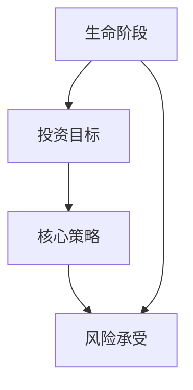
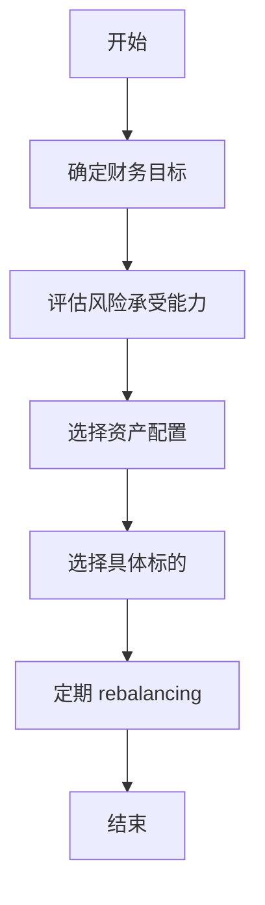
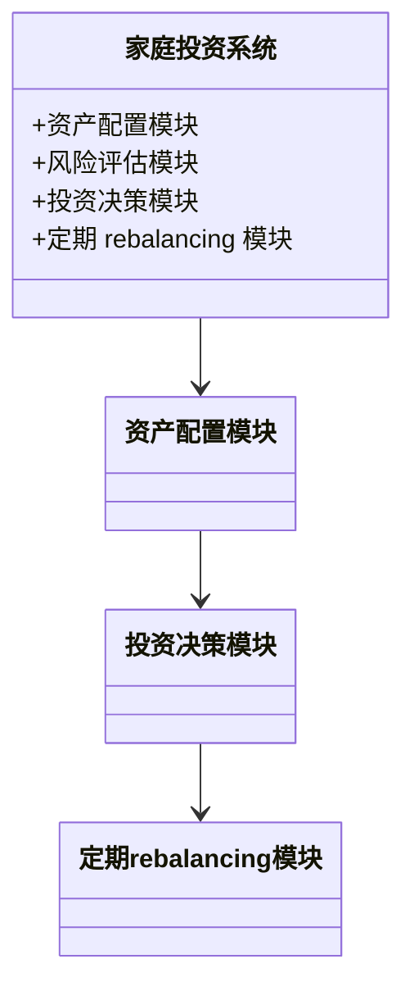
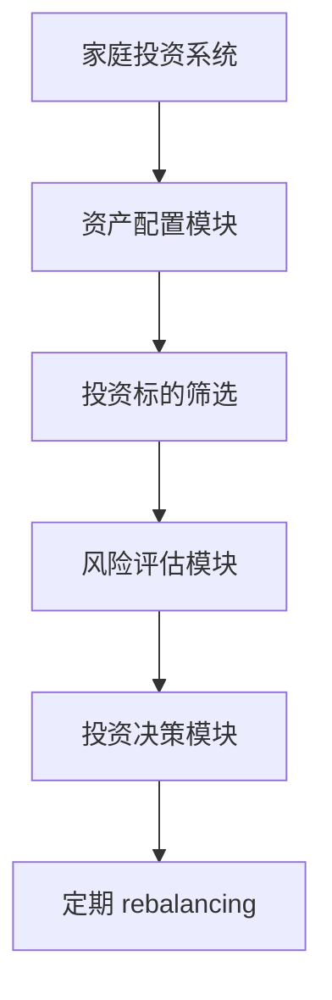
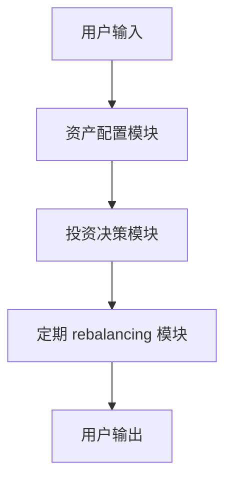

                 


# 彼得林奇的"家庭投资"在不同生命阶段的调整

**关键词：** 彼得林奇，家庭投资，生命阶段，投资策略，财务规划，资产配置

**摘要：**  
本文探讨了彼得林奇的家庭投资策略在不同生命阶段的调整方法。通过分析单身、成家、子女教育、中年、事业高峰期、退休准备及老年阶段的财务需求和投资目标，结合彼得林奇的价值投资理念和长期投资策略，为读者提供在不同生命阶段优化家庭投资组合的实用建议。文章还通过实际案例分析和数学模型，详细讲解了如何根据个人生命周期调整投资策略，以实现财务自由和长期财富增长。

---

## 目录大纲

### 第一部分：引言

#### 第1章：背景介绍

##### 1.1 问题背景  
- 家庭投资的重要性  
- 彼得林奇的投资理念  
- 不同生命阶段的财务需求变化  

##### 1.2 问题描述  
- 家庭投资在不同阶段的挑战  
- 彼得林奇投资策略的核心要素  
- 家庭投资与个人财务规划的关系  

##### 1.3 问题解决  
- 通过彼得林奇策略优化家庭投资  
- 不同阶段的投资目标设定  
- 家庭投资的动态调整方法  

##### 1.4 边界与外延  
- 家庭投资的边界条件  
- 投资策略的适用范围  
- 不同生命阶段的外延影响  

##### 1.5 概念结构与核心要素  
- 家庭投资的核心要素分析  
- 彼得林奇策略的结构化分解  
- 核心要素之间的关系图解  

---

### 第二部分：核心概念与联系

#### 第2章：彼得林奇投资策略的核心原理

##### 2.1 核心概念原理  
- 价值投资的核心理念  
- 长期投资的重要性  
- 分散投资的风险管理  

##### 2.2 概念属性特征对比表  
| 阶段 | 投资目标 | 核心策略 | 风险承受 |  
|------|----------|----------|----------|  
| 单身 | 资产积累 | 侧重股票 | 较高       |  
| 成家 | 稳定收益 | 股票+债券 | 中等       |  
| 子女教育 | 资产保值 | 债券为主 | 低         |  
| 中年 | 资产增值 | 股票+房地产 | 中高       |  
| 事业高峰期 | 资产最大化 | 股票+私募基金 | 高         |  
| 退休准备 | 稳定现金流 | 债券+分红股 | 极低       |  
| 老年 | 资产保值 | 现金+短期债券 | 极低       |  

##### 2.3 ER实体关系图  


---

### 第三部分：算法原理讲解

#### 第3章：基于彼得林奇策略的投资组合优化算法

##### 3.1 算法原理  
- 投资决策流程：识别财务需求 → 确定资产配置 → 选择标的 → 定期调整  
- 基于CAPM模型的投资回报预测  
  $$ E(r) = r_f + β \cdot (E(r_m) - r_f) $$  

##### 3.2 算法流程图  


##### 3.3 数学模型  
- 投资组合优化模型：  
  $$ \text{max} \quad \sum_{i=1}^{n} w_i \cdot r_i - \lambda \cdot \sum_{i=1}^{n} w_i^2 \cdot \sigma_i^2 $$  
  其中，\( w_i \) 为资产 \( i \) 的权重，\( r_i \) 为预期收益率，\( \sigma_i^2 \) 为波动率，\( \lambda \) 为风险厌恶系数。  

##### 3.4 代码实现  
```python
import numpy as np
from scipy.optimize import minimize

# 示例：优化投资组合
def portfolio_optimization(returns, cov_matrix, risk_aversion=1):
    n = len(returns)
    # 目标函数
    def objective(w):
        return -np.dot(w, returns @ w) + risk_aversion * w.T.dot(cov_matrix).dot(w)
    
    # 约束条件
    constraints = [{'type': 'eq', 'fun': lambda w: sum(w) - 1}]
    
    # 初始猜测
    w0 = np.array([1.0/n]*n)
    
    # 最优化
    result = minimize(objective, w0, constraints=constraints, method='SLSQP')
    return result.x

# 示例数据
returns = np.array([0.1, 0.15, 0.08])
cov_matrix = np.array([
    [0.04, 0.01, 0.005],
    [0.01, 0.06, 0.01],
    [0.005, 0.01, 0.03]
])
weights = portfolio_optimization(returns, cov_matrix)
print(weights)
```

---

### 第四部分：系统分析与架构设计方案

#### 第4章：家庭投资系统分析

##### 4.1 问题场景介绍  
- 不同生命阶段的财务需求变化  
- 家庭投资的动态调整需求  

##### 4.2 系统功能设计  


##### 4.3 系统架构设计  


##### 4.4 接口设计  
- 输入接口：财务目标、风险承受能力、可投资资金  
- 输出接口：资产配置建议、投资标的列表、定期 rebalancing 计划  

##### 4.5 交互流程图  


---

### 第五部分：项目实战

#### 第5章：基于彼得林奇策略的家庭投资实战

##### 5.1 环境安装  
- Python 3.8+  
- numpy、pandas、scipy、matplotlib  

##### 5.2 核心实现  
```python
import numpy as np
import pandas as pd
import matplotlib.pyplot as plt

# 示例：模拟投资组合表现
def simulate_portfolio(assets, weights, returns, periods=10):
    portfolio_returns = []
    for _ in range(periods):
        current_return = np.dot(weights, returns)
        portfolio_returns.append(current_return)
        # 动态调整权重（示例）
        weights = weights * (1 + current_return)
        weights = weights / sum(weights)
    return portfolio_returns

# 示例数据
assets = ['股票', '债券', '房地产']
returns = np.array([0.1, 0.05, 0.08])
weights = np.array([0.6, 0.3, 0.1])

# 模拟
periods = 10
sim_returns = simulate_portfolio(assets, weights, returns, periods)
plt.plot(sim_returns)
plt.title('投资组合模拟回报')
plt.xlabel('年份')
plt.ylabel('回报率')
plt.show()
```

##### 5.3 实际案例分析  
- 单身阶段：投资股票和成长型基金  
- 成家阶段：增加债券和房地产投资  
- 子女教育阶段：注重保值，增加债券配置  
- 退休阶段：以分红股和短期债券为主  

##### 5.4 代码解读与分析  
- 投资组合模拟：通过动态调整权重，模拟不同阶段的投资回报变化  
- 风险评估：通过波动率和相关系数分析投资组合的稳定性  

---

### 第六部分：总结与最佳实践

#### 第6章：总结与小结

##### 6.1 最佳实践  
- 根据生命阶段调整投资策略  
- 定期 rebalancing 投资组合  
- 选择适合风险承受能力的资产配置  

##### 6.2 小结  
- 彼得林奇的投资理念在不同生命阶段的应用  
- 动态调整的重要性  
- 系统化投资管理的关键作用  

##### 6.3 注意事项  
- 避免过度集中投资  
- 定期评估财务目标和风险承受能力  
- 寻求专业财务顾问的帮助  

##### 6.4 拓展阅读  
- 彼得林奇的《投资之道》  
- 现金流分析与家庭财务规划  

---

通过以上结构，文章详细分析了彼得林奇的投资理念在不同生命阶段的应用，并结合实际案例和数学模型，为读者提供了在不同阶段优化家庭投资组合的实用方法。

