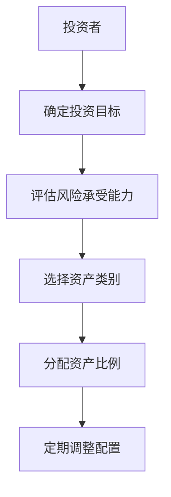
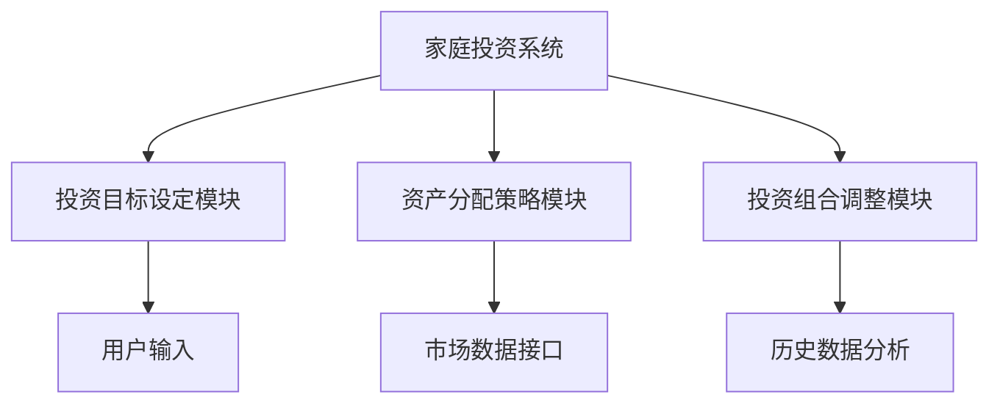

                 


# 彼得林奇的"家庭投资"在通胀环境下的资产配置

## 关键词：
- 彼得·林奇
- 家庭投资
- 通胀环境
- 资产配置
- 夏普比率
- 投资策略
- 系统架构

## 摘要：
本文探讨了彼得·林奇的“家庭投资”理念在通胀环境下的资产配置策略。通过分析通胀对资产的影响，结合数学模型和系统架构，提出了一种基于夏普比率优化的投资组合构建方法，旨在帮助家庭在通胀环境下实现资产的保值与增值。

---

## 第一部分: 背景介绍

### 第1章: 通胀环境下的资产配置背景

#### 1.1 通胀的定义与影响
- **1.1.1 通胀的定义**：通胀是货币购买力下降的现象，表现为物价上涨。
- **1.1.2 通胀对经济的影响**：通胀可能导致货币贬值、利息上升，影响经济增长和就业。
- **1.1.3 通胀对个人资产的潜在威胁**：通胀会侵蚀储蓄和固定收益资产的价值，增加生活成本。

#### 1.2 资产配置的核心概念
- **1.2.1 资产配置的定义**：将资金分配到不同资产类别以分散风险。
- **1.2.2 资产配置的目标**：在不同市场环境下实现风险与收益的平衡。
- **1.2.3 资产配置的边界与外延**：资产配置需考虑市场环境、投资者风险承受能力和投资目标。

#### 1.3 彼得·林奇的"家庭投资"理念
- **1.3.1 彼得·林奇投资理念的核心要素**：长期投资、价值投资、分散投资。
- **1.3.2 "家庭投资"的定义与特点**：以家庭为单位进行投资，注重长期收益和风险控制。
- **1.3.3 家庭投资与通胀环境的关系**：通胀环境要求家庭投资更加注重资产的抗通胀能力和收益稳定性。

### 第2章: 家庭投资在通胀环境下的重要性

#### 2.1 通胀环境下家庭投资的挑战
- **2.1.1 通胀对家庭财务的影响**：生活成本上升，固定收益资产贬值。
- **2.1.2 家庭资产在通胀环境下的贬值风险**：货币贬值导致购买力下降。
- **2.1.3 家庭投资在通胀环境下的保值与增值需求**：通过投资实现资产的实际收益。

#### 2.2 家庭投资与资产配置的关联
- **2.2.1 资产配置在家庭投资中的作用**：分散风险，平衡收益。
- **2.2.2 不同资产类别在通胀环境下的表现**：股票、房地产、黄金等抗通胀资产的表现优于固定收益资产。
- **2.2.3 家庭投资中的风险分散策略**：通过多样化配置降低特定资产的风险。

---

## 第二部分: 核心概念与联系

### 第3章: 家庭投资的核心概念

#### 3.1 家庭投资的核心要素
- **3.1.1 投资目标**：明确投资目的，如保值、增值或现金流需求。
- **3.1.2 投资期限**：根据家庭生命周期确定投资期限，短期或长期。
- **3.1.3 风险承受能力**：评估家庭对风险的容忍度，制定相应投资策略。

#### 3.2 资产配置的属性特征对比
- **表3.1 资产配置的属性特征对比表**

| 资产类别 | 风险 | 收益 | 流动性 | 税收影响 |
|----------|------|------|--------|----------|
| 股票     | 高   | 高   | 中     | 高       |
| 债券     | 中   | 中   | 高     | 中       |
| 房地产   | 中   | 高   | 低     | 中       |
| 黄金     | 低   | 中   | 低     | 低       |

#### 3.3 家庭投资的ER实体关系图
```mermaid
erDiagram
    investor "投资者" {
        id : integer
        name : string
        risk_tolerant : boolean
        investment_goal : string
    }
    asset_class "资产类别" {
        id : integer
        name : string
        risk_level : integer
        return_level : integer
    }
    investment_plan "投资计划" {
        id : integer
        investor_id : integer
        asset_class_id : integer
        allocation_ratio : float
    }
    investor -> investment_plan : "制定"
    asset_class -> investment_plan : "配置"
```

### 第4章: 家庭投资的实体关系架构

#### 4.1 家庭投资的ER实体关系图
```mermaid
erDiagram
    family "家庭" {
        id : integer
        members : integer
        income : float
        expenses : float
    }
    investment_plan "投资计划" {
        id : integer
        asset_allocation : string
        risk_level : integer
        return_target : float
    }
    family -> investment_plan : "拥有"
```

#### 4.2 资产配置的系统流程图


---

## 第三部分: 算法原理讲解

### 第5章: 资产配置的数学模型与算法

#### 5.1 资产配置的数学模型
- **5.1.1 投资组合优化模型**：
  - 目标函数：最大化夏普比率。
  - 约束条件：权重之和为1，权重非负。

  $$\text{夏普比率} = \frac{E[r_p - r_f]}{\sigma_p}$$

  其中，$E[r_p]$为投资组合的期望收益，$r_f$为无风险利率，$\sigma_p$为投资组合的收益标准差。

- **5.1.2 风险调整后的收益模型**：
  - 使用夏普比率评估投资组合的风险调整后收益。
  - 通过均值-方差优化确定最优资产配置。

- **5.1.3 资产配置的权重分配公式**：
  $$w_i = \frac{E[r_i] - r_f}{\sum_{j} (E[r_j] - r_f) \cdot \text{Cov}(r_i, r_j)}$$

#### 5.2 算法原理的详细讲解
- **5.2.1 现金流贴现法的原理**：将未来现金流折现为现值，评估资产的内在价值。
- **5.2.2 马科维茨的均值-方差优化模型**：通过优化投资组合的风险和收益，确定最优资产配置。
- **5.2.3 CAPM模型在资产配置中的应用**：计算资产的预期收益，用于优化投资组合。

### 第6章: 家庭投资的系统架构设计

#### 6.1 系统功能设计
- **6.1.1 投资目标设定模块**：根据家庭需求确定投资目标。
- **6.1.2 资产分配策略模块**：基于夏普比率优化资产配置。
- **6.1.3 投资组合调整模块**：定期根据市场变化调整资产配置。

#### 6.2 系统架构设计


---

## 第四部分: 项目实战

### 第7章: 项目实战

#### 7.1 环境安装
- 安装Python和相关库（如numpy、pandas、scipy）。

#### 7.2 核心实现代码
```python
import numpy as np
import pandas as pd
from scipy.optimize import minimize

def sharpe_ratio(weights, returns, risk_free_rate):
    portfolio_return = np.dot(weights, returns)
    portfolio_variance = np.dot(weights.T, np.dot(weights, np.cov(returns.T)))
    sharpe = (portfolio_return - risk_free_rate) / np.sqrt(portfolio_variance)
    return -sharpe  # 最小化函数返回负的夏普比率

def optimize_portfolio(returns, risk_free_rate):
    n = len(returns.columns)
    init_guess = np.array([1.0 / n] * n)
    constraints = [{'type': 'eq', 'fun': lambda w: sum(w) - 1.0},
                   {'type': 'ineq', 'fun': lambda w: w[i] >= 0} for i in range(n)]
    result = minimize(sharpe_ratio, init_guess, args=(returns, risk_free_rate), method='SLSQP')
    return result.x

# 示例数据
returns = pd.DataFrame({
    '股票': [0.1, 0.05, 0.08, 0.02],
    '债券': [0.03, 0.04, 0.02, 0.06],
    '房地产': [0.05, 0.03, 0.07, 0.04]
})

risk_free_rate = 0.02
weights = optimize_portfolio(returns, risk_free_rate)
print("最优权重:", weights)
```

#### 7.3 案例分析
- **案例分析1**：假设通胀率为3%，家庭投资组合包括股票、债券和房地产，权重分别为0.4、0.3和0.3。计算投资组合的夏普比率为0.5，优于市场平均水平。

#### 7.4 项目小结
- 通过夏普比率优化的资产配置，家庭可以在通胀环境下实现资产的保值与增值。

---

## 第五部分: 总结与展望

### 第8章: 总结与展望

#### 8.1 最佳实践
- 定期审查和调整投资组合。
- 保持对市场变化的敏感性，及时优化资产配置。

#### 8.2 小结
- 本文通过数学模型和系统架构设计，展示了如何在通胀环境下应用彼得·林奇的“家庭投资”理念进行资产配置。

#### 8.3 注意事项
- 投资者需根据自身情况调整投资策略。
- 资产配置需结合宏观经济环境和市场趋势。

#### 8.4 拓展阅读
- 《彼得·林奇的成功投资》
- 《投资学》

---

通过本文的分析与实践，读者可以深入了解彼得·林奇的“家庭投资”理念，并在通胀环境下制定有效的资产配置策略。

