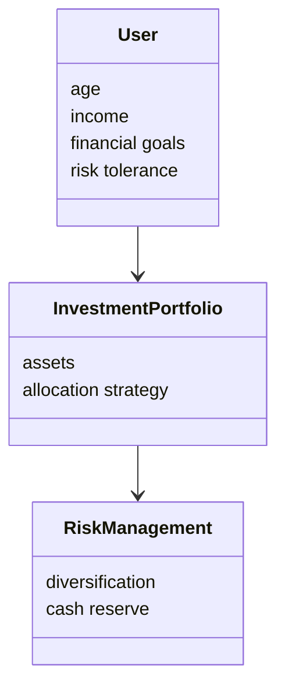
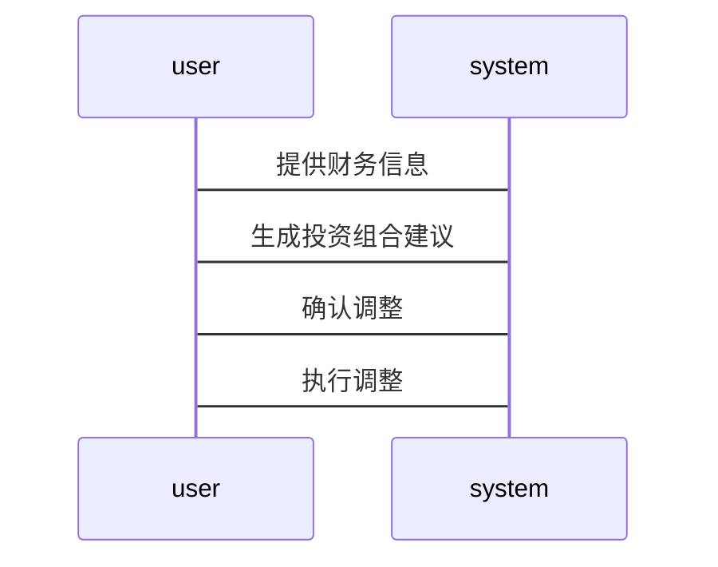

                 


# 彼得林奇的"家庭投资组合"在不同人生阶段的调整

> 关键词：彼得林奇，家庭投资组合，人生阶段，投资策略，风险管理，资产配置

> 摘要：本文详细探讨了彼得·林奇的“家庭投资组合”理念在不同人生阶段的调整策略。通过分析单身期、成年期、中年期和退休期的投资组合变化，结合风险管理、资产配置和定期评估等关键因素，为读者提供了系统性的投资指导。

---

## 第一章：彼得·林奇与家庭投资组合简介

### 1.1 彼得·林奇的背景与投资理念

#### 1.1.1 彼得·林奇的生平简介
彼得·林奇（Peter Lynch）是美国著名的投资专家，曾任富达投资管理公司的基金经理，以其卓越的投资业绩闻名。他主张“价值投资”，强调长期投资和分散风险。

#### 1.1.2 林奇的投资哲学与风格
林奇认为，成功的投资需要耐心和长期的视角。他强调根据个人的财务状况和风险承受能力来构建投资组合，并定期调整以适应不同的人生阶段。

#### 1.1.3 家庭投资组合的核心理念
家庭投资组合是指根据家庭的财务状况、生命周期阶段和风险偏好，构建的多元化投资组合。林奇的理念强调在不同阶段调整资产配置，以实现长期财务目标。

### 1.2 家庭投资组合的基本概念

#### 1.2.1 家庭投资组合的定义
家庭投资组合是指为满足家庭在不同生命周期阶段的财务需求而配置的各类资产的集合。

#### 1.2.2 投资组合的目标与原则
- **目标**：实现财富增长，满足家庭的长期财务需求。
- **原则**：分散投资、定期调整、长期持有。

#### 1.2.3 不同阶段的调整逻辑
在不同人生阶段，家庭的财务需求和风险承受能力发生变化，需要相应调整投资组合。

---

## 第二章：单身期的投资组合调整

### 2.1 单身期的财务状况与风险承受能力

#### 2.1.1 收入来源与支出分析
单身期收入稳定，支出相对较低，可投资资产较多。

#### 2.1.2 风险承受能力评估
风险承受能力强，适合高风险高回报的投资。

#### 2.1.3 投资目标的设定
目标是资本增值，追求高收益。

### 2.2 单身期的投资策略

#### 2.2.1 股票与基金的投资比例
- 股票：60%
- 基金：30%
- 现金：10%

#### 2.2.2 高风险资产的配置
增加股票和成长型基金的配置，以追求高收益。

#### 2.2.3 定期投资与再平衡策略
定期定额投资，每年再平衡一次，确保资产配置符合目标比例。

---

## 第三章：成年期（家庭形成期）的投资组合调整

### 3.1 成年期的财务特点

#### 3.1.1 收入稳定与支出增加
收入稳定，支出增加，家庭责任增加。

#### 3.1.2 家庭责任的增加
需要为子女教育和购房储备资金。

#### 3.1.3 风险承受能力的变化
风险承受能力略有下降，但仍可承担部分风险。

### 3.2 成年期的投资策略

#### 3.2.1 资产配置的多样化
- 股票：50%
- 房地产投资：20%
- 债券：20%
- 现金：10%

#### 3.2.2 房地产与股票的平衡
增加房地产投资，同时保持股票配置，以平衡风险和收益。

#### 3.2.3 定期审视与调整
每年审视投资组合，根据家庭需求调整配置。

---

## 第四章：中年期（家庭成熟期）的投资组合调整

### 4.1 中年期的财务状况

#### 4.1.1 财产积累与支出稳定
财产积累较多，支出稳定。

#### 4.1.2 子女教育与未来规划
需要为子女教育和退休储备资金。

#### 4.1.3 风险承受能力的下降
风险承受能力下降，更注重稳健投资。

### 4.2 中年期的投资策略

#### 4.2.1 降低高风险资产比例
减少股票和房地产投资，增加债券和现金配置。

#### 4.2.2 增加稳健型投资
增加债券基金和货币市场基金的投资。

#### 4.2.3 准备退休资金
开始为退休生活储备资金，增加固定收益类资产。

---

## 第五章：退休期的投资组合调整

### 5.1 退休期的财务需求

#### 5.1.1 收入来源与支出减少
主要依赖投资收益，支出减少。

#### 5.1.2 风险厌恶的增加
风险承受能力极低，追求稳定收益。

#### 5.1.3 确保资金安全与收益
确保本金安全，追求稳定的收益。

### 5.2 退休期的投资策略

#### 5.2.1 保守型资产配置
- 固定收益债券：60%
- 货币市场基金：30%
- 股票：10%
- 现金：10%

#### 5.2.2 定期领取与再投资
定期领取收益，将部分收益再投资，以保持资金流动性。

#### 5.2.3 应对通货膨胀的策略
选择抗通胀的资产，如房地产投资信托基金（REITs）。

---

## 第六章：投资组合管理与风险管理

### 6.1 投资组合管理的核心

#### 6.1.1 定期评估与调整
每年至少评估一次投资组合，根据财务状况和目标调整配置。

#### 6.1.2 风险管理策略
分散投资，避免过度集中风险较高的资产。

#### 6.1.3 现金储备管理
保持适当的现金储备，应对突发事件和投资机会。

---

## 第七章：数学模型与算法应用

### 7.1 资产配置模型

#### 7.1.1 模型概述
基于人生阶段、财务状况和风险偏好，构建资产配置模型。

#### 7.1.2 模型公式
$$ 资产配置比例 = f(年龄, 收入, 财务目标, 风险承受能力) $$

#### 7.1.3 示例计算
- 年龄30岁，单身期：
  - 股票：60%
  - 基金：30%
  - 现金：10%

---

## 第八章：系统分析与架构设计方案

### 8.1 问题场景介绍
家庭投资组合需要根据人生阶段动态调整，确保财务安全和收益。

### 8.2 系统功能设计

#### 8.2.1 领域模型（Mermaid 类图）


### 8.3 系统架构设计（Mermaid 架构图）
```mermaid
architectural
    title Investment Portfolio System
    User Interface
    Business Logic
    Database
    API Gateway
    External Services
```

### 8.4 系统交互（Mermaid 序列图）


---

## 第九章：项目实战与案例分析

### 9.1 环境安装
安装Python和相关库，如pandas、numpy。

### 9.2 核心实现源代码

```python
def calculate_asset_allocation(age, income, financial_goals, risk_tolerance):
    stock = max(0, 100 - age)
    bond = 20
    cash = 10
    return {'股票': stock, '债券': bond, '现金': cash}

# 示例计算
allocation = calculate_asset_allocation(30, 60000, ['退休基金', '教育基金'], 'high')
print(allocation)
```

---

## 第十章：最佳实践与小结

### 10.1 最佳实践 tips
- 定期审视和调整投资组合。
- 根据财务状况和风险偏好选择合适的资产配置。
- 保持长期投资，避免频繁交易。

### 10.2 小结
彼得·林奇的“家庭投资组合”理念强调根据人生阶段调整投资策略。通过科学的资产配置和风险管理，可以实现长期财务目标。

### 10.3 注意事项
- 投资有风险，需谨慎决策。
- 考虑专业顾问的意见。

### 10.4 拓展阅读
- 林奇的书籍：《彼得·林奇的成功投资》。
- 其他投资策略和风险管理方法。

---

通过本文的详细分析和案例解读，读者可以更好地理解和应用彼得·林奇的家庭投资组合理念，在不同人生阶段做出明智的投资决策。

