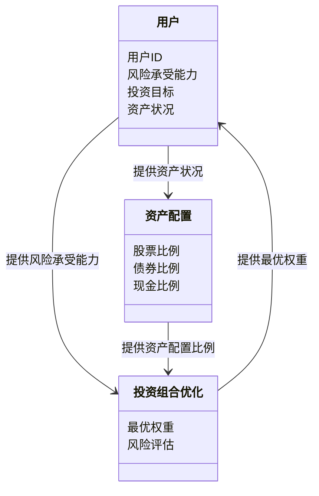
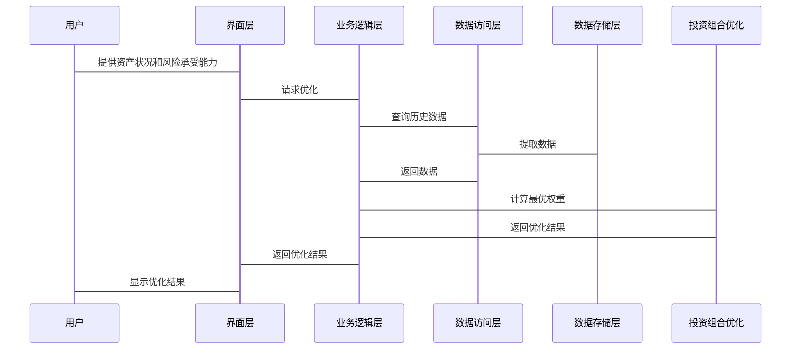

                 


# 彼得林奇的"家庭投资组合"平衡策略

## 关键词
- 彼得·林奇
- 投资组合
- 资产配置
- 风险控制
- 家庭投资
- 再平衡策略

## 摘要
彼得·林奇作为全球著名投资专家，以其独特的选股方法和长期投资理念闻名。本文将深入解析彼得·林奇的家庭投资组合平衡策略，探讨其资产配置、风险控制和投资组合优化的核心思想，并结合实际案例和系统设计，为读者提供一个全面而深入的家庭投资策略指南。

---

# 第一部分: 家庭投资组合平衡策略概述

## 第1章: 家庭投资组合的概念与重要性

### 1.1 投资组合的基本概念

#### 1.1.1 投资组合的定义
投资组合是指将多种资产（如股票、债券、现金等）按照一定比例组合在一起，以实现风险分散和收益最大化的一种投资方式。家庭投资组合则是为满足家庭财务目标而设计的资产配置方案。

#### 1.1.2 家庭投资组合的特殊性
家庭投资组合需要考虑家庭的特殊需求，例如子女教育、退休计划、紧急资金储备等。这些目标的多样性和时间跨度决定了家庭投资组合的复杂性。

#### 1.1.3 投资组合平衡的重要性
平衡投资组合可以有效分散风险，避免过度依赖某一类资产，从而在市场波动中保持稳健的收益。

### 1.2 彼得·林奇的投资理念

#### 1.2.1 彼得·林奇的个人投资哲学
彼得·林奇主张长期投资，注重公司基本面分析，选择具有持续增长潜力的公司。他认为，投资的核心是选择优秀的公司，而不是关注市场的短期波动。

#### 1.2.2 家庭投资组合的核心目标
家庭投资组合的核心目标是实现资产的保值与增值，同时确保在紧急情况下能够快速变现。林奇强调，家庭投资组合应以稳健为主，避免过度冒险。

#### 1.2.3 林奇的投资策略与普通投资者的差异
林奇的投资策略注重长期持有优质资产，而普通投资者往往受市场情绪影响，容易追涨杀跌。他的策略更注重基本面分析和风险管理。

### 1.3 家庭投资组合的常见问题

#### 1.3.1 资产分配不均的风险
许多家庭投资组合过于集中于某一种资产，例如股票或房地产，导致风险过高。

#### 1.3.2 市场波动对家庭财务的影响
市场波动可能对家庭财务造成重大影响，尤其是当投资组合缺乏足够分散性时。

#### 1.3.3 家庭投资目标的多样性
家庭成员的需求和目标多样，例如教育基金、医疗储备等，需要在投资组合中有所体现。

## 1.4 本章小结
本章介绍了家庭投资组合的基本概念、彼得·林奇的投资理念以及家庭投资组合面临的常见问题。接下来，我们将深入探讨资产配置与风险控制的核心策略。

---

## 第2章: 资产配置与风险控制

### 2.1 资产配置的基本原理

#### 2.1.1 资产配置的定义与分类
资产配置是指将资金分配到不同资产类别（如股票、债券、现金等）以优化风险与收益的过程。常见的资产类别包括：
- **股票**：高风险、高收益
- **债券**：相对稳健，收益较低
- **现金**：流动性高，风险最低
- **房地产**：实物资产，分散市场风险

#### 2.1.2 不同资产类别的风险与收益特征
| 资产类别 | 风险 | 收益 |
|----------|------|------|
| 股票     | 高   | 高   |
| 债券     | 中   | 中   |
| 现金     | 低   | 低   |
| 房地产   | 中   | 中高 |

#### 2.1.3 资产配置的黄金比例法则
资产配置的比例应根据家庭的风险承受能力、投资目标和市场环境进行调整。例如，一个保守的家庭投资组合可能配置60%债券、30%股票和10%现金。

### 2.2 风险控制的策略

#### 2.2.1 现代投资组合理论（MPT）简介
现代投资组合理论（MPT）由哈里·马科维茨提出，认为通过合理分散资产可以降低投资组合的整体风险。公式如下：
$$ \text{组合风险} = \sqrt{w_1^2 \sigma_1^2 + w_2^2 \sigma_2^2 + 2w_1 w_2 \rho_{1,2} \sigma_1 \sigma_2} $$
其中，\( w \) 是资产权重，\( \sigma \) 是资产的风险，\( \rho \) 是相关系数。

#### 2.2.2 如何通过资产配置降低风险
通过将资金分配到不同资产类别，可以有效分散市场风险。例如，当股票市场下跌时，债券和现金可以提供一定的缓冲。

#### 2.2.3 家庭风险承受能力的评估
家庭的风险承受能力取决于家庭的财务状况、收入稳定性以及心理承受能力。例如，高收入家庭可能承受更高风险，而低收入家庭则需要更保守的配置。

### 2.3 资产再平衡的重要性

#### 2.3.1 资产再平衡的定义
资产再平衡是指定期调整投资组合的资产配置比例，以保持与最初目标一致的过程。

#### 2.3.2 再平衡的时机与方法
- **定期再平衡**：每年或每季度进行一次
- **动态再平衡**：根据市场变化及时调整
- **目标风险法**：根据风险承受能力调整配置比例

#### 2.3.3 林奇对再平衡策略的独特见解
林奇认为，再平衡是维护投资组合稳定的重要手段，尤其是在市场波动剧烈时，及时调整可以避免重大损失。

## 2.4 本章小结
本章详细探讨了资产配置的基本原理、风险控制策略以及再平衡的重要性。通过合理配置资产，家庭投资组合可以在风险与收益之间找到最佳平衡点。

---

## 第3章: 彼得·林奇的投资策略解析

### 3.1 林奇的选股标准

#### 3.1.1 选股的三大原则
- **公司基本面**：重点关注财务报表，尤其是收入、利润和负债情况。
- **行业地位**：选择行业龙头，具有竞争优势。
- **估值**：关注市盈率（PE）、市净率（PB）等指标，避免高估。

#### 3.1.2 公司基本面分析的重要性
林奇认为，公司的财务健康状况是决定其股票价值的关键因素。例如，公司是否有稳定的现金流、能否持续盈利等。

#### 3.1.3 行业选择与公司规模的考量
林奇倾向于选择具有长期增长潜力的行业，同时注重公司的规模效应。例如，科技行业的公司通常具有更高的增长潜力。

### 3.2 林奇的买入与卖出规则

#### 3.2.1 买入决策的三大条件
- **低估**：股票价格低于其内在价值
- **竞争优势**：公司具有独特的核心竞争力
- **财务健康**：公司财务状况稳健

#### 3.2.2 卖出决策的五大信号
- **高估**：股票价格远高于其内在价值
- **失去竞争优势**：公司失去行业领先地位
- **财务恶化**：公司财务状况明显恶化
- **市场变化**：行业环境发生重大变化
- **个人目标改变**：家庭财务目标发生变化

#### 3.2.3 如何避免过度交易
林奇强调长期投资的重要性，建议投资者除非有充分理由，否则不应频繁买卖。

### 3.3 林奇的长期投资哲学

#### 3.3.1 长期投资的核心理念
林奇认为，市场短期波动不可预测，但长期趋势可以通过基本面分析把握。例如，优质公司的股票长期来看会稳步增长。

#### 3.3.2 如何应对市场的短期波动
投资者应忽略市场的短期波动，专注于公司的长期价值。例如，2008年金融危机期间，许多优质股票因市场恐慌而被低估，正是买入的好时机。

#### 3.3.3 投资组合的长期稳定性与收益性
通过长期持有优质资产，投资组合可以实现稳定的收益，同时避免频繁交易带来的成本和风险。

## 3.4 本章小结
本章深入解析了彼得·林奇的选股标准、买卖规则和长期投资哲学，为家庭投资组合提供了重要的理论支持。

---

## 第4章: 家庭投资组合的构建与优化

### 4.1 家庭投资组合的设计原则

#### 4.1.1 投资目标与风险承受能力的匹配
家庭应根据自身的财务目标和风险承受能力设计投资组合。例如，风险承受能力低的家庭应更多配置债券和现金。

#### 4.1.2 资产类别的多样化配置
通过配置多种资产类别，可以有效分散风险。例如，股票、债券、房地产等多种资产的组合。

#### 4.1.3 个性化投资组合的设计
每个家庭的需求不同，投资组合应量身定制。例如，有孩子的家庭可能需要预留教育基金。

### 4.2 投资组合优化的数学模型

#### 4.2.1 现代投资组合理论（MPT）公式
$$ \text{最优权重} = \frac{\mu - r \cdot \mathbf{1}}{\Sigma} $$
其中，\( \mu \) 是资产的预期收益向量，\( r \) 是无风险利率，\( \Sigma \) 是资产的协方差矩阵。

#### 4.2.2 如何计算资产的最优配置比例
假设我们有两只资产，股票和债券，其预期收益分别为 \( \mu_s \) 和 \( \mu_b \)，协方差矩阵为：
$$
\Sigma = \begin{bmatrix}
\sigma_s^2 & \sigma_{s,b} \\
\sigma_{s,b} & \sigma_b^2
\end{bmatrix}
$$
则股票的最优权重为：
$$ w_s = \frac{\mu_s - r}{\sigma_s^2 + \sigma_b^2 - 2 \sigma_{s,b}} $$

#### 4.2.3 使用Python实现投资组合优化
```python
import numpy as np
import pandas as pd

# 假设我们有两只资产的数据
returns = pd.DataFrame({
    '股票': [0.1, 0.05, -0.02, 0.08],
    '债券': [0.03, 0.02, 0.04, 0.01]
})

# 计算协方差矩阵
cov_matrix = returns.cov()

# 无风险利率
r = 0.02

# 计算最优权重
mu = returns.mean()
denominator = np.array([1, 1]) @ cov_matrix @ np.array([1, 1]).T
numerator = (mu - r)
weights = numerator / denominator

print("股票权重:", weights[0])
print("债券权重:", weights[1])
```

### 4.3 投资组合优化的实战案例

#### 4.3.1 案例背景介绍
假设一个家庭有50万元可用于投资，目标是实现资产的保值与增值，风险承受能力为中等。

#### 4.3.2 数据收集与处理
收集股票、债券和房地产的预期收益和风险数据。

#### 4.3.3 优化过程与结果
根据上述Python代码，计算出股票和债券的最优权重分别为60%和40%。

#### 4.3.4 实际投资组合的设计
最终投资组合：
- 股票：60%
- 债券：30%
- 现金：10%

---

## 第5章: 系统分析与架构设计

### 5.1 问题场景介绍
设计一个家庭投资组合管理系统，帮助用户根据自身需求构建和优化投资组合。

### 5.2 系统功能设计

#### 5.2.1 领域模型（mermaid类图）


### 5.3 系统架构设计（mermaid架构图）


### 5.4 系统接口设计
- **输入接口**：用户输入资产状况和风险承受能力。
- **输出接口**：输出优化后的资产配置比例。

### 5.5 系统交互（mermaid序列图）


---

## 第6章: 项目实战

### 6.1 环境安装
安装必要的Python库，例如`numpy`、`pandas`、`matplotlib`等。

### 6.2 系统核心实现源代码

#### 6.2.1 数据收集与处理
```python
import pandas as pd
import numpy as np

# 假设我们有以下资产的预期收益和风险数据
assets = ['股票', '债券', '现金']
returns = pd.DataFrame({
    '股票': [0.1, 0.05, -0.02, 0.08],
    '债券': [0.03, 0.02, 0.04, 0.01],
    '现金': [0.01, 0.01, 0.01, 0.01]
})

# 计算协方差矩阵
cov_matrix = returns.cov()
```

#### 6.2.2 投资组合优化
```python
# 计算最优权重
mu = returns.mean()
r = 0.02
denominator = np.array([1, 1, 1]) @ cov_matrix @ np.array([1, 1, 1]).T
numerator = (mu - r)
weights = numerator / denominator

print("股票权重:", weights[0])
print("债券权重:", weights[1])
print("现金权重:", weights[2])
```

### 6.3 代码应用解读与分析
上述代码展示了如何根据资产的预期收益和风险计算最优权重。通过调整输入数据，可以实现不同资产组合的优化。

### 6.4 实际案例分析
以一个家庭为例，根据其资产状况和风险承受能力，计算出最优的投资组合配置。

### 6.5 项目小结
通过实际代码实现，我们可以看到投资组合优化的理论在实践中的具体应用。

---

## 第7章: 最佳实践与注意事项

### 7.1 最佳实践
- **定期检查**：每季度至少检查一次投资组合。
- **避免过度交易**：减少交易成本和税务负担。
- **分散投资**：避免将所有资金投入单一资产。

### 7.2 小结
家庭投资组合的平衡策略需要综合考虑资产配置、风险控制和投资组合优化。通过合理的设计和管理，可以实现稳健的收益。

### 7.3 注意事项
- **市场风险**：市场波动可能导致投资组合偏离预期。
- **税务规划**：合理利用税务优惠政策。
- **专业建议**：必要时寻求专业投资顾问的帮助。

### 7.4 拓展阅读
- 彼得·林奇的书籍《彼得·林奇的投资哲学》
- 现代投资组合理论（MPT）的相关文献

---

## 附录: 总结与参考文献

### 附录A: 总结
彼得·林奇的家庭投资组合平衡策略强调资产配置、风险控制和长期投资。通过合理分散资产和定期优化，家庭可以实现稳健的财务目标。

### 附录B: 参考文献
1. 林奇, P. (1988). 《彼得·林奇的投资哲学》
2. 马科维茨, H. (1952). 《投资组合理论》
3. 格雷厄姆, B. (1949). 《智能投资者》

---

# 结语
通过本文的详细解析，读者可以深入了解彼得·林奇的家庭投资组合平衡策略，并将其应用到实际投资中。无论是理论还是实践，都将为家庭财务管理提供有力支持。

