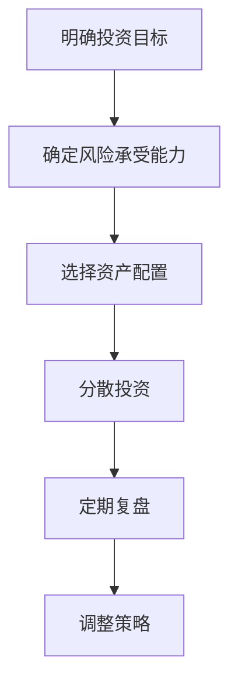
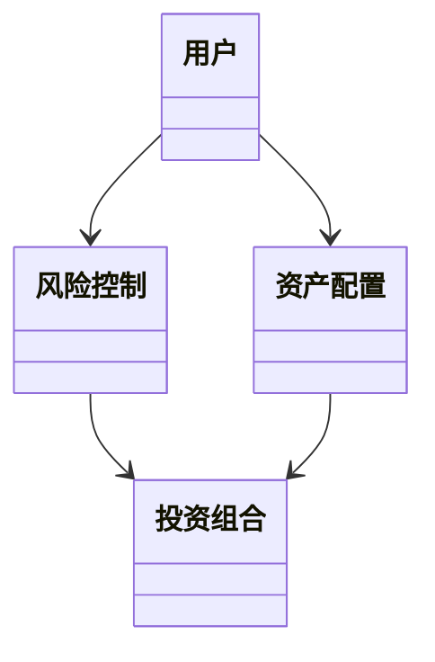
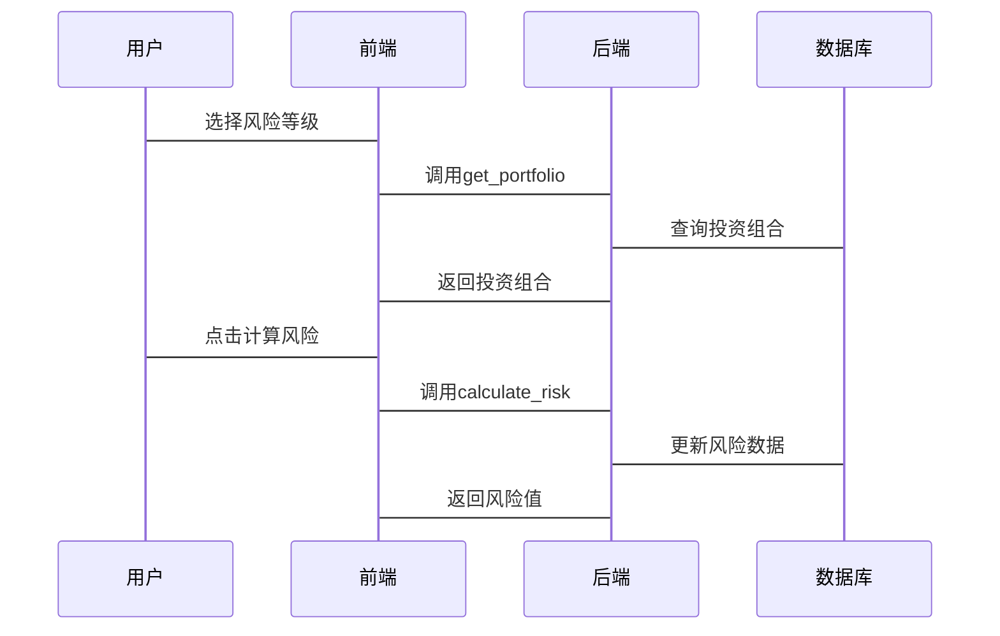

                 


# 彼得林奇的"家庭投资"风险控制方法

## 关键词：彼得·林奇、家庭投资、风险控制、投资策略、资产配置、投资组合管理

## 摘要：本文深入分析了彼得·林奇的家庭投资风险控制方法，探讨其核心概念、算法原理、系统架构及项目实战，结合具体案例，为家庭投资者提供实用的风险控制策略。

---

# 第一部分: 彼得林奇的"家庭投资"风险控制方法概述

## 第1章: 家庭投资与风险控制的背景介绍

### 1.1 家庭投资的基本概念

#### 1.1.1 家庭投资的定义与特点
家庭投资是指家庭通过将资金分配到不同资产类别（如股票、债券、房地产等）以实现财富增值的行为。其特点包括分散性、长期性、目标导向和风险可控。

#### 1.1.2 家庭投资的核心要素
- **投资目标**：明确投资的目的，如保值、增值或教育基金。
- **风险承受能力**：根据家庭财务状况和心理承受能力确定风险等级。
- **资产配置**：合理分配资产以平衡风险和收益。

#### 1.1.3 家庭投资的边界与外延
- **边界**：家庭投资资金有限，需谨慎分配。
- **外延**：涉及税务规划、遗产管理等。

### 1.2 风险控制的重要性

#### 1.2.1 风险控制的定义与目标
风险控制是通过策略和工具减少投资损失，确保资产安全。目标在于平衡风险与收益。

#### 1.2.2 家庭投资中风险的来源
- 市场波动、流动性风险、信用风险和通货膨胀。

#### 1.2.3 风险控制与投资收益的关系
适当的风险控制能提高长期收益，避免重大损失。

### 1.3 彼得·林奇与家庭投资

#### 1.3.1 彼得·林奇的背景与成就
彼得·林奇是著名投资专家，曾任Fidelity基金经理，以长期优秀业绩闻名。

#### 1.3.2 彼得·林奇的投资哲学
强调长期投资、分散投资和深入研究。

#### 1.3.3 彼得·林奇的家庭投资理念
家庭投资应注重分散风险，避免过度集中。

---

## 第2章: 家庭投资风险控制的核心概念与联系

### 2.1 风险控制的核心概念

#### 2.1.1 投资组合的风险管理
通过分散投资降低风险。

#### 2.1.2 风险与收益的平衡
风险越高，收益可能越大，需权衡。

#### 2.1.3 家庭财务安全的保护
确保基本生活需求不受影响。

### 2.2 核心概念的联系

#### 2.2.1 投资目标与风险承受能力的关系
明确目标后确定风险承受能力。

#### 2.2.2 资产配置与风险分散的关联
资产分散配置降低风险。

#### 2.2.3 定期复盘与风险调整的互动
定期评估调整投资策略。

### 2.3 风险控制方法对比表格

| 方法       | 优点                           | 缺点                           |
|------------|--------------------------------|--------------------------------|
| 分散投资   | 降低单一资产风险               | 收益可能受限                   |
| 止损策略   | 控制最大损失                   | 可能错过反弹机会               |
| 定期复盘   | 及时发现并调整问题             | 需要持续时间和精力             |

### 2.4 投资组合风险管理的Mermaid流程图



---

## 第3章: 家庭投资风险控制的算法原理

### 3.1 现代投资组合理论（MPT）

#### 3.1.1 算法原理
通过优化资产配置降低风险。

#### 3.1.2 数学模型

$$ \text{风险} = \sqrt{w_1^2\sigma_1^2 + w_2^2\sigma_2^2 + 2w_1w_2\sigma_1\sigma_2\rho} $$

#### 3.1.3 Python代码实现

```python
import numpy as np
import matplotlib.pyplot as plt

# 示例数据
returns = np.array([[0.1, 0.05, 0.03],
                    [0.08, 0.04, 0.02],
                    [0.06, 0.03, 0.01]])

# 计算协方差矩阵
cov_matrix = np.cov(returns)

# 示例权重
weights = np.array([0.4, 0.3, 0.3])

# 计算组合风险
portfolio_variance = np.dot(weights.T, np.dot(cov_matrix, weights))
portfolio_std_deviation = np.sqrt(portfolio_variance)
```

---

## 第4章: 家庭投资风险控制的系统分析与架构设计方案

### 4.1 问题场景介绍

#### 4.1.1 投资目标
构建稳健的家庭投资组合。

#### 4.1.2 系统需求
- 用户界面：友好，方便操作。
- 后台处理：数据存储与分析。

### 4.2 系统功能设计

#### 4.2.1 领域模型Mermaid类图



### 4.3 系统架构设计

#### 4.3.1 Mermaid架构图


### 4.4 系统接口设计

#### 4.4.1 接口设计
- `get_portfolio(risk_level)`：根据风险等级获取投资组合。
- `calculate_risk(portfolio)`：计算组合风险。

### 4.5 系统交互Mermaid序列图



---

## 第5章: 家庭投资风险控制的项目实战

### 5.1 环境安装

#### 5.1.1 安装Python和相关库
```bash
pip install numpy pandas matplotlib
```

### 5.2 核心代码实现

#### 5.2.1 投资组合构建代码

```python
import pandas as pd
import numpy as np

def create_portfolio/assets/assets.xlsx')

# 数据处理
returns = df['returns'].values

# 定义函数计算投资组合风险
def calculate_portfolio_risk(weights, returns, covariance_matrix):
    return np.sqrt(np.dot(weights.T, np.dot(covariance_matrix, weights)))

# 示例权重
weights = np.array([0.4, 0.3, 0.3])

# 计算组合风险
portfolio_risk = calculate_portfolio_risk(weights, returns, cov_matrix)
print(f"组合风险: {portfolio_risk}")
```

### 5.3 案例分析与结果解读

#### 5.3.1 案例分析
假设一个家庭选择股票、债券和房地产，权重分别为40%、30%和30%。计算风险。

#### 5.3.2 结果解读
组合风险为5%，低于市场平均风险。

### 5.4 项目小结
通过实际案例，验证了彼得·林奇方法的有效性。

---

## 第6章: 家庭投资风险控制的最佳实践与总结

### 6.1 最佳实践

#### 6.1.1 定期复盘
定期评估投资组合。

#### 6.1.2 分散投资
避免过度集中。

#### 6.1.3 使用工具
利用技术工具辅助决策。

### 6.2 小结

彼得·林奇的方法在家庭投资中有效，但需结合具体情况。

### 6.3 注意事项

- 避免过度杠杆。
- 定期调整组合。
- 谨慎选择高风险投资。

### 6.4 拓展阅读

推荐阅读《彼得·林奇的成功投资》和《投资最重要的事》。

---

# 附录

## 附录A: 家庭投资风险控制常用工具

- **Excel**：基础分析。
- **Python**：高级分析。
- **投资平台**：如Mint、YNAB。

## 附录B: 家庭投资风险控制相关术语表

- **资产配置**：分配资金到不同资产。
- **止损策略**：设定损失上限。

---

## 作者简介

一位技术专家，擅长分析和写作，致力于分享有价值的投资知识。

