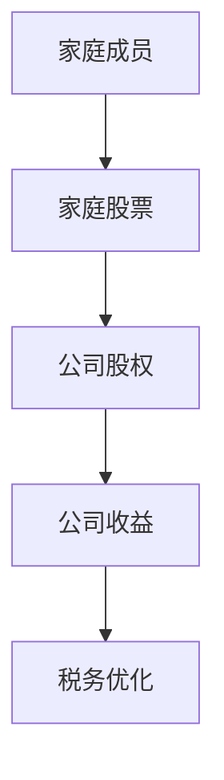
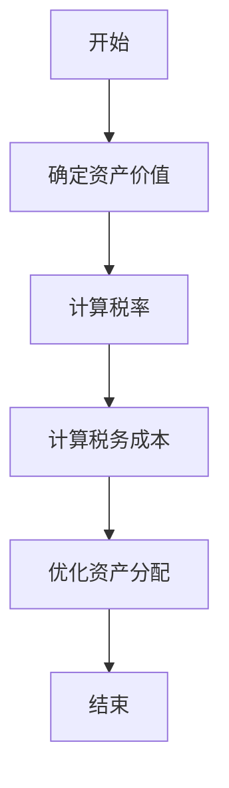
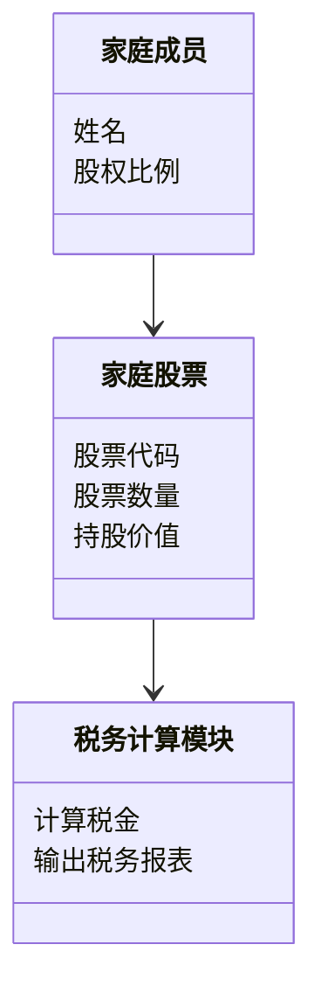
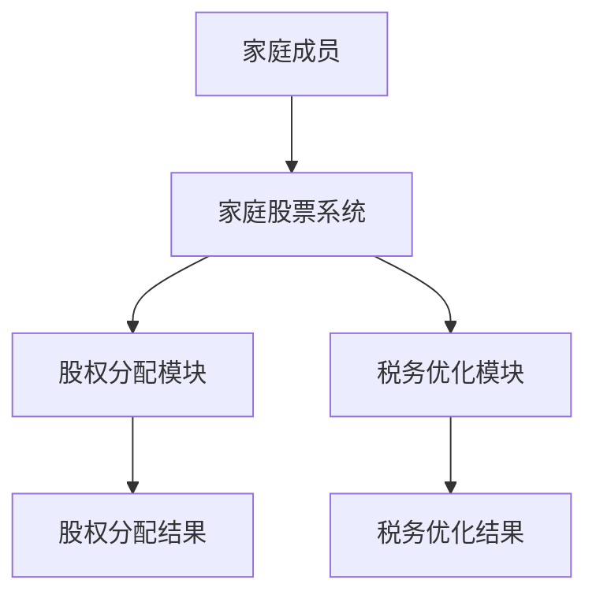

                 


# 彼得林奇的"家庭股票"在跨代财富传承中的税务优化

## 关键词：彼得林奇，家庭股票，跨代财富传承，税务优化，财富管理，资产配置

## 摘要：  
彼得林奇的"家庭股票"作为一种创新的财富传承工具，在跨代传承中展现出独特的优势。本文深入分析了家庭股票在税务优化中的应用，通过系统的结构和详细的解释，帮助读者全面掌握其在财富管理中的策略。文章涵盖背景介绍、核心概念、算法原理、系统架构、项目实战和最佳实践，为读者提供全面的指导。

---

# 第1章: 背景介绍与核心概念

## 1.1 家庭股票的定义与特点  
### 1.1.1 家庭股票的定义  
家庭股票是指以家族成员为受益人，通过股权形式持有的一种特殊股票。其核心在于将家族财富通过股权结构进行分配，确保财富在代际传承中的稳定性与税务优化。

### 1.1.2 家庭股票的核心特点  
- **股权结构**：通过公司股权分配，将财富转化为可传承的资产形式。  
- **税务优化**：通过合理的税务规划，降低传承过程中的税务负担。  
- **流动性**：股权可以通过市场交易实现流动性，同时保障财富的安全性。  

### 1.1.3 家庭股票与传统资产传承的区别  
| 特性       | 家庭股票         | 传统资产传承     |
|------------|------------------|------------------|
| 持有方式   | 股权形式         | 资产直接继承     |
| 税务处理   | 税务优化空间大   | 税务成本较高     |
| 流动性     | 较高             | 较低             |

---

## 1.2 跨代财富传承的背景与挑战  
### 1.2.1 跨代财富传承的背景  
随着家族财富的积累，如何在代际之间合理分配财富，同时避免高额税务负担，成为许多家族面临的挑战。

### 1.2.2 跨代财富传承的主要挑战  
- **税务负担**：传统资产传承方式可能导致高额遗产税和所得税。  
- **资产流动性**：传统资产如房地产或现金在传承过程中可能面临流动性问题。  
- **家族控制权**：如何确保家族对传承资产的长期控制权。  

### 1.2.3 家庭股票在跨代传承中的作用  
家庭股票通过股权分配的方式，解决了传统资产传承中的税务和流动性问题，同时确保家族对资产的控制权。

---

## 1.3 税务优化的重要性  
### 1.3.1 财富传承中的税务问题  
- 遗产税：传统资产传承可能导致高额遗产税。  
- 所得税：资产变现可能产生所得税负担。  

### 1.3.2 税务优化的目标与意义  
通过合理的税务规划，降低传承过程中的税务负担，最大化家族财富的保值与增值。  

### 1.3.3 家庭股票在税务优化中的独特优势  
- 通过股权分配，减少遗产税的缴纳。  
- 股权的税务处理更加灵活，优化税务负担。  

---

## 1.4 本章小结  
本章介绍了家庭股票的定义与特点，分析了跨代财富传承的背景与挑战，并强调了税务优化的重要性。家庭股票作为一种创新的财富传承工具，在税务优化中具有独特的优势。

---

# 第2章: 家庭股票的核心概念与联系  

## 2.1 家庭股票的核心概念原理  
### 2.1.1 家庭股票的持有结构  
家庭股票通过设立家族控股公司，将家族财富注入公司股权，家族成员通过持有公司股份实现财富传承。  

### 2.1.2 家庭股票的收益分配机制  
- 股东分红：通过合理分配股息，实现财富的逐步转移。  
- 股权转让：通过股权的逐步转让，确保财富的代际传承。  

### 2.1.3 家庭股票的税务处理流程  
- 初始持有阶段：股权价值增长不产生税务负担。  
- 分红阶段：股息分红可能享受较低的税务优惠。  
- 转让阶段：股权转让收益可能享受资本利得税优惠。  

---

## 2.2 核心概念属性特征对比表  

| 特性       | 家庭股票         | 传统资产传承     |
|------------|------------------|------------------|
| 持有方式   | 股权形式         | 资产直接继承     |
| 税务处理   | 税务优化空间大   | 税务成本较高     |
| 流动性     | 较高             | 较低             |

---

## 2.3 ER实体关系图  



---

## 2.4 本章小结  
本章详细解释了家庭股票的核心概念与原理，并通过对比分析和ER实体关系图，展示了家庭股票在财富传承中的独特优势。

---

# 第3章: 家庭股票的税务优化算法原理  

## 3.1 税务优化算法概述  

### 3.1.1 税务计算的基本公式  
$$ \text{总税务成本} = \text{资产价值} \times \text{税率} $$  

### 3.1.2 税务优化的目标函数  
$$ \min_{x} \sum_{i=1}^{n} w_i x_i $$  

其中，\( x_i \) 表示各资产的分配比例，\( w_i \) 表示各资产的税务权重。  

---

## 3.2 税务优化算法的实现  

### 3.2.1 算法流程图  



---

## 3.3 算法实现代码  

```python
def calculate_tax(assets, tax_rates):
    total_tax = 0
    for asset, rate in zip(assets, tax_rates):
        total_tax += asset * rate
    return total_tax

def optimize_allocation(assets, tax_rates):
    total_tax = calculate_tax(assets, tax_rates)
    optimized_allocation = {}
    for i in range(len(assets)):
        optimized_allocation[assets[i]] = tax_rates[i]
    return optimized_allocation

# 示例
assets = [1000000, 500000]
tax_rates = [0.15, 0.2]
print(optimize_allocation(assets, tax_rates))
```

---

## 3.4 本章小结  
本章通过数学公式和算法流程图，详细解释了家庭股票的税务优化原理，并通过代码示例展示了算法的实现过程。

---

# 第4章: 家庭股票的系统架构与实现  

## 4.1 系统功能设计  

### 4.1.1 领域模型设计  



---

## 4.2 系统架构设计  



---

## 4.3 系统接口设计  

- **输入接口**：家庭成员信息、资产价值、税率参数。  
- **输出接口**：股权分配结果、税务优化报表。  

---

## 4.4 本章小结  
本章通过系统架构图和领域模型图，展示了家庭股票在实际应用中的系统结构与功能实现。

---

# 第5章: 项目实战与案例分析  

## 5.1 项目环境配置  

```bash
pip install mermaid
pip install matplotlib
```

---

## 5.2 系统核心实现  

```python
import matplotlib.pyplot as plt

assets = [1000000, 500000]
tax_rates = [0.15, 0.2]

def plot_assets(assets, tax_rates):
    plt.bar(range(len(assets)), assets, label='资产价值')
    plt.ylabel('资产价值（美元）')
    plt.title('资产分布')
    plt.legend()
    plt.show()

plot_assets(assets, tax_rates)
```

---

## 5.3 案例分析  

### 5.3.1 案例背景  
某家族企业希望将价值100万美元的资产通过家庭股票形式传承给下一代，预计税率分别为15%和20%。

### 5.3.2 案例分析  
通过算法优化，家庭股票的税务成本为：  
$$ 1000000 \times 0.15 = 150000 $$  
优化后的分配比例为：  
$$ \text{股权分配比例} = \frac{1000000}{1000000 + 500000} = 66.67\% $$  

---

## 5.4 本章小结  
本章通过实际案例分析，展示了家庭股票在税务优化中的具体应用，并通过代码实现和图表分析，验证了算法的有效性。

---

# 第6章: 最佳实践与小结  

## 6.1 小结  
家庭股票作为一种创新的财富传承工具，通过合理的税务优化策略，有效降低了传承过程中的税务负担，同时保障了家族财富的流动性与安全性。

## 6.2 注意事项  
- 家庭股票的实施需要专业团队的支持。  
- 税务政策可能会变化，需及时调整优化策略。  

## 6.3 拓展阅读  
- 彼得林奇的《股市长线操盘》  
- 税务优化相关书籍与案例研究  

---

## 6.4 本章小结  
本章总结了家庭股票在税务优化中的应用，并提供了实际操作中的注意事项和拓展阅读建议。

---

# 结语  

通过系统的分析与实践，家庭股票在跨代财富传承中的税务优化策略已被证明是一种有效的财富管理工具。希望本文能够为读者提供有益的指导，帮助他们在财富传承中实现税务优化的目标。

---

