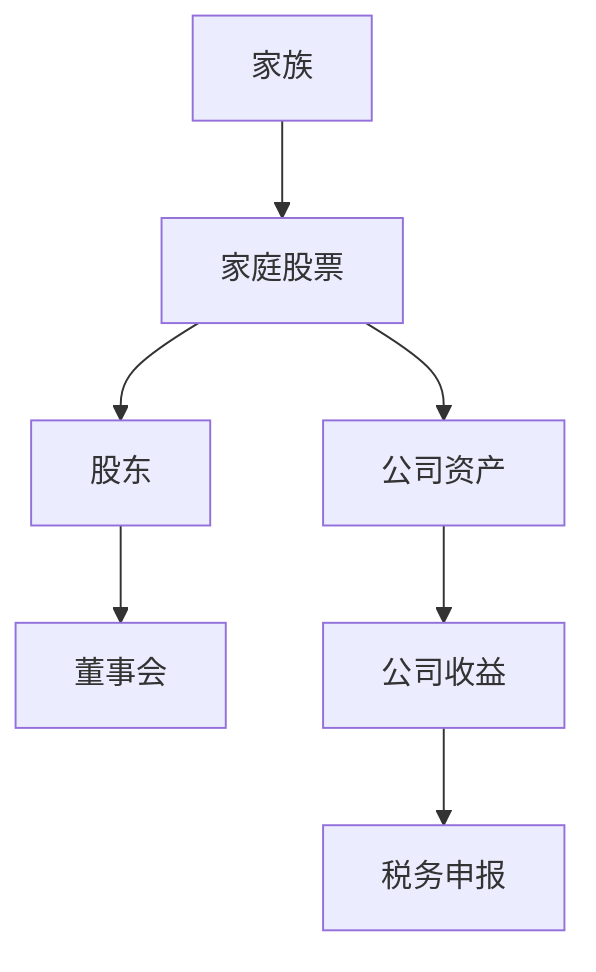
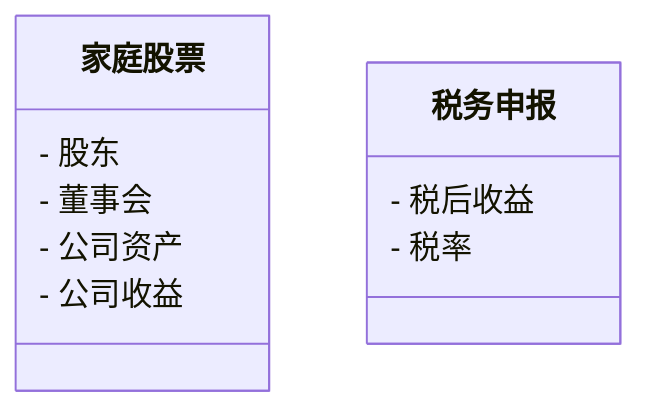
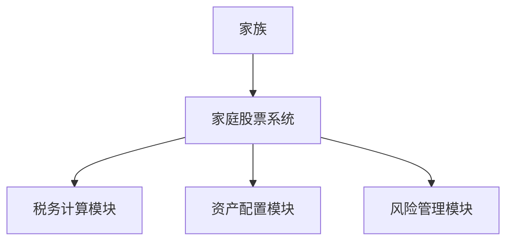

                 


# 彼得林奇的"家庭股票"在跨代财富传承中的税务效率最优化

## 关键词：财富传承，税务优化，家庭股票，彼得·林奇，跨代资产配置

## 摘要：本文深入分析了彼得·林奇的“家庭股票”理念在跨代财富传承中的税务效率优化策略。通过对比传统财富传承方式，探讨了家庭股票的税务优势，并结合数学模型和系统架构，详细阐述了如何通过优化资产配置实现税务效率最大化。文章最后通过实际案例分析，验证了家庭股票在财富传承中的实际应用价值。

---

# 第一部分: 背景介绍

## 第1章: 跨代财富传承中的税务效率问题

### 1.1 财富传承的背景与挑战

#### 1.1.1 财富传承的定义与重要性
财富传承是指通过法律和金融工具，将财富从一代人转移给下一代或其他受益人。随着家族财富的积累，如何有效传承财富，同时最大化资产价值，成为许多家族面临的挑战。

#### 1.1.2 跨代财富传承中的税务问题
在财富传承过程中，税务问题尤为突出。遗产税、赠与税、所得税等税务负担可能大幅侵蚀财富价值。传统的方式如直接继承或赠与，往往面临高额税务负担，导致财富损失。

#### 1.1.3 税务效率对财富传承的影响
税务效率直接影响财富传承的实际效果。高效的税务规划可以显著降低税务负担，确保财富的保值和增值，从而实现财富的顺利传承。

### 1.2 家庭股票在财富传承中的作用

#### 1.2.1 家庭股票的定义
家庭股票是指家族成员持有的特定股票，通常用于家族企业的资金管理和财富传承。它结合了股权和投资属性，具有独特的税务优势。

#### 1.2.2 家庭股票与传统财富传承方式的对比
家庭股票相较于传统的信托或直接赠与，具有更低的税务负担和更高的资产流动性。通过持有家庭股票，家族成员可以在享受资产收益的同时，灵活调整资产配置。

#### 1.2.3 家庭股票在税务优化中的潜力
家庭股票通过合理的税务结构设计，可以实现收益的递延和税基的最小化。例如，通过股息再投资或资本利得税的优化，降低整体税务负担。

---

## 第2章: 彼得·林奇的"家庭股票"理论

### 2.1 彼得·林奇投资理念概述

#### 2.1.1 彼得·林奇的投资者画像
彼得·林奇是著名投资经理，以其长期投资和价值发现策略闻名。他认为，成功的投资需要深入理解企业基本面，并长期持有优质资产。

#### 2.1.2 林奇的投资策略与风格
林奇强调长期投资和分散风险，注重企业的盈利能力和成长潜力。他的投资策略以稳健和可持续性为核心，注重资产的长期增值。

#### 2.1.3 林奇对家庭财富管理的见解
林奇认为，家庭财富管理应注重资产配置的合理性和税务规划的优化。通过持有优质资产，可以实现财富的保值和增值。

### 2.2 "家庭股票"的核心概念

#### 2.2.1 家庭股票的定义与特点
家庭股票是为家族定制的特定股票，通常用于家族企业的资金管理和财富传承。它具有较高的流动性和税务优化潜力。

#### 2.2.2 家庭股票的税务优势
通过持有家庭股票，家族成员可以享受资本利得税的优惠，避免高额遗产税和赠与税。此外，股息再投资可以进一步降低税务负担。

#### 2.2.3 家庭股票的长期投资价值
家庭股票不仅提供稳定的收益，还能通过长期持有实现资产增值。其税务优势使其成为跨代财富传承的理想选择。

### 2.3 家庭股票与财富传承的关系

#### 2.3.1 家庭股票在财富传承中的地位
家庭股票作为家族财富的核心资产，是实现财富传承的重要工具。通过合理配置家庭股票，可以确保家族财富的长期稳定。

#### 2.3.2 家庭股票如何实现税务效率优化
通过优化家庭股票的持有结构和资产配置，可以实现税务的递延和最小化。例如，通过家族信托持有家庭股票，可以有效降低遗产税负担。

#### 2.3.3 家庭股票的法律与税务结构
家庭股票的法律结构通常涉及家族信托和公司治理。通过合理的法律安排，可以确保家庭股票的税务优势，并实现财富的顺利传承。

---

# 第二部分: 核心概念与联系

## 第3章: 家庭股票的税务优化原理

### 3.1 税务效率优化的核心原理

#### 3.1.1 税收递延与税务抵扣机制
家庭股票通过递延税款支付，可以有效降低当前税务负担。同时，股息再投资可以享受税务抵扣，进一步优化税务结构。

#### 3.1.2 资产转移的税务影响
通过家庭股票实现资产转移，可以避免直接赠与的高额赠与税。家庭股票的持有结构设计可以有效降低税务负担。

#### 3.1.3 家庭股票的税务优势分析
家庭股票通过合理的税务规划，可以在股息分配、资本利得等方面享受优惠，实现财富的最小化税务负担。

### 3.2 家庭股票的税务属性对比

#### 3.2.1 家庭股票与其他财富传承工具的对比
| 工具类型       | 遗产税 | 赠与税 | 资本利得税 | 税务优势 |
|----------------|--------|--------|------------|-----------|
| 家庭股票       | 低     | 低     | 优惠       | 税务效率高 |
| 信托           | 中     | 中     | 一般       | 稍逊于家庭股票 |
| 直接继承       | 高     | 高     | 高         | 税务负担重 |

#### 3.2.2 家庭股票在不同税务环境下的表现
在不同国家和地区的税务政策下，家庭股票的税务优势有所不同。例如，在低税率地区设立家族信托，可以进一步优化税务负担。

#### 3.2.3 家庭股票的税务风险与控制
尽管家庭股票具有显著的税务优势，但也需要关注潜在的税务风险。例如，税务政策的变化可能影响家庭股票的税务待遇。因此，定期审查和调整税务结构至关重要。

### 3.3 家庭股票的ER实体关系图



---

# 第三部分: 算法原理讲解

## 第4章: 家庭股票税务优化的数学模型

### 4.1 税务优化的基本公式

#### 4.1.1 税后收益计算公式
税后收益计算公式如下：
$$ \text{税后收益} = \text{收益} \times (1 - \text{税率}) $$

#### 4.1.2 资产配置的优化模型
资产配置的优化模型可以通过以下步骤实现：
1. 确定可投资资产总额。
2. 设定各资产类别的预期收益和风险。
3. 优化资产配置，使得预期收益在给定风险下最大化。

### 4.2 家庭股票税务效率的

---

## 第5章: 系统分析与架构设计

### 5.1 问题场景介绍
在跨代财富传承中，税务效率是影响财富保值和增值的关键因素。通过优化家庭股票的税务结构，可以实现财富的长期稳定传承。

### 5.2 系统功能设计

#### 5.2.1 领域模型类图


### 5.3 系统架构设计

#### 5.3.1 系统架构图


---

## 第6章: 项目实战

### 6.1 环境安装
需要安装Python和相关库，如numpy和pandas。

### 6.2 核心代码实现

```python
import numpy as np
import pandas as pd

# 定义家庭股票的收益和税率
def calculate_tax_efficiency(revenue, tax_rate):
    tax = revenue * tax_rate
    net_revenue = revenue - tax
    return net_revenue

# 计算不同税率下的净收益
revenue = 1000000
tax_rates = [0.1, 0.15, 0.2]
results = []

for rate in tax_rates:
    net_revenue = calculate_tax_efficiency(revenue, rate)
    results.append((rate, net_revenue))

# 输出结果
for rate, net_revenue in results:
    print(f"税率 {rate}: 净收益 {net_revenue}")
```

### 6.3 代码解读与分析
通过上述代码，可以比较不同税率下的净收益，选择最优的税率结构。这有助于优化家庭股票的税务负担，实现财富的最小化税务损失。

---

## 第7章: 最佳实践与总结

### 7.1 小结
家庭股票通过合理的税务结构设计，可以在跨代财富传承中实现税务效率的最大化。其独特的优势使其成为财富传承的理想工具。

### 7.2 注意事项
在实际操作中，需关注税务政策的变化和法律结构的优化。定期审查和调整税务结构，确保家庭股票的税务优势得以持续发挥。

### 7.3 拓展阅读
建议进一步研究动态税率调整下的资产配置策略，以及家庭股票在国际税务环境中的应用。

---

通过以上分析和实践，我们可以看到，彼得·林奇的“家庭股票”在跨代财富传承中的税务效率优化具有显著的优势。通过合理的税务规划和资产配置，可以有效降低税务负担，确保财富的长期稳定传承。

