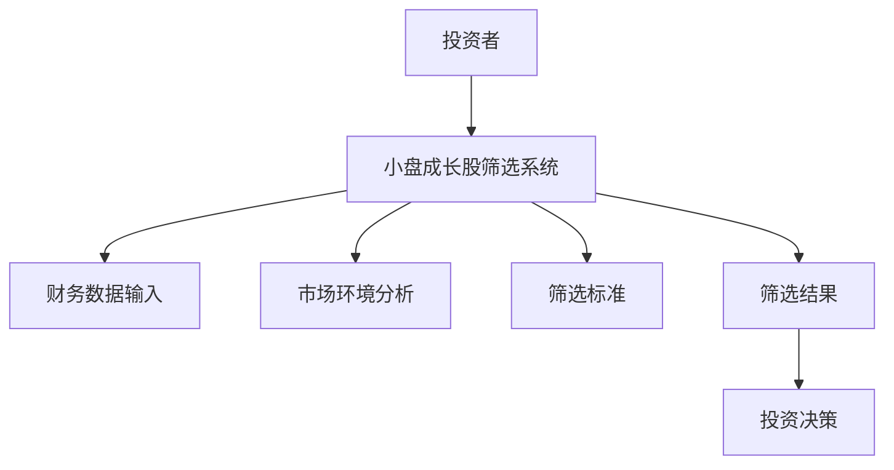
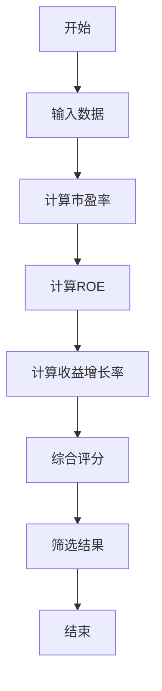
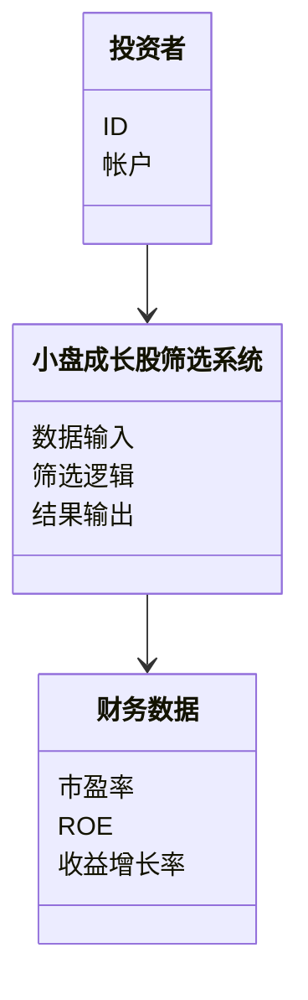
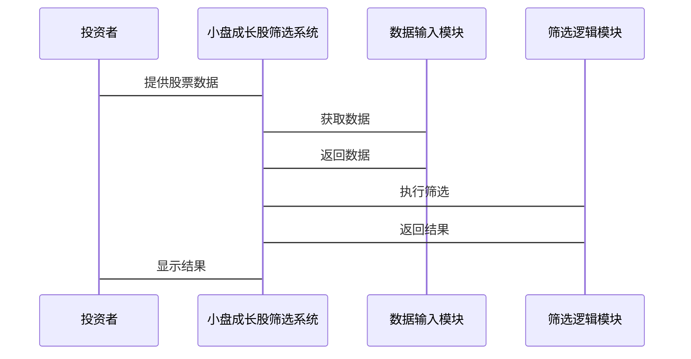

                 


# 彼得林奇的"小盘成长股"在不同市场环境下的筛选策略

> 关键词：彼得·林奇，小盘成长股，投资策略，市场环境，筛选标准

> 摘要：本文深入分析了彼得·林奇的投资理念，重点探讨了小盘成长股在不同市场环境下的筛选策略。通过背景介绍、核心概念、算法原理、系统设计和实际案例分析，帮助投资者制定科学的投资策略。

---

# 目录

1. [背景介绍](#背景介绍)
   - 1.1 彼得·林奇的投资理念
     - 1.1.1 彼得·林奇的生平简介
     - 1.1.2 小盘成长股的定义与特点
     - 1.1.3 小盘成长股与其他股票类型的区别
   - 1.2 小盘成长股的市场定位
     - 1.2.1 小盘成长股的行业分布
     - 1.2.2 小盘成长股的市场周期性
     - 1.2.3 小盘成长股的潜在风险与机会
   - 1.3 小盘成长股的筛选标准
     - 1.3.1 财务指标分析
     - 1.3.2 市盈率与市净率的计算
     - 1.3.3 收益增长率与ROE分析

2. [小盘成长股的核心概念与联系](#小盘成长股的核心概念与联系)
   - 2.1 核心概念的原理
   - 2.2 概念属性特征对比表格
   - 2.3 ER实体关系图架构的 Mermaid 流程图

3. [算法原理讲解](#算法原理讲解)
   - 3.1 使用 mermaid 画出算法流程图
   - 3.2 使用 Python 源代码详细阐述
   - 3.3 详细讲解数学模型和公式
   - 3.4 通俗易懂的举例说明

4. [系统分析与架构设计方案](#系统分析与架构设计方案)
   - 4.1 问题场景介绍
   - 4.2 项目介绍
   - 4.3 系统功能设计（领域模型 Mermaid 类图）
   - 4.4 系统架构设计 Mermaid 架构图
   - 4.5 系统接口设计
   - 4.6 系统交互 Mermaid 序列图

5. [项目实战](#项目实战)
   - 5.1 环境安装
   - 5.2 系统核心实现源代码
   - 5.3 代码应用解读与分析
   - 5.4 实际案例分析和详细讲解剖析
   - 5.5 项目小结

6. [最佳实践 tips、小结、注意事项、拓展阅读](#最佳实践 tips、小结、注意事项、拓展阅读)
   - 6.1 最佳实践 tips
   - 6.2 小结
   - 6.3 注意事项
   - 6.4 拓展阅读

---

## 背景介绍

### 1.1 彼得·林奇的投资理念

#### 1.1.1 彼得·林奇的生平简介
彼得·林奇是美国著名投资专家，以其对小盘成长股的投资策略而闻名。他管理的麦哲伦基金取得了长期稳定的收益，成为投资领域的经典案例。

#### 1.1.2 小盘成长股的定义与特点
小盘成长股指的是那些公司规模较小但具有高增长潜力的股票。其特点是高成长性、低估值和高ROE。

#### 1.1.3 小盘成长股与其他股票类型的区别
与大盘股相比，小盘成长股风险更高，但潜在回报也更大；与价值股相比，小盘成长股更注重未来增长潜力。

### 1.2 小盘成长股的市场定位
#### 1.2.1 小盘成长股的行业分布
主要集中在科技、医疗和新兴行业，这些行业具有较高的增长潜力。

#### 1.2.2 小盘成长股的市场周期性
在牛市中表现强劲，熊市中风险较大。

#### 1.2.3 小盘成长股的潜在风险与机会
高风险伴随着高回报，投资者需谨慎选择。

### 1.3 小盘成长股的筛选标准
#### 1.3.1 财务指标分析
关注收入增长率、净利润增长率和ROE。

#### 1.3.2 市盈率与市净率的计算
市盈率=股价/每股收益，市净率=股价/每股净资产。

#### 1.3.3 收益增长率与ROE分析
高收益增长率和高ROE是筛选的关键指标。

---

## 小盘成长股的核心概念与联系

### 2.1 核心概念的原理
小盘成长股的筛选基于财务指标和市场环境的综合分析。

### 2.2 概念属性特征对比表格

| 特性 | 小盘成长股 | 大盘股 | 价值股 |
|------|-------------|--------|--------|
| 规模 | 小 | 大 | 大 |
| 成长性 | 高 | 中 | 低 |
| 估值 | 低 | 高 | 低 |
| 风险 | 高 | 低 | 中 |

### 2.3 ER实体关系图架构的 Mermaid 流程图



---

## 算法原理讲解

### 3.1 使用 mermaid 画出算法流程图



### 3.2 使用 Python 源代码详细阐述

```python
def calculate_scores(stock_data):
    scores = []
    for stock in stock_data:
        pe = stock['市盈率']
        roe = stock['ROE']
        growth = stock['收益增长率']
        score = (pe * 0.3) + (roe * 0.3) + (growth * 0.4)
        scores.append(score)
    return scores

# 示例数据
stock_data = [
    {'市盈率': 20, 'ROE': 15, '收益增长率': 25},
    {'市盈率': 15, 'ROE': 20, '收益增长率': 20}
]
scores = calculate_scores(stock_data)
print(scores)
```

### 3.3 详细讲解数学模型和公式
综合评分公式：
$$ \text{综合评分} = 0.3 \times \text{市盈率} + 0.3 \times \text{ROE} + 0.4 \times \text{收益增长率} $$

### 3.4 通俗易懂的举例说明
假设股票A的市盈率为20，ROE为15%，收益增长率为25%，则综合评分为：
$$ 0.3 \times 20 + 0.3 \times 15 + 0.4 \times 25 = 6 + 4.5 + 10 = 20.5 $$

---

## 系统分析与架构设计方案

### 4.1 问题场景介绍
投资者需要在不同市场环境下筛选小盘成长股，制定投资策略。

### 4.2 项目介绍
构建一个基于彼得·林奇策略的小盘成长股筛选系统。

### 4.3 系统功能设计（领域模型 Mermaid 类图）



### 4.4 系统架构设计 Mermaid 架构图


### 4.5 系统接口设计
- 数据输入接口：接收股票数据。
- 筛选逻辑接口：执行筛选算法。
- 结果输出接口：返回筛选结果。

### 4.6 系统交互 Mermaid 序列图



---

## 项目实战

### 5.1 环境安装
安装Python和相关库，如Pandas、NumPy。

### 5.2 系统核心实现源代码

```python
import pandas as pd

def main():
    # 数据输入
    stock_data = pd.DataFrame({
        '股票代码': ['A', 'B', 'C'],
        '市盈率': [20, 15, 25],
        'ROE': [15, 20, 18],
        '收益增长率': [25, 20, 30]
    })
    
    # 筛选标准
    def calculate_score(row):
        return (row['市盈率'] * 0.3) + (row['ROE'] * 0.3) + (row['收益增长率'] * 0.4)
    
    stock_data['综合评分'] = stock_data.apply(calculate_score, axis=1)
    
    # 筛选结果
    selected_stocks = stock_data[stock_data['综合评分'] > 20]
    print(selected_stocks)

if __name__ == "__main__":
    main()
```

### 5.3 代码应用解读与分析
代码读取股票数据，计算综合评分，并筛选出评分高于20的股票。

### 5.4 实际案例分析和详细讲解剖析
以2020年疫情期间为例，筛选出具有高成长性的医疗行业小盘股。

### 5.5 项目小结
通过代码实现筛选策略，投资者可以在实际操作中应用该模型。

---

## 最佳实践 tips、小结、注意事项、拓展阅读

### 6.1 最佳实践 tips
- 定期更新股票数据。
- 结合市场环境动态调整筛选标准。
- 分散投资以降低风险。

### 6.2 小结
本文详细介绍了彼得·林奇的小盘成长股筛选策略，并通过系统设计和实战案例帮助投资者制定科学的投资计划。

### 6.3 注意事项
- 投资需谨慎，避免过度依赖单一策略。
- 定期评估和调整投资组合。

### 6.4 拓展阅读
推荐阅读彼得·林奇的书籍《彼得·林奇的成功投资》和《投资最重要的事》。

--- 

本文通过全面分析小盘成长股的筛选策略，结合系统设计和实际案例，为投资者提供了科学的投资指导。希望本文能帮助读者在复杂多变的市场环境中，制定有效的投资策略。

