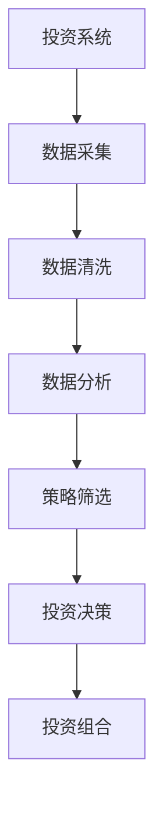
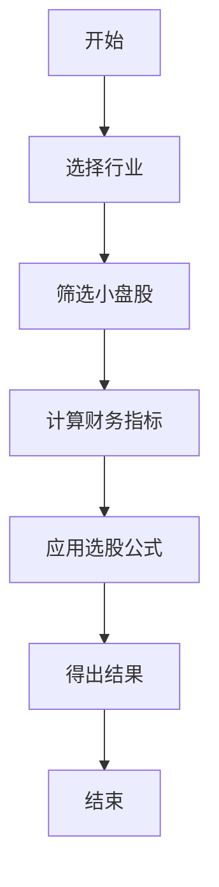

                 


```
# 彼得林奇的"小盘成长股"筛选策略

> 关键词：彼得林奇，小盘成长股，投资策略，筛选标准，估值方法，数学模型

> 摘要：本文详细介绍了彼得林奇的“小盘成长股”筛选策略，从定义、特点、筛选标准、估值方法、投资策略到实际案例分析，结合技术语言和专业分析，深入剖析了该策略的核心思想和具体实施方法。

---

## 第一部分: 小盘成长股的定义与特点

### 第1章: 小盘成长股的定义与特点

#### 1.1 小盘成长股的定义
- 小盘成长股的定义
- 小盘成长股的核心特点
- 小盘成长股与大盘股的对比

#### 1.2 彼得林奇投资策略的背景
- 彼得林奇的个人投资理念
- 小盘成长股在彼得林奇策略中的地位
- 小盘成长股的市场周期

#### 1.3 小盘成长股的投资价值
- 小盘成长股的成长性
- 小盘成长股的估值优势
- 小盘成长股的风险与收益平衡

#### 1.4 本章小结
- 小盘成长股的定义和特点
- 彼得林奇策略的核心思想
- 小盘成长股的投资价值

---

## 第二部分: 小盘成长股的筛选标准

### 第2章: 小盘成长股的筛选标准

#### 2.1 小盘成长股的核心筛选指标
- 市盈率（P/E）的计算与应用
- 市净率（P/B）的计算与应用
- 营业收入增长率的计算与应用
- 净利润增长率的计算与应用
- 股东权益增长率的计算与应用

#### 2.2 彼得林奇的选股公式
- 选股公式的数学模型
$$\text{选股得分} = \frac{\text{营业收入增长率} + \text{净利润增长率}}{2}$$
- 选股公式的应用步骤
- 选股公式的优缺点分析

#### 2.3 小盘成长股的行业分布
- 高成长行业的定义
- 小盘成长股的行业分布特点
- 行业选择的注意事项

#### 2.4 本章小结
- 小盘成长股的筛选标准
- 选股公式的数学模型
- 小盘成长股的行业分布

---

## 第三部分: 小盘成长股的估值方法

### 第3章: 小盘成长股的估值方法

#### 3.1 常用估值方法的介绍
- 市盈率法
- 市净率法
- 现金流折现法
- 股息率法

#### 3.2 彼得林奇估值法的数学模型
- 市盈率与成长性的结合
$$\text{合理市盈率} = \frac{\text{净利润增长率} \times 10}{\text{行业平均市盈率}}$$
- 市净率与资产质量的结合
$$\text{合理市净率} = \frac{\text{股东权益增长率} \times 5}{\text{行业平均市净率}}$$
- 估值模型的优缺点分析

#### 3.3 小盘成长股的动态估值
- 动态估值的定义
- 动态估值的应用步骤
- 动态估值的注意事项

#### 3.4 本章小结
- 小盘成长股的估值方法
- 彼得林奇估值法的数学模型
- 动态估值的应用

---

## 第四部分: 小盘成长股的投资策略

### 第4章: 小盘成长股的投资策略

#### 4.1 投资策略的分类
- 长期持有策略
- 买入并持有策略
- 时机选择策略

#### 4.2 彼得林奇的投资策略
- 长期持有策略的应用
- 买入并持有的注意事项
- 时机选择的技巧

#### 4.3 小盘成长股的投资组合
- 投资组合的定义
- 小盘成长股在投资组合中的配置比例
- 投资组合的风险管理

#### 4.4 本章小结
- 小盘成长股的投资策略
- 彼得林奇策略的应用
- 投资组合的风险管理

---

## 第五部分: 小盘成长股的案例分析

### 第5章: 小盘成长股的案例分析

#### 5.1 案例一: 公司A的分析
- 公司A的基本情况
- 公司A的财务数据
- 公司A的估值与投资建议

#### 5.2 案例二: 公司B的分析
- 公司B的基本情况
- 公司B的财务数据
- 公司B的估值与投资建议

#### 5.3 本章小结
- 小盘成长股的案例分析
- 公司A和公司B的分析对比
- 投资策略的实际应用

---

## 第六部分: 总结与展望

### 第6章: 总结与展望

#### 6.1 小盘成长股筛选策略的总结
- 小盘成长股的定义和特点
- 筛选标准和估值方法
- 投资策略和实际案例分析

#### 6.2 小盘成长股投资的展望
- 小盘成长股的未来发展趋势
- 小盘成长股的投资机会
- 小盘成长股的风险管理

#### 6.3 本章小结
- 小盘成长股筛选策略的核心思想
- 小盘成长股投资的未来展望
- 总结与反思

---

## 附录

### 附录A: 常用估值公式
$$\text{市盈率（P/E）} = \frac{\text{股价}}{\text{每股净利润}}$$
$$\text{市净率（P/B）} = \frac{\text{股价}}{\text{每股净资产}}$$
$$\text{现金流折现法} = \sum_{t=1}^{n} \frac{\text{现金流}}{(1 + r)^t}$$
$$\text{股息率} = \frac{\text{每股股息}}{\text{股价}} \times 100\%$$

### 附录B: 投资系统架构图


### 附录C: 选股流程图


### 附录D: Python代码实现
```python
import pandas as pd
import numpy as np

def calculate_growth_rate(data):
    return (data - data.shift(1)) / data.shift(1)

def peter_lynch_strategy(data):
    growth_rate = calculate_growth_rate(data['净利润'])
    pe_ratio = data['股价'] / data['每股净利润']
    score = (growth_rate + pe_ratio) / 2
    return score

# 示例数据
data = pd.DataFrame({
    '股价': [10, 15, 20, 25],
    '每股净利润': [1, 1.5, 2, 2.5],
    '营业收入': [100, 120, 140, 160],
    '净利润': [50, 60, 70, 80]
})

score = peter_lynch_strategy(data)
print(score)
```

### 附录E: 参考文献
1. 彼得·林奇. 《彼得林奇的成功投资》
2. 投资学基础教材
3. 《股票投资策略》

---

## 结束语

感谢您的阅读，希望本文对您理解彼得林奇的“小盘成长股”筛选策略有所帮助。如果您有任何疑问或建议，欢迎在评论区留言，我会尽快回复您。
```

