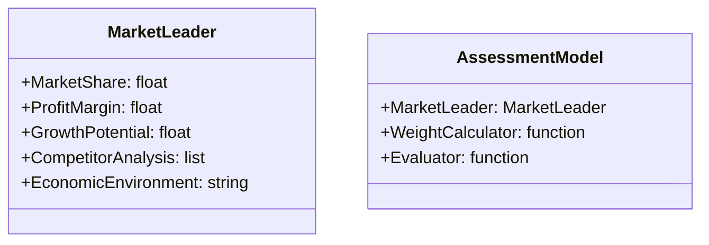
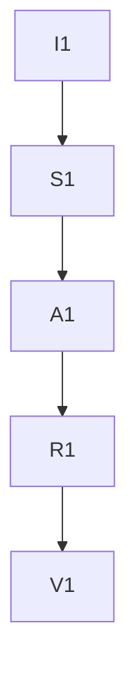
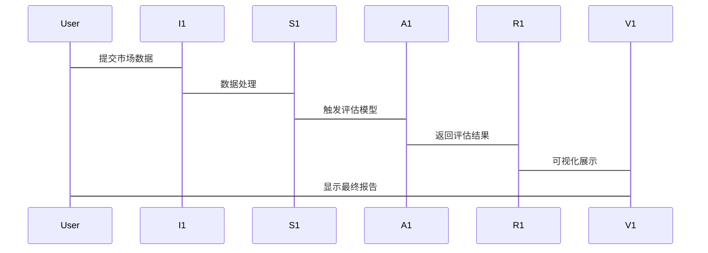

                 


# 彼得林奇的"市场先行者"优势持续性评估方法

> 关键词：彼得林奇，市场先行者，竞争优势，持续性评估，投资策略

> 摘要：本文将详细介绍彼得·林奇的市场先行者优势持续性评估方法，从理论基础到实际应用，分析如何通过评估市场竞争优势的持续性来制定有效的投资策略。

---

# 第一部分: 市场先行者优势的理论基础

## 第1章: 市场先行者优势的定义与特征

### 1.1 市场先行者的定义
- 什么是市场先行者
- 先行者的优势：先发制人的战略意义
- 先行者劣势：过早进入市场的潜在风险

### 1.2 先行者优势的核心特征
- 市场主导地位
- 品牌影响力
- 成本优势
- 技术创新
- 客户忠诚度

## 第2章: 彼得·林奇的市场先行者理论

### 2.1 彼得·林奇投资理论概述
- 彼得·林奇的投资哲学
- 市场先行者在林奇理论中的重要性
- 林奇对先行者优势的精辟见解

### 2.2 市场先行者优势的持续性评估
- 为何需要评估优势的持续性
- 评估方法的核心逻辑
- 评估结果对企业战略的影响

---

# 第二部分: 先行者优势的持续性评估模型

## 第3章: 评估维度与指标体系

### 3.1 评估维度分析
- 市场份额
- 利润率
- 市场增长潜力
- 竞争对手分析
- 宏观经济环境

### 3.2 指标体系的构建
- 核心指标的选择依据
- 指标权重的分配方法
- 综合评估指数的计算公式

## 第4章: 评估模型的数学表达

### 4.1 市场份额权重计算公式
$$ S_i = \sum_{j=1}^{n} w_j \cdot x_j $$

### 4.2 利润率与增长潜力的综合评估公式
$$ P_i = \alpha \cdot R_i + \beta \cdot G_i $$

### 4.3 综合优势指数计算公式
$$ C_i = \gamma \cdot S_i + \delta \cdot P_i $$

## 第5章: 模型的验证与优化

### 5.1 数据收集与处理
- 数据来源与采集方法
- 数据清洗与预处理
- 数据的可比性分析

### 5.2 模型验证
- 回归分析与拟合检验
- 模型的准确性和稳定性测试
- 实证分析案例

### 5.3 模型优化
- 参数调优策略
- 模型结构的改进
- 算法优化与效率提升

---

# 第三部分: 先行者优势评估的系统分析与架构设计

## 第6章: 系统分析

### 6.1 问题场景描述
- 企业面临的市场竞争问题
- 市场先行者优势评估的需求分析
- 系统目标与范围界定

### 6.2 系统功能需求
- 数据采集与管理模块
- 评估模型计算模块
- 结果可视化与报告生成模块

## 第7章: 系统架构设计

### 7.1 领域模型（Mermaid 类图）


### 7.2 系统架构图


## 第8章: 系统接口设计

### 8.1 数据接口设计
- 输入接口：市场数据输入格式
- 输出接口：评估结果输出格式
- 接口调用示例

### 8.2 系统交互设计


---

# 第四部分: 项目实战与案例分析

## 第9章: 项目实战

### 9.1 环境安装
- 安装必要的开发工具
- 数据库与依赖库安装
- 系统框架搭建

### 9.2 核心代码实现
```python
def calculate_market_share(company_data):
    # 公司数据处理和市场份额计算逻辑
    pass

def assess_growth_potential(company_data):
    # 市场增长潜力评估逻辑
    pass

# 主函数
def main():
    # 加载数据
    # 调用评估函数
    # 生成报告
```

### 9.3 代码解读与分析
- 关键函数实现
- 算法实现细节
- 代码优化建议

## 第10章: 案例分析

### 10.1 案例背景
- 某行业市场现状
- 典型市场先行者企业分析

### 10.2 应用过程
- 数据准备
- 模型应用
- 结果分析

### 10.3 案例总结
- 成功经验总结
- 问题与不足
- 改进建议

---

# 第五部分: 总结与展望

## 第11章: 总结

### 11.1 核心结论
- 本文的主要结论
- 对市场先行者优势评估方法的总结

### 11.2 方法的价值
- 对企业战略决策的意义
- 对投资者的指导作用
- 对学术研究的贡献

## 第12章: 未来展望

### 12.1 方法的改进方向
- 算法优化建议
- 数据源扩展
- 结果展示方式创新

### 12.2 研究的拓展
- 新兴市场的应用前景
- 数字化工具的引入
- 全球化视角下的市场分析

---

# 附录

## 附录A: 常用工具与资源

### A.1 数据分析工具推荐
- Python
- R语言
- SQL

### A.2 相关书籍与文献
- 彼得·林奇的经典著作
- 其他相关投资理论书籍

## 附录B: 行业案例库

### B.1 典型行业案例
- 科技行业
- 消费品行业
- 金融行业

## 附录C: 术语表

### C.1 核心术语解释
- 市场先行者
- 先行者优势
- 优势持续性

---

通过以上目录结构，本文将系统地介绍彼得·林奇的市场先行者优势持续性评估方法，结合理论分析、数学建模、系统设计和实际案例，为读者提供全面而深入的指导。

