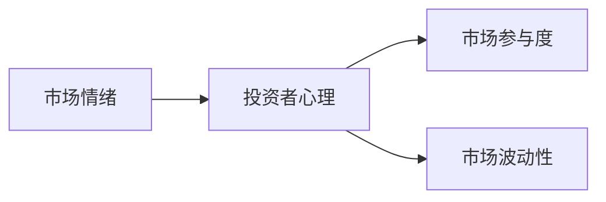
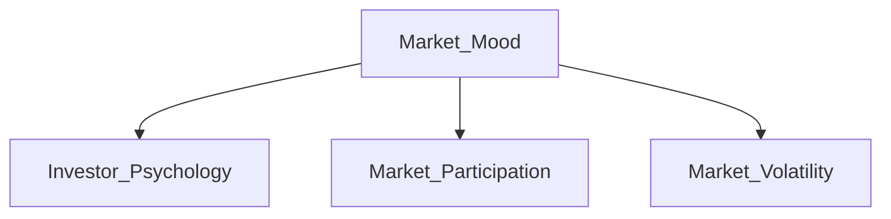
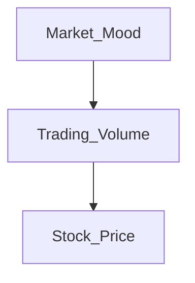
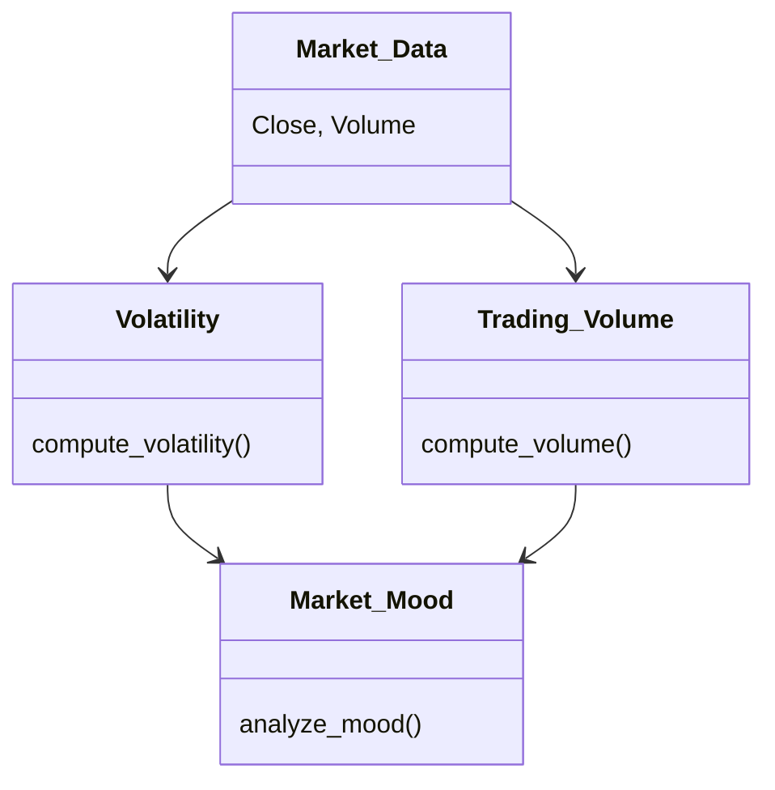
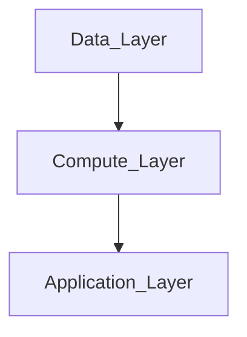

                 


# 彼得林奇的市场情绪判断技巧

## 关键词：彼得林奇，市场情绪，投资策略，情绪指标，市场分析

## 摘要：  
彼得林奇作为投资界的传奇人物，以其独特的市场情绪判断技巧闻名。本文将详细分析彼得林奇如何通过市场情绪进行投资决策，包括市场情绪的定义、构成要素、分析方法及其与投资策略的关系。通过实例分析和系统设计，本文将提供一套完整的市场情绪分析框架，帮助读者更好地理解和应用彼得林奇的市场情绪判断技巧。

---

# 第一部分: 市场情绪的定义与重要性

## 第1章: 市场情绪的定义与内涵

### 1.1 市场情绪的定义
市场情绪是指投资者在市场中的整体心理状态，反映了投资者对市场的看法和预期。它可以通过市场参与度、交易量、股价波动等指标来衡量。



市场情绪是投资决策的重要参考，特别是在市场波动剧烈时，情绪指标可以帮助投资者判断市场的短期走势。

---

## 第2章: 彼得林奇的市场情绪分析方法

### 2.1 市场情绪的构成要素

市场情绪的构成要素包括投资者心理、市场参与度和市场波动性。



彼得林奇认为，市场情绪的变化往往预示着市场的转折点，因此他特别关注市场情绪的拐点。

---

## 第3章: 市场情绪与投资决策

### 3.1 市场情绪对投资决策的影响

市场情绪通过影响投资者的行为进而影响市场走势。例如，当市场情绪高涨时，投资者倾向于追涨杀跌，导致股价偏离基本面。



彼得林奇通过分析市场情绪的变化，判断市场的买入或卖出信号。

---

# 第二部分: 彼得林奇的市场情绪分析技巧

## 第4章: 市场情绪的量化分析

### 4.1 情绪指标的计算方法

彼得林奇使用多种情绪指标来衡量市场情绪，例如波动率和交易量。

```python
import pandas as pd
import numpy as np

# 示例数据：假设我们有一个包含收盘价和交易量的数据集
data = pd.DataFrame({
    'Close': [100, 105, 98, 102, 104],
    'Volume': [1000, 1500, 800, 1200, 1300]
})

# 计算波动率
volatility = np.std(data['Close']) / np.mean(data['Close']) * 100

# 计算交易量的平均值
avg_volume = np.mean(data['Volume'])
```

波动率和交易量的变化可以帮助投资者判断市场情绪的变化。

---

## 第5章: 市场情绪分析的实战应用

### 5.1 实例分析

假设市场情绪高涨，彼得林奇可能会建议投资者减少头寸，以避免市场的过度波动带来的风险。

### 5.2 技巧总结

彼得林奇的市场情绪分析技巧包括：

1. 关注市场情绪的拐点
2. 结合技术指标进行分析
3. 考虑市场的周期性变化

---

# 第三部分: 系统分析与架构设计

## 第6章: 市场情绪分析系统的功能设计

### 6.1 系统功能设计

市场情绪分析系统需要具备以下功能：

1. 数据采集：获取市场数据
2. 情绪指标计算：计算波动率、交易量等指标
3. 情绪分析：判断市场情绪
4. 投资建议：根据市场情绪提供投资建议



---

## 第7章: 市场情绪分析系统的架构设计

### 7.1 系统架构设计

市场情绪分析系统的架构包括数据层、计算层和应用层。



---

## 第8章: 项目实战

### 8.1 环境安装

安装必要的库：

```bash
pip install pandas numpy matplotlib
```

---

## 第9章: 项目总结

### 9.1 最佳实践 tips

- 定期回顾市场情绪的变化
- 结合其他技术指标进行综合分析
- 避免过度依赖情绪指标

### 9.2 小结

彼得林奇的市场情绪判断技巧为投资者提供了一种新的视角来分析市场。通过量化分析和系统设计，投资者可以更好地理解市场情绪的变化，并做出更明智的投资决策。

---

通过本文的分析，读者可以全面了解彼得林奇的市场情绪判断技巧，并能够在实际投资中灵活运用这些方法。希望本文能够为投资者提供有价值的参考和启发。

