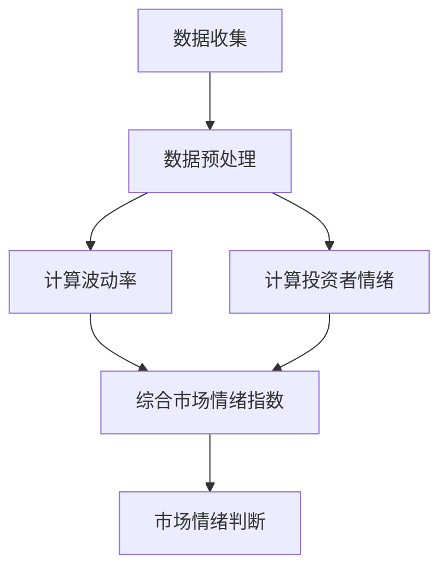
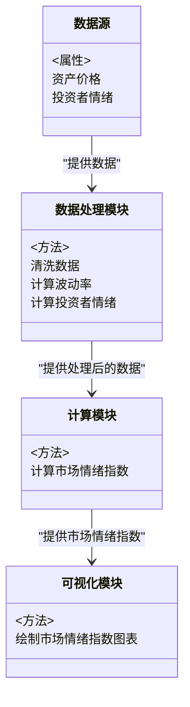
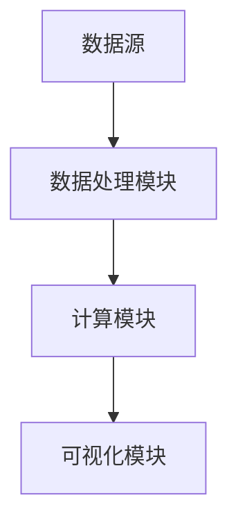
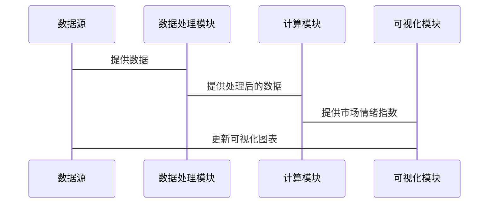

                 


# 彼得林奇的"市场情绪"判断方法

> 关键词：市场情绪，彼得·林奇，投资决策，市场波动，资产定价

> 摘要：本文深入探讨了彼得·林奇的市场情绪判断方法，从理论基础到实际应用，结合技术分析和量化方法，提供了一套完整的市场情绪分析框架。通过算法原理、数学模型和系统架构的设计，帮助读者更好地理解市场情绪对投资决策的影响。

---

## 第1章：市场情绪的基本概念与背景

### 1.1 市场情绪的定义与核心概念

#### 1.1.1 市场情绪的定义
市场情绪（Market Sentiment）是指市场参与者对当前市场状况的心理态度和预期，通常反映在投资者的行为和资产价格的变化中。市场情绪可以是乐观、悲观、恐慌或贪婪，这些情绪会影响市场的买卖行为和价格走势。

#### 1.1.2 市场情绪的核心要素
- **投资者情绪**：投资者对市场的看法和预期。
- **市场波动性**：资产价格的短期波动通常与市场情绪密切相关。
- **市场参与度**：市场的活跃程度，包括成交量和交易频率。

#### 1.1.3 市场情绪与投资决策的关系
市场情绪是连接市场行为和资产价格波动的重要桥梁。投资者的情绪会影响他们的买卖决策，从而影响资产价格。例如，当市场情绪乐观时，投资者倾向于买入资产，推动价格上涨；反之，当市场情绪悲观时，投资者倾向于卖出资产，导致价格下跌。

### 1.2 彼得·林奇的市场情绪理论

#### 1.2.1 彼得·林奇的生平简介
彼得·林奇（Peter Lynch）是美国著名的职业棒球运动员，同时也是金融市场的权威分析师。他在职业生涯中积累了丰富的市场经验，并提出了许多关于市场情绪和投资决策的理论。

#### 1.2.2 林奇市场情绪理论的核心思想
林奇认为，市场情绪是资产价格波动的核心驱动力。他提出，市场的短期波动通常由情绪驱动，而长期趋势则由基本面因素决定。投资者需要关注市场情绪的变化，并结合基本面分析做出投资决策。

#### 1.2.3 林奇理论在投资实践中的应用
林奇的理论在实践中被广泛应用于资产配置、风险管理等领域。他强调，投资者需要通过市场情绪分析来识别市场的短期波动，并结合长期基本面分析做出投资决策。

### 1.3 市场情绪判断的重要性

#### 1.3.1 市场情绪对投资决策的影响
市场情绪会影响投资者的买卖行为，进而影响资产价格的短期波动。因此，准确判断市场情绪可以帮助投资者做出更明智的投资决策。

#### 1.3.2 市场情绪与资产价格波动的关系
市场情绪是资产价格波动的重要驱动因素。当市场情绪乐观时，资产价格上涨；当市场情绪悲观时，资产价格下跌。因此，市场情绪是资产价格预测的重要依据。

#### 1.3.3 市场情绪在不同市场周期的表现
在不同的市场周期中，市场情绪的表现有所不同。例如，在牛市中，市场情绪通常较为乐观；在熊市中，市场情绪通常较为悲观。了解市场情绪在不同周期中的表现，可以帮助投资者更好地应对市场波动。

## 第2章：市场情绪的核心要素与属性特征

### 2.1 市场情绪的核心要素

#### 2.1.1 投资者情绪
投资者情绪是市场情绪的核心要素之一。投资者的情绪通常通过市场参与度、成交量和投资者行为来反映。例如，当投资者情绪乐观时，成交量通常会增加。

#### 2.1.2 市场波动性
市场波动性是市场情绪的重要表现形式。市场波动性通常通过资产价格的波动幅度来衡量。例如，恐慌指数（VIX）是衡量市场波动性的重要指标。

#### 2.1.3 市场参与度
市场参与度是市场情绪的重要指标之一。市场参与度通常通过成交量和交易活跃度来反映。当市场参与度较高时，通常意味着市场情绪较为乐观。

### 2.2 市场情绪的属性特征对比

#### 2.2.1 不同市场情绪指标的对比
下表对比了常见市场情绪指标的定义、计算方法和应用场景。

| 情绪指标       | 定义                           | 计算方法                     | 应用场景                     |
|----------------|--------------------------------|------------------------------|------------------------------|
| 恐慌指数（VIX） | 衡量市场波动性的指标           | 基于标普500指数的波动率计算   | 判断市场的恐慌程度           |
| 投资者情绪指数 | 衡量投资者情绪的指标           | 基于投资者行为数据计算       | 判断投资者的情绪状态         |
| 市场广度指数   | 衡量市场参与度的指标           | 基于成交量和交易活跃度计算     | 判断市场的广度和深度         |

#### 2.2.2 市场情绪与资产价格的相关性
市场情绪与资产价格高度相关。当市场情绪乐观时，资产价格上涨；当市场情绪悲观时，资产价格下跌。因此，市场情绪是资产价格预测的重要依据。

#### 2.2.3 市场情绪的时间序列特征
市场情绪具有明显的时间序列特征。例如，市场情绪通常在市场顶部达到峰值，在市场底部达到谷值。这些特征可以帮助投资者识别市场的短期波动。

### 2.3 市场情绪的ER实体关系图

```mermaid
erDiagram
    class 市场情绪 {
        <属性>
        投资者情绪
        市场波动性
        市场参与度
    }
    class 资产价格 {
        <属性>
        价格
        波动率
    }
    class 市场情绪指标 {
        <属性>
        恐慌指数
        投资者情绪指数
        市场广度指数
    }
    市场情绪 --> 市场情绪指标 : "驱动"
    资产价格 --> 市场情绪 : "反映"
```

---

## 第3章：市场情绪的算法原理与数学模型

### 3.1 市场情绪指数的计算方法

#### 3.1.1 数据收集
市场情绪指数的计算通常基于历史资产价格数据和投资者行为数据。例如，可以通过收集标普500指数的历史数据和投资者情绪数据来计算市场情绪指数。

#### 3.1.2 数据预处理
数据预处理包括数据清洗和标准化。例如，可以通过去除异常值和填充缺失值来处理数据。

#### 3.1.3 市场情绪指数的计算
市场情绪指数的计算通常基于统计学方法。例如，可以通过计算资产价格的波动率和投资者情绪的综合指标来衡量市场情绪。

### 3.2 市场情绪指数的数学模型

#### 3.2.1 波动率模型
波动率模型用于衡量市场情绪的波动性。例如，恐慌指数（VIX）的计算公式如下：

$$ VIX = \sqrt{\frac{252}{n} \sum_{i=1}^{n} (\ln \frac{P_i}{P_{i-1}})^2} $$

其中，$P_i$ 是第i天的资产价格，$n$ 是交易天数。

#### 3.2.2 投资者情绪模型
投资者情绪模型用于衡量投资者的情绪状态。例如，投资者情绪指数可以通过以下公式计算：

$$ \text{投资者情绪指数} = \frac{\sum_{i=1}^{n} \text{投资者情绪评分}_i}{n} $$

其中，$\text{投资者情绪评分}_i$ 是第i天的投资者情绪评分，取值范围为-1到1。

#### 3.2.3 综合市场情绪指数
综合市场情绪指数是波动率和投资者情绪的综合指标。例如，综合市场情绪指数可以通过以下公式计算：

$$ \text{综合市场情绪指数} = \alpha \cdot VIX + \beta \cdot \text{投资者情绪指数} $$

其中，$\alpha$ 和 $\beta$ 是权重系数，通常通过历史数据回归确定。

### 3.3 算法流程图



### 3.4 代码实现

```python
import pandas as pd
import numpy as np

# 数据收集
data = pd.read_csv('market_data.csv')

# 数据预处理
data_clean = data.dropna().reset_index(drop=True)

# 计算波动率
def calculate_vix(data):
    log_returns = np.log(data['price'].pct_change().values)
    vix = np.sqrt(252 / len(log_returns)) * np.mean(log_returns ** 2)
    return vix

# 计算投资者情绪指数
def calculate Investor_sentiment(data):
    sentiment_scores = data['sentiment'].values
    investor_sentiment = np.mean(sentiment_scores)
    return investor_sentiment

# 计算综合市场情绪指数
alpha = 0.5
beta = 0.5
vix = calculate_vix(data_clean)
investor_sentiment = calculate Investor_sentiment(data_clean)
composite_sentiment = alpha * vix + beta * investor_sentiment

print(composite_sentiment)
```

---

## 第4章：市场情绪的系统架构设计

### 4.1 问题场景介绍
为了实时监控市场情绪，我们需要设计一个市场情绪监控系统。该系统需要实时收集市场数据，计算市场情绪指数，并提供可视化界面供投资者参考。

### 4.2 系统功能设计

#### 4.2.1 领域模型


#### 4.2.2 系统架构


#### 4.2.3 系统接口设计
- 数据源接口：提供资产价格和投资者情绪数据。
- 计算模块接口：接收处理后的数据，计算市场情绪指数。
- 可视化模块接口：接收市场情绪指数，生成可视化图表。

#### 4.2.4 系统交互流程


---

## 第5章：项目实战

### 5.1 环境安装
需要安装以下Python库：
- pandas
- numpy
- matplotlib
- seaborn

### 5.2 核心实现

#### 5.2.1 数据收集
```python
import pandas as pd
import numpy as np
import matplotlib.pyplot as plt

data = pd.read_csv('market_data.csv')
```

#### 5.2.2 数据预处理
```python
data_clean = data.dropna().reset_index(drop=True)
```

#### 5.2.3 波动率计算
```python
log_returns = np.log(data_clean['price'].pct_change().values)
vix = np.sqrt(252 / len(log_returns)) * np.mean(log_returns ** 2)
print(f"VIX指数: {vix}")
```

#### 5.2.4 投资者情绪计算
```python
sentiment_scores = data_clean['sentiment'].values
investor_sentiment = np.mean(sentiment_scores)
print(f"投资者情绪指数: {investor_sentiment}")
```

#### 5.2.5 综合市场情绪指数计算
```python
alpha = 0.5
beta = 0.5
composite_sentiment = alpha * vix + beta * investor_sentiment
print(f"综合市场情绪指数: {composite_sentiment}")
```

#### 5.2.6 可视化
```python
plt.figure(figsize=(10, 6))
plt.plot(data_clean['date'], data_clean['price'], label='资产价格')
plt.title('资产价格与市场情绪')
plt.xlabel('时间')
plt.ylabel('资产价格')
plt.legend()
plt.show()
```

### 5.3 案例分析
以标普500指数为例，分析市场情绪对资产价格的影响。通过计算综合市场情绪指数，可以判断市场的短期波动，并据此调整投资策略。

---

## 第6章：最佳实践与注意事项

### 6.1 小结
本文详细介绍了彼得·林奇的市场情绪判断方法，从理论到实践，结合技术分析和量化方法，提供了一套完整的市场情绪分析框架。

### 6.2 注意事项
- 市场情绪分析仅适用于短期投资决策，长期投资应结合基本面分析。
- 数据质量和数据来源对市场情绪计算至关重要。
- 市场情绪模型需要定期更新和优化，以适应市场变化。

### 6.3 拓展阅读
- 《彼得·林奇的投资哲学》
- 《市场情绪与资产定价》

---

## 结语
通过本文的分析，读者可以更好地理解市场情绪对投资决策的影响，并能够结合实际数据进行市场情绪分析。希望本文能够为投资者提供有价值的参考和指导。

