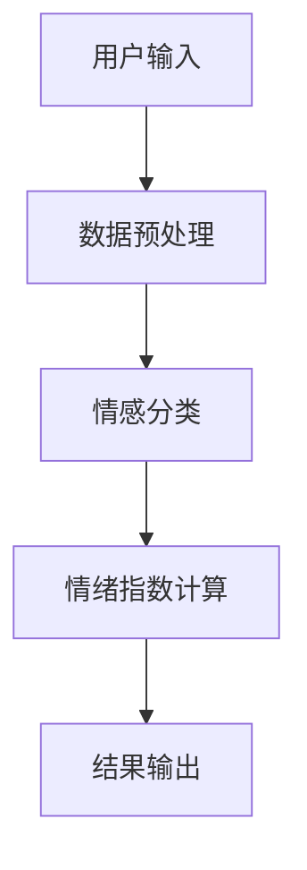

                 


# 彼得林奇的"市场情绪"利用技巧

## 关键词：
- 彼得·林奇
- 市场情绪
- 投资策略
- 情绪分析
- 量化投资

## 摘要：
彼得·林奇是全球著名基金经理，他将市场情绪视为投资决策的重要依据。本文深入解析市场情绪的定义、分类及其对投资的影响，详细阐述彼得·林奇的市场情绪利用技巧，并结合技术手段，从算法、系统设计和项目实战等方面，提供全面解析。通过本文，读者将理解如何将市场情绪分析应用于实际投资中，掌握量化分析方法，并通过技术手段优化投资策略。

---

## 第一部分：引言

### 第1章：市场情绪的重要性
#### 1.1 市场情绪的定义与作用
市场情绪是指市场参与者在特定市场环境下的心理状态和行为倾向，包括乐观、悲观、贪婪和恐慌等情绪。市场情绪对市场价格波动、投资者决策和市场趋势具有重要影响，是量化投资的重要参考指标。

- 市场情绪的作用：
  - 预测市场趋势：市场情绪的变化往往领先于价格变化。
  - 投资决策参考：通过分析市场情绪，投资者可以更好地做出买卖决策。
  - 风险管理：市场情绪可以帮助投资者识别市场风险，制定风险管理策略。

#### 1.2 彼得·林奇对市场情绪的重视
彼得·林奇在其投资生涯中，始终将市场情绪作为投资决策的重要依据。他认为，市场情绪的变化是市场波动的根本原因，投资者可以通过分析市场情绪的变化，捕捉投资机会。

- 林奇的市场情绪理论：
  - 市场情绪是市场的“第六感”。
  - 市场情绪的变化往往比价格变化更早出现。
  - 市场情绪分析是投资成功的关键。

### 第2章：彼得·林奇的市场情绪分析方法
#### 2.1 市场情绪的分类与影响因素
市场情绪可以分为以下几类：
1. **乐观情绪**：市场参与者对市场前景充满信心，大量买入，推高股价。
2. **悲观情绪**：市场参与者对市场前景感到失望，大量卖出，压低股价。
3. **贪婪情绪**：市场参与者在价格快速上涨时，不顾风险大量买入。
4. **恐慌情绪**：市场参与者在价格快速下跌时，恐慌性抛售。

市场情绪的影响因素包括：
- 宏观经济环境：如GDP增长率、利率、通货膨胀等。
- 市场参与者的心理：如投资者信心、风险偏好等。
- 市场波动：如股价波动、成交量变化等。

#### 2.2 林奇的市场情绪量化方法
彼得·林奇提出了一种量化市场情绪的方法，即通过分析市场参与者的行为数据，计算市场情绪指数。具体步骤如下：
1. **数据收集**：收集市场相关的数据，如股价、成交量、新闻标题、社交媒体情绪等。
2. **情绪指标计算**：通过自然语言处理技术（NLP）分析新闻和社交媒体内容，计算市场情绪指数。
3. **情绪指数分析**：根据情绪指数的变化，判断市场情绪的强弱，并制定相应的投资策略。

---

## 第二部分：技术实现

### 第3章：市场情绪分析的算法原理
#### 3.1 情绪分析的算法框架
市场情绪分析的核心算法是自然语言处理技术（NLP）。以下是市场情绪分析的算法框架：

1. **数据预处理**：
   - 清洗数据：去除无关信息，提取与市场相关的关键词。
   - 分词：将文本数据进行分词处理。
2. **情感分类**：
   - 使用情感分类算法（如SVM、LSTM等）对文本进行情感分类。
   - 情感分类结果分为正面、负面和中性三类。
3. **情绪指数计算**：
   - 根据分类结果，计算市场情绪指数。
   - 情绪指数的范围通常在-1到1之间，-1表示极度悲观，1表示极度乐观。

#### 3.2 情绪指数计算公式
市场情绪指数（MEI）的计算公式如下：

$$ MEI = \frac{\text{正面情绪的数量} - \text{负面情绪的数量}}{\text{总样本数量}} $$

其中，MEI的取值范围为[-1, 1]，值越大表示市场情绪越乐观，值越小表示市场情绪越悲观。

#### 3.3 情绪分析的Python实现
以下是基于Python的情感分析代码示例：

```python
import pandas as pd
from sklearn.feature_extraction.text import TfidfVectorizer
from sklearn.svm import SVC

# 数据预处理
df = pd.read_csv('market_news.csv')
text = df['news'].values
labels = df['sentiment'].values

# 特征提取
vectorizer = TfidfVectorizer(max_features=500)
X = vectorizer.fit_transform(text)

# 情感分类
model = SVC()
model.fit(X, labels)

# 预测情绪
test_text = ["Market is going to rise"]
test_X = vectorizer.transform(test_text)
predicted_sentiment = model.predict(test_X)
print(predicted_sentiment)
```

---

### 第4章：系统设计与实现
#### 4.1 系统架构设计
以下是市场情绪分析系统的架构图：



#### 4.2 系统功能设计
市场情绪分析系统的主要功能包括：
1. 数据采集：从新闻网站、社交媒体等渠道采集市场相关数据。
2. 数据预处理：对采集的数据进行清洗和分词。
3. 情感分类：使用NLP技术对文本进行情感分类。
4. 情绪指数计算：根据分类结果计算市场情绪指数。
5. 结果输出：将情绪指数可视化或输出到数据库。

#### 4.3 系统接口设计
以下是市场情绪分析系统的接口设计：

- 输入接口：
  - 文本数据：如新闻标题、社交媒体帖子。
- 输出接口：
  - 情绪指数：如MEI值。
  - 情感分类结果：如正面、负面、中性。

---

### 第5章：项目实战
#### 5.1 环境安装
要运行市场情绪分析系统，需要安装以下环境：
- Python 3.8及以上版本
- Numpy、Pandas、Scikit-learn、NLTK等Python库

#### 5.2 核心代码实现
以下是市场情绪分析系统的核心代码：

```python
import pandas as pd
from sklearn.feature_extraction.text import TfidfVectorizer
from sklearn.svm import SVC

# 数据预处理
df = pd.read_csv('market_news.csv')
text = df['news'].values
labels = df['sentiment'].values

# 特征提取
vectorizer = TfidfVectorizer(max_features=500)
X = vectorizer.fit_transform(text)

# 情感分类
model = SVC()
model.fit(X, labels)

# 情绪指数计算
positive = sum(labels == 'positive')
negative = sum(labels == 'negative')
total = len(labels)
mei = (positive - negative) / total

print(f"Market Sentiment Index: {mei}")
```

#### 5.3 实际案例分析
以某次市场波动为例，分析市场情绪的变化对股价的影响。假设市场情绪指数从-0.5上升到0.3，表明市场情绪从悲观转为乐观，股价可能会上涨。

#### 5.4 项目总结
通过本项目，我们可以看到市场情绪分析在实际投资中的重要性。通过量化分析，投资者可以更好地理解市场情绪的变化，并制定相应的投资策略。

---

## 第三部分：总结与展望

### 第6章：总结
#### 6.1 最佳实践
- 定期监控市场情绪指数，及时调整投资策略。
- 结合其他指标（如技术指标、基本面分析）进行综合判断。

#### 6.2 小结
市场情绪是投资决策的重要参考，彼得·林奇的市场情绪利用技巧为我们提供了宝贵的思路。通过技术手段，我们可以更准确地分析市场情绪，并将其应用于实际投资中。

### 第7章：注意事项与拓展阅读
#### 7.1 注意事项
- 市场情绪分析具有一定的滞后性，需结合其他指标进行综合判断。
- 情绪分析模型需要不断优化，以适应市场变化。

#### 7.2 拓展阅读
- 《彼得·林奇的投资智慧》
- 《量化投资：算法与策略》
- 《自然语言处理在金融中的应用》

---

通过本文的分析与实践，我们可以看到，市场情绪分析不仅是彼得·林奇投资成功的关键，也是现代量化投资的重要工具。希望本文能为投资者和技术爱好者提供有益的参考，帮助他们在投资决策中更好地利用市场情绪分析。

