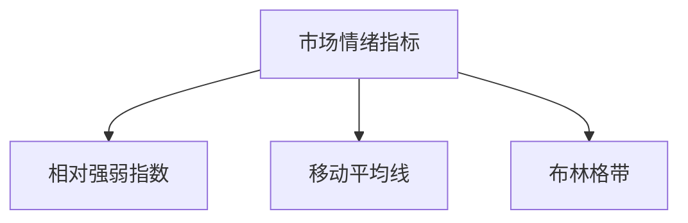
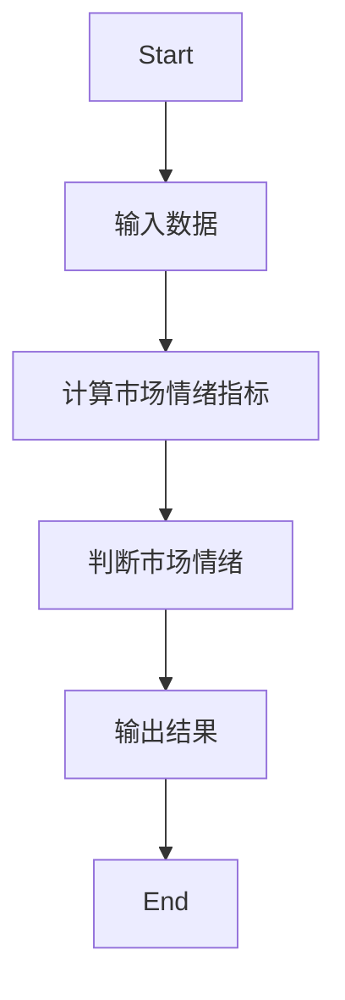
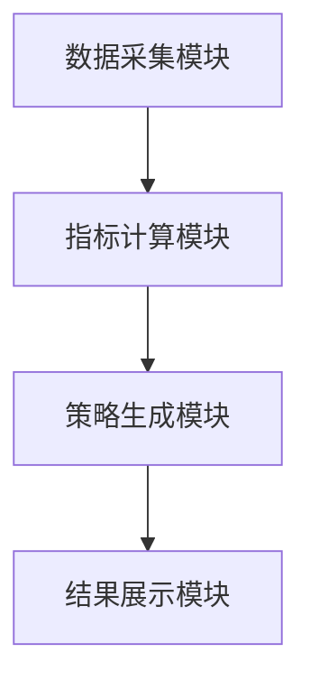

                 


# 彼得林奇的"市场情绪"在技术分析中的应用

> 关键词：市场情绪，技术分析，彼得·林奇，投资策略，技术指标

> 摘要：本文深入探讨了彼得·林奇的市场情绪理论在技术分析中的应用。通过分析市场情绪对投资者决策的影响，结合技术分析的核心工具和方法，本文展示了如何将市场情绪指标应用于实际投资策略中，以提高投资决策的科学性和准确性。

---

## 第一部分: 市场情绪与技术分析基础

### 第1章: 市场情绪的定义与重要性

#### 1.1 市场情绪的定义

市场情绪是指投资者在市场中的整体心理状态，反映了市场参与者的乐观或悲观情绪。市场情绪可以通过多种方式表现出来，如股票价格的波动、交易量的变化等。市场情绪的波动直接影响投资者的决策行为，进而影响市场价格走势。

#### 1.2 技术分析与市场情绪的关系

技术分析是一种通过分析历史价格和交易量来预测未来价格走势的方法。市场情绪作为影响价格走势的重要因素，是技术分析中不可或缺的一部分。技术分析师通过分析市场情绪指标，如相对强弱指数（RSI）、移动平均线（MA）等，来判断市场的买卖信号。

#### 1.3 彼得·林奇的市场情绪理论

彼得·林奇是著名的投资经理，他强调市场情绪在投资决策中的重要性。他认为，市场情绪的变化是导致股票价格波动的主要原因之一。通过分析市场情绪，投资者可以更好地把握市场的趋势和拐点，从而做出更明智的投资决策。

---

## 第二部分: 市场情绪指标的分类与特点

### 第2章: 常见市场情绪指标

#### 2.1 移动平均线（MA）

移动平均线是技术分析中最常用的指标之一，用于衡量市场的趋势方向。简单移动平均线（SMA）和指数移动平均线（EMA）是两种常见的计算方法。移动平均线可以帮助投资者判断市场的短期或长期趋势。

#### 2.2 相对强弱指数（RSI）

RSI是衡量市场超买或超卖状态的重要指标，通常用于判断市场的短期趋势。RSI的取值范围在0到100之间，当RSI超过70时，市场处于超买状态；当RSI低于30时，市场处于超卖状态。

#### 2.3 威尔德的随机指标（RSI）

随机指标也是一种衡量市场超买或超卖状态的指标，与RSI类似，但计算方法有所不同。随机指标通常用于判断市场的短期波动。

#### 2.4 布林格带（Bollinger Bands）

布林格带是一种用于衡量市场波动范围的指标，由三条曲线组成：中线（MA）、上限（MA + 标准差）和下限（MA - 标准差）。布林格带可以帮助投资者判断市场的波动范围和趋势。

### 第3章: 市场情绪指标的属性对比

#### 3.1 指标属性特征对比表

| 指标名称 | 计算方式 | 适用场景 | 优点 | 缺点 |
|----------|----------|----------|------|------|
| RSI     | 基于价格波动计算相对强度 | 超买超卖判断 | 灵敏 | 易受短期波动影响 |
| MA      | 简单移动平均或指数移动平均 | 趋势判断 | 稳定 | 反应较慢 |
| RSI     | 基于价格波动计算相对强度 | 超买超卖判断 | 灵敏 | 易受短期波动影响 |
| BB      | 基于平均值和标准差计算 | 波动范围判断 | 敏感 | 易受极端值影响 |

#### 3.2 市场情绪指标的实体关系图



---

## 第三部分: 市场情绪指标的算法实现

### 第4章: 市场情绪指标的算法实现

#### 4.1 算法流程图



#### 4.2 Python代码实现

```python
import pandas as pd
import numpy as np

def calculate_rsi(data, period=14):
    # 计算相对强弱指数
    delta = data['收盘价'] - data['收盘价'].shift(1)
    up = delta.where(delta > 0, 0)
    down = delta.where(delta < 0, 0)
    ma_up = up.rolling(period).mean()
    ma_down = down.rolling(period).mean()
    rsi = 100 - (100 - (ma_up / ma_down))
    return rsi

def calculate_ma(data, period=20):
    # 计算移动平均线
    ma = data['收盘价'].rolling(period).mean()
    return ma

# 示例数据
data = {
    '收盘价': [100, 102, 101, 103, 104, 105, 106, 107, 108, 109]
}
data = pd.DataFrame(data)

# 计算RSI和MA
rsi = calculate_rsi(data)
ma = calculate_ma(data)

print("RSI:", rsi)
print("MA:", ma)
```

#### 4.3 数学模型与公式

- RSI的计算公式：
  $$
  RSI = 100 - \frac{100 - \frac{MA_{up}}{MA_{down}}}
  $$

- 移动平均线的计算公式：
  $$
  SMA = \frac{1}{n} \sum_{i=1}^{n} P_i
  $$
  其中，$P_i$ 是第$i$天的价格，$n$ 是计算天数。

---

## 第四部分: 系统分析与架构设计

### 第5章: 系统架构设计

#### 5.1 系统功能设计

- 数据采集模块：从数据源获取市场数据。
- 指标计算模块：计算市场情绪指标（RSI、MA等）。
- 策略生成模块：根据指标结果生成投资策略。
- 结果展示模块：将结果以可视化的方式展示。

#### 5.2 系统架构图



---

## 第五部分: 项目实战

### 第6章: 项目实战

#### 6.1 环境安装

```bash
pip install pandas numpy matplotlib
```

#### 6.2 核心代码实现

```python
import pandas as pd
import matplotlib.pyplot as plt

# 示例数据
data = pd.DataFrame({
    '收盘价': [100, 102, 101, 103, 104, 105, 106, 107, 108, 109]
})

# 计算RSI
def calculate_rsi(df, period=14):
    delta = df['收盘价'] - df['收盘价'].shift(1)
    up = delta.where(delta > 0, 0)
    down = delta.where(delta < 0, 0)
    ma_up = up.rolling(period).mean()
    ma_down = down.rolling(period).mean()
    rsi = 100 - (100 - (ma_up / ma_down))
    return rsi

rsi = calculate_rsi(data)

# 可视化
data['RSI'] = rsi
data.plot(kind='line')
plt.show()
```

---

## 第六部分: 最佳实践

### 第7章: 最佳实践

#### 7.1 小结

本文通过分析彼得·林奇的市场情绪理论，结合技术分析的核心工具，展示了如何将市场情绪指标应用于实际投资策略中。通过具体的代码实现和案例分析，读者可以更好地理解市场情绪对投资决策的影响。

#### 7.2 注意事项

- 市场情绪指标只是投资决策的参考工具，需结合其他因素进行综合判断。
- 在实际操作中，需根据市场环境和投资目标调整指标的参数和权重。

#### 7.3 拓展阅读

- 彼得·林奇的《彼得·林奇的成功投资》
- 技术分析的经典著作《股票市场的麦哲伦航线》

---

通过以上步骤，本文系统地介绍了彼得·林奇的市场情绪理论在技术分析中的应用，帮助读者更好地理解和应用这些理论和工具进行投资决策。

