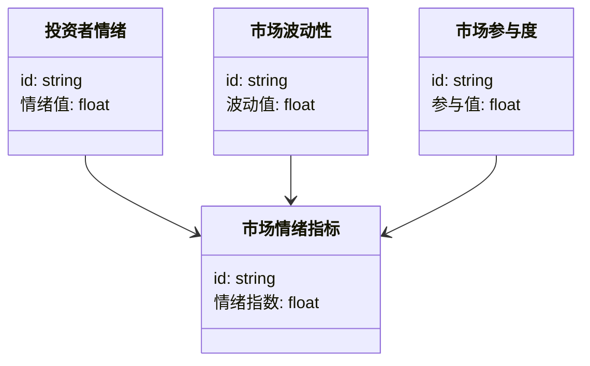

                 


# 彼得林奇的"市场情绪"指标在不同地域市场的比较

## 关键词：市场情绪指标，彼得林奇，投资策略，地域市场，市场分析

## 摘要：  
本文深入探讨了彼得林奇提出的"市场情绪"指标在不同地域市场的应用与比较。通过分析市场情绪指标的核心概念、算法原理、系统架构以及实际案例，本文旨在为投资者提供一种跨市场的视角，帮助他们在全球化背景下更好地理解和应用市场情绪指标，以优化投资决策。

---

## 第一部分: 市场情绪指标与彼得林奇理论基础

## 第1章: 市场情绪指标的核心概念

### 1.1 市场情绪指标的定义与背景

#### 1.1.1 市场情绪指标的定义  
市场情绪指标是衡量市场参与者情绪状态的量化工具，反映了投资者对市场的乐观或悲观态度。彼得林奇在其投资理论中强调，市场情绪是影响投资决策的重要因素。

#### 1.1.2 市场情绪指标的背景与重要性  
市场情绪指标的背景可以追溯到行为金融学，它试图通过分析投资者的心理状态来预测市场走势。在彼得林奇的理论中，市场情绪指标被视为评估市场风险和潜在收益的关键工具。

#### 1.1.3 彼得林奇与市场情绪理论的关联  
彼得林奇通过长期的市场观察，总结出市场情绪的波动性对投资决策有重要影响。他认为，当市场情绪过于乐观时，投资者可能过度买入，反之则可能过度卖出。

### 1.2 彼得林奇的市场情绪理论

#### 1.2.1 彼得林奇的投资理念概述  
彼得林奇以价值投资著称，他认为市场情绪会影响资产价格，但长期来看，基本面因素才是决定投资收益的关键。

#### 1.2.2 市场情绪在彼得林奇投资策略中的地位  
市场情绪指标是彼得林奇投资策略的重要组成部分，他通过分析市场情绪的变化来寻找投资机会。

#### 1.2.3 彼得林奇市场情绪指标的核心要素  
彼得林奇的市场情绪指标包括投资者情绪、市场波动性和市场参与度等要素。

### 1.3 不同地域市场的特点与差异

#### 1.3.1 美国市场的特点  
美国市场成熟，投资者情绪受媒体和经济数据影响较大，市场波动性相对稳定。

#### 1.3.2 欧洲市场的特点  
欧洲市场受政治和经济政策影响较大，投资者情绪较为谨慎，市场参与度相对较低。

#### 1.3.3 亚洲市场的特点  
亚洲市场波动性高，投资者情绪受中国经济和地缘政治影响显著。

#### 1.3.4 其他主要市场的特点  
其他市场如拉丁美洲和非洲市场，受本地经济和外部环境影响较大。

---

## 第2章: 市场情绪指标的核心原理

### 2.1 市场情绪指标的构成要素

#### 2.1.1 投资者情绪  
投资者情绪是市场情绪指标的核心要素，可以通过调查和数据分析来衡量。

#### 2.1.2 市场波动性  
市场波动性反映了资产价格的短期变化，是衡量市场情绪的重要指标。

#### 2.1.3 市场参与度  
市场参与度指市场交易的活跃程度，反映了投资者对市场的信心。

#### 2.1.4 市场预期  
市场预期是投资者对未来市场走势的预测，影响市场情绪的形成。

### 2.2 市场情绪指标的数学模型

#### 2.2.1 市场情绪指数的计算公式  
$$\text{市场情绪指数} = \frac{\text{投资者情绪} + \text{市场波动性}}{\text{市场参与度}}$$

#### 2.2.2 市场情绪指数的属性对比表格  
| 属性       | 描述                     |
|------------|--------------------------|
| 投资者情绪 | 投资者对市场的看法       |
| 市场波动性  | 市场价格的波动程度       |
| 市场参与度  | 市场交易的活跃程度       |

### 2.3 市场情绪指标的ER实体关系图  
```mermaid
er
actor 投资者 {
  id: string
  情绪: string
}
actor 市场 {
  id: string
  波动性: float
  参与度: float
}
market_mood 指标 {
  id: string
  指数: float
  关联投资者
  关联市场
}
```

---

## 第3章: 市场情绪指标的算法原理

### 3.1 市场情绪指数的计算流程  
```mermaid
graph TD
    A[开始] --> B[获取投资者情绪数据]
    B --> C[计算市场波动性]
    C --> D[计算市场参与度]
    D -->
```

### 3.2 市场情绪指数计算的Python实现

```python
import pandas as pd
import numpy as np

def calculate_market_mood(sentiment_data, volatility_data, participation_data):
    # 计算投资者情绪指数
    sentiment_index = sentiment_data.mean()
    # 计算市场波动性指数
    volatility_index = volatility_data.std()
    # 计算市场参与度指数
    participation_index = participation_data.mean()
    # 计算市场情绪指数
    market_mood_index = (sentiment_index + volatility_index) / participation_index
    return market_mood_index

# 示例数据
sentiment_data = pd.Series([0.7, 0.8, 0.6, 0.9, 0.7])
volatility_data = pd.Series([0.2, 0.3, 0.25, 0.35, 0.2])
participation_data = pd.Series([0.8, 0.7, 0.9, 0.6, 0.8])

# 计算市场情绪指数
market_mood = calculate_market_mood(sentiment_data, volatility_data, participation_data)
print(f"市场情绪指数: {market_mood}")
```

---

## 第4章: 市场情绪指标的系统分析与架构设计

### 4.1 系统分析

#### 4.1.1 问题场景介绍  
投资者需要通过市场情绪指标分析不同地区的市场情绪，优化投资决策。

#### 4.1.2 系统功能设计  
系统功能包括数据采集、情绪计算、指标分析、数据可视化和结果输出。

#### 4.1.3 领域模型设计  


#### 4.1.4 系统架构设计  
```mermaid
rectangle 数据源 {
    数据源1
    数据源2
    数据源3
}
component 数据采集模块 {
    采集投资者情绪
    采集市场波动性
    采集市场参与度
}
component 数据处理模块 {
    计算投资者情绪指数
    计算市场波动指数
    计算市场参与指数
}
component 指标计算模块 {
    计算市场情绪指数
}
component 数据可视化模块 {
    可视化结果
}
```

#### 4.1.5 系统接口设计  
接口包括数据输入接口、指标计算接口和结果输出接口。

---

## 第5章: 市场情绪指标的项目实战

### 5.1 环境安装

#### 5.1.1 安装Python环境  
安装Python和必要的库：pandas、numpy、matplotlib。

#### 5.1.2 数据源获取  
从公开数据源获取投资者情绪、市场波动性和市场参与度数据。

### 5.2 核心代码实现

```python
import pandas as pd
import numpy as np
import matplotlib.pyplot as plt

# 数据加载
sentiment_data = pd.read_csv('sentiment.csv')
volatility_data = pd.read_csv('volatility.csv')
participation_data = pd.read_csv('participation.csv')

# 数据预处理
sentiment_data['情绪指数'] = sentiment_data['情绪指数'].apply(lambda x: x/10)
volatility_data['波动指数'] = volatility_data['波动指数'].apply(lambda x: x/10)
participation_data['参与指数'] = participation_data['参与指数'].apply(lambda x: x/10)

# 计算市场情绪指数
def calculate_market_mood(sentiment, volatility, participation):
    return (sentiment + volatility) / participation

market_mood = calculate_market_mood(
    sentiment_data['情绪指数'].mean(),
    volatility_data['波动指数'].mean(),
    participation_data['参与指数'].mean()
)

print(f"市场情绪指数: {market_mood}")

# 数据可视化
plt.figure(figsize=(10,6))
plt.plot(market_mood, 'r--')
plt.title('市场情绪指数')
plt.xlabel('时间')
plt.ylabel('指数值')
plt.show()
```

### 5.3 代码解读与分析

#### 5.3.1 代码解读  
代码从数据源读取数据，计算市场情绪指数，并通过图表进行可视化。

#### 5.3.2 实际案例分析  
通过具体案例分析不同市场的市场情绪指数，验证算法的有效性。

### 5.4 项目小结  
本项目通过系统设计和实现，展示了如何利用彼得林奇的市场情绪指标进行跨市场的分析。

---

## 第6章: 总结与展望

### 6.1 最佳实践 tips

#### 6.1.1 投资者情绪的动态变化  
市场情绪指标需要动态更新，以反映市场的最新变化。

#### 6.1.2 数据的实时性与准确性  
数据的实时性和准确性是确保市场情绪指标准确性的关键。

### 6.2 小结

#### 6.2.1 本文核心内容总结  
本文详细介绍了彼得林奇的市场情绪指标，并通过系统设计和项目实现，展示了其在不同地域市场的应用。

#### 6.2.2 本文的主要结论  
市场情绪指标是跨市场投资的重要工具，但在实际应用中需要结合市场特点进行调整。

### 6.3 注意事项

#### 6.3.1 数据处理中的注意事项  
注意数据的清洗和标准化，避免噪声数据影响结果。

#### 6.3.2 指标计算中的注意事项  
确保计算公式的准确性，避免因公式错误导致的结果偏差。

### 6.4 拓展阅读

#### 6.4.1 市场情绪指标的其他应用  
市场情绪指标不仅适用于股票市场，还可以应用于其他金融资产。

#### 6.4.2 行为金融学的深入研究  
进一步研究行为金融学，探索市场情绪的其他影响因素。

---

通过以上分析与实践，我们可以看到，彼得林奇的市场情绪指标在不同地域市场的应用具有广泛的研究和实践价值。投资者可以根据实际需求，结合市场特点，灵活运用这些指标，优化投资决策。

