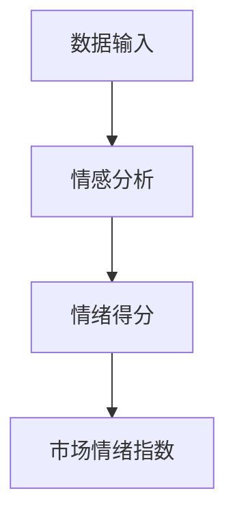
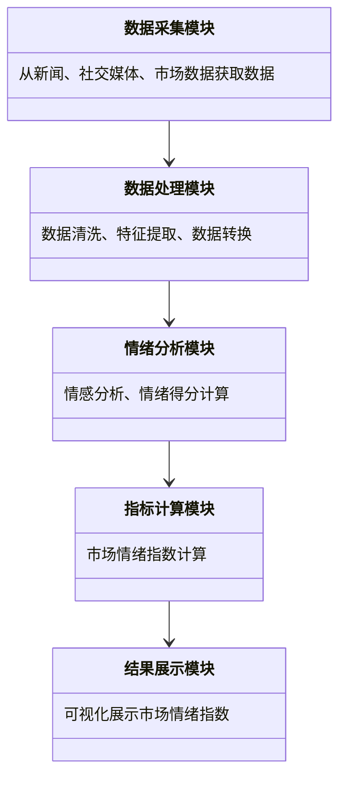

                 


# 彼得林奇的"市场情绪"指标在跨资产类别定价中的应用

---

## 关键词：市场情绪指标、跨资产定价、彼得林奇、金融分析、资产配置、投资策略

---

## 摘要：  
本文深入探讨了彼得林奇提出的“市场情绪”指标在跨资产类别定价中的应用。通过分析市场情绪对不同资产类别（如股票、债券、基金等）的影响，结合数据驱动的方法，展示了如何利用市场情绪指标优化资产定价策略。文章从理论基础、指标构建、算法实现、系统设计到实际案例，全面阐述了市场情绪指标在跨资产定价中的价值与应用。

---

# 第一部分：市场情绪指标的背景与基础

## 第1章：市场情绪指标的起源与核心概念

### 1.1 彼得林奇市场情绪指标的定义与起源

市场情绪指标是彼得林奇提出的一种用于衡量市场参与者情绪的工具，其核心在于通过分析投资者行为和市场数据，预测资产价格的波动。市场情绪指标的理论基础包括行为金融学和市场心理学，强调情绪对市场定价的影响。

#### 关键术语解释：
- **市场情绪**：投资者在市场中的情绪状态，通常分为乐观、中性和悲观。
- **市场情绪指标**：通过量化方法衡量市场情绪的指标，用于预测资产价格变化。

### 1.2 市场情绪指标的核心思想

彼得林奇认为，市场情绪是影响资产价格波动的重要因素。投资者的情绪波动会导致市场出现非理性定价，从而为理性投资者提供套利机会。市场情绪指标的核心思想是将市场情绪量化，帮助投资者识别市场过热或低估的情况。

### 1.3 市场情绪指标的应用价值

市场情绪指标在资产定价、风险管理、投资策略等领域具有重要应用。通过分析市场情绪，投资者可以更好地理解市场波动，优化资产配置，降低投资风险。

---

## 第2章：市场情绪指标的理论基础

### 2.1 投资者情绪与市场行为

投资者情绪是市场行为的核心驱动因素之一。情绪波动会导致投资者做出非理性决策，从而影响资产价格。情绪分析的关键在于识别市场参与者的心理状态，并将其量化。

### 2.2 彼得林奇市场情绪指标的核心要素

市场情绪指标的核心要素包括：
1. **数据来源**：新闻、社交媒体、市场数据等。
2. **指标构建**：通过统计方法或机器学习模型量化市场情绪。
3. **指标验证**：通过回测和实证分析验证指标的有效性。

---

# 第二部分：市场情绪指标的构建与分析

## 第3章：市场情绪指标的构建方法

### 3.1 数据采集与处理

市场情绪指标的构建依赖于高质量的数据。数据来源包括新闻、社交媒体、市场数据等，需要进行清洗和预处理。

#### 数据处理步骤：
1. **数据清洗**：去除无效数据，处理缺失值。
2. **特征提取**：从文本数据中提取情感特征，如情感倾向、情感强度等。
3. **数据转换**：将数据标准化或归一化，便于模型训练。

### 3.2 市场情绪指标的计算与验证

市场情绪指标的计算通常基于统计模型或机器学习算法，如情感分析模型。验证过程包括回测和实证分析，评估指标的有效性和稳定性。

#### 情感分析模型示例：
使用自然语言处理技术，对新闻标题进行情感分类，计算市场情绪指数。

---

## 第4章：市场情绪指标的多维度分析

### 4.1 跨资产类别的市场情绪分析

不同资产类别的市场情绪表现差异显著。股票市场情绪波动较大，债券市场情绪相对稳定，基金市场情绪受投资者信心影响较大。

### 4.2 市场情绪指标的动态调整

市场情绪指标需要根据市场变化动态调整。通过实时数据更新和模型优化，提高指标的准确性和适用性。

---

# 第三部分：算法与数学模型

## 第5章：市场情绪的量化与建模

### 5.1 情感分析模型

使用自然语言处理技术对文本数据进行情感分析，计算市场情绪指数。

#### 情感分析模型流程图：


### 5.2 数学模型与公式

市场情绪指数（MEI）计算公式：
$$
MEI = \alpha \cdot \text{情感得分} + \beta \cdot \text{市场数据指标}
$$

其中，$\alpha$ 和 $\beta$ 是模型参数，通过训练数据优化得到。

---

# 第四部分：系统架构与设计

## 第6章：系统架构设计

### 6.1 系统功能设计

系统功能包括数据采集、情绪分析、指标计算、结果展示等。

#### 系统功能模块图：


---

## 第五章：项目实战

## 第7章：项目实战与案例分析

### 7.1 项目环境搭建

使用Python、Pandas、NLTK等工具搭建开发环境。

### 7.2 核心代码实现

编写情感分析模型代码，计算市场情绪指数。

#### 示例代码：
```python
import pandas as pd
from nltk.sentiment import SentimentIntensityAnalyzer

# 数据采集与处理
data = pd.read_csv('market_news.csv')
data['sentiment'] = data['text'].apply(lambda x: SentimentIntensityAnalyzer().polarity_scores(x)['compound'])

# 情绪得分计算
data['情绪得分'] = (data['sentiment'] + 1) / 2

# 市场情绪指数计算
market_emotion_index = data['情绪得分'].mean()
```

### 7.3 案例分析

分析股票市场的情绪指数变化，验证其对资产定价的影响。

---

## 第六章：最佳实践与总结

## 第8章：最佳实践与总结

### 8.1 小结

彼得林奇的市场情绪指标在跨资产定价中的应用具有重要意义，通过量化市场情绪，帮助投资者优化资产配置和风险管理。

### 8.2 注意事项

- 数据质量对指标计算至关重要。
- 模型需要不断优化和调整。
- 结合其他指标进行综合分析。

### 8.3 拓展阅读

推荐相关书籍和论文，进一步深入学习市场情绪分析和资产定价策略。

---

## 附录

## 附录A：数学公式汇总

### 情绪得分计算公式：
$$
\text{情绪得分} = \frac{\text{情感倾向} + 1}{2}
$$

---

## 附录B：代码库与工具

推荐使用的工具和库：
- Python
- Pandas
- NLTK
- Scikit-learn

---

# 结语

通过本文的分析，读者可以深入了解彼得林奇市场情绪指标在跨资产定价中的应用，掌握从数据采集到模型构建的全过程，并通过实际案例分析，提升对市场情绪分析的理解和应用能力。

