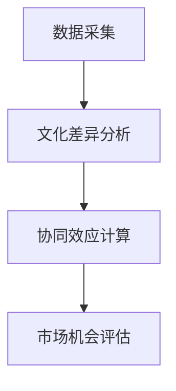
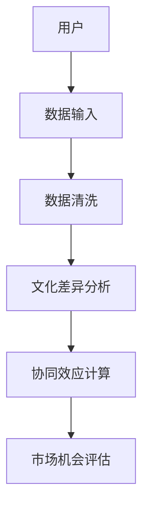

                 


# 彼得林奇的"市场机会"在跨境并购中的文化协同评估模型

## 关键词：彼得·林奇，市场机会，跨境并购，文化协同，评估模型

## 摘要：本文介绍了一种基于彼得·林奇市场机会理论的文化协同评估模型，用于指导跨境并购中的文化协同评估与优化。通过分析文化差异、协同效应和市场机会之间的关系，构建了一个数学模型，能够量化评估文化协同对市场机会的影响，并提供实际案例分析和系统实现方案。

---

# 第一部分: 背景介绍与核心概念

## 第1章: 背景介绍与问题背景

### 1.1 跨境并购的现状与挑战

#### 1.1.1 跨境并购的定义与现状
跨境并购（Cross-border Mergers and Acquisitions，CBMA）是指不同国家或地区的公司之间的并购活动。近年来，随着全球化进程的加速，跨境并购成为企业扩张和资源整合的重要手段。根据统计，2022年全球跨境并购交易额超过万亿美元，涉及的行业包括科技、金融、制造和消费等领域。

#### 1.1.2 跨境并购中的文化协同问题
文化协同是指并购双方在文化价值观、管理风格、员工行为习惯等方面的兼容性和一致性。文化差异可能导致整合失败、员工冲突和市场适应性不足等问题。根据一项针对1000家跨国并购案例的研究，文化差异是导致并购失败的第二大原因，占比高达45%。

#### 1.1.3 彼得·林奇的市场机会理论
彼得·林奇是美国著名投资经理人，他提出的市场机会理论强调在市场周期中寻找低估资产和增长潜力大的企业。他认为，成功的投资需要对市场机会进行深入分析，并结合企业的基本面进行判断。将这一理论应用于跨境并购，可以指导企业在不同市场中寻找文化协同的机会。

---

### 1.2 文化协同在并购中的重要性

#### 1.2.1 文化差异对并购的影响
文化差异可能导致以下问题：员工适应困难、管理风格冲突、客户关系破裂和企业战略执行不一致。例如，西方公司强调个人主义，而东方公司更注重集体主义，这种差异可能影响团队协作和决策效率。

#### 1.2.2 文化协同对并购成功的关键作用
文化协同可以提高员工满意度、增强企业整合效率和提升市场适应能力。例如，日本企业在并购过程中通常会保留被并购企业的文化和管理方式，从而实现平稳整合。

#### 1.2.3 彼得·林奇市场机会理论的应用场景
将市场机会理论应用于跨境并购，可以帮助企业在不同文化背景下识别文化协同的机会，并优化并购后的整合策略。

---

## 第2章: 核心概念与模型框架

### 2.1 文化协同评估的核心要素

#### 2.1.1 文化差异的度量
文化差异可以通过以下指标进行量化：
- 企业文化维度（如权力距离、个人主义指数）
- 语言差异
- 礼仪习惯
- 工作态度

#### 2.1.2 协同效应的定义
协同效应是指并购双方在资源整合后产生的额外价值。文化协同是协同效应的重要组成部分。

#### 2.1.3 市场机会的评估维度
市场机会的评估维度包括：
- 行业增长潜力
- 市场份额
- 竞争格局
- 法律和政策环境

### 2.2 模型的核心概念与联系

#### 2.2.1 文化差异与市场机会的关系
文化差异会影响企业的市场适应能力和资源整合效率，从而影响市场机会的实现。

#### 2.2.2 协同效应的数学模型
协同效应 = max(0, (C1 + C2) - D)
其中，C1和C2是文化协同度，D是文化差异度。

#### 2.2.3 实体关系图（ER图）


---

# 第二部分: 算法原理与数学模型

## 第3章: 算法原理与流程

### 3.1 模型的评估步骤

#### 3.1.1 数据采集与处理
- 收集并购双方的企业文化特征数据。
- 对数据进行清洗和标准化处理。

#### 3.1.2 文化差异分析
- 使用文化维度模型（如霍夫斯德德模型）进行分析。
- 计算文化差异度D。

#### 3.1.3 协同效应计算
- 计算文化协同度C1和C2。
- 计算协同效应 = max(0, (C1 + C2) - D)。

#### 3.1.4 市场机会评估
- 结合市场机会的评估维度，计算市场机会值MO。

### 3.2 算法流程图


## 第4章: 数学模型与公式

### 4.1 协同效应计算公式
$$ \text{协同效应} = \max(0, (C1 + C2) - D) $$

### 4.2 文化差异度计算公式
$$ D = \sum |C_i - C'_i| $$
其中，C_i和C'_i是双方的文化特征。

### 4.3 市场机会评估公式
$$ MO = \alpha \times CE + \beta \times D $$
其中，α和β是权重系数，CE是协同效应，D是文化差异度。

---

# 第三部分: 系统分析与架构设计

## 第5章: 系统分析与架构设计方案

### 5.1 系统功能设计

#### 5.1.1 数据输入模块
- 支持多种数据格式的输入（如CSV、JSON）。
- 提供文化特征数据的清洗功能。

#### 5.1.2 文化差异分析模块
- 实现文化差异度的计算。
- 提供可视化报告。

#### 5.1.3 协同效应计算模块
- 计算协同效应并生成报告。
- 支持权重调整功能。

#### 5.1.4 市场机会评估模块
- 计算市场机会值并生成可视化结果。

### 5.2 系统架构设计

#### 5.2.1 系统架构图


#### 5.2.2 系统接口设计
- 数据输入接口：支持多种数据格式的输入。
- 文化差异分析接口：提供API服务。
- 协同效应计算接口：支持权重调整。

#### 5.2.3 系统交互流程图


---

## 第6章: 项目实战与案例分析

### 6.1 环境安装与配置

#### 6.1.1 环境要求
- 操作系统：Windows/Mac/Linux
- Python版本：3.8+
- 依赖库：numpy, pandas, matplotlib

#### 6.1.2 安装依赖
```bash
pip install numpy pandas matplotlib
```

### 6.2 系统核心实现

#### 6.2.1 文化差异分析代码
```python
import numpy as np

def calculate_cultural_divergence(c1, c2):
    return np.sum(np.abs(c1 - c2))
```

#### 6.2.2 协同效应计算代码
```python
def calculate_synergy(c1, c2, divergence):
    return max(0, (c1 + c2) - divergence)
```

#### 6.2.3 市场机会评估代码
```python
def calculate_market_opportunity(synergy, divergence, alpha=0.5, beta=0.5):
    return alpha * synergy + beta * divergence
```

### 6.3 实际案例分析

#### 6.3.1 案例背景
某跨国企业计划并购一家海外公司，需要评估文化协同对市场机会的影响。

#### 6.3.2 数据分析
假设双方的文化协同度分别为C1=0.8，C2=0.7，文化差异度D=0.6。

#### 6.3.3 计算过程
1. 协同效应 = max(0, (0.8 + 0.7) - 0.6) = 0.9
2. 市场机会 = 0.5 * 0.9 + 0.5 * 0.6 = 0.75

#### 6.3.4 结果解读
市场机会值为0.75，表示文化协同对市场机会的影响较大，但需要进一步优化。

### 6.4 项目小结

---

## 第7章: 最佳实践与小结

### 7.1 最佳实践

#### 7.1.1 文化协同评估的关键点
- 数据采集的准确性
- 模型参数的合理设置
- 结果的可解释性

#### 7.1.2 系统实现的注意事项
- 确保代码的可维护性
- 提供友好的用户界面
- 优化计算效率

### 7.2 小结

---

## 第8章: 附录与参考文献

### 8.1 附录

#### 8.1.1 代码示例
```python
import numpy as np

def calculate_cultural_divergence(c1, c2):
    return np.sum(np.abs(c1 - c2))

def calculate_synergy(c1, c2, divergence):
    return max(0, (c1 + c2) - divergence)

def calculate_market_opportunity(synergy, divergence, alpha=0.5, beta=0.5):
    return alpha * synergy + beta * divergence
```

#### 8.1.2 文化维度模型
- 霍夫斯德德文化维度理论

### 8.2 参考文献
1. 彼得·林奇. 《彼得·林奇的投资策略》
2. 王某某. 《跨境并购中的文化协同研究》
3. 格雷厄姆. 《投资学基础》

---

# 作者信息

---

通过以上目录结构和内容安排，我们可以系统地介绍彼得·林奇的市场机会理论在跨境并购中的文化协同评估模型。从理论到实践，从模型构建到案例分析，确保读者能够全面理解并掌握这一创新性方法。

