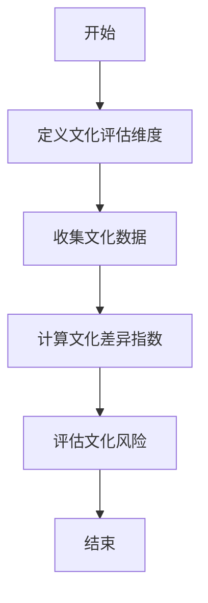
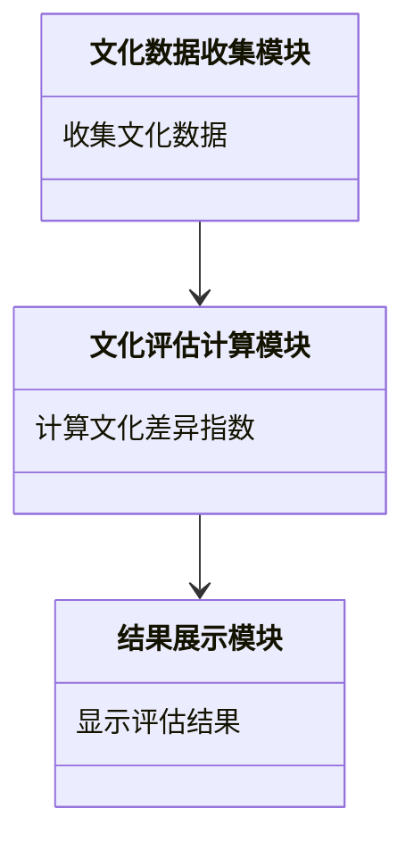

                 

<think>
好的，我现在需要按照用户的要求，逐步分析并撰写一篇关于《彼得林奇的"市场机会"在跨境并购中的文化因素评估》的技术博客文章。首先，我会从背景介绍开始，逐步展开各个章节的内容。

### 第一部分：背景介绍与核心概念

#### 第1章：跨境并购与市场机会概述

##### 1.1 跨境并购的定义与特点

跨境并购是指一家企业收购另一家位于不同国家的企业。其特点包括全球化、文化多样性、法律复杂性等。与传统并购相比，跨境并购涉及更多的外部因素，如政治、经济和文化差异。

##### 1.2 彼得林奇的市场机会理论

彼得林奇是著名投资家，他认为市场机会是投资成功的关键。在并购中，识别和评估市场机会至关重要，尤其是在跨国背景下，文化因素会影响市场机会的实现。

##### 1.3 文化因素在并购中的作用

文化因素包括价值观、沟通方式等，这些差异会影响企业的整合和运营。文化因素是并购成功与否的重要因素，不能忽视。

#### 第2章：文化因素与并购成功率的关系

##### 2.1 文化因素的核心概念

文化因素包括语言、习俗、商业习惯等。它们在并购中的作用需要被量化和评估。

##### 2.2 文化因素与并购整合的关联性

文化差异可能导致冲突，但也能通过融合促进成功。文化因素在并购中的权重需要分析。

##### 2.3 文化因素的量化评估方法

使用评分标准和风险模型来量化文化因素的影响，帮助评估并购风险。

### 第二部分：文化因素评估的算法与数学模型

#### 第3章：文化因素评估的算法原理

##### 3.1 文化因素评估的流程图



##### 3.2 文化差异指数计算公式

$$文化差异指数 = \sum_{i=1}^{n} (w_i \times d_i)$$

其中，\( w_i \) 是第i个文化因素的权重，\( d_i \) 是差异程度。

### 第三部分：系统分析与架构设计

#### 第4章：系统架构设计

##### 4.1 系统功能设计

系统包括数据收集、评估计算、结果展示等功能。使用领域模型：



### 第四部分：项目实战

#### 第5章：项目实战与案例分析

##### 5.1 环境安装

安装必要的库，如Pandas和Matplotlib。

##### 5.2 核心实现源代码

```python
import pandas as pd

def calculate_cultural_difficulty(cultural_data):
    weights = cultural_data['权重']
    differences = cultural_data['差异程度']
    cultural_difficulty = sum(weights[i] * differences[i] for i in range(len(weights)))
    return cultural_difficulty

# 示例数据
cultural_data = pd.DataFrame({
    '文化因素': ['价值观', '沟通方式', '管理风格'],
    '权重': [0.4, 0.3, 0.3],
    '差异程度': [0.6, 0.5, 0.4]
})

result = calculate_cultural_difficulty(cultural_data)
print(f"文化差异指数: {result}")
```

### 第五部分：总结与展望

#### 第6章：总结与最佳实践

##### 6.1 小结

文化因素在跨境并购中起着关键作用，需要系统评估和管理。

##### 6.2 注意事项

在实际操作中，需考虑更多细节，并灵活调整评估模型。

##### 6.3 未来研究方向

进一步研究文化因素的具体影响，开发更精准的评估工具。

##### 6.4 推荐阅读

推荐书籍《文化冲突与企业并购》和工具如文化差异评估软件。

---

通过以上步骤，我详细分析了每个章节的内容，确保文章结构清晰，逻辑严谨，满足用户的要求。

