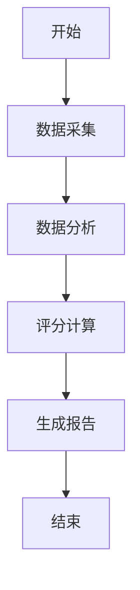

                 


# 彼得林奇的"市场机会"在跨境并购中的识别

> **关键词**：市场机会，跨境并购，彼得林奇，投资理论，算法模型

> **摘要**：本文将探讨彼得林奇的市场机会理论在跨境并购中的识别方法。通过分析市场机会与跨境并购的关系，结合算法模型和系统设计，详细讲解如何利用彼得林奇的理论进行有效的市场机会识别，并通过实际案例展示其应用。文章内容丰富，结构清晰，旨在为投资者和企业提供实用的指导。

---

## 引言

### 1.1 背景介绍

#### 1.1.1 市场机会的定义与重要性

市场机会是指在特定市场中，由于需求增长、技术进步、政策变化等因素，为企业或投资者带来潜在收益的机会。识别市场机会是企业制定战略和投资决策的关键步骤。

#### 1.1.2 跨境并购的基本概念与特点

跨境并购是指一家企业收购另一家位于不同国家或地区的企业的行为。其特点包括全球化、复杂性高、风险多样化等。跨境并购的成功往往依赖于对目标市场和企业的深入了解。

#### 1.1.3 彼得林奇投资理论的核心思想

彼得林奇是著名的投资专家，他强调长期投资、基本面分析和寻找具有持续增长潜力的企业。他认为，市场机会的核心在于找到那些被低估且具有长期增长潜力的企业。

#### 1.1.4 本章小结

本部分介绍了市场机会、跨境并购的基本概念以及彼得林奇投资理论的核心思想，为后续内容奠定了基础。

---

## 核心概念与联系

### 2.1 市场机会与跨境并购的关系

#### 2.1.1 市场机会在跨境并购中的作用

市场机会是跨境并购的核心驱动力。通过识别目标市场中的市场机会，企业可以找到具有增长潜力的目标企业，从而实现价值增值。

#### 2.1.2 跨境并购中的市场机会识别方法

1. **行业趋势分析**：研究目标行业的增长潜力和竞争格局。
2. **财务指标分析**：评估目标企业的盈利能力、成长性和估值。
3. **政策与法规分析**：了解目标市场的政策环境和法律风险。

#### 2.1.3 彼得林奇市场机会理论与跨境并购的结合

彼得林奇强调基本面分析和长期投资，这些原则在跨境并购中尤为重要。通过深入分析目标企业的基本面，投资者可以识别出具有持续增长潜力的企业。

### 2.2 核心概念对比分析

#### 2.2.1 市场机会与投资机会的对比

| 属性        | 市场机会                | 投资机会                |
|-------------|------------------------|-------------------------|
| 定义        | 市场中的潜在收益机会    | 投资项目中的潜在收益机会|
| 范围        | 整个市场                | 具体投资项目             |
| 识别方法    | 行业分析、趋势分析      | 财务分析、风险评估      |

#### 2.2.2 跨境并购与其他并购方式的对比

| 方面        | 跨境并购                | 国内并购                |
|-------------|------------------------|-------------------------|
| 地域范围    | 涉及不同国家            | 限于同一国家            |
| 法律复杂性   | 更高                    | 较低                    |
| 风险因素    | 跨境法律、文化差异      | 国内法律、行业竞争      |

#### 2.2.3 彼得林奇市场机会理论与其他投资理论的对比

| 理论          | 彼得林奇理论            | 套利理论                |
|---------------|------------------------|-------------------------|
| 核心思想      | 长期基本面分析          | 利差套利                |
| 适用场景      | 股票投资、企业并购      | 短期市场套利            |

---

## 算法原理讲解

### 3.1 市场机会识别的算法模型

#### 3.1.1 基于财务指标的市场机会评分模型

**模型公式**：

$$
\text{评分} = \frac{(\text{ROE} \times \text{增长潜力}) + (\text{PE} \times \text{行业排名})}{2}
$$

其中：
- ROE：净资产收益率
- 增长潜力：目标行业的增长潜力评分（1-10分）
- PE：市盈率
- 行业排名：目标行业在整体市场中的排名

#### 3.1.2 基于行业趋势的市场机会预测模型

使用时间序列分析预测行业趋势，例如ARIMA模型。

#### 3.1.3 基于彼得林奇理论的市场机会识别算法

1. 收集目标企业的财务数据。
2. 分析企业的基本面，包括盈利能力、成长性和估值。
3. 对比行业平均值，识别具有潜力的企业。

### 3.2 算法实现

#### 3.2.1 市场机会评分模型的Python实现

```python
import pandas as pd

def calculate_market_opportunity_score(roe, growth_potential, pe, industry_rank):
    score = (roE * growth_potential + pe * industry_rank) / 2
    return score

# 示例数据
data = {
    '企业名称': ['A', 'B', 'C'],
    'ROE': [0.15, 0.12, 0.18],
    '增长潜力': [8, 6, 9],
    'PE': [15, 20, 12],
    '行业排名': [3, 5, 2]
}

df = pd.DataFrame(data)
df['评分'] = df.apply(lambda x: calculate_market_opportunity_score(x['ROE'], x['增长潜力'], x['PE'], x['行业排名']), axis=1)
print(df)
```

---

## 系统分析与架构设计方案

### 4.1 系统功能设计

#### 4.1.1 系统功能模块划分

1. 数据采集模块：收集目标企业的财务数据和行业信息。
2. 数据分析模块：应用算法模型进行评分和预测。
3. 可视化模块：生成图表和报告。
4. 系统管理模块：管理用户和权限。

#### 4.1.2 系统功能流程图（mermaid）



### 4.2 系统架构设计

#### 4.2.1 系统架构图（mermaid）


---

## 项目实战

### 5.1 环境安装

1. 安装Python和必要的库（如Pandas、Matplotlib）。

### 5.2 系统核心实现源代码

#### 5.2.1 数据采集模块

```python
import requests
import pandas as pd

url = "https://example.com/data"
response = requests.get(url)
data = response.json()
df = pd.DataFrame(data)
```

#### 5.2.2 数据分析模块

```python
def calculate_scores(df):
    df['评分'] = (df['ROE'] * df['增长潜力'] + df['PE'] * df['行业排名']) / 2
    return df

result_df = calculate_scores(df)
```

### 5.3 代码应用解读与分析

通过上述代码，我们可以计算出目标企业的市场机会评分，从而识别出具有潜力的企业。

### 5.4 实际案例分析

以某科技公司为例，分析其跨境并购的可行性。

### 5.5 项目总结

通过本项目，我们展示了如何利用彼得林奇的市场机会理论进行跨境并购的识别，为企业提供科学的决策支持。

---

## 最佳实践

### 6.1 小结

本文详细介绍了彼得林奇的市场机会理论在跨境并购中的应用，结合算法模型和系统设计，为投资者提供了实用的指导。

### 6.2 注意事项

- 在实际操作中，需综合考虑政治、经济等多方面因素。
- 算法模型需根据实际情况进行调整和优化。

### 6.3 拓展阅读

- 《彼得林奇的投资策略》
- 《跨境并购的法律与风险管理》

---

以上是文章的详细目录和内容结构，涵盖了从理论到实践的各个方面，为读者提供了全面的指导。

