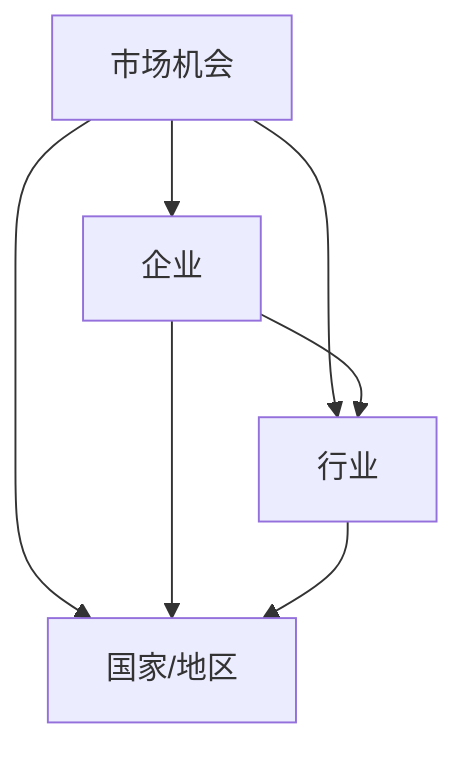
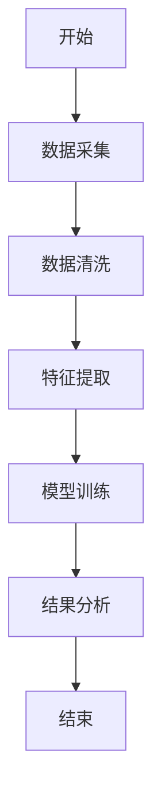
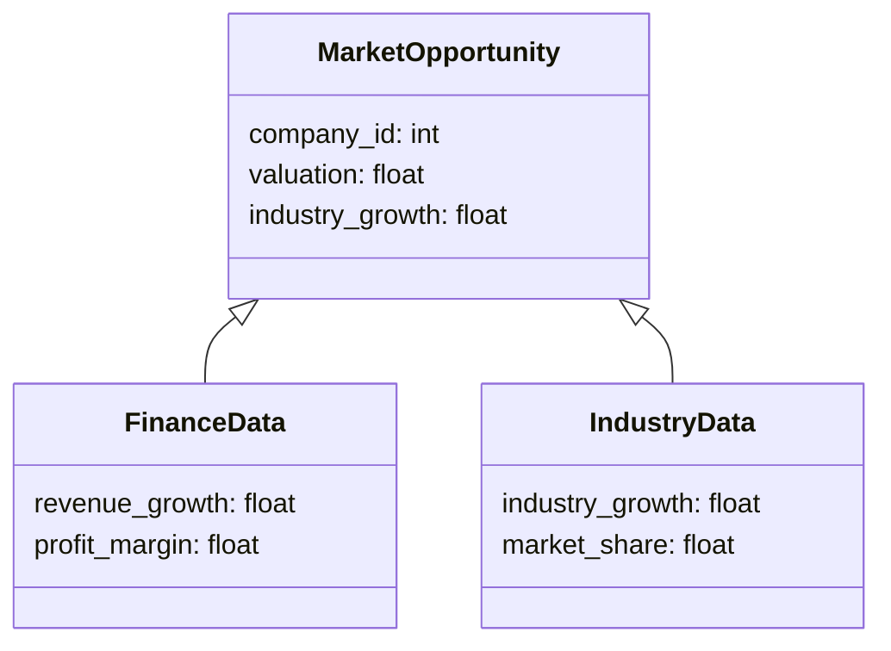

                 


# 彼得林奇的"市场机会"在跨境并购中的识别方法

> 关键词：彼得林奇，市场机会，跨境并购，算法原理，系统架构，项目实战

> 摘要：本文详细探讨了彼得林奇的市场机会理论在跨境并购中的识别方法，结合算法原理、系统架构和实际案例，为读者提供了全面的分析和实践指导。

---

# 第1章: 背景介绍

## 1.1 跨境并购的背景与现状
### 1.1.1 跨境并购的定义与特点
跨境并购是指一家企业收购另一家位于不同国家或地区的企业的资产或股权。其特点包括跨国性、复杂性、高风险和高回报。

### 1.1.2 跨境并购的驱动因素
- 经济全球化
- 市场扩展需求
- 资源整合
- 技术获取

### 1.1.3 跨境并购的历史发展与现状
跨境并购在20世纪80年代开始快速发展，近年来随着技术的进步和全球化的加深，其规模和频率显著增加。

## 1.2 彼得林奇的市场机会理论
### 1.2.1 彼得林奇与价值投资概述
彼得林奇是美国著名投资专家，主张通过基本面分析寻找被低估的投资机会。

### 1.2.2 市场机会的定义与特征
市场机会是指在特定市场中，企业能够利用某种优势或趋势获得超额收益的机会。

### 1.2.3 彼得林奇市场机会理论的核心思想
彼得林奇认为，市场机会的核心在于发现市场中被低估的投资标的，并通过长期持有实现收益。

## 1.3 跨境并购与市场机会的结合
### 1.3.1 跨境并购中的市场机会识别
在跨境并购中，识别市场机会的关键在于发现目标企业的潜在价值和行业趋势。

### 1.3.2 市场机会对并购决策的影响
市场机会直接影响企业的并购决策，包括目标选择、估值和投资策略。

### 1.3.3 跨境并购中的风险与挑战
包括文化差异、法律风险、税务问题等。

---

# 第2章: 市场机会识别的核心概念与联系

## 2.1 核心概念原理
### 2.1.1 市场机会的构成要素
- 市场需求
- 竞争环境
- 技术创新
- 政策环境

### 2.1.2 彼得林奇市场机会识别模型
彼得林奇模型基于基本面分析，关注企业的财务状况、管理团队和行业前景。

### 2.1.3 跨境并购中的市场机会特征
- 行业集中度
- 目标企业估值
- 并购后的协同效应

## 2.2 核心概念属性特征对比表
| 概念 | 定义 | 属性1 | 属性2 | 属性3 |
|------|------|-------|-------|-------|
| 市场机会 | 企业发现的潜在收益空间 | 可行性 | 利润潜力 | 时间敏感性 |
| 跨境并购 | 跨国企业间的资产收购 | 跨境性 | 资源整合 | 风险性 |

## 2.3 ER实体关系图（Mermaid）



---

# 第3章: 市场机会识别算法原理

## 3.1 算法原理概述
### 3.1.1 基于彼得林奇理论的市场机会识别框架
框架包括数据采集、特征提取、模型构建和结果分析。

### 3.1.2 数据采集与处理
数据来源包括企业财务报表、行业报告和市场数据。

### 3.1.3 算法实现步骤
1. 数据清洗
2. 特征提取
3. 模型训练
4. 结果分析

## 3.2 算法流程图（Mermaid）



## 3.3 算法实现代码

```python
import pandas as pd
import numpy as np

def market_opportunity_score(finance_data, industry_data):
    # 数据清洗
    finance_data = finance_data.dropna()
    industry_data = industry_data.dropna()
    
    # 特征提取
    features = pd.merge(finance_data, industry_data, on='company_id')
    
    # 模型训练
    from sklearn.linear_model import LinearRegression
    model = LinearRegression()
    model.fit(features[['revenue_growth', 'profit_margin']], features['valuation'])
    
    # 结果分析
    predicted_valuation = model.predict(features[['revenue_growth', 'profit_margin']])
    score = predicted_valuation.mean()
    
    return score

# 示例数据
finance_data = pd.DataFrame({
    'company_id': [1, 2, 3],
    'revenue_growth': [15, 10, 8],
    'profit_margin': [20, 15, 12]
})

industry_data = pd.DataFrame({
    'company_id': [1, 2, 3],
    'industry_growth': [5, 7, 6],
    'market_share': [30, 25, 20]
})

# 调用函数
score = market_opportunity_score(finance_data, industry_data)
print(f"市场机会评分: {score}")
```

---

# 第4章: 数学模型与公式

## 4.1 市场机会评分模型
市场机会评分公式：
$$ \text{市场机会评分} = \frac{\text{目标企业价值}}{\text{行业平均价值}} \times \text{行业增长潜力} $$

## 4.2 并购估值模型
$$ \text{企业价值} = \text{EBITDA} \times \text{行业平均EV/EBITDA倍数} $$

---

# 第5章: 系统分析与架构设计

## 5.1 系统功能设计（Mermaid 类图）



## 5.2 系统架构设计（Mermaid 架构图）


---

# 第6章: 项目实战

## 6.1 环境安装
安装Python和相关库：
```bash
pip install pandas numpy scikit-learn
```

## 6.2 核心实现代码

```python
from sklearn.linear_model import LinearRegression
import pandas as pd

# 示例数据
data = {
    'company_id': [1, 2, 3],
    'revenue_growth': [15, 10, 8],
    'profit_margin': [20, 15, 12],
    'industry_growth': [5, 7, 6]
}

df = pd.DataFrame(data)

# 模型训练
model = LinearRegression()
model.fit(df[['revenue_growth', 'profit_margin']], df['industry_growth'])

# 预测
new_data = pd.DataFrame({
    'revenue_growth': [9],
    'profit_margin': [14]
})
predicted = model.predict(new_data)
print(predicted)
```

---

# 第7章: 最佳实践

## 7.1 小结
本文通过彼得林奇的市场机会理论，结合算法和系统设计，详细探讨了跨境并购中的市场机会识别方法。

## 7.2 注意事项
- 数据质量至关重要
- 模型需要不断优化
- 风险控制必不可少

## 7.3 拓展阅读
建议阅读彼得林奇的《击败市场的投资方法》和相关并购案例分析。

---

通过以上步骤，我们可以系统地识别和利用市场机会，提高跨境并购的成功率。

