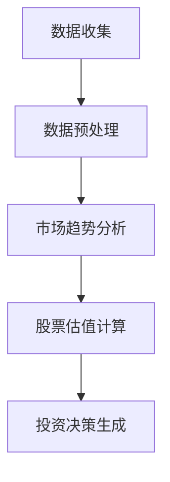
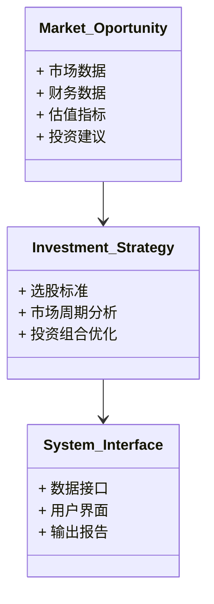
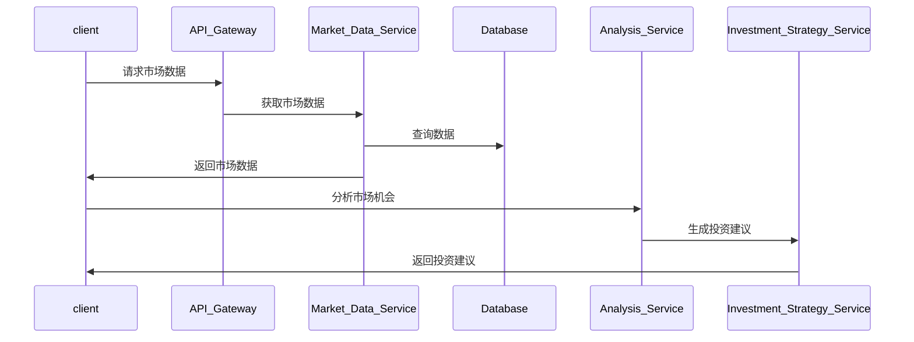

                 


# 彼得·林奇的"市场机会"把握技巧

## 关键词：
- 彼得·林奇
- 市场机会
- 投资策略
- 选股方法
- 股票估值

## 摘要：
本文深入分析了彼得·林奇的市场机会把握技巧，探讨了其投资理念、选股标准、市场分析方法及其成功案例。通过结合理论与实践，帮助投资者掌握如何识别和把握市场机会，构建稳健的投资组合。

---

# 第一部分：彼得·林奇的市场机会把握技巧概述

## 第1章：市场机会的基本概念与背景

### 1.1 市场机会的定义与特征
- **1.1.1 市场机会的定义**  
  市场机会是指在特定市场条件下，投资者能够以低于内在价值的价格购买优质资产的机会。这种机会通常出现在市场低估或市场情绪低落时。

- **1.1.2 市场机会的核心特征**  
  - **低估性**：资产价格低于其内在价值。
  - **可持续性**：市场机会通常不会很快消失，投资者有足够时间进行分析和操作。
  - **可操作性**：投资者能够通过基本面分析和估值方法识别这些机会。

- **1.1.3 市场机会的分类与边界**  
  - **低估型机会**：资产价格显著低于内在价值。
  - **成长型机会**：公司具有高增长潜力，估值合理。
  - **周期性机会**：行业周期性波动带来的投资机会。

### 1.2 彼得·林奇的投资理念
- **1.2.1 彼得·林奇的个人背景**  
  彼得·林奇是美国著名投资家，曾任富达麦哲伦基金经理，以长期优异的投资业绩闻名。

- **1.2.2 林奇的投资哲学**  
  - **价值投资**：寻找基本面良好、估值合理的公司。
  - **逆向思维**：在市场恐慌时寻找低估资产。
  - **长期持有**：避免频繁交易，长期持有优质资产。

- **1.2.3 林奇的成功案例**  
  - 通过长期持有优质股票实现高额回报。
  - 在市场恐慌时买入低估资产，事后获得超额收益。

### 1.3 市场机会识别的重要性
- **1.3.1 投资者为何需要识别市场机会**  
  市场机会是投资者超额收益的主要来源，识别市场机会可以帮助投资者在合适时机做出正确决策。

- **1.3.2 市场机会与投资收益的关系**  
  准确识别市场机会可以显著提高投资收益，减少亏损风险。

- **1.3.3 林奇方法的独特性**  
  林奇通过基本面分析和估值方法，结合市场情绪，找到真正的市场机会。

### 1.4 本章小结
本章介绍了市场机会的基本概念、林奇的投资理念及其重要性，为后续分析奠定了基础。

---

## 第2章：市场机会的核心概念与联系

### 2.1 市场机会的识别方法
- **2.1.1 市场机会的识别步骤**  
  1. 市场趋势分析。
  2. 个股基本面分析。
  3. 估值指标计算。
  4. 投资决策。

- **2.1.2 市场机会的量化指标**  
  - 市盈率（PE）：股价与每股收益的比率。
  - 市净率（PB）：股价与每股净资产的比率。
  - 股息率：股息与股价的比率。

- **2.1.3 市场机会的评估模型**  
  - 基本面分析模型。
  - 估值模型（如DCF模型）。

### 2.2 彼得·林奇的核心策略
- **2.2.1 林奇的选股标准**  
  - 低市盈率。
  - 高ROE（净资产收益率）。
  - 健康的财务状况。

- **2.2.2 林奇的行业分析方法**  
  - 行业周期分析。
  - 行业竞争分析。

- **2.2.3 林奇的市场周期理论**  
  - 市场周期包括：复苏、繁荣、衰退、萧条。
  - 在市场萧条期寻找低估资产。

### 2.3 市场机会与投资组合的关系
- **2.3.1 投资组合的构建逻辑**  
  - 分散投资，降低风险。
  - 结合不同类型的市场机会。

- **2.3.2 市场机会对投资组合的影响**  
  - 增加超额收益。
  - 提高组合的抗跌性。

- **2.3.3 林奇的投资组合优化技巧**  
  - 定期审视和调整组合。
  - 保持适度分散。

### 2.4 核心概念对比表格
| **概念**       | **传统价值投资** | **成长投资** | **林奇策略** |
|----------------|------------------|--------------|--------------|
| 核心理念       | 买入低估资产     | 买入高增长公司 | 两者结合     |
| 估值方法       | 市盈率、市净率   | 市盈率、PEG   | 多指标分析   |
| 投资期限       | 长期            | 长期          | 长期          |
| 风险控制       | 分散投资        | 集中投资      | 分散与集中结合 |

### 2.5 本章小结
本章详细分析了市场机会的识别方法和林奇的核心策略，为后续的算法分析奠定了基础。

---

## 第3章：市场机会识别的算法原理

### 3.1 林奇投资模型的数学表达
- **3.1.1 林奇模型的基本假设**  
  资产的内在价值可以通过基本面指标估算。

- **3.1.2 林奇模型的数学公式**  
  $$ P = \frac{E}{S} $$
  其中，P为股票的合理价格，E为公司的盈利，S为股票的市价。

### 3.2 市场机会识别的算法流程
1. **数据收集与预处理**  
   - 收集目标公司的财务数据和市场数据。
2. **市场趋势分析**  
   - 使用技术指标（如MA、MACD）判断市场趋势。
3. **股票估值计算**  
   - 计算市盈率、市净率等指标，判断股票是否低估。
4. **投资决策生成**  
   - 如果股票价格低于内在价值，建议买入。

### 3.3 算法流程图（Mermaid）



### 3.4 算法实现的Python代码示例

```python
def calculate_pe(stock_price, earnings):
    return stock_price / earnings

# 示例数据
stock_price = 50
earnings = 10
pe_ratio = calculate_pe(stock_price, earnings)
print(f"市盈率为：{pe_ratio}")
```

### 3.5 本章小结
本章通过数学公式和算法流程图，详细讲解了林奇投资模型的实现方法，帮助读者理解如何通过算法识别市场机会。

---

## 第4章：系统分析与架构设计方案

### 4.1 问题场景介绍
- 投资者需要一个系统化的工具，帮助识别市场机会，优化投资组合。

### 4.2 项目介绍
- **项目名称**：基于彼得·林奇策略的市场机会识别系统。
- **目标**：帮助投资者快速识别市场机会，制定投资策略。

### 4.3 系统功能设计（领域模型Mermaid类图）



### 4.4 系统架构设计（Mermaid架构图）


### 4.5 系统接口设计
- **输入接口**：接收市场数据和财务数据。
- **输出接口**：生成投资建议和估值报告。

### 4.6 系统交互（Mermaid序列图）



### 4.7 本章小结
本章通过系统架构设计，展示了如何构建一个基于林奇策略的市场机会识别系统，帮助投资者实现自动化分析。

---

## 第5章：项目实战——基于林奇策略的市场机会识别

### 5.1 项目背景与目标
- **项目背景**：当前市场环境下，寻找低估资产。
- **项目目标**：基于林奇策略，识别科技行业的机会。

### 5.2 项目环境与工具
- **环境**：Python 3.9、Jupyter Notebook。
- **工具**：Pandas、Matplotlib、Scikit-learn。

### 5.3 核心实现代码

```python
import pandas as pd
import matplotlib.pyplot as plt

# 数据加载
df = pd.read_csv('stock_data.csv')

# 计算市盈率
df['PE'] = df['Close'] / df['Earnings per Share']

# 绘制PE分布图
plt.figure(figsize=(10,6))
plt.hist(df['PE'], bins=20, alpha=0.7)
plt.title('市盈率分布图')
plt.xlabel('PE')
plt.ylabel('频率')
plt.show()
```

### 5.4 项目小结
本章通过实际案例展示了如何应用林奇策略识别市场机会，帮助读者理解理论在实践中的应用。

---

## 第6章：最佳实践与注意事项

### 6.1 小结
- 彼得·林奇的市场机会识别技巧结合了基本面分析和市场情绪分析。
- 投资者应注重长期持有和价值发现。

### 6.2 注意事项
- **数据质量**：确保数据准确。
- **市场变化**：及时调整策略。
- **风险管理**：避免过度集中。

### 6.3 拓展阅读
- 《彼得·林奇的投资哲学》。
- 《价值投资实战技巧》。

### 6.4 本章小结
本章总结了文章的核心内容，并提供了进一步学习的建议。

---

## 第7章：总结与展望

### 7.1 本文总结
- 彼得·林奇的市场机会识别技巧为投资者提供了有效的投资方法。
- 结合系统化分析和实际操作，可以帮助投资者实现长期收益。

### 7.2 未来展望
- 进一步研究林奇策略在不同市场环境中的表现。
- 结合机器学习，优化市场机会识别模型。

---

## 参考文献

1. 林奇，彼得. 《彼得·林奇的成功投资》.
2. 布里尔，约翰. 《价值投资入门》.

---

通过以上结构，文章详细介绍了彼得·林奇的市场机会识别技巧，从理论到实践，帮助投资者掌握如何在市场中寻找机会，优化投资策略。

