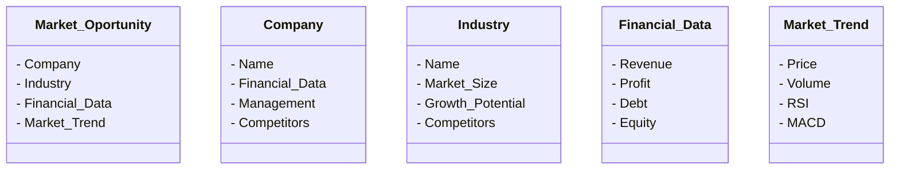
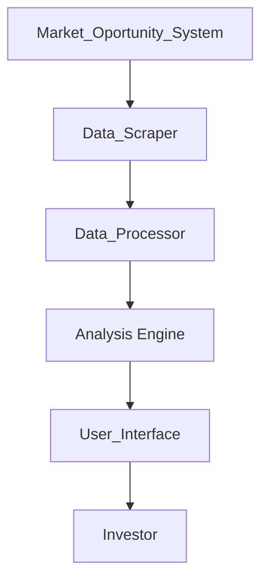
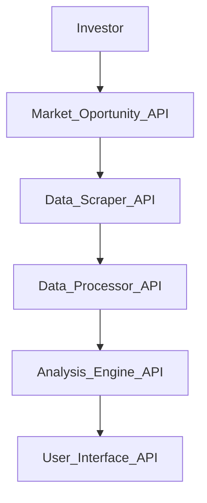
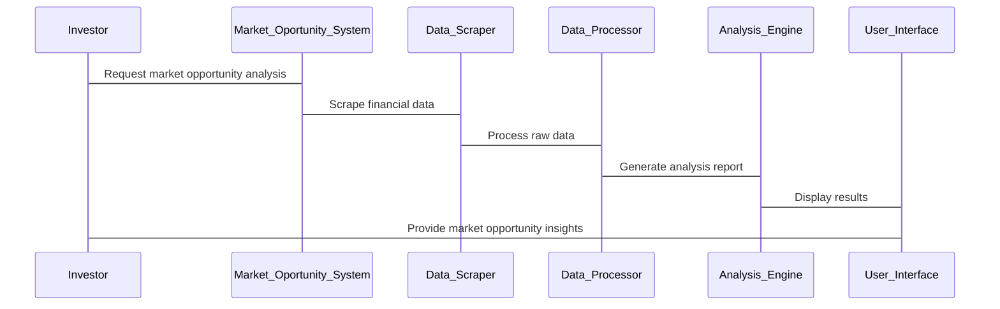

                 


# 彼得林奇的"市场机会"识别训练方法

## 关键词：
- 彼得·林奇
- 市场机会
- 投资策略
- 基本面分析
- 技术分析

## 摘要：
彼得·林奇作为全球最著名的基金经理之一，以其独特的市场机会识别方法闻名。本文将详细分析林奇的市场机会识别训练方法，从基本面分析、技术分析、市场情绪分析等多个维度，结合数学模型和实际案例，逐步揭示其方法的核心原理和应用场景。

---

## 第1章：市场机会识别的重要性

### 1.1 投资的基本概念

#### 1.1.1 投资的定义与分类
投资是通过购买资产以期获得未来收益或资本增值的行为。常见的投资形式包括股票、债券、基金、房地产等。投资的本质是通过分析市场信息，识别潜在的高回报机会。

#### 1.1.2 市场机会识别的核心意义
市场机会识别是投资成功的关键。通过分析市场趋势、公司基本面和技术指标，投资者可以提前发现潜在的高回报机会。彼得·林奇的成功在于他能够通过深入研究和市场观察，发现那些被市场低估的投资机会。

#### 1.1.3 彼得·林奇的投资者哲学
彼得·林奇强调长期投资和价值发现。他认为，投资的关键是找到那些具有持续竞争优势且管理良好的公司。他的投资哲学强调基本面分析的重要性，并注重对公司管理层的信任。

### 1.2 彼得·林奇的背景与成就

#### 1.2.1 彼得·林奇的生平简介
彼得·林奇是美国著名的职业棒球运动员和基金经理。他于1985年进入富达投资集团，管理着全球最大的共同基金——麦哲伦基金。在他的管理下，该基金取得了卓越的业绩，年平均回报率超过29%。

#### 1.2.2 林奇的投资理念与风格
林奇的投资理念强调长期投资、价值发现和分散投资。他认为，市场的短期波动不应影响长期投资决策，而公司基本面和管理层的稳定性是判断投资价值的关键因素。

#### 1.2.3 林奇的成功案例分析
林奇最著名的案例是投资于一些被市场低估的公司，如IBM和莲花公司。他通过深入分析公司的财务状况和市场地位，成功识别出这些公司的潜在价值。

---

## 第2章：市场机会识别的基本要素

### 2.1 市场机会的核心概念

#### 2.1.1 市场机会的定义
市场机会是指在特定市场条件下，某种资产或投资标的能够产生超额收益的可能性。它通常与公司的基本面、行业趋势和市场情绪密切相关。

#### 2.1.2 市场机会的构成要素
市场机会的构成要素包括：
- 公司基本面：如盈利能力、财务状况、管理层能力等。
- 市场趋势：如行业增长、技术创新、政策变化等。
- 市场情绪：如投资者心理、市场波动、资金流动等。

#### 2.1.3 市场机会的分类与层次
市场机会可以分为短期机会、中期机会和长期机会。短期机会通常基于技术分析，而长期机会则依赖于基本面分析。

### 2.2 彼得·林奇的市场机会识别方法

#### 2.2.1 基本面分析的核心要素
基本面分析是林奇识别市场机会的核心方法。他通过分析公司的财务报表、行业地位和管理层能力，识别具有潜在增长的公司。

#### 2.2.2 技术分析的关键指标
林奇也关注技术分析，如股价走势、成交量和关键支撑位。他认为，技术分析可以提供市场的短期信号，帮助投资者做出交易决策。

#### 2.2.3 市场情绪与投资者心理
林奇非常关注市场情绪和投资者心理。他认为，市场的短期波动往往由投资者情绪驱动，而长期机会则需要回归基本面分析。

---

## 第3章：彼得·林奇的市场机会识别模型

### 3.1 基本面分析模型

#### 3.1.1 公司财务报表分析
公司财务报表是基本面分析的核心工具。林奇通过分析收入表、资产负债表和现金流量表，评估公司的盈利能力、财务健康和现金流状况。

#### 3.1.2 行业分析与竞争环境
林奇注重行业分析，他认为公司所在行业的增长潜力和竞争环境是判断公司价值的关键因素。他通过分析行业趋势和竞争对手情况，评估公司的市场地位。

#### 3.1.3 管理层评估与企业治理
林奇非常重视公司管理层的能力和企业治理结构。他认为，一个优秀的管理层能够带领公司克服困难，实现持续增长。

### 3.2 技术分析模型

#### 3.2.1 股价走势分析
林奇关注股价走势，认为股价的变化反映了市场的预期和情绪。他通过分析股价的上升趋势和下降趋势，判断市场的短期方向。

#### 3.2.2 成交量与市场情绪
林奇认为，成交量是市场情绪的晴雨表。高成交量通常意味着市场的活跃和投资者情绪的高涨，而低成交量则可能预示市场的低迷。

#### 3.2.3 技术指标的综合运用
林奇综合运用多种技术指标，如移动平均线、相对强弱指数（RSI）和MACD等，判断市场的短期趋势和买卖信号。

### 3.3 市场情绪与投资者心理分析

#### 3.3.1 市场情绪的周期性
林奇认为，市场情绪具有周期性。他通过分析市场的周期性波动，判断市场的短期趋势和潜在机会。

#### 3.3.2 投资者心理与市场行为
林奇关注投资者心理，认为市场的波动往往由投资者的非理性行为驱动。他通过分析投资者的心理，判断市场的短期走势。

#### 3.3.3 林奇的市场情绪分析方法
林奇通过观察市场的波动和投资者行为，结合基本面分析，判断市场的短期和长期机会。他认为，市场情绪是短期波动的主要原因，而基本面分析是长期投资的关键。

---

## 第4章：基本面分析的数学模型

### 4.1 市盈率模型

#### 4.1.1 市盈率的定义与计算
市盈率（P/E）是股票价格与每股收益的比率，用于衡量股票的估值。计算公式为：
$$ P/E = \frac{Price}{Earnings} $$

#### 4.1.2 市盈率的行业比较与应用
市盈率的行业比较可以帮助投资者判断股票的估值是否合理。如果某股票的市盈率低于行业平均水平，可能意味着该股票被低估。

#### 4.1.3 市盈率与市场机会的关系
市盈率低的股票可能具有较大的市场机会，因为它们可能具有较高的增长潜力和较低的估值风险。

### 4.2 市净率模型

#### 4.2.1 市净率的定义与计算
市净率（P/B）是股票价格与每股净资产的比率，用于衡量股票的估值。计算公式为：
$$ P/B = \frac{Price}{Book\ Value} $$

#### 4.2.2 市净率的行业适用性
市净率适用于资产密集型行业，如银行、房地产和制造业。对于这些行业，市净率可以帮助投资者判断股票的估值是否合理。

#### 4.2.3 市净率与投资决策
市净率低的股票可能具有较大的市场机会，因为它们可能具有较高的资产价值和较低的估值风险。

### 4.3 资产负债率分析

#### 4.3.1 资产负债率的定义与计算
资产负债率是公司总负债与总资产的比率，用于衡量公司的财务健康状况。计算公式为：
$$ Debt-to-Equity = \frac{Total\ Debt}{Total\ Equity} $$

#### 4.3.2 资产负债率与企业风险的关系
高资产负债率通常意味着公司财务风险较高，而低资产负债率则意味着公司财务风险较低。

#### 4.3.3 林奇对资产负债率的重视
林奇认为，资产负债率是衡量公司财务健康的重要指标。他通常选择那些资产负债率较低且财务状况健康的公司进行投资。

---

## 第5章：系统分析与架构设计方案

### 5.1 系统功能设计

#### 5.1.1 领域模型
领域模型是一个概念化的表示，展示了系统中各实体之间的关系。以下是领域模型的Mermaid类图：



#### 5.1.2 系统架构
系统架构设计展示了系统的核心组件及其交互方式。以下是系统架构的Mermaid图：



#### 5.1.3 系统接口设计
系统接口设计展示了系统各组件之间的交互接口。以下是系统接口设计的Mermaid图：



#### 5.1.4 系统交互
系统交互展示了用户与系统之间的交互流程。以下是系统交互的Mermaid图：



---

## 第6章：项目实战

### 6.1 环境安装

#### 6.1.1 安装Python
```bash
python --version
pip install --upgrade pip
```

#### 6.1.2 安装必要的Python库
```bash
pip install pandas numpy matplotlib seaborn scikit-learn
```

### 6.2 核心实现源代码

#### 6.2.1 数据获取与处理
```python
import pandas as pd
import numpy as np

# 示例数据：假设我们从网络上获取某公司的财务数据
data = {
    'Revenue': [100, 200, 300, 400],
    'Profit': [20, 40, 60, 80],
    'Debt': [50, 60, 70, 80],
    'Equity': [150, 250, 350, 450]
}
df = pd.DataFrame(data)
print(df)
```

#### 6.2.2 市盈率与市净率计算
```python
def calculate_pe(ticker):
    # 假设我们通过API获取股票价格和每股收益
    price = get_price(ticker)
    earnings = get_earnings(ticker)
    if earnings == 0:
        return np.inf
    return price / earnings

def calculate_pb(ticker):
    # 假设我们通过API获取股票价格和每股净资产
    price = get_price(ticker)
    book_value = get_book_value(ticker)
    return price / book_value
```

#### 6.2.3 股价走势分析
```python
import matplotlib.pyplot as plt
import pandas as pd

# 示例数据：假设我们从数据库中获取某股票的历史价格
data = {
    'Date': ['2020-01-01', '2020-02-01', '2020-03-01', '2020-04-01'],
    'Price': [100, 110, 120, 115]
}
df = pd.DataFrame(data)
df.set_index('Date', inplace=True)
df.plot()
plt.show()
```

### 6.3 案例分析与详细解读

#### 6.3.1 案例分析
假设我们选择某公司进行分析，以下是具体的分析步骤：

1. 数据获取与处理：从网络上获取该公司的财务数据和股价数据。
2. 市盈率与市净率计算：计算该公司的市盈率和市净率，与行业平均水平进行比较。
3. 股价走势分析：绘制该公司的股价走势图，观察其趋势和成交量变化。
4. 市场情绪分析：结合市场情绪指标，判断该公司的市场机会。

#### 6.3.2 详细解读
通过上述分析步骤，我们可以识别出该公司的市场机会。如果市盈率低于行业平均水平，且股价处于上升趋势，同时市场情绪积极，那么该股票可能具有较大的市场机会。

---

## 第7章：总结与最佳实践

### 7.1 总结

彼得·林奇的市场机会识别方法结合了基本面分析和市场情绪分析，通过深入研究公司财务状况、行业趋势和市场情绪，识别出潜在的高回报机会。他的方法强调长期投资和价值发现，同时注重市场情绪的短期影响。

### 7.2 最佳实践 tips

1. **基本面分析**：深入研究公司的财务报表、行业地位和管理层能力。
2. **技术分析**：结合股价走势、成交量和关键技术指标，判断市场的短期趋势。
3. **市场情绪分析**：关注市场情绪和投资者心理，判断市场的短期波动。
4. **分散投资**：避免过度集中，降低投资风险。
5. **长期投资**：坚持长期投资，关注公司的基本面和长期增长潜力。

### 7.3 小结

通过彼得·林奇的市场机会识别方法，我们可以系统地识别和捕捉市场机会。然而，投资市场充满不确定性，投资者需要不断学习和适应市场的变化。只有通过深入研究和持续实践，才能在市场中获得长期的成功。

---

## 第8章：拓展阅读与参考文献

### 8.1 拓展阅读

1. **《彼得林奇的成功投资》**：深入分析彼得·林奇的投资理念和方法。
2. **《股票投资实战技术》**：详细介绍股票投资的技术分析和实战技巧。
3. **《价值投资入门》**：从价值投资的角度，分析如何识别市场机会。

### 8.2 参考文献

1. 林奇，P. (1988). 《彼得林奇的成功投资》.
2. 葛拉罕姆，B. (1974). 《价值投资入门》.
3. 葛兰碧，W. D. (1999). 《股票投资实战技术》.

---

通过本文的详细分析，我们可以系统地学习彼得·林奇的市场机会识别方法，并将其应用于实际投资中。希望本文能够为投资者提供有价值的参考和启发。

