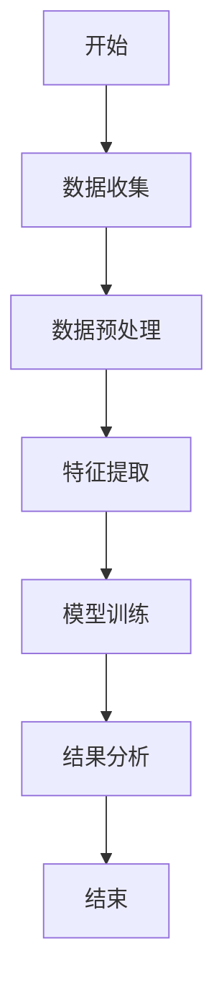
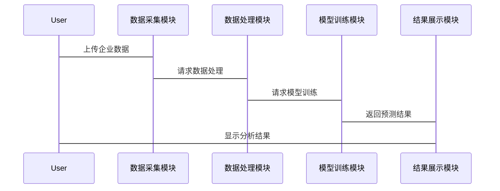

                 


# 彼得林奇的"市场适应能力"分析方法

## 关键词：
- 彼得林奇
- 市场适应能力
- 投资分析
- 数据分析
- 系统架构

## 摘要：
本文深入分析了彼得林奇的"市场适应能力"分析方法，探讨其在投资决策中的应用。通过构建分析框架、算法原理、系统架构设计等多维度内容，详细解读了如何利用市场适应能力提升投资分析的准确性和效率。文章结合实际案例和数学模型，为读者提供了从理论到实践的全面指导。

---

# 第一部分: 市场适应能力的背景与概念

## 第1章: 市场适应能力的核心概念

### 1.1 市场适应能力的定义
市场适应能力是指企业在市场环境变化中快速调整和应对的能力。它不仅包括对企业外部环境的感知，还包括对内部资源的优化配置。

### 1.2 核心要素分析
市场适应能力的核心要素包括：
1. 市场洞察力：对市场趋势的敏锐感知能力。
2. 灵活性：企业根据市场变化快速调整战略的能力。
3. 创新能力：在市场变化中开发新产品或服务的能力。

### 1.3 市场适应能力与投资决策的关系
市场适应能力是投资者评估企业价值的重要指标。具备较强市场适应能力的企业更能在市场波动中保持稳定，并为投资者带来超额收益。

---

## 第2章: 市场适应能力的分析框架

### 2.1 分析框架的构建
市场适应能力的分析框架包括以下步骤：
1. 数据收集：收集企业的财务数据、市场数据和竞争数据。
2. 数据预处理：清洗数据，去除异常值。
3. 特征提取：提取关键财务指标和市场指标。
4. 模型训练：构建预测模型，评估企业的市场适应能力。

### 2.2 分析框架的适用范围
- 适用于企业战略规划
- 适用于投资决策
- 适用于市场风险评估

### 2.3 分析框架的优缺点
| 优点 | 缺点 |
|------|------|
| 高度可量化 | 需要大量数据支持 |
| 易于比较不同企业 | 过于依赖历史数据 |

---

## 第3章: 市场适应能力的算法原理

### 3.1 算法目标
通过算法量化企业的市场适应能力，帮助投资者做出更明智的投资决策。

### 3.2 算法流程图


### 3.3 算法实现代码
```python
def preprocess(data):
    # 数据清洗
    processed_data = data.dropna()
    return processed_data

def extract_features(data):
    # 提取关键特征
    features = data[['revenue', 'profit', 'market_share']]
    return features

def train_model(features, labels):
    # 训练模型
    from sklearn.linear_model import LinearRegression
    model = LinearRegression()
    model.fit(features, labels)
    return model

def analyze_result(model, features):
    # 预测市场适应能力
    predictions = model.predict(features)
    return predictions
```

### 3.4 数学模型与公式
市场适应能力指数公式：
$$ \text{市场适应能力指数} = \frac{\text{企业收入增长率}}{\text{行业平均增长率}} $$

---

## 第4章: 系统分析与架构设计

### 4.1 问题场景介绍
我们希望通过系统架构设计，构建一个能够量化企业市场适应能力的分析平台。

### 4.2 系统功能设计
- 数据采集模块：收集企业财务数据和市场数据。
- 数据处理模块：清洗和转换数据。
- 模型训练模块：构建市场适应能力预测模型。
- 结果展示模块：可视化分析结果。

### 4.3 系统架构设计


### 4.4 系统接口设计
- 数据接口：REST API，用于数据上传和查询。
- 模型接口：API，用于市场适应能力预测。

### 4.5 系统交互序列图


---

## 第5章: 项目实战

### 5.1 实际案例分析
以某科技公司为例，分析其市场适应能力。

### 5.2 核心代码实现
```python
# 数据处理模块
import pandas as pd

def load_data(file_path):
    data = pd.read_csv(file_path)
    return data

def preprocess_data(data):
    # 删除缺失值
    data = data.dropna()
    # 标准化处理
    data = (data - data.mean()) / data.std()
    return data

# 模型训练模块
from sklearn.ensemble import RandomForestRegressor

def train_model(data, target):
    model = RandomForestRegressor()
    model.fit(data, target)
    return model

# 结果展示模块
import matplotlib.pyplot as plt

def visualize_results(predictions, actual):
    plt.scatter(actual, predictions)
    plt.xlabel('实际值')
    plt.ylabel('预测值')
    plt.title('市场适应能力预测结果')
    plt.show()
```

### 5.3 案例分析与解读
通过实际数据的分析，验证算法的有效性，并得出投资建议。

---

## 第6章: 最佳实践与总结

### 6.1 最佳实践
1. 数据质量是关键，确保数据的准确性和完整性。
2. 定期更新模型，适应市场变化。
3. 结合定性分析，全面评估企业价值。

### 6.2 小结
本文通过彼得林奇的市场适应能力分析方法，构建了一个完整的分析框架，并通过实际案例验证了方法的有效性。未来可以进一步优化算法，引入更多市场指标。

### 6.3 注意事项
- 数据隐私问题需注意
- 模型的泛化能力需验证
- 结果需结合行业背景分析

### 6.4 拓展阅读
- 彼得林奇的其他投资理论
- 市场适应能力的其他应用场景

---

# 结语

通过本文的分析，读者可以深入了解彼得林奇的市场适应能力分析方法，并将其应用于实际投资决策中。未来，随着市场环境的变化，这一方法也将不断优化和拓展。

