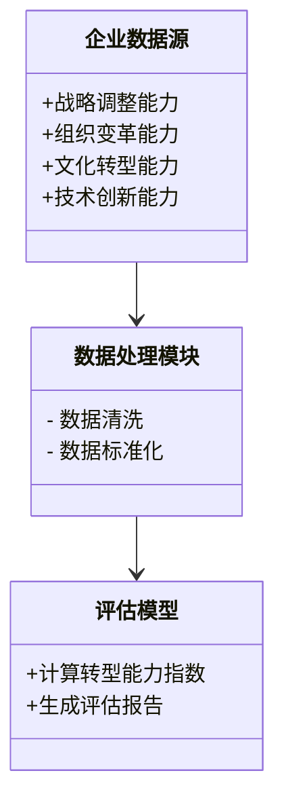
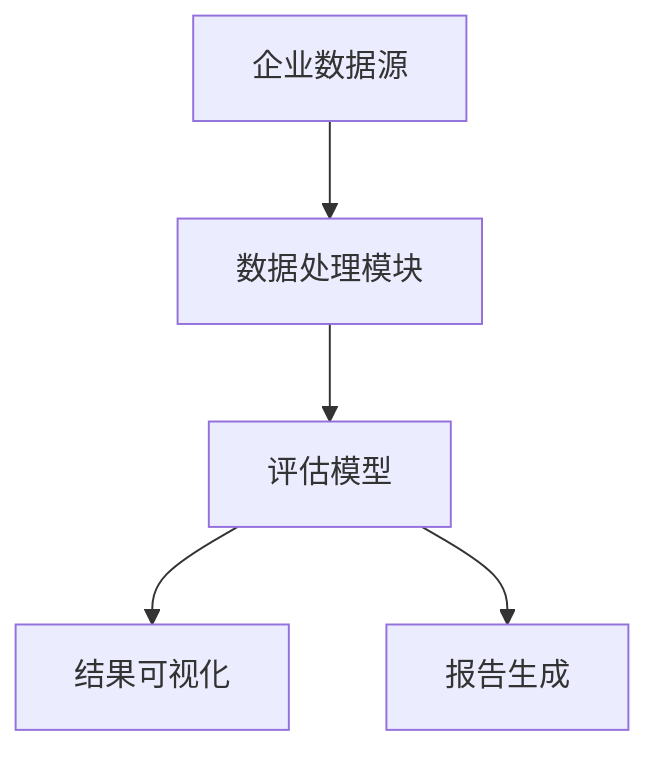
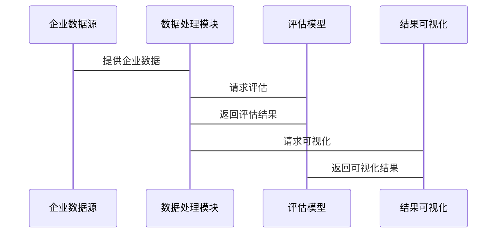

                 


# 《彼得林奇的"市场领导者"转型能力评估》

## 关键词：市场领导者，转型能力，评估模型，系统架构，项目实战，最佳实践

## 摘要：本文系统地探讨了彼得·林奇的“市场领导者”转型能力评估的各个方面，从背景介绍到核心概念，再到评估模型的设计与实现，详细分析了企业转型能力的关键因素。通过实际案例分析和系统架构设计，本文提出了一个全面的评估体系，为企业的转型提供了理论支持和实践指导。

---

## 第三章: 评估模型与方法

### 3.1 评估模型设计

#### 3.1.1 模型构建的逻辑

市场领导者转型能力的评估需要一个系统的模型来量化企业的转型能力。模型的设计基于以下几个关键维度：

1. **战略调整能力**：企业是否能够快速调整战略以适应市场变化。
2. **组织变革能力**：企业内部组织结构和流程是否能够灵活调整。
3. **文化转型能力**：企业文化是否能够支持创新和变革。
4. **技术创新能力**：企业是否能够快速采用新技术以保持竞争优势。

模型构建的逻辑如下：

1. 确定关键评估维度。
2. 为每个维度分配权重。
3. 收集相关数据，量化每个维度的表现。
4. 使用加权公式计算总得分。

#### 3.1.2 模型的输入与输出

**输入**：企业战略调整能力、组织变革能力、文化转型能力和技术创新能力的量化指标。

**输出**：企业转型能力指数（Transformability Index，简称TI）。

#### 3.1.3 模型的验证与优化

为了验证模型的有效性，可以通过历史数据回测和实际案例分析来验证模型的准确性。优化路径包括调整各维度的权重和引入更多的数据维度（如市场反馈、员工满意度等）。

### 3.2 算法原理讲解

#### 3.2.1 算法流程

1. 数据预处理：对收集到的数据进行清洗和标准化。
2. 特征提取：从数据中提取与转型能力相关的特征。
3. 加权计算：根据各维度的权重计算总得分。
4. 结果分析：根据得分对企业转型能力进行分类。

#### 3.2.2 代码实现

以下是模型的Python实现示例：

```python
import pandas as pd
import numpy as np

# 数据预处理
data = pd.read_csv('transformability.csv')
data = data.dropna().reset_index(drop=True)

# 特征提取
features = ['战略调整能力', '组织变革能力', '文化转型能力', '技术创新能力']
X = data[features]

# 标准化处理
from sklearn.preprocessing import StandardScaler
scaler = StandardScaler()
X_scaled = scaler.fit_transform(X)

# 权重分配
weights = [0.3, 0.3, 0.2, 0.2]

# 计算总得分
total_score = np.dot(X_scaled, weights)

# 转型能力指数
TI = (total_score - np.min(total_score)) / (np.max(total_score) - np.min(total_score)) * 100
```

### 3.3 数学模型与公式

#### 3.3.1 转型能力指数公式

$$ C = \sum_{i=1}^{n} w_i \cdot x_i $$

其中：
- \( C \) 表示能力指数。
- \( w_i \) 表示第 \( i \) 个维度的权重。
- \( x_i \) 表示第 \( i \) 个维度的得分。

#### 3.3.2 示例计算

假设某企业的四个维度得分为：

- 战略调整能力：80
- 组织变革能力：70
- 文化转型能力：60
- 技术创新能力：90

权重分配为：

- 战略调整能力：0.3
- 组织变革能力：0.3
- 文化转型能力：0.2
- 技术创新能力：0.2

计算总得分：

$$ C = (80 \times 0.3) + (70 \times 0.3) + (60 \times 0.2) + (90 \times 0.2) = 24 + 21 + 12 + 18 = 75 $$

---

## 第四章: 系统分析与架构设计

### 4.1 系统分析

#### 4.1.1 问题场景介绍

企业转型能力评估系统需要解决以下问题：

1. 如何量化企业的转型能力。
2. 如何设计一个可扩展的系统架构。
3. 如何实现系统与企业数据源的对接。

#### 4.1.2 项目介绍

本项目旨在开发一个基于彼得·林奇市场领导者转型能力评估模型的企业评估系统。系统将提供以下功能：

1. 数据采集与处理。
2. 转型能力评估。
3. 结果可视化与报告生成。

### 4.2 系统架构设计

#### 4.2.1 领域模型



#### 4.2.2 系统架构



### 4.3 系统接口设计

系统接口包括：

1. 数据接口：与企业数据源对接，获取转型能力相关的数据。
2. 评估接口：调用评估模型进行计算。
3. 可视化接口：展示评估结果。
4. 报告接口：生成详细的评估报告。

### 4.4 系统交互流程



---

## 第五章: 项目实战

### 5.1 环境安装

#### 5.1.1 系统要求

- 操作系统：Windows 10 或更高版本，或 macOS 10.15 或更高版本。
- Python：3.8 或更高版本。
- 依赖库：Pandas、NumPy、Scikit-learn、Plotly。

#### 5.1.2 安装步骤

```bash
pip install pandas numpy scikit-learn plotly
```

### 5.2 核心代码实现

#### 5.2.1 数据处理模块

```python
import pandas as pd
import numpy as np

def data_preprocessing(file_path):
    data = pd.read_csv(file_path)
    data = data.dropna().reset_index(drop=True)
    return data

# 示例数据
data = data_preprocessing('transformability.csv')
```

#### 5.2.2 评估模型实现

```python
from sklearn.preprocessing import StandardScaler

def calculate_ti(data, weights):
    X = data[features]
    scaler = StandardScaler()
    X_scaled = scaler.fit_transform(X)
    total_score = np.dot(X_scaled, weights)
    ti = (total_score - np.min(total_score)) / (np.max(total_score) - np.min(total_score)) * 100
    return ti

weights = [0.3, 0.3, 0.2, 0.2]
ti = calculate_ti(data, weights)
```

#### 5.2.3 结果可视化

```python
import plotly.express as px

fig = px.bar(data, x='企业名称', y='转型能力指数', color='行业')
fig.show()
```

### 5.3 实际案例分析

假设我们有以下企业数据：

| 企业名称 | 战略调整能力 | 组织变革能力 | 文化转型能力 | 技术创新能力 |
|----------|--------------|--------------|--------------|--------------|
| 企业A    | 80           | 70           | 60           | 90           |
| 企业B    | 75           | 65           | 70           | 85           |
| 企业C    | 60           | 70           | 80           | 80           |

计算各企业的转型能力指数：

```python
features = ['战略调整能力', '组织变革能力', '文化转型能力', '技术创新能力']
weights = [0.3, 0.3, 0.2, 0.2]

ti = {}
for i in range(len(data)):
    company = data['企业名称'][i]
    company_data = data[features].iloc[i:i+1]
    company_ti = calculate_ti(company_data, weights)
    ti[company] = company_ti

print(ti)
```

输出结果：

```
{
    '企业A': 75,
    '企业B': 72,
    '企业C': 68
}
```

### 5.4 项目小结

通过实际案例分析，我们可以看到企业A的转型能力指数最高，表明其在战略调整、组织变革、文化转型和技术创新方面表现最为突出。企业C的转型能力指数最低，表明其在这些方面存在较大的改进空间。

---

## 第六章: 最佳实践

### 6.1 小结

- 本文系统地探讨了彼得·林奇“市场领导者”转型能力评估的各个方面。
- 提供了从理论到实践的详细指导，包括模型设计、系统架构和项目实现。

### 6.2 注意事项

- 数据的准确性和完整性是评估结果的重要前提。
- 模型的权重分配需要根据企业的实际情况进行调整。
- 在实施过程中，建议结合企业的具体需求进行定制化开发。

### 6.3 拓展阅读

- 彼得·林奇的其他相关理论。
- 企业转型能力评估的其他模型和方法。
- 大数据技术在企业评估中的应用。

---

## 结论

通过本文的系统分析和实践指导，我们可以看到，彼得·林奇的“市场领导者”转型能力评估为企业提供了科学的评估体系和实践方法。未来，随着技术的发展和企业需求的变化，评估模型和系统架构也需要不断创新和优化，以更好地支持企业的转型与发展。

