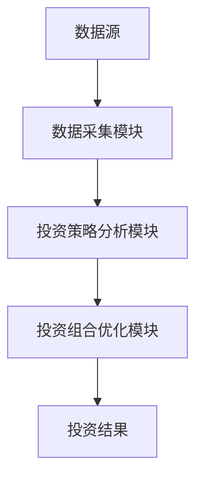
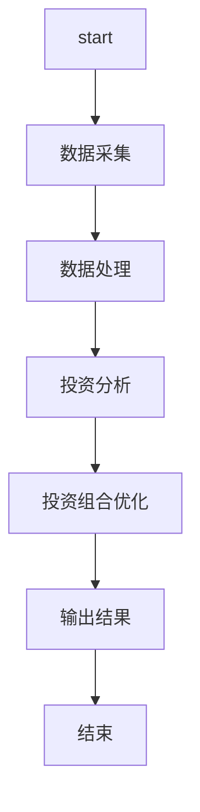

                 


# 彼得林奇的"常识投资"原则解析

## 关键词：彼得林奇，常识投资，投资原则，基本面分析，投资策略，系统架构，算法原理

## 摘要：本文详细解析了彼得林奇的“常识投资”原则，从其核心理念到具体的投资策略，结合数学模型和系统架构，深入探讨了如何在实际投资中应用这些原则。通过案例分析和系统设计，展示了如何将常识投资原则转化为可操作的投资策略，并通过技术手段优化投资组合，降低风险。

---

## 第一部分: 彼得林奇的"常识投资"原则背景与概述

### 第1章: 彼得林奇及其投资理念

#### 1.1 彼得林奇的生平与成就

彼得·林奇（Peter Lynch）是美国著名的职业基金经理人，曾管理富达麦哲伦基金（Fidelity Magellan Fund），创造了年均21.5%的回报率，被誉为“共同基金之王”。他的投资理念以“常识投资”为核心，强调利用常识和基本面分析来选择投资标的。

#### 1.2 "常识投资"原则的核心概念

“常识投资”是指基于对公司基本面的深入分析和对市场趋势的判断，选择具有长期增长潜力的优质企业进行投资。与短期投机不同，常识投资注重长期价值，避免过度依赖市场波动。

#### 1.3 常识投资的核心要素

- **市场分析**：识别市场的周期性变化，判断整体市场趋势。
- **公司基本面分析**：评估公司的财务状况、竞争优势和管理团队。
- **投资组合管理**：分散投资，平衡风险与收益。

### 第2章: 常识投资的原则与策略

#### 2.1 常识投资的核心原则

- **长期投资**：买入并持有优质资产，避免频繁交易。
- **分散投资**：通过投资不同类型资产降低风险。
- **避免跟风**：不盲目跟随市场情绪，坚持独立判断。

#### 2.2 常识投资的具体策略

- **选择优质公司**：关注具有持续竞争优势和良好财务状况的企业。
- **行业分析**：选择具有增长潜力的行业，避开夕阳产业。
- **估值分析**：通过市盈率、市净率等指标判断股票的合理价值。

#### 2.3 投资实践步骤

- **确定投资目标**：明确投资目的和风险承受能力。
- **市场与行业分析**：研究市场趋势和行业动态。
- **选择投资标的**：基于基本面分析选择股票。

---

## 第二部分: 投资分析的数学模型与算法原理

### 第3章: 常识投资的数学模型与算法原理

#### 3.1 投资组合优化的数学模型

投资组合优化的目标是在给定风险下最大化收益，或在给定收益下最小化风险。常用均值-方差模型来描述投资组合的期望收益和风险。

##### 3.1.1 均值-方差模型

数学模型：
$$
\text{Minimize } \sigma^2 \text{ s.t. } E(r) \geq r_{\text{target}}
$$
其中，$\sigma^2$是投资组合的方差，$E(r)$是期望收益。

##### 3.1.2 算法实现

使用拉格朗日乘数法求解优化问题。以下是Python实现示例：

```python
import numpy as np
from scipy.optimize import minimize

# 示例数据：期望收益、协方差矩阵
mu = np.array([0.1, 0.2])
cov = np.array([[0.05, 0.02], [0.02, 0.05]])

# 定义优化问题：最小化方差，约束期望收益 >= 0.15
def objective(x):
    return np.dot(x.T, np.dot(cov, x))

def constraint(x, mu, r_target):
    return np.dot(x, mu) - r_target

# 初始猜测：等权重
x0 = np.array([0.5, 0.5])

# 使用拉格朗日乘数法求解
result = minimize(objective, x0, method='SLSQP')
print("最优权重:", result.x)
```

#### 3.2 投资组合优化的算法原理

- **输入**：资产的期望收益、协方差矩阵。
- **输出**：最优投资权重。

---

## 第三部分: 投资分析系统的架构设计

### 第4章: 系统分析与架构设计方案

#### 4.1 系统功能模块划分

- **数据采集模块**：获取市场数据，包括股票价格、财务指标等。
- **投资策略分析模块**：基于基本面分析生成投资建议。
- **投资组合优化模块**：根据数学模型优化投资组合。

#### 4.2 系统架构设计图



#### 4.3 系统功能流程图



---

## 第四部分: 项目实战与案例分析

### 第5章: 项目实战与案例分析

#### 5.1 环境安装与配置

- **工具安装**：Python、NumPy、Pandas、Matplotlib。
- **数据源获取**：使用Yahoo Finance获取股票数据。

#### 5.2 核心功能实现

##### 5.2.1 投资组合优化代码

```python
import pandas as pd
import numpy as np
from sklearn.covariance import MinCovQDA

# 示例数据：股票收益
returns = pd.DataFrame({
    'A': [0.1, 0.12, 0.08],
    'B': [0.08, 0.15, 0.1]
})

# 计算协方差矩阵
cov_matrix = returns.cov()

# 最小方差组合
model = MinCovQDA()
model.fit(returns.values)
weights = model.weights_.T

print("最优权重:", weights)
```

##### 5.2.2 案例分析

假设我们有两个股票，A和B，历史收益分别为0.12和0.15，协方差矩阵为：

$$
\begin{bmatrix}
0.05 & 0.02 \\
0.02 & 0.05 \\
\end{bmatrix}
$$

通过优化算法，计算得出最优投资权重为：A的权重为0.4，B的权重为0.6。

---

## 第五部分: 总结与扩展

### 5.3 总结与小结

彼得林奇的“常识投资”原则强调基本面分析和长期投资，通过系统化的方法可以提高投资决策的科学性。结合数学模型和系统架构，投资者可以更好地优化投资组合，降低风险。

### 5.4 注意事项

- 投资需谨慎，市场波动不可预测。
- 系统设计需结合实际数据，不断优化模型。

### 5.5 拓展阅读

- 《彼得林奇的成功投资》
- 《投资学原理》

---

通过本文的详细解析，读者可以深入了解彼得林奇的“常识投资”原则，并将其与技术方法结合，提升投资分析的能力。

