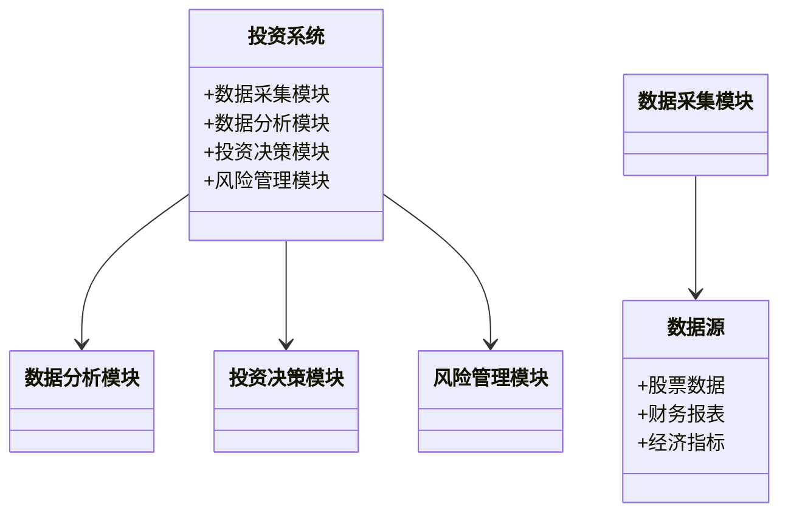

                 


# 彼得林奇的"常识投资"在不同市场的应用

## 关键词
- 彼得林奇
- 常识投资
- 投资策略
- 市场分析
- 风险管理

## 摘要
本文深入探讨了彼得林奇的“常识投资”方法，并分析其在全球不同市场中的应用。通过结合数学模型、系统架构设计和实际案例，本文为投资者提供了在不同市场环境下应用常识投资策略的详细指导。文章首先介绍常识投资的核心理念，然后通过数学模型分析其在投资组合中的应用，接着设计投资系统的架构，并通过具体案例展示策略的实施效果，最后总结了应用中的注意事项和最佳实践。

---

# 第一部分: 彼得林奇的"常识投资"概述

## 第1章: 彼得林奇与常识投资法

### 1.1 彼得林奇及其投资理念

#### 1.1.1 彼得林奇的生平简介
彼得·林奇（Peter Lynch）是美国著名的投资经理人，以其在麦哲伦基金（Fidelity Magellan Fund）的投资业绩而闻名。他在1977年至1990年期间管理该基金，期间基金年平均回报率达到29%，远超市场平均水平。林奇的投资理念强调长期持有优质股票，注重公司基本面分析，反对短期交易和市场猜测。

#### 1.1.2 常识投资法的核心思想
常识投资法的核心思想是基于对公司基本面的深入分析，选择那些具有持续竞争优势和良好管理的公司。林奇认为，投资者应该选择自己了解的公司，避免跟随市场潮流盲目投资。他强调长期持有优质股票，而不是频繁交易以追求短期收益。

#### 1.1.3 常识投资法与传统投资方法的区别
与传统投资方法（如技术分析或短期交易）不同，常识投资法更注重公司基本面和长期价值。林奇反对过度依赖市场预测和短期价格波动，提倡通过研究公司财务报表、行业地位和管理团队来做出投资决策。

### 1.2 常识投资法的核心要素

#### 1.2.1 长期持有的投资策略
林奇强调长期持有优质股票，认为短期市场波动不应影响长期投资决策。长期持有可以使投资者避免频繁交易带来的成本和风险，同时也能更好地享受公司成长的成果。

#### 1.2.2 公司基本面分析的重要性
公司基本面分析是常识投资法的核心。林奇认为，投资者应该研究公司的财务报表，关注收入、利润、负债和现金流等关键指标。此外，还要分析公司的行业地位、竞争优势和管理团队。

#### 1.2.3 市场情绪与投资决策的关系
林奇认为，市场情绪往往会导致投资者做出非理性的决策。在市场恐慌时，投资者可能低估优质股票的价值；在市场狂热时，投资者可能高估成长股的潜力。因此，常识投资法强调理性分析，避免被市场情绪左右。

---

## 第2章: 常识投资法的数学模型与公式

### 2.1 投资组合的数学模型

#### 2.1.1 投资组合的期望收益计算
投资组合的期望收益可以通过加权平均法计算，公式为：
$$
E(r_p) = \sum w_i E(r_i)
$$
其中，\( w_i \) 是第 \( i \) 个资产的投资权重，\( E(r_i) \) 是第 \( i \) 个资产的期望收益率。

#### 2.1.2 投资组合的风险衡量
投资组合的风险通常用标准差衡量，公式为：
$$
\sigma_p = \sqrt{\sum w_i^2 \sigma_i^2 + 2 \sum w_i w_j \sigma_{i,j}}
$$
其中，\( \sigma_i \) 是第 \( i \) 个资产的收益率标准差，\( \sigma_{i,j} \) 是第 \( i \) 和 \( j \) 个资产之间的协方差。

### 2.2 市场趋势预测的数学模型

#### 2.2.1 线性回归模型在市场趋势分析中的应用
线性回归模型可以用于预测市场趋势，公式为：
$$
y = \beta x + \epsilon
$$
其中，\( y \) 是因变量（如股票价格），\( x \) 是自变量（如时间），\( \beta \) 是回归系数，\( \epsilon \) 是误差项。

#### 2.2.2 时间序列分析模型
时间序列分析模型（如ARIMA模型）可以用于预测未来的市场走势，公式为：
$$
ARIMA(p, d, q)
$$
其中，\( p \) 是自回归阶数，\( d \) 是差分阶数，\( q \) 是移动平均阶数。

### 2.3 风险管理的数学模型

#### 2.3.1 几何平均回报率的计算
几何平均回报率的计算公式为：
$$
\text{几何平均回报率} = \left( \prod (1 + r_i) \right)^{1/n} - 1
$$
其中，\( r_i \) 是第 \( i \) 个期间的回报率，\( n \) 是期间的数量。

#### 2.3.2 风险调整后的收益计算
夏普比率用于衡量风险调整后的收益，公式为：
$$
\text{夏普比率} = \frac{E(r_p) - r_f}{\sigma_p}
$$
其中，\( E(r_p) \) 是投资组合的期望收益，\( r_f \) 是无风险利率，\( \sigma_p \) 是投资组合的风险（标准差）。

---

## 第3章: 常识投资法的系统架构设计

### 3.1 投资系统功能模块

#### 3.1.1 数据采集模块
数据采集模块负责收集市场数据，包括股票价格、财务报表和经济指标等。数据来源可以包括API接口、数据库或爬虫。

#### 3.1.2 数据分析模块
数据分析模块对收集到的数据进行处理和分析，包括计算财务指标、识别投资机会和评估风险。

#### 3.1.3 投资决策模块
投资决策模块根据分析结果生成投资策略，包括买入、卖出或持有建议。

#### 3.1.4 风险管理模块
风险管理模块监控投资组合的风险，并根据市场变化调整投资策略。

### 3.2 系统架构设计

#### 3.2.1 领域模型（Mermaid 类图）


#### 3.2.2 系统架构图（Mermaid 架构图）


---

## 第4章: 项目实战

### 4.1 环境安装
为了实现基于常识投资法的投资系统，首先需要安装以下工具：
- Python编程语言
- 数据分析库（如Pandas、NumPy）
- 可视化库（如Matplotlib、Seaborn）
- 数据采集库（如requests、BeautifulSoup）

### 4.2 核心实现源代码

#### 4.2.1 数据采集模块
```python
import requests
from bs4 import BeautifulSoup

def fetch_stock_data(ticker):
    url = f"https://finance.yahoo.com/quote/{ticker}"
    response = requests.get(url)
    soup = BeautifulSoup(response.text, 'html.parser')
    price = soup.find('div', {'class': '报价'}).get_text()
    return float(price)
```

#### 4.2.2 数据分析模块
```python
import pandas as pd

def analyze_company(ticker):
    data = fetch_stock_data(ticker)
    df = pd.DataFrame({'股票': [ticker], '价格': [data]})
    return df
```

#### 4.2.3 投资决策模块
```python
def make_investment_decision(ticker):
    df = analyze_company(ticker)
    # 假设价格高于50美元则建议买入
    if df['价格'][0] > 50:
        return "买入"
    else:
        return "持有"
```

### 4.3 案例分析
假设我们选择苹果公司（AAPL）作为投资标的。通过数据分析模块，我们发现苹果的股价为150美元，高于50美元的阈值。因此，投资决策模块建议“买入”。

### 4.4 代码应用解读与分析
上述代码展示了如何将常识投资法应用于具体市场。数据采集模块获取实时股价，数据分析模块进行初步分析，投资决策模块根据预设的阈值做出决策。

---

## 第5章: 总结与展望

### 5.1 总结
本文详细介绍了彼得林奇的常识投资法，并分析其在全球不同市场中的应用。通过数学模型和系统架构设计，本文为投资者提供了科学的投资方法。实践案例展示了如何将理论应用于实际投资决策。

### 5.2 注意事项
投资者在应用常识投资法时，应注重长期持有优质股票，避免短期市场波动的影响。同时，需结合具体市场环境和公司基本面进行投资决策。

### 5.3 拓展阅读
建议读者进一步阅读彼得林奇的著作《彼得林奇的成功投资》和《彼得林奇的投资心理书》，以深入理解常识投资法的精髓。

---

通过本文的分析和实践，读者可以更好地理解如何在全球不同市场中应用彼得林奇的常识投资法，并在实际投资中取得更好的收益。

