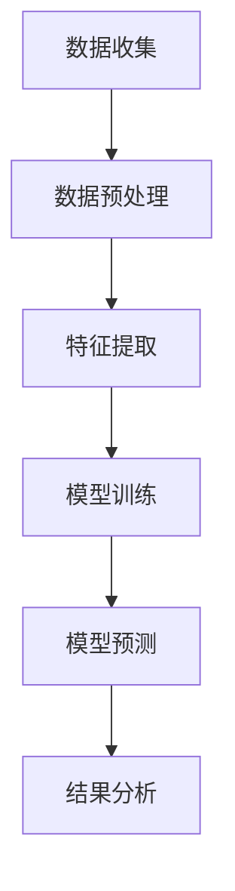
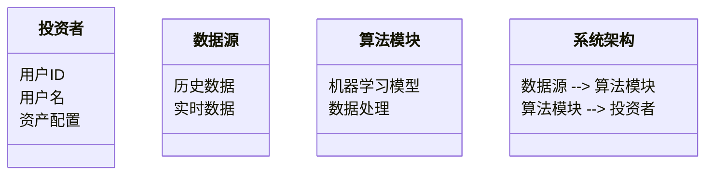
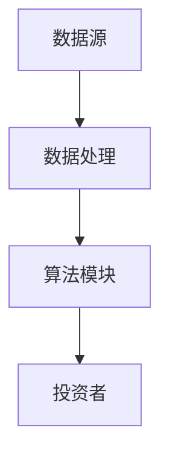
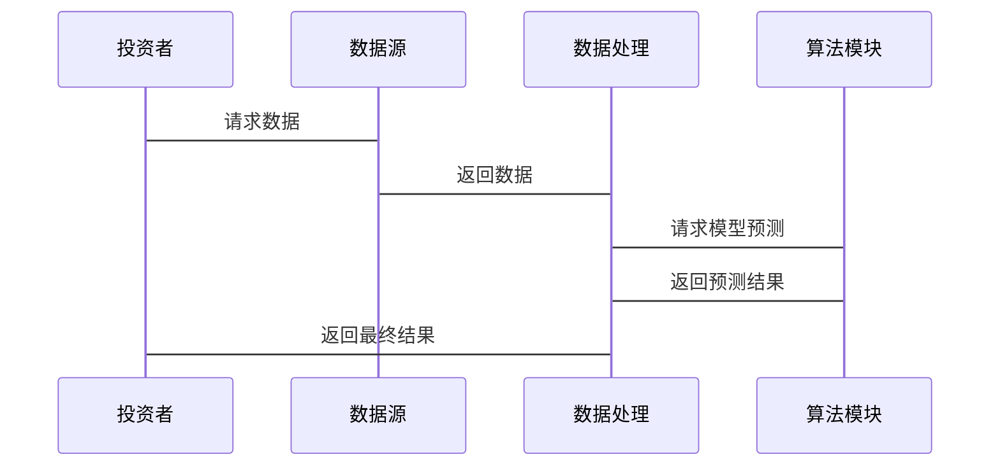

                 


# 彼得林奇的"常识投资"在人工智能决策辅助时代的价值重估

> **关键词**：常识投资，人工智能，投资决策，彼得·林奇，决策辅助
>
> **摘要**：本文探讨了彼得·林奇的常识投资策略在人工智能决策辅助时代的价值演变。通过分析常识投资的核心理念、人工智能在投资决策中的应用，以及两者结合的可能性，本文旨在重新评估常识投资在AI时代的战略意义。

---

## 第一章：背景介绍

### 1.1 常识投资的起源与发展

常识投资是一种基于基本面分析的投资策略，强调通过研究公司的财务状况、行业地位和市场前景等基本面因素来做出投资决策。这一策略的核心在于利用市场中的非效率性和价值低估现象，寻找被市场忽视的优质投资标的。

彼得·林奇作为常识投资的代表人物，他在富达投资集团的长期任职中，通过深入研究企业基本面，构建了庞大的股票投资组合，并取得了卓越的投资业绩。林奇的理念强调长期持有优质股票，避免短期市场波动的干扰。

### 1.2 彼得·林奇的常识投资策略

林奇的策略主要包括以下几点：

1. **深入研究企业基本面**：通过分析公司的财务报表、行业地位、竞争优势等，寻找具有长期增长潜力的企业。
2. **分散投资**：通过投资于不同行业和规模的公司，降低投资风险。
3. **长期持有**：避免频繁交易，减少交易成本，同时利用复利效应实现财富增长。

### 1.3 AI决策辅助的现状

人工智能在投资领域的应用日益广泛，从量化交易到智能投顾，AI技术正在改变传统投资方式。AI通过处理海量数据，利用机器学习算法，帮助投资者发现潜在的投资机会和风险。

然而，AI在投资决策中的应用也面临挑战，如数据质量、模型过拟合、黑箱问题等。这些挑战要求我们在使用AI辅助投资时，保持对基本面分析的重视。

---

## 第二章：常识投资与人工智能的结合

### 2.1 常识投资与AI决策辅助的联系

AI技术可以为常识投资提供以下支持：

1. **数据处理能力**：AI能够快速处理大量非结构化数据（如新闻、社交媒体），帮助投资者发现市场情绪和潜在信息。
2. **预测能力**：通过机器学习模型，AI可以预测公司业绩、行业趋势和市场波动。
3. **决策优化**：AI可以帮助投资者优化投资组合，降低风险。

### 2.2 常识投资与AI决策辅助的对比分析

下表对比了常识投资和AI决策辅助的核心特点：

| **特点**         | **常识投资**             | **AI决策辅助**             |
|------------------|--------------------------|-----------------------------|
| **决策依据**      | 公司基本面、行业分析     | 数据驱动、机器学习模型     |
| **决策速度**      | 较慢（依赖人工分析）      | 快速（基于算法实时计算）    |
| **灵活性**        | 较低（长期策略为主）      | 较高（可根据市场变化快速调整）|
| **风险管理**      | 依赖人工判断             | 可量化风险，提供风险模型    |

---

## 第三章：AI决策辅助的算法原理

### 3.1 机器学习模型在投资决策中的应用

机器学习模型在投资中的应用主要体现在以下几个方面：

1. **股价预测**：利用历史数据训练模型，预测未来股价走势。
2. **风险评估**：通过分析市场数据，评估投资组合的风险。
3. **情绪分析**：通过自然语言处理技术，分析新闻、社交媒体情绪，预测市场波动。

以下是一个简单的机器学习模型流程图：



### 3.2 数学模型与公式

机器学习模型的核心是优化目标函数，以下是一个简单的线性回归模型：

$$
y = w_1x_1 + w_2x_2 + \dots + w_nx_n + b
$$

其中，$w_i$ 是特征$x_i$的权重，$b$是截距，$y$是预测结果。

优化目标是最小化预测值与实际值的平方差之和：

$$
\text{最小化} \sum_{i=1}^{m}(y_i - \hat{y_i})^2
$$

---

## 第四章：系统分析与架构设计

### 4.1 系统功能设计

以下是AI辅助投资决策系统的功能设计类图：



### 4.2 系统架构设计

以下是系统的架构图：



### 4.3 系统交互设计

以下是系统交互的序列图：



---

## 第五章：项目实战与案例分析

### 5.1 环境安装与配置

以下是如何安装AI投资决策系统的环境：

1. **安装Python**：确保安装了Python 3.8以上版本。
2. **安装依赖库**：运行以下命令安装必要的库：
   ```bash
   pip install numpy pandas scikit-learn
   ```

### 5.2 核心代码实现

以下是简单的机器学习模型实现代码：

```python
import numpy as np
from sklearn.linear_model import LinearRegression

# 示例数据
X = np.array([[1, 2], [3, 4], [5, 6]])
y = np.array([7, 8, 9])

# 训练模型
model = LinearRegression()
model.fit(X, y)

# 预测
print(model.predict([[7, 8]]))
```

### 5.3 案例分析

通过以上代码，我们可以看到AI模型如何根据历史数据预测股价。然而，AI模型的结果需要结合常识投资的逻辑进行验证，避免单一依赖算法。

---

## 第六章：最佳实践、小结与注意事项

### 6.1 最佳实践

1. **结合基本面分析**：AI模型的结果需要结合基本面分析进行验证。
2. **持续监控**：市场变化迅速，需要定期监控和调整模型。
3. **风险管理**：设置合理的止损点，避免过度依赖AI模型。

### 6.2 小结

在人工智能时代，常识投资的价值并未被取代，而是与AI技术相结合，形成了更加高效的投资策略。通过AI辅助，投资者可以更好地发现机会和风险，提升决策效率。

### 6.3 注意事项

1. **数据质量**：AI模型的效果依赖于数据质量，需要确保数据的完整性和准确性。
2. **模型解释性**：复杂的模型可能难以解释，需要选择合适的模型以确保可解释性。
3. **合规性**：AI投资需要符合相关法律法规，避免合规风险。

### 6.4 拓展阅读

1. 《彼得·林奇的投资哲学》
2. 《机器学习在金融中的应用》
3. 《人工智能与投资决策》

---

以上是《彼得林奇的"常识投资"在人工智能决策辅助时代的价值重估》的完整目录和内容框架。通过理论与实践的结合，本文为投资者在AI时代提供了新的思考方向和实践指导。

