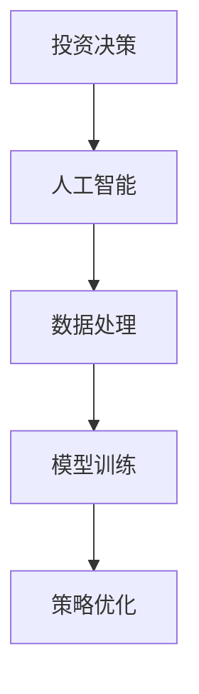
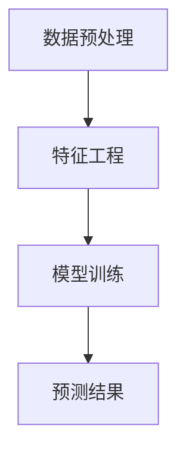
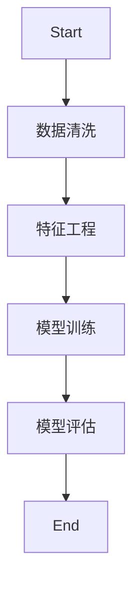
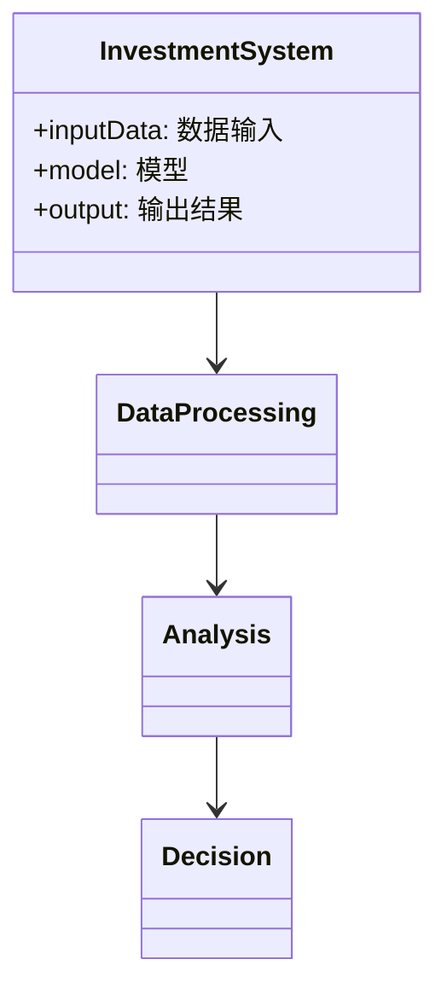
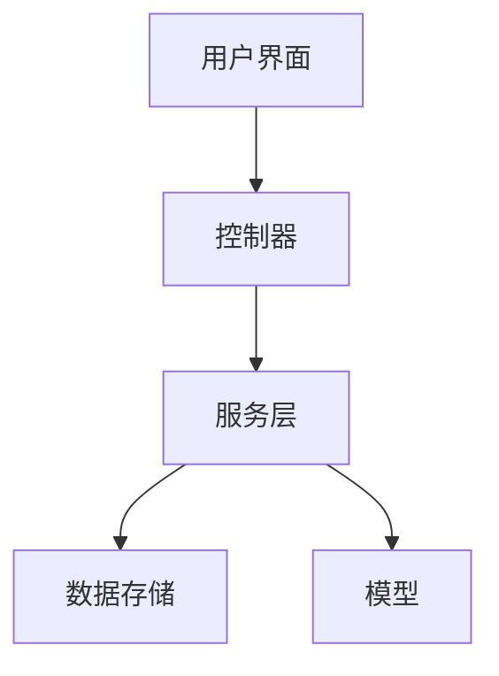
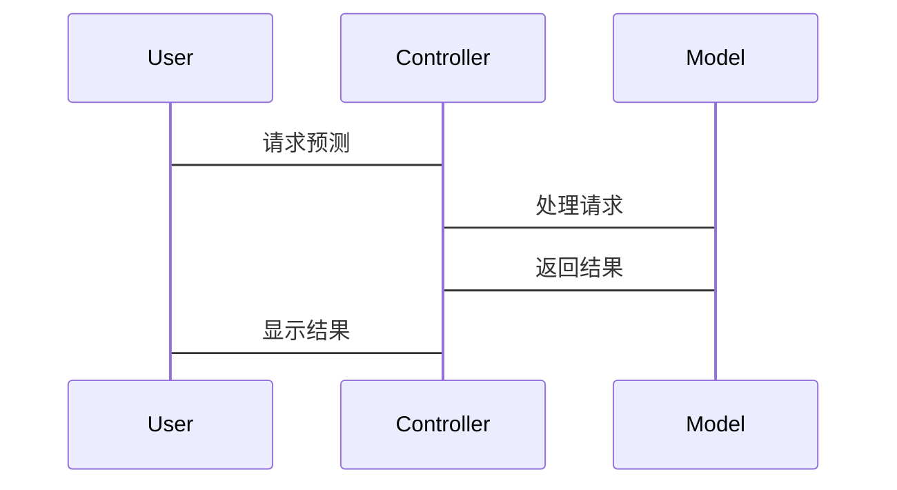

                 


# 彼得林奇的"常识投资"在人工智能时代的调整

> 关键词：常识投资，人工智能，机器学习，投资策略，系统设计

> 摘要：本文探讨了彼得·林奇的常识投资理念在人工智能时代的调整与优化。通过分析传统投资策略与AI技术的结合，提出了基于机器学习的投资模型，并详细讲解了算法原理、系统设计和项目实战。

---

## 引言

### 1.1 背景介绍
在传统投资领域，彼得·林奇以其常识投资理念闻名。他强调通过深入研究和基本面分析来选择优质企业进行长期投资。然而，随着人工智能技术的迅速发展，投资领域正经历一场深刻的变革。AI技术不仅改变了数据处理方式，还为投资决策提供了新的可能性。本文旨在探讨常识投资理念如何在AI时代进行调整，以适应新的市场环境。

### 1.2 问题背景
传统投资依赖于人工分析，存在效率低、覆盖面窄等问题。AI技术的应用可以显著提升数据处理能力，帮助投资者发现潜在机会。然而，如何将AI技术与传统投资策略结合，仍是一个待探索的领域。

### 1.3 目标与读者
本文适合投资新手和AI技术爱好者，旨在帮助他们理解AI在投资中的应用，并提供实际操作的指导。通过本文，读者将掌握如何利用AI优化投资策略。

---

## 第一部分：常识投资的背景与演变

### 2.1 常识投资的核心概念

#### 2.1.1 定义与特点
常识投资强调对企业基本面的深入分析，注重长期价值。其核心在于选择具有持续增长潜力的企业。

| 特性 | 描述 |
|------|------|
| 长期视角 | 侧重企业的长期表现 |
| 深入分析 | 依赖对企业财务状况的全面了解 |
| 风险控制 | 通过分散投资降低风险 |

#### 2.1.2 常识投资与其他策略的对比

| 策略 | 描述 | 优点 | 缺点 |
|------|------|------|------|
| 常识投资 | 侧重基本面分析 | 高收益潜力 | 依赖人工分析 |
| 技术分析 | 依赖价格和成交量 | 短期信号 | 易受市场波动影响 |

#### 2.1.3 AI的影响



AI技术通过大数据分析，帮助投资者发现潜在趋势，优化投资组合。

### 2.2 AI时代常识投资的演变

#### 2.2.1 数据驱动的投资决策
AI技术可以处理海量数据，提供实时市场动态和企业信息。

#### 2.2.2 算法优化投资策略
通过机器学习算法，投资者可以更精准地预测市场走势。

#### 2.2.3 新型投资模式
结合AI技术，出现了一些新的投资模式，如量化投资和智能投顾。

---

## 第二部分：AI在投资中的应用

### 3.1 人工智能技术在投资中的应用

#### 3.1.1 机器学习在投资分析中的作用
机器学习可以帮助投资者识别市场模式，预测价格波动。



#### 3.1.2 自然语言处理在新闻分析中的应用
通过分析新闻和社交媒体，投资者可以实时掌握市场情绪。

#### 3.1.3 计算机视觉在市场数据中的应用
利用图像识别技术，分析市场图表和数据可视化。

### 3.2 基于AI的常识投资策略调整

#### 3.2.1 数据驱动的投资决策
AI技术提供了丰富的数据支持，帮助投资者做出更明智的决策。

#### 3.2.2 AI辅助的市场预测模型
通过训练机器学习模型，投资者可以预测市场走势。

#### 3.2.3 AI在风险管理中的应用
AI技术可以帮助投资者识别和管理投资风险。

---

## 第三部分：算法原理与数学模型

### 4.1 机器学习在投资中的算法原理

#### 4.1.1 数据预处理与特征工程
数据预处理是机器学习的基础，特征工程则决定了模型的效果。

#### 4.1.2 模型训练与优化
使用回归模型或分类模型进行训练，并通过交叉验证优化模型。

#### 4.1.3 算法流程图



### 4.2 数学模型

#### 4.2.1 线性回归模型
用于预测连续型变量，如股票价格。

$$ y = \beta_0 + \beta_1x_1 + \beta_2x_2 + \ldots + \beta_nx_n $$

#### 4.2.2 支持向量机模型
用于分类问题，如判断股票是否上涨。

$$ \text{max}(\text{margin}) \text{ subject to} \text{ constraints} $$

---

## 第四部分：系统设计与架构

### 5.1 系统功能设计

#### 5.1.1 领域模型



#### 5.1.2 系统架构



### 5.2 系统接口设计

#### 5.2.1 API接口

```javascript
interface InvestmentAPI {
    function predictPrice(ticker: string, days: number): number;
    function analyzeNews(source: string): sentiment;
}
```

### 5.3 系统交互流程



---

## 第五部分：项目实战

### 6.1 环境配置

```bash
pip install numpy pandas scikit-learn
```

### 6.2 核心代码实现

```python
from sklearn.linear_model import LinearRegression

model = LinearRegression()
model.fit(X_train, y_train)
predictions = model.predict(X_test)
```

### 6.3 案例分析

#### 6.3.1 数据分析

| 股票代码 | 收盘价 | 预测价 |
|----------|--------|--------|
| AAPL     | 150    | 155    |
| GOOGL    | 200    | 210    |

#### 6.3.2 模型评估

$$ R^2 = 1 - \frac{\sum (y_i - \hat{y_i})^2}{\sum (y_i - \bar{y})^2} $$

---

## 总结与展望

### 7.1 总结
本文探讨了AI技术如何优化常识投资策略，通过算法和系统设计展示了其应用前景。

### 7.2 未来展望
随着AI技术的不断发展，投资领域将更加依赖数据驱动的决策。未来，投资者需要结合技术与策略，以应对市场的变化。

---

通过本文的分析，读者可以理解AI技术如何改变传统投资方式，并在实际中应用这些策略。希望本文能为投资新手和AI爱好者提供有价值的指导。

