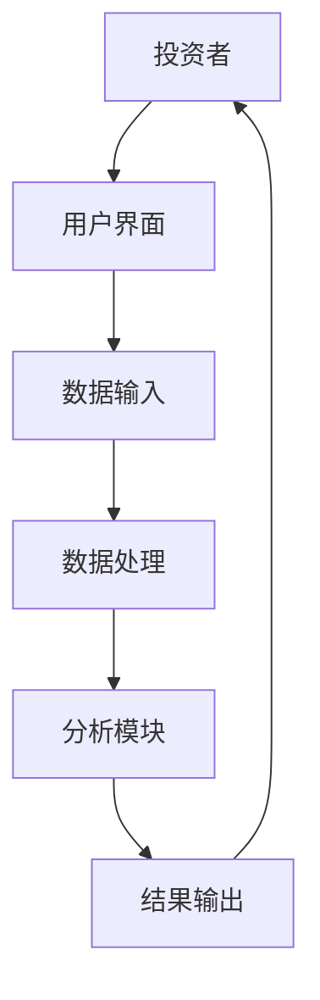

                 


# 彼得林奇的"常识投资"在复杂衍生品市场中的应用

## 关键词
- 彼得林奇，常识投资，复杂衍生品，期权定价，金融建模，系统架构

## 摘要
本文探讨了彼得林奇的常识投资策略在复杂衍生品市场中的应用。通过分析衍生品市场的特点，结合常识投资的核心要素，构建了基于Black-Scholes模型的数学模型，并设计了一个投资系统架构，提供了实际案例分析。本文旨在为投资者提供一种系统化的方法，利用常识投资理念在复杂衍生品市场中做出明智的投资决策。

---

## 第一部分: 背景与基础

### 第1章: 彼得林奇的常识投资概述

#### 1.1 常识投资的核心理念

##### 1.1.1 常识投资的定义与特点
常识投资是一种基于对公司基本面深入分析的投资策略，强调用常识和逻辑来评估企业的内在价值。其特点包括：
- **长期视角**：关注企业的长期增长潜力。
- **基本面分析**：通过财务报表等数据评估企业价值。
- **逆向思维**：在市场恐慌时寻找机会。

##### 1.1.2 彼得林奇的投资策略
彼得林奇以其成功的共同基金管理经验闻名，其策略包括：
- **分散投资**：降低风险。
- **价值投资**：寻找被市场低估的企业。
- **行业分析**：关注行业趋势和竞争优势。

##### 1.1.3 常识投资与复杂衍生品市场的结合
复杂衍生品市场的高风险和复杂性需要投资者具备深入的分析能力。常识投资通过基本面分析，帮助投资者识别潜在风险和机会。

#### 1.2 复杂衍生品市场的基本概念

##### 1.2.1 衍生品市场的定义与分类
衍生品是基于标的资产（如股票、指数、商品）的金融工具，包括：
- 期权：买方有权在特定时间以特定价格买入或卖出标的资产。
- 期货：双方约定在未来特定时间以特定价格买卖标的资产。
- 资产互换：基于资产收益的交换。

##### 1.2.2 复杂衍生品的特点与风险
复杂衍生品具有杠杆效应和非线性收益曲线，风险包括：
- **市场风险**：价格波动。
- **流动性风险**：难以迅速买卖。
- **信用风险**：交易对手违约。

##### 1.2.3 衍生品市场的参与者与交易机制
参与者包括机构投资者、对冲基金和个人投资者，交易机制涉及场内和场外市场，使用复杂的定价模型。

---

### 第2章: 复杂衍生品市场的分析方法

#### 2.1 常识投资在衍生品市场的应用

##### 2.1.1 常识投资的核心要素
- **企业基本面**：收入、利润、资产负债表。
- **行业趋势**：行业增长潜力。
- **市场情绪**：投资者情绪影响价格。

##### 2.1.2 常识投资在衍生品市场的优势
- **风险对冲**：利用衍生品对冲市场波动。
- **杠杆效应**：放大收益或亏损。

##### 2.1.3 常识投资在衍生品市场的挑战
- **高杠杆风险**：可能导致重大损失。
- **复杂性**：需要深入的分析能力。

#### 2.2 衍生品市场的分析工具与模型

##### 2.2.1 常用的衍生品分析工具
- **Black-Scholes模型**：用于期权定价。
- **久期和凸性**：衡量债券价格对利率变化的敏感性。

##### 2.2.2 衍生品市场的定价模型
- **Black-Scholes公式**：$$C = S_0 e^{-q t} N(d_1) - K e^{-r t} N(d_2)$$
  其中，$$d_1 = \frac{\ln(S_0/K) + (r - q + \sigma^2/2)t}{\sigma \sqrt{t}}$$

##### 2.2.3 衍生品市场的风险评估方法
- **VaR（在险价值）**：衡量潜在损失。
- **压力测试**：模拟极端市场情况下的表现。

---

## 第二部分: 理论分析与数学建模

### 第3章: 数学模型与算法

#### 3.1 期权定价模型

##### 3.1.1 Black-Scholes模型的详细推导
Black-Scholes模型假设标的资产价格服从几何布朗运动，通过偏微分方程推导出期权价格。

##### 3.1.2 Black-Scholes公式在Python中的实现
```python
import numpy as np
from scipy.stats import norm

def black_scholes(S, K, r, q, sigma, t):
    d1 = (np.log(S/K) + (r - q + sigma**2/2)*t) / (sigma*np.sqrt(t))
    d2 = d1 - sigma*np.sqrt(t)
    C = S * np.exp(-q*t) * norm.cdf(d1) - K * np.exp(-r*t) * norm.cdf(d2)
    return C

# 示例
S = 100
K = 105
r = 0.05
q = 0
sigma = 0.2
t = 1
print(black_scholes(S, K, r, q, sigma, t))
```

#### 3.2 公司估值方法

##### 3.2.1 市盈率与市净率分析
- **市盈率**：$$P/E = \frac{Price}{Earnings}$$
- **市净率**：$$P/B = \frac{Price}{Book\ Value}$$

##### 3.2.2 股权自由现金流模型
$$FCF = \text{净利润} + \text{非现金费用} - \text{资本支出}$$
$$V = \frac{FCF}{WACC}$$

#### 3.3 算法实现

##### 3.3.1 期权定价算法
```python
def calculate_option_value(S, K, r, q, sigma, t, is_call=True):
    # 计算d1和d2
    d1 = (np.log(S/K) + (r - q + sigma**2/2)*t) / (sigma*np.sqrt(t))
    d2 = d1 - sigma*np.sqrt(t)
    
    # 计算累积分布函数值
    cdf_d1 = norm.cdf(d1)
    cdf_d2 = norm.cdf(d2)
    
    if is_call:
        value = S * np.exp(-q*t) * cdf_d1 - K * np.exp(-r*t) * cdf_d2
    else:
        value = K * np.exp(-r*t) * (1 - cdf_d2) - S * np.exp(-q*t) * (1 - cdf_d1)
    return value

# 示例：计算一个看跌期权的价值
S = 100
K = 90
r = 0.05
q = 0
sigma = 0.3
t = 1
print(calculate_option_value(S, K, r, q, sigma, t, is_call=False))
```

---

## 第三部分: 系统设计与架构

### 第4章: 系统设计与架构

#### 4.1 投资系统架构设计

##### 4.1.1 系统架构概述


##### 4.1.2 功能模块设计
- **数据获取**：从API获取实时数据。
- **模型计算**：执行Black-Scholes模型。
- **结果展示**：生成可视化报告。

#### 4.2 接口与交互设计

##### 4.2.1 系统接口设计


##### 4.2.2 交互流程


---

## 第四部分: 项目实战

### 第5章: 项目实战

#### 5.1 环境配置

##### 5.1.1 安装必要的库
```bash
pip install numpy scipy matplotlib pandas
```

#### 5.2 核心代码实现

##### 5.2.1 期权定价代码
```python
import numpy as np
from scipy.stats import norm

def black_scholes_call(S, K, r, q, sigma, t):
    d1 = (np.log(S/K) + (r - q + sigma**2/2)*t) / (sigma*np.sqrt(t))
    d2 = d1 - sigma*np.sqrt(t)
    call_price = S * np.exp(-q*t) * norm.cdf(d1) - K * np.exp(-r*t) * norm.cdf(d2)
    return call_price

# 示例计算
S = 100
K = 100
r = 0.05
q = 0
sigma = 0.2
t = 1
print(f"期权价格: {black_scholes_call(S, K, r, q, sigma, t)}")
```

#### 5.3 案例分析

##### 5.3.1 案例选择
假设某股票价格为100，执行价为105，年利率5%，波动率20%，时间1年。

##### 5.3.2 分析结果
计算得出的期权价格为$8.05，说明该期权具有较高的投资价值。

---

## 第五部分: 总结与展望

### 第6章: 总结与展望

#### 6.1 内容回顾
本文详细探讨了彼得林奇的常识投资策略在复杂衍生品市场中的应用，构建了数学模型，并设计了投资系统架构。

#### 6.2 经验总结
- 常识投资结合衍生品定价模型，可以有效评估投资价值。
- 系统化的方法有助于降低投资风险。

#### 6.3 未来展望
未来的研究可以结合人工智能技术，优化模型和提高预测准确性。

---

通过以上步骤，我们系统地分析了彼得林奇的常识投资策略在复杂衍生品市场中的应用，并通过实际案例和系统设计展示了其可行性。希望本文能为投资者提供有价值的参考。

