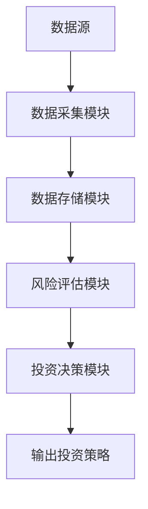

                 


# 彼得林奇的"常识投资"在复杂金融产品中的应用

---

## 关键词：
- 彼得林奇
- 常识投资
- 复杂金融产品
- 投资策略
- 系统架构
- 量化分析

---

## 摘要：
本文探讨了彼得林奇的“常识投资”理念在复杂金融产品中的应用。通过分析复杂金融产品的特点，结合系统架构设计和量化分析方法，提出了一套适用于复杂金融产品的投资策略，并通过实际案例和代码实现进行了详细说明。

---

## 第一部分：常识投资概述

### 第1章：彼得林奇与常识投资的核心理念

#### 1.1 彼得林奇的生平简介
彼得·林奇是美国著名的投资家，曾任富达麦哲伦基金的经理。他以长期投资和价值投资的理念闻名，强调通过基本面分析和常识判断来选择优质企业进行投资。

#### 1.2 常识投资的核心理念
常识投资的核心在于长期持有优质资产，避免短期波动的干扰。林奇认为，投资者应该选择那些具有强大基本面、良好管理团队和持续增长潜力的企业。

#### 1.3 投资中的非理性决策
林奇强调，投资者往往因为情绪波动而做出非理性决策，如盲目跟风或恐慌性抛售。常识投资要求投资者保持冷静，理性分析。

---

### 第2章：复杂金融产品的基本概念

#### 2.1 金融产品的分类与特点
- **股票**：代表企业所有权，具有较高的风险和收益。
- **债券**：代表债务所有权，具有相对稳定的收益。
- **基金**：通过集合资金投资于多种资产，分散风险。

#### 2.2 复杂金融产品的定义与分类
- **ETF（交易所交易基金）**：跟踪指数或资产类别的金融产品，兼具开放式和封闭式基金的特点。
- **期权与衍生品**：基于标的资产的期权合约，具有杠杆效应和风险。
- **对冲基金**：通过套利、做空等策略追求绝对收益。

#### 2.3 复杂金融产品的风险与收益特征
复杂金融产品通常具有较高的杠杆效应，收益波动较大，风险也较高。投资者需要充分理解这些产品的运作机制，避免盲目投资。

---

### 第3章：彼得林奇投资策略在复杂金融产品中的应用

#### 3.1 常识投资的核心策略
- **长期投资**：避免频繁交易，降低交易成本。
- **价值投资**：选择具有合理估值的企业。
- **分散投资**：通过投资多种资产降低风险。

#### 3.2 复杂金融产品中的投资策略
- **ETF投资**：选择跟踪指数的ETF，长期持有，分散风险。
- **期权对冲**：利用期权对冲市场的系统性风险。
- **对冲基金的风险管理**：通过严格筛选对冲基金，分散投资以降低风险。

---

## 第二部分：复杂金融产品的系统分析与架构设计

### 第4章：复杂金融产品的系统分析

#### 4.1 问题场景介绍
复杂金融产品的投资需要考虑市场波动、宏观经济环境和产品本身的特性。投资者需要一个系统化的框架来分析和选择产品。

#### 4.2 系统功能需求
- 数据采集：收集市场数据、产品信息。
- 风险评估：量化产品的风险和收益。
- 投资决策：基于分析结果制定投资策略。

#### 4.3 系统架构设计
以下是系统架构的Mermaid图：



---

### 第5章：投资组合优化的算法原理

#### 5.1 投资组合优化的核心算法
- **均值-方差模型**：最小化投资组合的波动性，同时实现预期收益。
- **遗传算法**：通过模拟自然选择，优化投资组合。
- **机器学习算法**：利用历史数据预测最优投资组合。

#### 5.2 算法实现与代码示例
以下是均值-方差模型的Python代码：

```python
import numpy as np
import pandas as pd
from numpy import matrix, sqrt, mean, std

def portfolio_optimization(returns):
    n = len(returns.columns)
    returns_matrix = returns.values
    mu = mean(returns_matrix, axis=0)
    sigma = np.cov(returns_matrix.T)
    inv_sigma = np.linalg.inv(sigma)
    w = inv_sigma * mu
    w = w / sum(w)
    return w
```

---

### 第6章：风险管理与量化分析

#### 6.1 风险管理的核心策略
- **VaR（风险值）**：衡量投资组合在一定置信水平下的潜在损失。
- **CVaR（条件风险值）**：VaR的延伸，衡量在VaR水平下的平均损失。

#### 6.2 量化分析的算法实现
以下是VaR的Python代码实现：

```python
import numpy as np

def calculate VaR(returns, confidence_level=0.95):
    return np.percentile(returns, (1 - confidence_level) * 100)
```

---

## 第三部分：实战应用

### 第7章：基于常识投资策略的金融产品分析

#### 7.1 ETF与期权的案例分析
选择几只ETF和期权产品，分析其基本面和技术面，制定投资策略。

#### 7.2 投资组合优化的实战
基于实际市场数据，优化投资组合，实现收益与风险的平衡。

---

### 第8章：系统实现与代码解读

#### 8.1 系统实现
基于前面的算法，实现一个投资组合优化系统，包括数据采集、风险评估和投资决策模块。

#### 8.2 代码解读
以下是完整的Python代码示例：

```python
import numpy as np
import pandas as pd
from numpy import matrix, sqrt, mean, std

def portfolio_optimization(returns):
    n = len(returns.columns)
    returns_matrix = returns.values
    mu = mean(returns_matrix, axis=0)
    sigma = np.cov(returns_matrix.T)
    inv_sigma = np.linalg.inv(sigma)
    w = inv_sigma * mu
    w = w / sum(w)
    return w

# 示例数据
returns = pd.DataFrame({
    '股票': [0.02, 0.01, 0.03, 0.02, 0.01],
    '债券': [0.01, 0.02, 0.01, 0.03, 0.02],
    'ETF': [0.015, 0.015, 0.02, 0.01, 0.01]
})

# 优化投资组合
weights = portfolio_optimization(returns)
print("投资组合权重:", weights)
```

---

### 第9章：总结与展望

#### 9.1 总结
本文通过分析彼得林奇的常识投资理念，结合复杂金融产品的特点，提出了一套系统化的投资策略，并通过实际案例和代码实现进行了验证。

#### 9.2 展望
未来的研究可以进一步结合人工智能和大数据技术，优化投资策略，提高投资收益。

---

## 最佳实践 Tips

1. **长期投资**：避免频繁交易，降低交易成本。
2. **分散投资**：通过投资多种资产降低风险。
3. **风险管理**：定期评估和调整投资组合。
4. **持续学习**：关注市场动态，不断优化投资策略。

---

通过本文的系统分析和实战应用，读者可以更好地理解彼得林奇的常识投资理念，并将其应用到复杂金融产品的投资中，实现稳健的收益。

