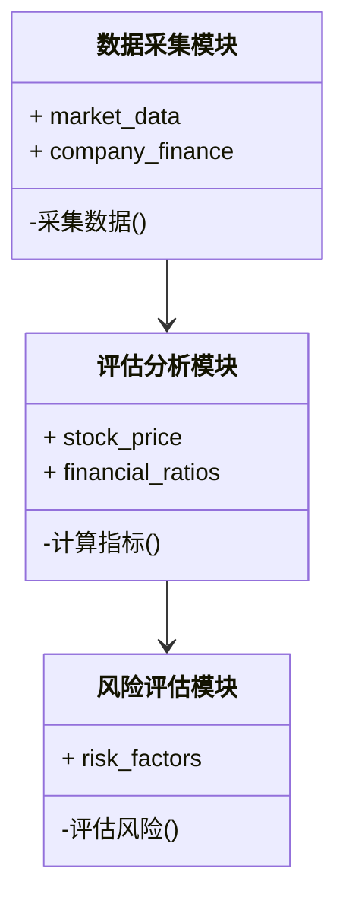

                 


# 彼得林奇的"常识投资"在复杂金融产品评估中的应用

## 关键词：常识投资，金融产品评估，复杂金融产品，投资策略，金融分析

## 摘要：  
本文探讨了彼得林奇提出的“常识投资”方法在复杂金融产品评估中的应用。通过分析金融产品的特点、评估指标和投资策略，本文详细阐述了如何将常识投资的核心理念应用于债券、基金、衍生品等复杂金融工具的评估中。文章结合实际案例，提供了系统的设计思路和实施步骤，帮助投资者在复杂多变的金融环境中做出明智决策。

---

## 第一部分：常识投资法的核心理念

### 第1章：常识投资法的背景与核心要素

#### 1.1 投资的基本概念与核心问题  
投资的核心问题在于如何在不确定性中实现收益最大化，同时控制风险。投资者需要关注市场趋势、公司基本面、行业动态和宏观经济环境等因素。  

**关键概念**：  
- **投资回报**：指投资后获得的收益，包括资本增值和现金流。  
- **风险与收益的平衡**：投资者需要在风险和收益之间找到最佳平衡点。  

#### 1.2 彼得林奇与常识投资法的提出  
彼得林奇是美国著名投资家，曾任富达麦哲伦基金的经理，创造了辉煌的投资业绩。他提出的“常识投资”方法强调基于常识和基本面分析，寻找被市场低估的投资机会。  

**核心要素**：  
1. **基本面分析**：通过分析公司的财务报表、行业地位和竞争优势，评估其内在价值。  
2. **市场情绪分析**：关注市场情绪对投资决策的影响，避免被短期波动迷惑。  
3. **长期视角**：投资不是短期交易，而是长期价值的积累。  

#### 1.3 常识投资法的特点与局限性  
**特点**：  
- 以基本面分析为基础，注重公司内在价值。  
- 强调长期投资，避免短期市场波动的干扰。  

**局限性**：  
- 对复杂金融产品的适用性有限，需要结合其他方法进行优化。  

---

## 第二部分：复杂金融产品的分类与评估要点

### 第2章：复杂金融产品的分类与评估指标

#### 2.1 金融产品的分类  
复杂金融产品包括债券、基金、衍生品（如期权、期货）等。每类产品的特点和评估指标有所不同。  

**分类**：  
1. **债券**：包括国债、企业债等，主要评估其信用评级和利率风险。  
2. **基金**：包括股票型基金、债券型基金等，主要评估其历史业绩和管理团队。  
3. **衍生品**：包括期权、期货等，主要评估其杠杆效应和风险敞口。  

#### 2.2 金融产品评估的核心指标  
**指标**：  
- **市盈率（P/E）**：用于评估股票的价值。  
- **市净率（P/B）**：用于评估股票的合理性。  
- **信用评级**：用于评估债券的违约风险。  

**表格对比**：  
| 产品类型 | 市盈率（P/E） | 市净率（P/B） | 信用评级 |
|----------|--------------|---------------|----------|
| 股票     | 高            | 中            | 无       |
| 债券     | 无            | 低            | AAA       |
| 基金     | 中            | 高            | 无       |

---

## 第三部分：常识投资法在复杂金融产品评估中的应用

### 第3章：复杂金融产品的常识投资策略

#### 3.1 行业分析与投资机会  
**行业分析**：  
- 选择具有长期增长潜力的行业，如科技、医疗等。  
- 分析行业的竞争格局、市场需求和政策影响。  

**投资机会**：  
- 寻找行业内被低估的公司，关注其财务健康和管理能力。  

#### 3.2 复杂金融产品的案例分析  
**案例分析**：  
- 以某科技公司为例，分析其市盈率和市净率，判断其是否被低估。  

**图表分析**：  


---

## 第四部分：系统架构与技术实现

### 第4章：复杂金融产品评估系统的架构设计

#### 4.1 系统功能设计  
**功能模块**：  
1. 数据采集模块：收集市场数据、财务报表等。  
2. 评估分析模块：计算市盈率、市净率等指标。  
3. 风险评估模块：评估投资组合的风险敞口。  

**类图设计**：  


#### 4.2 系统架构设计  


---

## 第五部分：项目实战与经验总结

### 第5章：项目实战与经验分享

#### 5.1 项目环境与工具安装  
**工具**：  
- Python 3.8及以上版本  
- pandas、numpy、scipy等库  

**安装命令**：  
```bash
pip install pandas numpy scipy
```

#### 5.2 核心代码实现  
```python
import pandas as pd
import numpy as np

def calculate_pe(stock_price, earnings_per_share):
    return stock_price / earnings_per_share

def calculate_pb(stock_price, book_value_per_share):
    return stock_price / book_value_per_share

# 示例数据
stock_price = 100
earnings_per_share = 10
book_value_per_share = 20

pe = calculate_pe(stock_price, earnings_per_share)
pb = calculate_pb(stock_price, book_value_per_share)

print(f"市盈率（P/E）：{pe}")
print(f"市净率（P/B）：{pb}")
```

#### 5.3 实际案例分析  
以某公司为例，分析其市盈率和市净率，判断其是否被低估。  

---

## 第六部分：总结与展望

### 第6章：总结与展望

#### 6.1 总结  
本文详细探讨了彼得林奇的常识投资法在复杂金融产品评估中的应用，结合实际案例和系统设计，展示了如何将这种方法应用于债券、基金和衍生品等产品的评估中。  

#### 6.2 展望  
未来，随着金融市场的不断发展，复杂金融产品将更加多样化，常识投资法需要结合其他方法进行优化和创新，以适应新的市场环境。  

---

**注意事项**：  
- 投资者应根据市场变化和产品特点，灵活调整投资策略。  
- 本文提供的方法和代码仅供参考，实际投资需谨慎。  

**拓展阅读**：  
- 彼得林奇的《彼得林奇的成功投资》  
- 《复杂金融产品评估方法》

