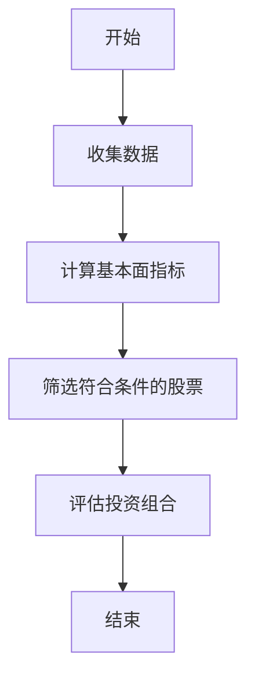
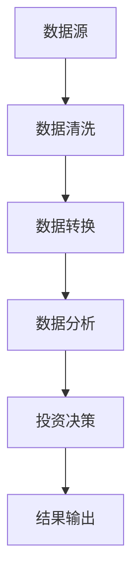

                 


# 彼得林奇的"常识投资"在复杂金融衍生品时代的重要性

> 关键词：常识投资、彼得林奇、金融衍生品、量化投资、投资策略

> 摘要：本文探讨了彼得林奇的常识投资理念在当今复杂金融环境中的重要性，分析了其在金融衍生品时代的适用性，并通过算法和系统设计展示了如何在现代投资中应用这些策略。文章从背景介绍、核心概念、算法原理、系统架构到项目实战，全面解析了常识投资的现代应用。

---

## 第一部分: 彼得林奇的"常识投资"概述

### 第1章: 彼得林奇的常识投资理念

#### 1.1 常识投资的核心概念

##### 1.1.1 什么是常识投资
常识投资是一种基于基本面分析和长期价值投资的投资策略。彼得林奇以其独特的选股方法闻名，强调对企业基本面的深入研究，寻找具有持续增长潜力的公司。这种方法的核心在于“常识”，即通过分析企业的财务状况、行业地位和管理层能力，做出明智的投资决策。

##### 1.1.2 彼得林奇的贡献
彼得林奇是投资界的传奇，他管理的麦哲伦基金在任职期间取得了卓越的业绩。他提出的常识投资理念影响了无数投资者，强调长期持有优质股票，避免短期市场波动的干扰。

##### 1.1.3 常识投资的基本原则
- **基本面分析**：通过研究企业的财务报表、行业地位和管理层能力，评估其长期发展潜力。
- **长期投资**：避免频繁交易，长期持有优质股票以获得复利效应。
- **分散投资**：通过投资于不同行业和公司的股票，降低投资风险。

##### 1.1.4 与现代金融工具的对比
现代金融工具如金融衍生品的出现，使得投资策略更加多样化，但也增加了复杂性和风险。常识投资在面对衍生品时，需要结合其基本原理，审慎评估其对投资组合的影响。

#### 1.2 常识投资与复杂金融环境

##### 1.2.1 金融衍生品的复杂性
金融衍生品如期权、期货和掉期合约，其复杂性在于它们的定价依赖于复杂的数学模型，且具有杠杆效应，可能导致高额收益或损失。这些工具的使用需要深入的理解和风险管理能力。

##### 1.2.2 常识投资在复杂环境中的适用性
尽管金融衍生品增加了市场的复杂性，但常识投资的基本原则仍然适用。通过基本面分析，投资者可以识别具有长期增长潜力的公司，并利用衍生品作为对冲或放大收益的工具。

##### 1.2.3 常识投资与现代金融工具的结合
常识投资可以通过结合现代金融工具，如期权和期货，来增强投资组合的收益或降低风险。例如，使用期权作为对冲工具，可以在市场下跌时保护投资组合的价值。

---

### 第2章: 常识投资的核心概念与原理

#### 2.1 常识投资的核心要素

##### 2.1.1 基本面分析
基本面分析是常识投资的核心，涉及对企业财务状况、行业地位和管理层能力的深入研究。例如，分析企业的收入增长、利润率、资产负债表和现金流等指标，以评估其长期发展潜力。

##### 2.1.2 长期投资策略
长期投资策略强调持有优质股票，避免频繁交易。通过复利效应，投资者可以最大化收益，同时降低交易成本和税务负担。

##### 2.1.3 分散投资原则
分散投资是降低风险的有效方法。通过投资于不同行业和公司的股票，投资者可以减少单一投资带来的风险，同时保持投资组合的稳定性。

#### 2.2 常识投资与现代金融工具的对比

##### 2.2.1 传统投资策略
传统投资策略主要依赖于基本面分析和长期持有，但缺乏对复杂金融工具的适应性。在面对金融衍生品时，传统策略可能显得不够灵活。

##### 2.2.2 现代量化投资策略
量化投资策略依赖于数学模型和算法，通过大量数据分析寻找投资机会。这种方法在处理复杂金融工具时具有优势，但可能忽视企业的基本面因素。

##### 2.2.3 常识投资的优势与局限性
- **优势**：常识投资注重企业的长期基本面，能够识别具有持续增长潜力的公司。这种方法在市场波动中表现稳定。
- **局限性**：在面对复杂金融工具时，常识投资可能显得不够灵活，需要结合现代工具进行优化。

---

### 第3章: 常识投资在复杂金融环境中的应用

#### 3.1 金融衍生品的复杂性分析

##### 3.1.1 金融衍生品的基本类型
金融衍生品包括期权、期货、掉期和认沽权证等。每种工具都有其独特的定价模型和风险特征，增加了投资的复杂性。

##### 3.1.2 金融衍生品的风险特征
衍生品的价格波动性大，且具有杠杆效应，可能导致高额收益或损失。因此，风险管理是使用衍生品的关键。

##### 3.1.3 金融衍生品对投资策略的影响
衍生品的引入丰富了投资策略，但也增加了对投资者知识和技能的要求。投资者需要理解衍生品的运作机制，并合理评估其对投资组合的影响。

#### 3.2 常识投资在衍生品中的应用策略

##### 3.2.1 基于基本面的衍生品投资
通过基本面分析，投资者可以识别具有长期增长潜力的公司，并利用衍生品工具进行投资。例如，购买认股权证以获得潜在收益，同时降低初始投资成本。

##### 3.2.2 衍生品作为风险管理工具
衍生品可以用于对冲投资组合的风险。例如，使用期货对冲汇率风险，或用期权保护投资组合免受市场下跌的影响。

##### 3.2.3 衍生品在资产配置中的作用
衍生品可以作为资产配置的补充工具，帮助投资者优化投资组合的收益和风险。例如，通过投资衍生品，投资者可以增加对特定资产的敞口，而不必持有大量头寸。

---

### 第4章: 常识投资的算法与量化分析

#### 4.1 算法原理

##### 4.1.1 基于基本面的量化分析
通过量化分析，投资者可以将基本面因素转化为可量化的指标。例如，使用市盈率、市净率和股息率等指标进行选股。

##### 4.1.2 算法流程图
以下是基于基本面的量化分析流程图：



##### 4.1.3 数学模型和公式
以下是计算市盈率（P/E比率）的公式：

$$ P/E = \frac{\text{股价}}{\text{每股收益}} $$

##### 4.1.4 代码实现
以下是使用Python进行基本面分析的代码示例：

```python
import pandas as pd
import yfinance as yf

# 下载数据
data = yf.download(tickers='AAPL', period='5y', interval='1d')

# 计算市盈率
def calculate_pe_ratio(data):
    pe_ratio = data['Close'] / data['EPS']
    return pe_ratio

pe_ratio = calculate_pe_ratio(data)
print(pe_ratio)
```

---

### 第5章: 系统分析与架构设计方案

#### 5.1 系统功能设计

##### 5.1.1 数据收集与处理
系统需要收集股票的基本面数据，如收入、利润和现金流，并进行清洗和转换。

##### 5.1.2 系统架构设计
以下是系统的架构图：



##### 5.1.3 系统接口设计
系统需要通过API接口与数据源和交易平台连接，实现数据的实时获取和交易指令的发送。

---

### 第6章: 项目实战

#### 6.1 环境安装与配置
安装必要的库，如Pandas、NumPy和Matplotlib，以及交易平台的API接口。

#### 6.2 核心实现
通过代码实现基本面分析和投资决策。

#### 6.3 案例分析
选择一个具体的金融衍生品，如期权，分析其在投资组合中的应用。

---

### 第7章: 最佳实践、小结、注意事项和拓展阅读

#### 7.1 最佳实践
- 定期审查投资组合，评估其表现和风险。
- 结合基本面分析和量化模型，制定灵活的投资策略。
- 合理使用金融衍生品，降低投资风险。

#### 7.2 小结
本文探讨了彼得林奇的常识投资理念在复杂金融环境中的重要性，分析了其在金融衍生品时代的适用性，并通过算法和系统设计展示了如何在现代投资中应用这些策略。

#### 7.3 注意事项
- 投资者需具备足够的知识和技能，避免盲目跟风。
- 合理评估风险，制定风险管理计划。
- 定期审视投资策略，适应市场变化。

#### 7.4 拓展阅读
- 彼得林奇的书籍，如《彼得林奇的成功投资》。
- 量化投资的相关书籍和资源。

---

通过以上分析，可以看出，彼得林奇的常识投资理念在复杂金融环境下仍然具有重要的指导意义。通过结合现代金融工具和量化分析，投资者可以更好地应对市场的挑战，实现长期稳健的投资回报。

