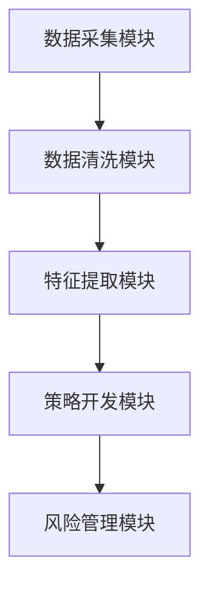

                 


# 彼得林奇的"常识投资"在算法交易盛行时代的重新定位

## 关键词：常识投资、算法交易、彼得林奇、投资策略、混合策略

## 摘要：本文探讨了彼得林奇的常识投资在算法交易盛行时代的适应与优化。通过分析算法交易的兴起及其对传统投资策略的影响，提出将常识投资与算法交易相结合的混合策略，优化投资组合，降低风险，提升收益。文章详细阐述了系统的架构设计、实现方法及实际案例，为投资者提供了新的思路。

---

### 第1章：常识投资的基本概念

#### 1.1 常识投资的定义与核心理念
- **常识投资**：基于基本面分析，长期持有的投资策略，强调对企业的深入了解和长期价值判断。
- **核心理念**：注重企业的内在价值，追求长期稳定的收益，避免短期波动的干扰。

#### 1.2 算法交易的兴起
- **算法交易**：利用数学模型和计算机程序自动执行交易策略，追求短期收益。
- **兴起背景**：技术进步、数据量增加、交易成本降低，使得算法交易成为主流。

#### 1.3 两者的关系
- **相互影响**：算法交易改变了市场结构，影响了常识投资的实施；常识投资为算法交易提供了长期价值判断的基础。

---

### 第2章：算法交易的兴起

#### 2.1 算法交易的优势
- **高效性**：快速决策和执行，抓住市场机会。
- **精准性**：基于大量数据分析，提高交易决策的准确性。
- **24/7运行**：全天候交易，捕捉更多机会。

#### 2.2 算法交易的局限性
- **依赖模型**：过度依赖数学模型，可能导致模型失效。
- **系统性风险**：算法交易可能引发市场闪崩，造成系统性风险。
- **市场操纵风险**：算法交易可能被滥用，进行市场操纵。

#### 2.3 对比分析
| 特性       | 常识投资             | 算法交易             |
|------------|----------------------|----------------------|
| 时间框架   | 长期                 | 短期                 |
| 决策依据   | 基本面分析           | 数学模型和算法       |
| 风险管理   | 侧重长期风险管理     | 侧重短期风险管理     |

---

### 第3章：算法交易对常识投资的挑战

#### 3.1 市场影响
- **流动性变化**：算法交易增加了市场的流动性，但也可能导致流动性波动。
- **波动性增加**：算法交易可能导致市场波动加剧，影响常识投资的稳定性。
- **结构变化**：高频交易改变了市场结构，影响传统投资策略的有效性。

#### 3.2 挑战分析
- **信息优势**：算法交易依赖数据和技术，常识投资的信息优势可能被削弱。
- **决策速度**：算法交易的快速决策能力对传统投资策略构成挑战。
- **交易机会**：算法交易可能减少长期投资机会，影响常识投资的收益。

---

### 第4章：混合策略的提出

#### 4.1 混合策略的概念
- **混合策略**：结合常识投资和算法交易的优点，优化投资组合。
- **优势**：结合长期价值判断和短期交易机会，降低风险，提升收益。

#### 4.2 实现方法
1. **数据整合**：结合基本面数据和市场数据，构建全面的分析框架。
2. **策略开发**：开发混合策略模型，结合基本面分析和算法交易信号。
3. **风险管理**：制定风险控制机制，平衡长期投资和短期交易的风险。

---

### 第5章：系统架构与实现

#### 5.1 系统模块划分
- **数据采集模块**：收集市场数据和公司基本面数据。
- **策略开发模块**：开发混合策略模型，结合基本面分析和算法交易信号。
- **风险管理模块**：制定风险控制机制，平衡长期投资和短期交易的风险。

#### 5.2 数据流的处理流程
1. **数据获取**：从多种数据源获取实时数据。
2. **数据清洗**：去除无效数据，确保数据质量。
3. **数据特征提取**：提取关键特征，用于策略开发。

#### 5.3 系统架构图


---

### 第6章：项目实战

#### 6.1 环境安装
- **工具安装**：安装Python、Pandas、NumPy、Plotly等工具。
- **数据源**：选择可靠的数据源，如Yahoo Finance或Quandl。

#### 6.2 核心代码实现
```python
import pandas as pd
import numpy as np

# 数据获取
data = pd.read_csv('stock_data.csv')

# 特征提取
data['SMA_20'] = data['close'].rolling(20).mean()
data['RSI'] = ta.RSI(data['close'], window=14)

# 策略开发
def strategy(signal):
    if signal['SMA_20'][i] > signal['SMA_50'][i]:
        return '买入'
    else:
        return '卖出'
```

#### 6.3 案例分析
- **案例选择**：选择一个典型股票，分析其在混合策略下的表现。
- **结果解读**：比较策略收益与基准收益，评估策略的有效性。

---

### 第7章：总结与展望

#### 7.1 总结
- **核心观点**：常识投资在算法交易时代需要结合新技术，通过混合策略优化投资组合。
- **实现方法**：结合基本面分析和算法交易，构建全面的分析框架。

#### 7.2 展望
- **未来趋势**：随着技术进步，混合策略将更加智能化和个性化。
- **挑战与机遇**：投资者需要不断学习新技术，抓住混合策略带来的新机会。

---

通过本文的分析，读者可以全面了解常识投资在算法交易时代的适应与优化，掌握混合策略的实现方法，为投资决策提供新的思路。

