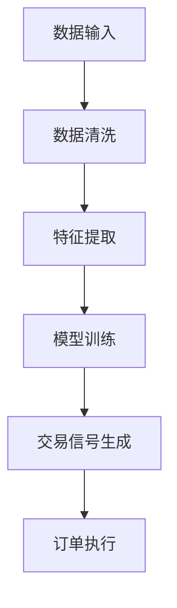
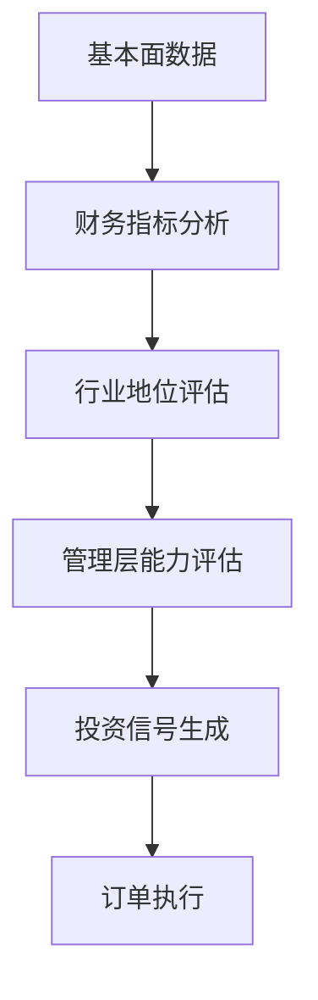

                 

# 彼得林奇的"常识投资"在算法交易盛行时代的重要性

> 关键词：彼得林奇，常识投资，算法交易，投资策略，风险管理，数学模型

> 摘要：在算法交易日益盛行的今天，彼得林奇的“常识投资”理念依然具有重要的现实意义。本文从常识投资的基本概念出发，分析算法交易的特点与挑战，探讨如何将常识投资的理念融入算法交易系统中，从而实现长期稳健的投资收益。

---

## 目录

1. [背景介绍](#背景介绍)
2. [算法交易的现状与挑战](#算法交易的现状与挑战)
3. [常识投资与算法交易的结合](#常识投资与算法交易的结合)
4. [算法交易时代下的投资机会](#算法交易时代下的投资机会)
5. [未来展望与风险管理](#未来展望与风险管理)

---

## 正文

### 1. 背景介绍

#### 1.1 常识投资的核心概念

常识投资是一种基于基本面分析的投资策略，强调通过对企业基本面的深入研究，选择具有长期增长潜力的公司进行投资。彼得林奇作为常识投资的代表人物，提出了许多实用的投资理念。

- **核心概念**：
  - 以企业基本面分析为基础，关注企业的财务状况、行业地位和管理层能力。
  - 长期投资，避免频繁交易。
  - 风险管理，分散投资以降低风险。

- **与传统投资的区别**：
  | **传统投资** | **常识投资** |
  |---------------|---------------|
  | 基于技术分析或短期市场波动 | 基于企业基本面分析 |
  | 短期交易为主 | 长期持有为主 |

#### 1.2 彼得林奇的投资理念

彼得林奇的选股标准可以用一个简单的数学模型表示：

$$
\text{投资价值} = \frac{\text{企业未来现金流}}{\text{当前市盈率}}
$$

这个模型强调了企业未来现金流的重要性，而现金流可以通过财务报表中的净利润和现金流指标来衡量。

### 2. 算法交易的现状与挑战

#### 2.1 算法交易的特点

算法交易是一种基于数学模型和算法的投资策略，通过程序自动执行交易指令。其特点包括：

- **高速性**：算法交易可以在毫秒级别完成交易决策。
- **量化性**：基于大量数据和数学模型进行决策。
- **复杂性**：涉及复杂的算法设计和优化。

#### 2.2 算法交易的核心算法

一个典型的算法交易系统可以分为以下几个步骤：

其中，特征提取和模型训练是关键步骤。特征提取通常包括技术指标（如移动平均线、相对强弱指数）和市场情绪指标。模型训练可以使用机器学习算法，如支持向量机（SVM）或随机森林（Random Forest）。

#### 2.3 算法交易的挑战

算法交易的挑战主要体现在以下几个方面：

- **数据质量问题**：高频交易需要高质量的实时数据，数据延迟或缺失会影响交易效果。
- **模型过拟合**：复杂的模型容易过拟合历史数据，导致实际交易中表现不佳。
- **市场冲击**：大额交易可能对市场产生冲击，影响交易成本。

### 3. 常识投资与算法交易的结合

#### 3.1 算法交易如何实现常识投资理念

将常识投资理念融入算法交易系统，可以通过以下步骤：

这种结合方式充分利用了算法交易的高速性和量化能力，同时保留了常识投资的长期视角。

#### 3.2 算法交易对常识投资的优化

算法交易可以通过以下方式优化常识投资：

- **自动化筛选**：利用算法快速筛选符合条件的公司。
- **实时监控**：实时监控企业的财务状况和市场变化。
- **风险管理**：通过算法动态调整投资组合，降低风险。

### 4. 算法交易时代下的投资机会

#### 4.1 算法交易与市场趋势分析

算法交易可以帮助投资者捕捉市场趋势，例如通过移动平均线和相对强弱指数的结合，预测市场的短期走势。

#### 4.2 算法交易与投资策略的结合

投资者可以通过算法交易实现以下策略：

- **套利机会**：利用市场价差进行套利。
- **趋势跟踪**：基于技术指标进行趋势跟踪交易。
- **风险对冲**：利用算法进行风险对冲。

### 5. 未来展望与风险管理

#### 5.1 未来发展趋势

未来，算法交易将更加依赖人工智能和大数据技术。例如，使用自然语言处理技术分析企业新闻和社交媒体情绪，进一步优化投资决策。

#### 5.2 风险管理

- **风险管理原则**：
  - 分散投资：避免过度集中于某一只股票或行业。
  - 设置止损：当亏损达到一定比例时，立即卖出。
  - 定期审查：定期审查投资组合，及时调整。

- **风险管理模型**：
  $$
  \text{风险价值} = \sqrt{\sum_{i=1}^{n} w_i^2 \times \text{标准差}_i^2}
  $$
  其中，\( w_i \) 是第 \( i \) 个资产的权重，\( \text{标准差}_i \) 是第 \( i \) 个资产的风险。

---

## 结语

在算法交易盛行的时代，彼得林奇的常识投资理念依然具有重要的意义。通过将常识投资与算法交易相结合，投资者可以在保持长期视角的同时，利用技术手段提高投资效率和风险管理能力。未来，随着人工智能和大数据技术的发展，常识投资与算法交易的结合将更加紧密，为投资者创造更多的价值。

---

**小结**：
- 常识投资的核心在于基本面分析，而算法交易则提供了高效执行和量化决策的手段。
- 投资者需要在两者之间找到平衡点，既保持长期视角，又利用技术手段优化投资策略。
- 风险管理是投资成功的关键，无论是传统投资还是算法交易，都需要高度重视风险管理。

**注意事项**：
- 初学者应先掌握基本面分析和风险管理的基本原理，再逐步学习算法交易的技术。
- 在实际操作中，建议结合具体市场环境和自身能力，选择合适的投资策略。

**拓展阅读**：
- 《彼得林奇的投资艺术》
- 《算法交易：数学模型与实践》

---

**End of Document**

