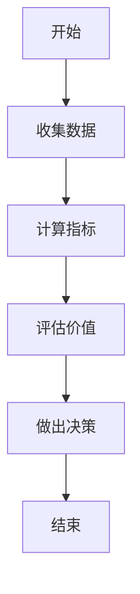
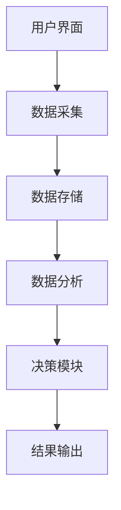

                 


# 彼得林奇的"常识投资"实践指南

> **关键词**：投资策略，彼得·林奇，常识投资，价值评估，投资组合优化，风险管理

> **摘要**：本文深入探讨了彼得·林奇的“常识投资”方法，结合系统分析与实战案例，详细阐述了投资的基本原理、价值评估模型、系统架构设计及风险控制策略。通过本文的学习，读者可以掌握如何利用常识投资理念构建稳健的投资组合，并在实际操作中优化投资决策。

---

## 第一部分：投资基础知识

### 第1章：投资入门与彼得·林奇简介

#### 1.1 投资的基本概念

投资是通过将资金投入到能够产生收益的资产或项目中，以实现财富增值的过程。投资的核心在于对风险与收益的平衡，以及对市场规律的深刻理解。以下是投资的几个关键点：

- **投资的目标**：通过配置资产实现财富增长，同时避免重大损失。
- **投资的基本原则**：分散投资、长期持有、价值发现。
- **投资的常见工具**：股票、债券、基金、房地产等。

#### 1.2 彼得·林奇的简介

彼得·林奇（Peter Lynch）是全球最著名的职业投资人之一，曾任富达投资的麦哲伦基金经理，创造了令人瞩目的投资业绩。他的投资理念以“常识投资”为核心，强调利用常识和基本面分析来选择优质企业进行投资。林奇的成功不仅在于他的投资策略，还在于他对市场的深刻理解以及对投资者心理的洞察。

---

## 第二部分：常识投资的核心概念

### 第2章：常识投资的基本原理

#### 2.1 常识投资的定义与特点

常识投资是一种基于基本面分析的投资策略，强调通过对企业基本面的深入研究，选择具有持续增长潜力的公司进行投资。其核心在于利用常识和逻辑，识别那些被市场低估的优质企业。

- **常识投资的特点**：
  - 以基本面分析为基础。
  - 强调企业质量而非市场短期波动。
  - 适合长期投资者。
  - 重视企业竞争优势和财务健康状况。

#### 2.2 投资决策的逻辑框架

常识投资的决策过程是一个系统化的过程，包括以下几个关键步骤：

1. **信息收集**：通过财务报表、行业报告、新闻等渠道，收集企业的相关信息。
2. **基本面分析**：对企业盈利能力、成长性、财务健康状况等进行分析。
3. **价值评估**：通过数学模型计算企业的内在价值。
4. **投资决策**：结合市场环境和企业情况，决定是否投资。

---

## 第三部分：投资分析的算法与数学模型

### 第3章：价值评估方法

#### 3.1 常用的价值评估指标

在常识投资中，价值评估是核心环节之一。以下是几种常用的指标：

- **市盈率（P/E）**：股票价格与每股收益的比率。
  $$ P/E = \frac{Price}{Earnings Per Share} $$
  
- **市净率（P/B）**：股票价格与每股净资产的比率。
  $$ P/B = \frac{Price}{Book Value Per Share} $$
  
- **股息率（Dividend Yield）**：股息与股票价格的比率。
  $$ Dividend Yield = \frac{Dividend}{Price} $$

#### 3.2 投资价值的数学模型

以下是一个简化的价值评估模型：

$$ \text{内在价值} = \text{未来现金流的现值} $$

假设某公司未来5年的现金流分别为CF1, CF2, CF3, CF4, CF5，贴现率为r，则内在价值为：

$$ \text{内在价值} = \frac{CF1}{(1+r)^1} + \frac{CF2}{(1+r)^2} + \frac{CF3}{(1+r)^3} + \frac{CF4}{(1+r)^4} + \frac{CF5}{(1+r)^5} $$

#### 3.3 投资决策的算法流程图



---

## 第四部分：系统分析与架构设计

### 第4章：投资决策系统的构建

#### 4.1 系统功能模块设计

- **数据采集模块**：从股票数据库、财经新闻等渠道获取数据。
- **数据分析模块**：对数据进行清洗、整理和计算指标。
- **投资决策模块**：基于模型生成投资建议。

#### 4.2 系统架构设计图



---

## 第五部分：项目实战与案例分析

### 第5章：构建你的投资组合

#### 5.1 环境配置与工具安装

- **工具安装**：安装Python、Pandas、NumPy、Matplotlib等库。
- **数据获取**：从Yahoo Finance获取股票数据。

#### 5.2 核心代码实现

以下是一个简单的价值评估代码示例：

```python
import pandas as pd
import numpy as np

# 假设data为股票数据，包含'Adj Close'列
data = pd.DataFrame({'Adj Close': [100, 105, 98, 110, 115]})

# 计算简单平均回报率
returns = data.pct_change().values
average_return = np.mean(returns)

# 计算未来现金流的现值
# 假设未来现金流为100, 110, 120，贴现率为5%
cf = [100, 110, 120]
discount_rate = 0.05
pv = sum(cf[i]/(1+discount_rate)**i for i in range(len(cf)))

print(f"Average Return: {average_return}")
print(f"Present Value: {pv}")
```

#### 5.3 实际案例分析

以某公司为例，假设其未来5年的现金流分别为100、110、120、130、140，贴现率为5%。计算其内在价值：

$$ \text{内在价值} = \frac{100}{1.05} + \frac{110}{1.05^2} + \frac{120}{1.05^3} + \frac{130}{1.05^4} + \frac{140}{1.05^5} $$

通过计算，我们可以得出该公司的内在价值，并与当前股价进行对比，从而做出投资决策。

---

## 第六部分：最佳实践与总结

### 第6章：投资策略的优化与调整

#### 6.1 小结

- 投资需要系统化的方法和长期的坚持。
- 常识投资强调基本面分析和对企业价值的深入理解。
- 通过数学模型和系统架构设计，可以提高投资决策的科学性和准确性。

#### 6.2 注意事项

- 投资有风险，需谨慎选择投资标的。
- 定期审视和调整投资组合，以应对市场变化。
- 保持对市场的敏感性和对企业的持续关注。

#### 6.3 拓展阅读

- 彼得·林奇的书籍：《彼得·林奇的股票投资策略》。
- 其他投资经典书籍：《证券分析》（Benjamin Graham）。

---

通过本文的系统分析和实战案例，读者可以深入了解彼得·林奇的“常识投资”方法，并将其应用于实际投资中。投资是一项长期的事业，需要不断学习和实践，才能在市场中实现稳健的收益。

