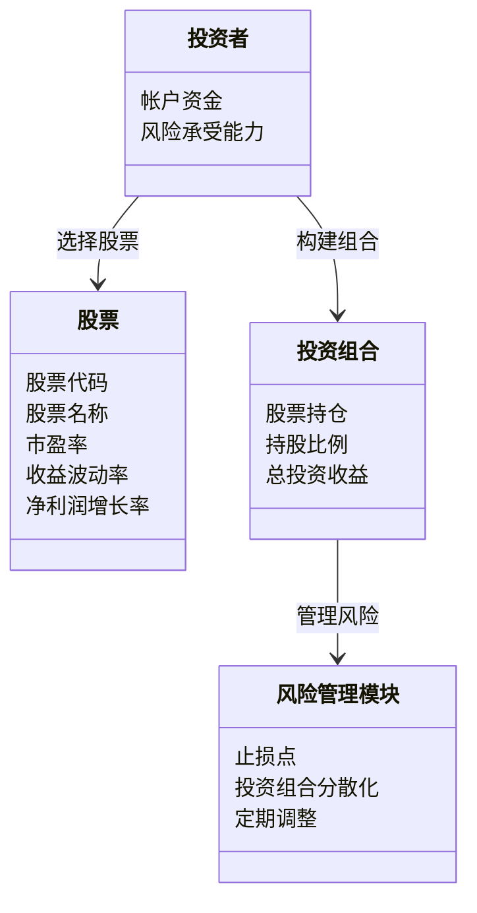
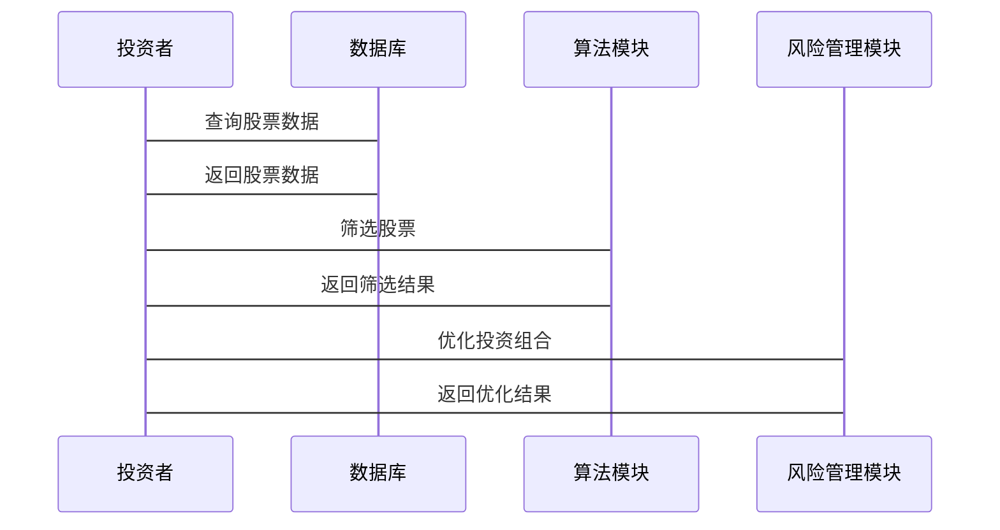

                 


# 彼得林奇的"慢牛"投资哲学

## 关键词：彼得林奇，慢牛，投资哲学，长期投资，风险管理，价值投资

## 摘要：本文系统地介绍了彼得林奇的“慢牛”投资哲学，分析了其核心概念、策略、数学模型和系统架构，通过实际案例展示了如何在实践中应用这一投资理念，并总结了最佳实践方法。

---

# 第一部分: 引言

## 1.1 彼得·林奇与“慢牛”投资哲学

### 1.1.1 彼得·林奇的背景介绍

彼得·林奇（Peter Lynch）是美国著名的投资专家，曾担任富达麦哲伦基金的经理，创造了年均29%的惊人回报率。他以独特的“慢牛”投资哲学闻名，强调长期稳定增长而非短期暴利。

### 1.1.2 “慢牛”投资哲学的提出背景

20世纪80年代，美国股市经历了剧烈波动，传统投资策略难以应对。彼得·林奇提出“慢牛”策略，注重长期稳定增长，避免短期波动。

### 1.1.3 本书的核心目标与内容框架

本书旨在系统介绍“慢牛”投资哲学，涵盖背景、核心概念、策略分析、数学模型、系统设计和实战案例。

---

## 1.2 本书的结构与学习方法

### 1.2.1 如何高效阅读本书

建议读者从引言开始，逐步深入学习，结合实际案例理解理论。

### 1.2.2 知识点之间的关联与应用

各章节内容相互关联，从概念到策略，再到数学模型，形成完整的知识体系。

### 1.2.3 学习过程中需要注意的事项

保持理性，避免盲目跟风，注重长期价值。

---

# 第二部分: “慢牛”投资哲学的背景与概念

## 2.1 投资哲学的定义与分类

### 2.1.1 投资哲学的定义

投资哲学是指导投资决策的系统化方法，包括目标、策略和原则。

### 2.1.2 主流投资哲学的分类

- **价值投资**：寻找被低估的股票。
- **成长投资**：投资于高增长公司。
- **趋势投资**：跟随市场趋势。

### 2.1.3 “慢牛”投资哲学的独特性

强调长期稳定增长，注重低波动性和高质量成长股。

---

## 2.2 “慢牛”投资哲学的核心概念

### 2.2.1 长期稳定增长的定义

通过投资优质公司，实现长期稳定的收益。

### 2.2.2 低波动性投资的特征

避免短期剧烈波动，追求稳定回报。

### 2.2.3 高质量成长股的筛选标准

选择财务健康、行业地位稳固的公司。

---

## 2.3 “慢牛”投资哲学与传统投资的区别

### 2.3.1 传统投资策略的优缺点

优点：灵活性高；缺点：风险大，波动性高。

### 2.3.2 “慢牛”投资哲学的创新点

注重长期价值，避免短期波动。

### 2.3.3 两种策略的对比分析

通过表格对比，清晰展示两者的异同：

| 特性        | 传统投资       | “慢牛”投资 |
|-------------|----------------|-------------|
| 目标         | 短期收益       | 长期稳定    |
| 波动性       | 高            | 低          |
| 风险         | 高            | 中          |
| 适合人群     | 短期投资者     | 长期投资者   |

---

# 第三部分: “慢牛”投资哲学的核心要素

## 3.1 长期稳定增长的实现路径

### 3.1.1 企业基本面分析的重要性

分析财务报表，评估公司盈利能力。

### 3.1.2 行业趋势的判断方法

研究行业发展趋势，选择朝阳行业。

### 3.1.3 股票估值的合理区间确定

使用市盈率、市净率等指标评估股票价值。

---

## 3.2 低波动性投资的策略选择

### 3.2.1 低波动性股票的特征

收益波动小，稳定性高。

### 3.2.2 如何通过技术分析筛选股票

使用移动平均线、RSI等技术指标。

### 3.2.3 风险控制的具体措施

设置止损点，分散投资。

---

## 3.3 高质量成长股的筛选标准

### 3.3.1 高质量成长股的定义

具有持续增长潜力的优质股票。

### 3.3.2 企业财务指标的分析方法

关注净利润增长率、ROE等指标。

### 3.3.3 行业地位与竞争优势的评估

分析公司在行业中的地位和竞争优势。

---

# 第四部分: “慢牛”投资哲学的策略分析

## 4.1 投资组合的构建方法

### 4.1.1 投资组合的分散化原则

避免过度集中，降低风险。

### 4.1.2 不同资产类别的配置比例

根据风险偏好分配股票、债券等资产。

### 4.1.3 定期调整投资组合的必要性

根据市场变化和公司情况调整持仓。

---

## 4.2 风险管理的策略与技巧

### 4.2.1 风险评估的具体步骤

分析市场风险、公司风险等。

### 4.2.2 如何设置止损点

根据技术分析确定止损点。

### 4.2.3 风险分散的实现方式

通过多样化投资降低风险。

---

## 4.3 投资心态的培养与调整

### 4.3.1 投资者常见的心态问题

贪婪和恐惧影响决策。

### 4.3.2 如何保持理性决策

避免情绪化，注重逻辑分析。

### 4.3.3 长期投资中的耐心与信心

坚持长期投资，相信价值终将体现。

---

# 第五部分: “慢牛”投资哲学的数学模型与算法

## 5.1 投资回报的数学模型

### 5.1.1 投资回报的计算公式

$$回报率 = \frac{最终价值 - 初始价值}{初始价值} \times 100\%$$

### 5.1.2 复利计算的原理

$$A = P(1 + r)^n$$

### 5.1.3 收益波动率的计算

$$波动率 = \sqrt{\frac{1}{n-1} \sum_{i=1}^{n} (x_i - \bar{x})^2}$$

---

## 5.2 投资组合优化的算法

### 5.2.1 风险调整后的收益最大化

使用均值-方差优化模型。

### 5.2.2 遗传算法在投资组合中的应用

通过模拟进化过程优化投资组合。

---

## 5.3 低波动性股票筛选的算法

### 5.3.1 基于波动率的排序

$$波动率排序：\text{从小到大排序股票的波动率}$$

### 5.3.2 基于财务指标的加权评分

$$评分 = 0.5 \times \text{ROE} + 0.3 \times \text{净利润增长率} + 0.2 \times \text{股息率}$$

---

## 5.4 高质量成长股筛选的算法

### 5.4.1 基于基本面指标的筛选

$$筛选条件：ROE > 15\%，净利润增长率 > 10\%$$

### 5.4.2 基于技术指标的确认

$$确认条件：股价在MA20之上，MACD线上穿零线$$

---

# 第六部分: “慢牛”投资哲学的系统分析与架构设计

## 6.1 问题场景介绍

### 6.1.1 投资者面临的挑战

市场波动、信息过载、决策疲劳。

### 6.1.2 系统设计的目标

提供一套完整的投资决策支持系统。

---

## 6.2 系统功能设计

### 6.2.1 领域模型（Mermaid 类图）



---

## 6.3 系统架构设计（Mermaid 架构图）


---

## 6.4 系统接口设计

### 6.4.1 数据接口

- **输入**：股票数据、市场数据
- **输出**：投资建议、风险评估

### 6.4.2 用户接口

- **功能**：股票筛选、投资组合管理、风险控制

---

## 6.5 系统交互设计（Mermaid 序列图）



---

# 第七部分: 项目实战

## 7.1 环境安装与配置

### 7.1.1 系统需求

- 操作系统：Windows/Mac/Linux
- 开发工具：Python、Jupyter Notebook
- 数据库：MySQL/SQLite

### 7.1.2 安装依赖

```bash
pip install pandas numpy matplotlib
```

---

## 7.2 核心实现源代码

### 7.2.1 数据获取与预处理

```python
import pandas as pd

# 获取股票数据
data = pd.read_csv('stock_data.csv')

# 数据清洗
data.dropna(inplace=True)
data = data.sort_values('date')
```

### 7.2.2 筛选算法实现

```python
def screen_stocks(data):
    # 筛选条件：ROE > 15%，净利润增长率 > 10%
    data['ROE'] = data['net_profit'] / data['total_assets']
    data['net_profit_growth'] = (data['net_profit'].pct_change() * 100).round(2)
    
    return data[(data['ROE'] > 0.15) & (data['net_profit_growth'] > 10)]
```

### 7.2.3 可视化展示

```python
import matplotlib.pyplot as plt

data['price'].plot(kind='line')
plt.title('Stock Price Trend')
plt.xlabel('Time')
plt.ylabel('Price')
plt.show()
```

---

## 7.3 实际案例分析

### 7.3.1 案例背景

选择一个行业，如科技行业，筛选符合条件的股票。

### 7.3.2 数据分析与筛选

应用上述算法，筛选出ROE > 15%且净利润增长率 > 10%的股票。

### 7.3.3 投资组合构建

根据筛选结果，构建投资组合，并定期调整。

---

## 7.4 项目小结

通过实际案例，验证“慢牛”策略的有效性，总结经验教训。

---

# 第八部分: 最佳实践与小结

## 8.1 最佳实践 tips

- **保持耐心**：长期投资需要耐心。
- **分散投资**：降低风险。
- **持续学习**：关注市场变化。

---

## 8.2 投资心态的调整

- 避免贪婪和恐惧，保持理性。
- 专注于长期价值，忽略短期波动。

---

## 8.3 未来展望

随着市场变化，不断完善“慢牛”策略，探索新的投资机会。

---

## 8.4 总结

彼得林奇的“慢牛”投资哲学是一种长期稳定的投资策略，通过精选优质股票，实现可持续的收益。投资者需结合市场环境，灵活运用这一策略，实现财富增长。

---

# 结语

通过系统学习和实践，“慢牛”投资哲学可以帮助投资者在复杂多变的市场中找到稳定的收益。希望本文能为读者提供有价值的指导和启发。

