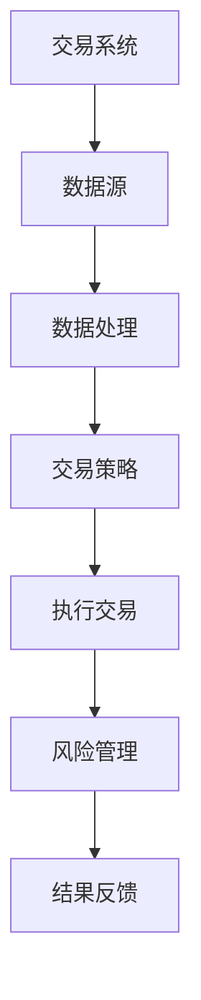

                 


# 彼得林奇的"慢牛"投资在高频交易环境中的心理建设

---

## 关键词  
- 彼得·林奇  
- 慢牛投资  
- 高频交易  
- 心理建设  
- 决策疲劳  
- 风险管理  

---

## 摘要  
本文探讨了彼得·林奇的“慢牛”投资理念在高频交易环境中的心理建设问题。高频交易的快节奏和高压力与传统投资的长期视角形成了鲜明对比，而彼得·林奇的“慢牛”理念强调长期价值和耐心投资，这在高频交易中显得尤为重要。本文从高频交易的心理挑战入手，分析了投资者如何在高频交易环境中保持长期投资的心态，提出了系统性的心理建设方案，包括心态调整、压力管理和决策优化等策略。同时，本文结合实际案例，总结了彼得·林奇理念在高频交易中的应用经验，为投资者提供了实用的心理建设指导。

---

## 第1章：高频交易与彼得·林奇的“慢牛”投资理念

### 1.1 高频交易的定义与特点  
高频交易是指通过计算机算法在极短时间内进行大量的买卖交易，其核心特点包括：  
- **自动化**：依赖算法和程序自动执行交易。  
- **高频**：交易次数极多，时间间隔极短。  
- **数据驱动**：基于实时数据和复杂模型进行决策。  

### 1.2 彼得·林奇的“慢牛”投资理念  
彼得·林奇是美国著名投资经理人，他主张寻找那些具有长期增长潜力的公司，即“慢牛”股票。其核心观点包括：  
- **长期视角**：关注企业的基本面，寻找能够持续增长的公司。  
- **耐心投资**：不追求短期收益，而是通过长期持有优质资产实现财富增长。  
- **逆向思维**：在市场恐慌时寻找机会，避免跟随市场的短期波动。  

---

## 第2章：高频交易环境中的心理挑战

### 2.1 高频交易对心理的影响  
高频交易的快节奏和高压力对投资者的心理产生了显著影响：  
- **决策疲劳**：短时间内需要做出大量决策，容易导致疲劳和错误判断。  
- **情绪波动**：市场的短期波动容易引发贪婪和恐惧情绪，影响理性决策。  
- **过度自信**：高频交易的自动化和快速反馈可能导致投资者过度自信，忽视潜在风险。  

### 2.2 投资者心理模型的构建  
在高频交易环境中，投资者需要构建适合的心理模型：  
- **心理账户**：将资金分成多个虚拟账户，避免过度集中在某一次交易中。  
- **风险预期**：建立对风险的合理预期，避免过度乐观或悲观。  
- **决策框架**：制定明确的决策框架，减少情绪化决策的影响。  

---

## 第3章：彼得·林奇理念在高频交易中的应用

### 3.1 长期投资与高频交易的结合  
高频交易可以通过以下方式结合彼得·林奇的长期投资理念：  
- **长期视角下的短期交易**：通过高频交易快速捕捉短期机会，同时保持长期投资的耐心。  
- **价值发现与高频筛选**：利用高频交易的快速性，筛选出具有长期增长潜力的股票。  

### 3.2 高频交易中的风险管理  
彼得·林奇的风险管理策略在高频交易中同样重要：  
- **分散投资**：通过分散投资降低风险，避免过度依赖单一交易策略。  
- **止损机制**：设置止损点，避免单次交易的亏损扩大。  
- **动态调整**：根据市场变化动态调整投资策略，保持灵活性。  

---

## 第4章：高频交易中的心理建设

### 4.1 心理素质的培养  
投资者在高频交易中需要培养以下心理素质：  
- **耐心与专注**：保持冷静，避免因市场的短期波动而做出冲动决策。  
- **情绪管理**：学会控制情绪，避免贪婪和恐惧影响判断。  
- **自我反思**：定期反思交易决策，总结经验教训。  

### 4.2 压力管理与决策疲劳  
在高频交易中，压力管理尤为重要：  
- **压力来源**：高频交易的高风险和快节奏容易导致压力积累。  
- **决策疲劳的应对**：通过制定严格的交易计划和自动化工具减少决策疲劳。  

---

## 第5章：系统性心理建设方案

### 5.1 心理模型的系统化构建  
- **目标设定**：明确投资目标，制定长期和短期的计划。  
- **决策框架**：建立清晰的决策流程，减少情绪化决策的影响。  
- **反馈机制**：通过交易结果的反馈，不断优化心理模型。  

### 5.2 情绪管理与决策优化  
- **情绪管理技巧**：包括冥想、运动等方法，帮助投资者保持冷静。  
- **决策优化策略**：通过数据驱动的决策和自动化工具减少人为干扰。  

---

## 第6章：实际案例分析与经验总结

### 6.1 彼得·林奇理念在高频交易中的成功案例  
- **案例背景**：某高频交易公司通过结合彼得·林奇的长期视角，成功实现了稳定收益。  
- **实施过程**：通过算法筛选长期增长潜力的股票，结合高频交易捕捉短期机会。  
- **成功经验**：保持长期视角，同时利用高频交易的快速性和数据驱动优势。  

### 6.2 案例分析与启示  
- **启示**：高频交易需要结合长期投资理念，才能实现可持续的收益。  
- **借鉴意义**：投资者应在高频交易中保持耐心和冷静，避免过度追求短期收益。  

---

## 第7章：总结与展望

### 7.1 全书总结  
- **核心观点**：高频交易需要结合彼得·林奇的“慢牛”理念，注重心理建设，保持长期投资的耐心。  
- **主要结论**：通过系统性心理建设，投资者可以在高频交易中实现长期稳定收益。  

### 7.2 对投资者的心理建议  
- **心理建设的重要性**：投资者需要认识到心理建设在高频交易中的关键作用。  
- **高频交易中的心理调节**：通过情绪管理和决策优化，减少压力和决策疲劳的影响。  
- **长期投资的耐心培养**：保持长期视角，避免被短期市场波动干扰。  

### 7.3 展望与建议  
- **未来研究方向**：结合更多的心理学研究成果，优化高频交易中的心理建设策略。  
- **技术创新**：利用人工智能和大数据技术，进一步提升高频交易的效率和准确性。  

---

## 附录：数学公式与算法原理  

### 1. 高频交易中的概率模型  
假设市场中有 $N$ 只股票，每只股票的收益服从正态分布。高频交易中，投资者需要计算每只股票的预期收益和风险，选择收益最大、风险最小的组合。数学模型如下：  
$$ E[r_i] = \mu + \beta_i (\alpha) $$  
$$ Var(r_i) = \beta_i^2 \sigma^2 $$  
其中，$\mu$ 是市场平均收益，$\alpha$ 是市场风险溢价，$\beta_i$ 是股票的贝塔系数，$\sigma$ 是市场收益的标准差。  

### 2. 决策疲劳的数学模型  
决策疲劳的累积程度可以用以下公式表示：  
$$ D = \sum_{t=1}^{T} \text{Decision Fatigue}_t $$  
其中，$D$ 是决策疲劳的累积程度，$T$ 是交易次数，$\text{Decision Fatigue}_t$ 是第 $t$ 次决策后的疲劳程度。  

---

## 附录：Python代码实现  

```python
import numpy as np
import pandas as pd

def calculate_beta(r, r_m, r_f):
    # 计算贝塔系数
    r_excess = r - r_f
    r_m_excess = r_m - r_f
    beta = np.cov(r_excess, r_m_excess)[0, 1] / np.var(r_m_excess)
    return beta

# 示例数据
returns = pd.Series([0.05, 0.03, 0.02, 0.04, 0.06])
r_f = 0.02
r_m = 0.04

beta = calculate_beta(returns, r_m, r_f)
print("贝塔系数为:", beta)
```

---

## 附录：系统架构设计  

以下是高频交易系统的简单架构图：  



---

通过以上分析和设计，本文为高频交易环境中的心理建设提供了全面的指导，帮助投资者在复杂的市场环境中保持冷静和耐心，实现长期稳定的收益。

