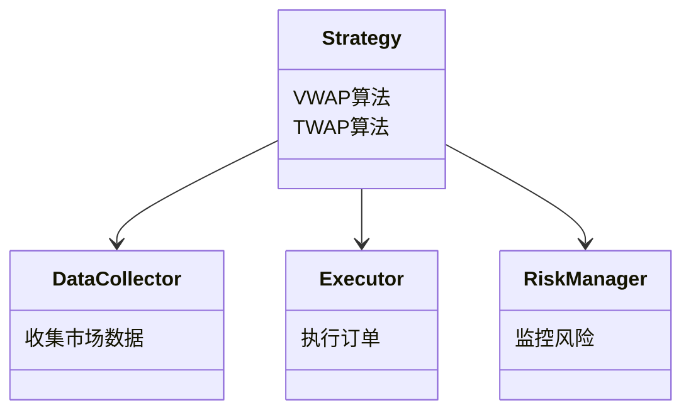

                 


# 彼得林奇的"慢牛"投资在高频交易环境中的执行策略

> 关键词：高频交易、算法交易、彼得·林奇、慢牛投资、策略执行

> 摘要：本文详细探讨了彼得·林奇的“慢牛”投资策略在高频交易环境中的执行策略。通过分析高频交易的特点、算法交易的核心概念、策略执行的数学模型与实现、系统架构设计，以及项目实战案例，本文为投资者和程序员提供了在高频交易环境中优化“慢牛”投资策略的深度见解。

---

## 第一部分: 高频交易环境下的投资策略执行

## 第1章: 高频交易与"慢牛"投资概述

### 1.1 高频交易的定义与特点

#### 1.1.1 高频交易的定义
高频交易（High-Frequency Trading, HFT）是一种依靠复杂的算法和高速计算机技术，在极短时间内进行大量交易的交易策略。其核心在于利用市场的微小价差和时间延迟，通过高频次的买卖操作获利。

#### 1.1.2 高频交易的核心特点
- **高速性**：高频交易依赖于超低延迟的网络和硬件，能够在毫秒级别完成交易决策和执行。
- **自动化**：交易策略完全由算法驱动，从数据采集、信号生成到订单执行，整个流程自动化完成。
- **短期性**：高频交易通常持有时间极短，从几秒到几分钟不等，追求短期价差的捕捉。

#### 1.1.3 高频交易与传统交易的对比
| 对比维度       | 高频交易             | 传统交易             |
|----------------|----------------------|----------------------|
| 交易频率       | 极高                 | 较低                 |
| 交易时间       | 毫秒级别             | 分钟或小时级别       |
| 交易策略       | 算法驱动             | 人为决策             |
| 市场影响       | 可能放大市场波动     | 对市场影响较小       |

### 1.2 彼得·林奇的"慢牛"投资策略

#### 1.2.1 "慢牛"投资的定义
“慢牛”投资策略是由著名投资家彼得·林奇提出的，强调选择具有长期稳定增长潜力的公司进行投资。该策略的核心在于寻找那些能够持续增长的公司，而非短期波动较大的股票。

#### 1.2.2 "慢牛"投资的核心理念
- **长期视角**：关注公司的基本面，寻找具有持续增长潜力的企业。
- **价值投资**：注重公司的内在价值，而非短期市场波动。
- **分散投资**：通过分散投资降低风险，避免过度依赖单一股票。

#### 1.2.3 "慢牛"投资与高频交易的结合点
尽管“慢牛”投资强调长期性和稳定性，但在高频交易环境中，如何将这种策略转化为可执行的算法，是一个极具挑战性的课题。高频交易的高速性和自动化特点，为“慢牛”策略的执行提供了新的可能性。

---

## 第2章: 高频交易环境下的投资策略执行

### 2.1 高频交易中的策略执行框架

#### 2.1.1 策略执行的基本流程
1. **数据采集**：从市场数据源获取实时行情数据。
2. **信号生成**：通过算法分析数据，生成买入或卖出信号。
3. **订单执行**：根据信号快速执行订单，确保在最佳时机完成交易。
4. **风险管理**：实时监控交易风险，调整策略参数。

#### 2.1.2 策略执行的关键环节
- **数据处理**：高频交易依赖于快速的数据处理能力，确保交易决策的实时性。
- **算法优化**：通过不断优化算法，提高策略的执行效率和盈利能力。
- **风险控制**：在高频交易中，风险控制尤为重要，避免因为策略失误导致的重大损失。

### 2.2 策略执行中的算法选择

#### 2.2.1 算法交易的定义与分类
算法交易（Algorithmic Trading）是通过数学模型和算法，自动执行交易策略的一种方式。其主要分类包括：
- **统计套利**：基于统计学方法寻找市场中的套利机会。
- **高频交易**：依赖高频数据和快速执行的交易策略。
- **算法选股**：通过算法筛选出具有投资价值的股票。

#### 2.2.2 高频交易中的算法应用
- **VWAP（成交量加权平均价格）算法**：通过分析市场成交量，寻找最佳买入或卖出时机。
- **TWAP（时间加权平均价格）算法**：在特定时间段内平均分配订单，降低市场冲击。

#### 2.2.3 算法选择的实践考量
- **交易目标**：根据投资目标选择合适的算法。
- **市场环境**：根据市场波动性和流动性调整算法参数。
- **交易成本**：平衡交易成本和预期收益，选择最优算法。

---

## 第3章: 高频交易中的订单执行策略

### 3.1 订单执行的基本原理

#### 3.1.1 订单类型与执行方式
- **市场订单**：以当前市场价格立即执行的订单。
- **限价订单**：以指定价格或更好价格执行的订单。
- **止损订单**：当价格触及设定止损点时自动执行的订单。

#### 3.1.2 订单簿分析与市场微观结构
订单簿（Order Book）是反映市场当前买卖订单状态的工具，高频交易算法通常通过分析订单簿的变化来捕捉市场信号。

#### 3.1.3 订单执行中的延迟优化
- **延迟优化**：通过优化网络架构和硬件配置，降低交易执行的延迟。
- **多层次订单提交**：将订单分解为多个小订单，逐步提交，降低市场冲击。

### 3.2 高频交易中的算法选择与实现

#### 3.2.1 VWAP算法实现
VWAP算法通过计算成交量加权平均价格，确定最佳交易时机。

```python
def calculate_vwap(high, low, close, volume):
    # 计算典型价格
    typical_price = (high + low + close) / 3
    # 计算 VWAP
    vwap = (typical_price * volume).cumsum() / volume.cumsum()
    return vwap
```

#### 3.2.2 TWAP算法实现
TWAP算法通过在特定时间段内平均分配订单，降低市场冲击。

```python
def calculate_twap(close_prices, window_size):
    # 计算 TWAP
    twap = close_prices.rolling(window_size).mean()
    return twap
```

---

## 第4章: 算法交易的数学模型与实现

### 4.1 算法交易的数学模型

#### 4.1.1 VWAP算法的数学表达式
$$ VWAP = \frac{\sum_{i=1}^{n} p_i \cdot v_i}{\sum_{i=1}^{n} v_i} $$

#### 4.1.2 TWAP算法的数学表达式
$$ TWAP = \frac{\sum_{i=1}^{n} p_i}{n} $$

### 4.2 算法实现的Python代码

#### 4.2.1 VWAP算法实现
```python
import pandas as pd

def calculate_vwap(data):
    # 计算典型价格
    typical_price = (data['high'] + data['low'] + data['close']) / 3
    # 计算 VWAP
    vwap = (typical_price * data['volume']).cumsum() / data['volume'].cumsum()
    return vwap
```

#### 4.2.2 TWAP算法实现
```python
import pandas as pd

def calculate_twap(data, window_size):
    # 计算 TWAP
    twap = data['close'].rolling(window_size).mean()
    return twap
```

---

## 第5章: 系统分析与架构设计方案

### 5.1 系统功能设计

#### 5.1.1 领域模型（Mermaid 类图）


#### 5.1.2 系统架构设计（Mermaid 架构图）


---

## 第6章: 项目实战

### 6.1 环境安装

#### 6.1.1 安装依赖
```bash
pip install pandas numpy matplotlib
```

#### 6.1.2 数据源获取
使用Yahoo Finance API获取股票数据。

### 6.2 系统核心实现源代码

#### 6.2.1 策略实现
```python
import pandas as pd
import numpy as np

def calculate_vwap(data):
    typical_price = (data['high'] + data['low'] + data['close']) / 3
    vwap = (typical_price * data['volume']).cumsum() / data['volume'].cumsum()
    return vwap

def calculate_twap(data, window_size):
    twap = data['close'].rolling(window_size).mean()
    return twap
```

---

## 第7章: 最佳实践与小结

### 7.1 最佳实践 tips

1. **算法优化**：高频交易算法需要不断优化，以适应市场环境的变化。
2. **风险管理**：在高频交易中，风险控制是策略执行的核心。
3. **数据质量**：高质量的数据是高频交易策略成功的关键。

### 7.2 小结

本文通过详细分析高频交易的特点、“慢牛”投资策略的核心理念，以及两者的结合点，为投资者和程序员提供了在高频交易环境中优化投资策略的深度见解。通过算法实现和系统设计的详细讲解，帮助读者更好地理解和应用这些策略。

### 7.3 注意事项

- 高频交易具有高风险，需谨慎操作。
- 算法策略需结合市场环境进行调整。
- 风险管理是高频交易成功的关键。

### 7.4 拓展阅读

- 《彼得·林奇的投资哲学》
- 《算法交易：善用数学与电脑的科学方法》
- 《高频交易：数据、模型与策略》

---

通过以上章节的详细讲解，读者可以全面理解彼得·林奇的“慢牛”投资策略在高频交易环境中的执行策略，并能够将其应用到实际的投资和交易中。

