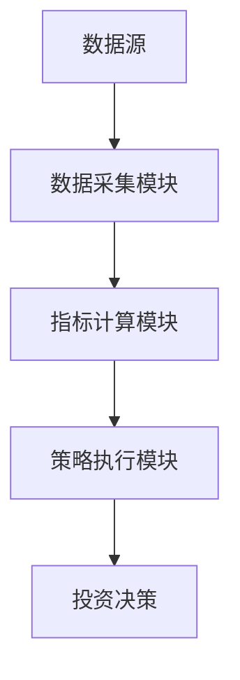

                 


---

# 彼得林奇的"慢牛"投资理念探讨

> **关键词**: 投资理念，彼得·林奇，慢牛股票，风险管理，长期投资

---

## 摘要

彼得·林奇作为全球著名的投资专家，提出了“慢牛”投资理念，强调通过长期稳定的股票增长实现财富积累。本文将从背景、核心概念、识别方法、策略制定、系统架构及实战案例等方面，详细探讨这一理念，帮助读者更好地理解和应用。

---

## 第一部分: “慢牛”投资理念的背景与核心概念

### 第1章: “慢牛”投资理念的起源与背景

#### 1.1 投资理念的演变

- **传统投资理念的局限性**: 过度追求短期收益可能导致高风险和波动性。
- **彼得·林奇的投资哲学**: 强调长期稳定增长，避免短期波动。
- **“慢牛”理念的提出背景**: 在市场波动中，寻找长期稳定的股票以实现财富增长。

#### 1.2 “慢牛”理念的核心价值

- **长期性**: 通过长期持有优质股票，获得稳定的收益。
- **稳定性**: 避免短期波动，降低投资风险。
- **可持续性**: 选择能够持续增长的企业，确保投资的长期性。

### 第2章: “慢牛”投资理念的核心概念

#### 2.1 慢牛股票的定义与特征

- **定义**: 指那些长期稳定增长，但短期内波动较小的股票。
- **特征**:
  - 收益稳定：ROE（净资产收益率）持续增长。
  - 财务健康：低负债率，高现金流。
  - 行业地位：龙头企业，具有竞争优势。

#### 2.2 投资组合构建的核心要素

- **资产配置**: 分散投资，降低风险。
- **行业分布**: 避免集中，选择不同行业的优质股票。
- **风险管理**: 设置止损点，控制仓位。

---

## 第二部分: 慢牛股票的识别与分析

### 第3章: 慢牛股票的识别方法

#### 3.1 基本面分析的关键指标

- **收益稳定性**: 检查过去5年的ROE是否稳定增长。
- **财务健康状况**: 分析资产负债表，确保低负债率和高现金流。
- **行业地位**: 评估公司在行业内的排名和竞争优势。

#### 3.2 技术面分析的要点

- **长期趋势**: 观察股票价格的长期走势是否呈上升趋势。
- **支撑位与阻力位**: 识别价格的支撑位和阻力位，判断买卖时机。
- **交易量**: 通过交易量的变化，判断价格走势的强弱。

### 第4章: 慢牛股票的投资策略

#### 4.1 分阶段投资策略

- **初期建仓阶段**: 小额买入，逐步加仓。
- **中期持股阶段**: 长期持有，避免频繁交易。
- **后期优化阶段**: 定期调整持仓，优化收益。

#### 4.2 风险管理的核心原则

- **风险分散**: 通过投资不同行业和公司的股票，降低风险。
- **仓位控制**: 避免过度集中，控制仓位在合理范围内。
- **止损机制**: 设置止损点，防止亏损过大。

---

## 第三部分: 慢牛理念的系统分析与架构设计

### 第5章: 系统分析与架构设计方案

#### 5.1 系统功能设计

- **数据采集模块**: 收集股票的历史数据，包括价格、成交量等。
- **指标计算模块**: 计算ROE、市盈率等关键指标。
- **策略执行模块**: 根据指标结果，执行买入或卖出操作。

#### 5.2 系统架构设计



---

## 第四部分: 项目实战与案例分析

### 第6章: 项目实战

#### 6.1 环境安装

- **工具选择**: 使用Python和相关库（如pandas、matplotlib）进行数据处理和可视化。
- **数据获取**: 通过API获取股票数据。

#### 6.2 核心代码实现

```python
import pandas as pd
import matplotlib.pyplot as plt

# 获取股票数据
data = pd.read_csv('stock_data.csv')

# 计算ROE
data['ROE'] = data['NetIncome'] / data['Equity']

# 绘制ROE趋势图
plt.plot(data['Date'], data['ROE'])
plt.title('ROE Trend')
plt.xlabel('Date')
plt.ylabel('ROE')
plt.show()
```

#### 6.3 案例分析

- **案例背景**: 选择一只慢牛股票，分析其ROE和股价走势。
- **数据分析**: 通过数据展示该股票的长期增长趋势。
- **投资决策**: 根据分析结果，制定买入和持有的策略。

---

## 第五部分: 总结与展望

### 第7章: 总结与展望

#### 7.1 核心要点回顾

- **长期性**: 稳定增长是实现财富积累的关键。
- **稳定性**: 避免短期波动，降低投资风险。
- **可持续性**: 选择优质企业，确保长期收益。

#### 7.2 未来展望

- **技术进步**: 利用大数据和人工智能优化投资决策。
- **市场变化**: 随着市场的变化，不断调整投资策略。
- **风险管理**: 提高风险管理能力，确保投资安全。

---

## 第六部分: 最佳实践 tips

### 6.1 投资理念 tips

- **长期持有**: 避免频繁交易，降低交易成本。
- **分散投资**: 通过投资不同行业的股票，降低风险。
- **定期调整**: 定期审视持仓，优化投资组合。

### 6.2 风险管理 tips

- **设置止损**: 防止亏损过大，保护投资本金。
- **控制仓位**: 避免过度集中，保持合理仓位。
- **关注财务报表**: 定期分析公司财务状况，及时调整投资策略。

### 6.3 持续学习 tips

- **阅读经典书籍**: 如《彼得·林奇的投资哲学》。
- **关注市场动态**: 通过新闻和报告了解市场变化。
- **交流与分享**: 与投资社群交流，获取更多见解。

---

## 第七部分: 结语

彼得·林奇的“慢牛”投资理念强调了长期稳定增长的重要性，通过选择优质的慢牛股票，投资者可以在市场波动中实现财富的稳步增长。本文通过系统分析和实战案例，详细探讨了这一理念的实现方法和注意事项，希望对读者有所帮助。

---

**注**: 如果需要更详细的内容或具体代码实现，请告诉我，我将为您提供更多支持！

