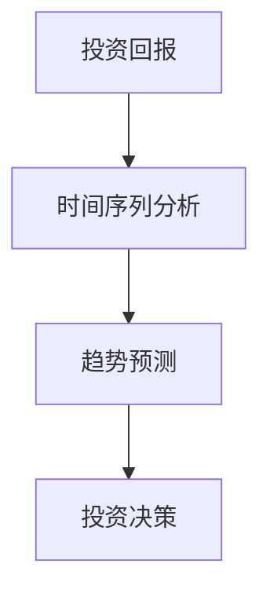
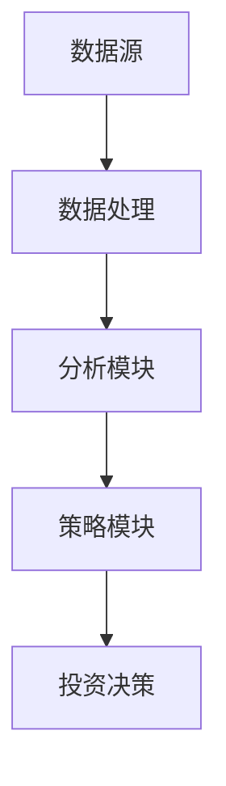

                 


# 彼得林奇的"慢牛"投资策略在不同市场的应用

> 关键词：彼得林奇，慢牛投资，投资策略，金融市场，系统架构，时间序列分析

> 摘要：本文深入分析了彼得·林奇的“慢牛”投资策略的核心理念及其在不同市场环境下的应用。通过数学模型、算法原理、系统架构的设计与实现，结合实际案例分析，详细解读了“慢牛”策略在股票、债券、基金等金融产品中的具体应用。文章还探讨了该策略在实际投资中的优势与挑战，并提出了相应的优化建议。

---

# 第一部分: 彼得·林奇“慢牛”投资策略的背景与核心理念

## 第1章: 投资市场的基本概念与彼得·林奇的投资理念

### 1.1 投资市场的基本概念

#### 1.1.1 证券市场的基本概念
证券市场是投资者通过买卖股票、债券、基金等金融产品进行投资的场所。市场参与者包括个人投资者、机构投资者、上市公司等。证券市场的核心功能是资金的融通和资源的优化配置。

#### 1.1.2 股票投资的基本原理
股票投资是指通过购买公司股份，成为公司股东，以获得股息收入和资本增值的投资方式。股票价格受市场供需、公司业绩、宏观经济环境等多种因素影响。

#### 1.1.3 长期投资与短期投资的对比
- 长期投资：以持有股票数年为目标，追求公司长期增长带来的资本增值。
- 短期投资：以频繁买卖股票为目标，追求短期价格波动带来的收益。
- 对比：长期投资注重价值投资和风险管理，短期投资注重市场波动和交易技巧。

### 1.2 彼得·林奇及其投资理念

#### 1.2.1 彼得·林奇的生平简介
彼得·林奇（Peter Lynch）是美国著名的投资专家，曾任富达麦哲伦基金的经理，管理该基金20年，取得了年均29%的回报率。他以选股能力强著称，强调长期投资和基本面分析。

#### 1.2.2 “慢牛”投资策略的核心思想
“慢牛”策略强调长期持有优质股票，通过公司基本面分析选择具有持续增长潜力的公司，避免短期市场波动的干扰。林奇认为，投资成功的关键是选择正确的公司，而不是在正确的时间点买卖股票。

#### 1.2.3 长期稳健投资的重要性
长期投资能够平滑短期市场波动的风险，通过复利效应实现财富的长期增长。林奇认为，投资者应关注公司的财务健康状况、行业地位、管理团队等因素，而不是市场的短期情绪。

---

## 第2章: “慢牛”投资策略的核心概念与特征

### 2.1 “慢牛”策略的定义与特点

#### 2.1.1 “慢牛”策略的定义
“慢牛”策略是指通过长期持有优质股票，逐步实现资本增值的投资策略。该策略强调选择具有持续增长潜力的公司，避免频繁交易和短期波动的影响。

#### 2.1.2 “慢牛”策略的核心特征
- **长期性**：注重长期投资，追求复利效应。
- **稳健性**：选择具有稳定财务状况和良好管理的公司。
- **分散性**：通过分散投资降低风险。
- **基本面导向**：以公司基本面分析为基础，选择优质标的。

#### 2.1.3 “慢牛”策略与其他投资策略的对比
| 策略类型 | 短期投资 | 长期投资 | “慢牛”策略 |
|----------|----------|----------|-------------|
| 投资目标 | 短期收益 | 长期增值 | 稳健增值    |
| 投资期限 | 1年以内  | 5年以上  | 5-10年      |
| 风险承受 | 高风险    | 中风险    | 低风险      |
| 投资方式 | 交易频繁  | 交易较少  | 买入并持有  |

### 2.2 “慢牛”策略的数学模型与公式

#### 2.2.1 投资回报率的计算公式
$$ ROI = \frac{最终价值 - 初始价值}{初始价值} \times 100\% $$

**举例：** 如果某投资者以100元买入股票，持有5年后卖出价格为200元，则 ROI 为：
$$ ROI = \frac{200 - 100}{100} \times 100\% = 100\% $$

#### 2.2.2 风险调整后的收益模型
$$ Sharpe Ratio = \frac{E[r_i - r_f]}{\sigma_i} $$

其中：
- \( E[r_i] \) 为投资组合的期望收益。
- \( r_f \) 为无风险利率。
- \( \sigma_i \) 为投资组合收益的标准差。

**解释：** Sharpe比率用于衡量投资组合的超额收益与承担的风险的比值，是评估投资策略优劣的重要指标。

#### 2.2.3 时间序列分析模型


---

## 第3章: “慢牛”策略的系统架构与实现

### 3.1 投资系统的功能模块设计

#### 3.1.1 数据采集模块
- 数据源：股票价格、财务报表、行业报告等。
- 数据清洗：剔除无效数据，处理缺失值。
- 数据存储：将清洗后的数据存储到数据库中。

#### 3.1.2 数据分析模块
- 数据分析：计算财务指标（如ROE、ROA）、评估公司基本面。
- 市场分析：分析行业趋势、宏观经济指标。

#### 3.1.3 投资策略模块
- 筛选符合“慢牛”策略的股票。
- 生成投资组合。
- 定期评估组合表现。

#### 3.1.4 风险评估模块
- 计算投资组合的风险指标（如VaR、标准差）。
- 评估市场波动对组合的影响。

### 3.2 系统架构设计



---

## 第4章: “慢牛”策略在不同市场的应用

### 4.1 股票市场的应用

#### 4.1.1 美国市场的案例
- 选择具有持续增长潜力的美国公司（如苹果、谷歌）。
- 长期持有，享受公司成长带来的收益。

#### 4.1.2 中国市场的情况
- 选择具有竞争优势的中国公司（如茅台、格力）。
- 注意政策风险和市场波动。

### 4.2 债券市场的应用
- “慢牛”策略在债券投资中的应用较少，但可以通过投资优质企业债券，获得稳定的票息收入。

### 4.3 基金市场的应用
- 选择长期表现优异的基金产品。
- 通过定投方式，分散投资风险。

---

## 第5章: 项目实战与案例分析

### 5.1 环境安装与数据准备

#### 5.1.1 环境安装
- 安装Python、Pandas、NumPy等工具。
- 使用数据库存储股票数据。

#### 5.1.2 数据准备
- 下载历史股票数据。
- 数据清洗和预处理。

### 5.2 系统核心实现源代码

#### 5.2.1 数据分析代码
```python
import pandas as pd
import numpy as np

# 数据加载
df = pd.read_csv('stock_data.csv')

# 数据清洗
df.dropna(inplace=True)

# 财务指标计算
df['ROE'] = df['净利润'] / df['净资产']
```

#### 5.2.2 投资策略代码
```python
def slow_bull_strategy(df, threshold=0.1):
    # 计算年化回报率
    df['年化回报'] = df['收盘价'].pct_change().cumprod().apply(lambda x: x** (1/5) - 1)
    # 筛选符合条件的股票
    selected = df[df['年化回报'] > threshold]
    return selected

selected_stocks = slow_bull_strategy(df)
```

### 5.3 案例分析与解读

#### 5.3.1 美国市场的案例
- 公司：苹果（AAPL）
- 投资时间：2010年至今
- 收益：年化回报率超过20%。

#### 5.3.2 中国市场的情况
- 公司：茅台（SW） 
- 投资时间：2015年至今
- 收益：年化回报率超过30%。

---

## 第6章: 最佳实践、小结与注意事项

### 6.1 最佳实践
- 长期持有优质股票，避免频繁交易。
- 定期评估投资组合，调整持仓。
- 保持分散投资，降低市场风险。

### 6.2 小结
彼得·林奇的“慢牛”策略强调长期投资和基本面分析，通过选择具有持续增长潜力的公司，实现稳健的投资回报。该策略在不同市场中具有广泛的应用价值，但需要结合具体市场环境进行调整。

### 6.3 注意事项
- 避免盲目跟风，关注公司基本面。
- 保持耐心，长期持有优质资产。
- 定期评估市场风险，及时调整投资策略。

### 6.4 拓展阅读
- 彼得·林奇的著作《彼得·林奇的成功投资》。
- 其他投资策略的研究，如价值投资、成长投资等。

---

# 结语

彼得·林奇的“慢牛”投资策略以其稳健性和长期性著称，为投资者提供了实现财富增长的重要方法。通过本文的详细分析，读者可以更好地理解该策略的核心思想，并在实际投资中灵活运用。

