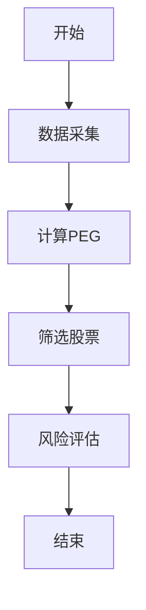
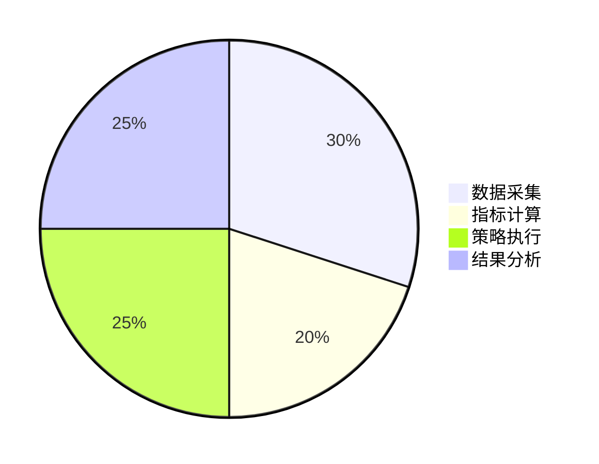

                 


# 彼得林奇的"成长型价值股"在不同市场规模中的表现

## 关键词：彼得林奇、成长型价值股、股票投资、市场规模、投资策略

## 摘要：本文探讨彼得林奇的成长型价值股策略在不同市场规模中的表现，分析其在小盘股、中盘股和大盘股中的应用，通过算法原理、数学模型和系统设计，结合实际案例，深入解析该策略的有效性和挑战。

---

# 第一部分：背景与概述

## 第1章：彼得林奇的成长型价值股概述

### 1.1 投资哲学与成长型投资的核心思想

彼得·林奇是美国著名投资经理人，其成长型价值股策略结合了成长股和价值股的优点，寻找基本面良好、估值合理且具有持续增长潜力的公司。他强调通过深入研究公司基本面，选择那些市盈率合理、预期增长率高的股票。

### 1.2 成长型价值股的背景与演变

成长型价值股策略在20世纪80年代的美国股市中崭露头角，尤其在科技股和新兴行业公司中表现突出。随着市场的变化，该策略不断演变，结合新的经济环境和市场趋势，调整选股标准。

### 1.3 成长型价值股的特征与优势

- **特征**：市盈率适中，预期增长率高，财务状况稳健。
- **优势**：平衡了成长股的高风险和价值股的低估值，适合长期投资。

---

# 第二部分：核心概念与联系

## 第2章：成长型价值股的核心要素

### 2.1 成长型价值股的关键指标

- **市盈率（P/E）**：衡量股价与盈利的关系，合理市盈率是关键。
- **预期增长率（EGR）**：预测公司未来几年的年均增长率。
- **PEG比率**：将市盈率与预期增长率结合，判断股票估值。

### 2.2 成长型价值股与其他投资策略的对比

- **与价值股对比**：价值股侧重低市盈率，成长型价值股更注重增长率。
- **与成长股对比**：成长股可能市盈率过高，成长型价值股更注重估值合理性。
- **与红利股对比**：红利股注重股息收益，成长型价值股注重长期增长。

## 第3章：不同市场规模中的成长型价值股特征

### 3.1 小盘股的成长型价值股

- **高增长潜力**：小盘股公司通常处于成长阶段，预期增长率较高。
- **高波动性**：市场流动性较低，价格波动较大，风险较高。

### 3.2 中盘股的成长型价值股

- **平衡性**：中盘股公司在规模和增长潜力之间取得平衡，波动性较中小。
- **稳定性**：相较于小盘股，市场流动性较好，风险相对较低。

### 3.3 大盘股的成长型价值股

- **稳定性与低增长**：大盘股公司通常增长较为平稳，市盈率适中。
- **低波动性**：市场流动性高，价格波动较小，风险较低。

---

# 第三部分：算法原理

## 第4章：彼得林奇选股模型的算法原理

### 4.1 选股模型的核心步骤

1. **数据采集**：收集目标公司的财务数据，包括市盈率、预期增长率等。
2. **计算PEG比率**：通过公式计算PEG，判断股票估值。
3. **筛选股票**：选择PEG小于1且预期增长率高于行业平均水平的股票。
4. **风险评估**：分析公司财务状况和行业前景，排除高风险股票。

### 4.2 使用mermaid流程图展示选股流程



### 4.3 Python代码实现

```python
import pandas as pd

def calculate_peg(pe, expected_growth_rate):
    return pe / expected_growth_rate

data = {
    '公司': ['公司A', '公司B', '公司C'],
    '市盈率': [15, 20, 25],
    '预期增长率': [0.1, 0.15, 0.08]
}

df = pd.DataFrame(data)
df['PEG'] = df.apply(lambda x: calculate_peg(x['市盈率'], x['预期增长率']), axis=1)
print(df)
```

---

# 第四部分：数学模型

## 第5章：PEG指标的数学模型

### 5.1 PEG指标公式

$$PEG = \frac{市盈率}{预期增长率}$$

### 5.2 示例计算

假设公司A的市盈率为20，预期年增长率为15%，则：

$$PEG = \frac{20}{0.15} \approx 133.33$$

---

# 第五部分：系统分析与架构设计

## 第6章：投资分析系统设计

### 6.1 系统功能设计

- **数据采集模块**：从金融数据库获取股票数据。
- **指标计算模块**：计算PEG等指标。
- **策略执行模块**：根据模型筛选股票。
- **结果分析模块**：生成报告和可视化。

### 6.2 使用mermaid设计系统架构



---

# 第六部分：项目实战

## 第7章：实战分析与案例解读

### 7.1 安装必要的库

```bash
pip install pandas numpy
```

### 7.2 核心实现代码

```python
import pandas as pd
import numpy as np

def calculate_peg(pe, expected_growth_rate):
    return pe / expected_growth_rate

# 示例数据
data = {
    '公司': ['微软', '亚马逊', '苹果'],
    '市盈率': [15, 25, 20],
    '预期增长率': [0.12, 0.15, 0.1]
}

df = pd.DataFrame(data)
df['PEG'] = df.apply(lambda x: calculate_peg(x['市盈率'], x['预期增长率']), axis=1)
print(df)
```

### 7.3 案例分析

以微软为例，市盈率为15，预期增长率为12%，计算PEG：

$$PEG = \frac{15}{0.12} = 125$$

---

# 第七部分：总结与最佳实践

## 第8章：总结与注意事项

### 8.1 投资策略总结

- **长期投资**：成长型价值股适合长期持有，避免短期波动影响。
- **风险控制**：定期评估投资组合，分散投资降低风险。
- **持续学习**：关注市场动态，更新选股模型。

### 8.2 小结与注意事项

- **小盘股风险**：高增长伴随着高波动，需谨慎选择。
- **大盘股稳定性**：适合风险厌恶型投资者，但增长潜力有限。

### 8.3 拓展阅读

- 《彼得·林奇的成功投资》
- 《投资中最简单的事》

---

通过以上结构，文章详细探讨了彼得林奇的成长型价值股策略在不同市场规模中的表现，结合理论与实践，为投资者提供了深入的分析和实用的指导。

