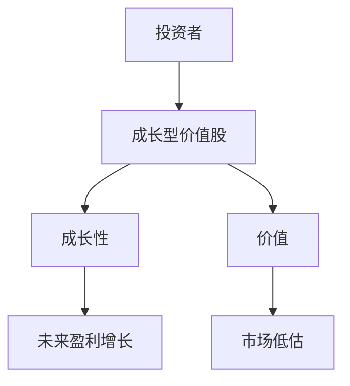
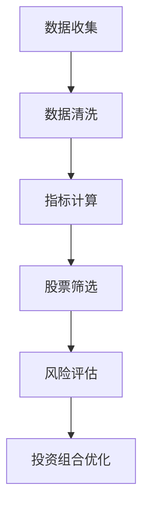

                 


# 彼得林奇的"成长型价值股"在不同行业的表现

## 关键词：
- 彼得林奇
- 成长型价值股
- 投资策略
- 股票分析
- 投资理念

## 摘要：
彼得·林奇是全球著名的投资专家，他提出的“成长型价值股”概念在投资界产生了深远影响。本文将详细分析成长型价值股的核心概念、算法原理、系统架构设计、项目实战案例以及最佳投资策略。通过结合数学模型和实际案例，深入探讨彼得林奇的投资理念在不同行业中的应用效果。

---

## 第1章：成长型价值股的背景与核心概念

### 1.1 成长型价值股的定义与背景

#### 1.1.1 成长股与价值股的结合
成长型价值股是一种结合了成长股和价值股特点的投资策略。彼得林奇认为，成长型价值股是指那些具有较高成长潜力，但市场价格被低估的股票。这种股票既不是高增长但高估值的成长股，也不是低增长但低估值的价值股，而是两者之间的平衡点。

#### 1.1.2 彼得林奇的成长型价值股理念
彼得林奇的投资理念强调基本面分析和长期持有的结合。他注重寻找那些具有稳定增长潜力，同时市场价格低于其内在价值的股票。这种理念的核心在于寻找那些被市场忽视的优质成长股。

#### 1.1.3 成长型价值股的市场定位
成长型价值股通常出现在那些具有较高增长潜力但尚未被市场充分认识到的行业中。例如，新兴科技行业、医疗行业或绿色能源行业中的某些公司，可能会符合成长型价值股的特征。

---

### 1.2 成长型价值股的背景

#### 1.2.1 彼得林奇的个人投资风格
彼得林奇以其保守而稳健的投资风格闻名。他认为，投资者应该选择那些具有稳定增长潜力且市场价格被低估的股票。他的投资策略注重长期持有，避免短期波动的干扰。

#### 1.2.2 成长型价值股的筛选标准
彼得林奇提出了一系列筛选成长型价值股的标准，包括：
- **低市盈率（P/E）**：市盈率低于行业平均水平。
- **低市净率（P/B）**：市净率低于行业平均水平。
- **高ROE（股东权益收益率）**：ROE较高，表明公司盈利能力强。
- **稳定的收入增长**：收入增长率保持在合理范围内，既不过高也不过低。
- **低债务水平**：公司债务负担较低，财务风险较小。

#### 1.2.3 成长型价值股的市场表现
成长型价值股在长期表现中通常优于市场平均水平。由于其兼具成长性和价值性，能够在市场波动中表现出较高的抗跌性，并在市场上涨时获得超额收益。

---

## 第2章：成长型价值股的核心概念

### 2.1 成长型价值股的属性特征

#### 2.1.1 市盈率（P/E）分析
市盈率是衡量股票价值的重要指标之一。彼得林奇认为，成长型价值股的市盈率应该低于行业平均水平，但又不能过低，否则可能表明市场对其前景缺乏信心。

$$ P/E = \frac{\text{股价}}{\text{每股收益}} $$

#### 2.1.2 市净率（P/B）分析
市净率是股价与每股净资产的比率。彼得林奇认为，成长型价值股的市净率应该低于行业平均水平，这表明市场对其资产价值的评估较为合理。

$$ P/B = \frac{\text{股价}}{\text{每股净资产}} $$

#### 2.1.3 股东权益收益率（ROE）分析
ROE是衡量公司盈利能力的重要指标。彼得林奇认为，成长型价值股的ROE应该较高，表明公司能够有效利用股东权益创造利润。

$$ ROE = \frac{\text{净利润}}{\text{股东权益}} $$

---

### 2.2 成长型价值股与其他类型股票的对比

#### 2.2.1 成长型价值股与防御型股票的对比
防御型股票通常来自公用事业、消费品等行业的公司，具有稳定的收入和较低的波动性。而成长型价值股则更注重未来的增长潜力，虽然波动性稍高，但潜在回报也更大。

#### 2.2.2 成长型价值股与高风险股票的对比
高风险股票通常来自新兴行业或具有高增长潜力但财务状况不稳定的公司。而成长型价值股则注重稳定增长和财务健康，风险相对较低。

#### 2.2.3 成长型价值股与红利股的对比
红利股主要是指那些股息收益率较高的股票，通常来自成熟行业中的大型公司。而成长型价值股则更注重未来的增长潜力，股息收益率可能较低。

---

### 2.3 成长型价值股的ER实体关系图



---

## 第3章：成长型价值股的算法原理

### 3.1 彼得林奇选股模型的算法流

#### 3.1.1 算法流程

1. 数据收集：收集目标行业的财务数据和市场数据。
2. 数据清洗：剔除异常数据，确保数据的准确性和完整性。
3. 指标计算：计算市盈率（P/E）、市净率（P/B）和ROE等关键指标。
4. 筛选股票：根据彼得林奇的标准筛选出符合条件的股票。
5. 风险评估：评估筛选出的股票的风险等级。
6. 投资组合优化：根据风险和收益的平衡，优化投资组合。



---

### 3.2 算法实现

#### 3.2.1 Python代码实现

```python
import pandas as pd

def calculate_pe(stock_data):
    pe = stock_data['股价'] / stock_data['每股收益']
    return pe

def calculate_pb(stock_data):
    pb = stock_data['股价'] / stock_data['每股净资产']
    return pb

def calculate_roe(stock_data):
    roe = stock_data['净利润'] / stock_data['股东权益']
    return roe

def screen_growth_value_stocks(stock_data, industry_avg_pe, industry_avg_pb):
    stock_data['pe'] = calculate_pe(stock_data)
    stock_data['pb'] = calculate_pb(stock_data)
    stock_data['ro

