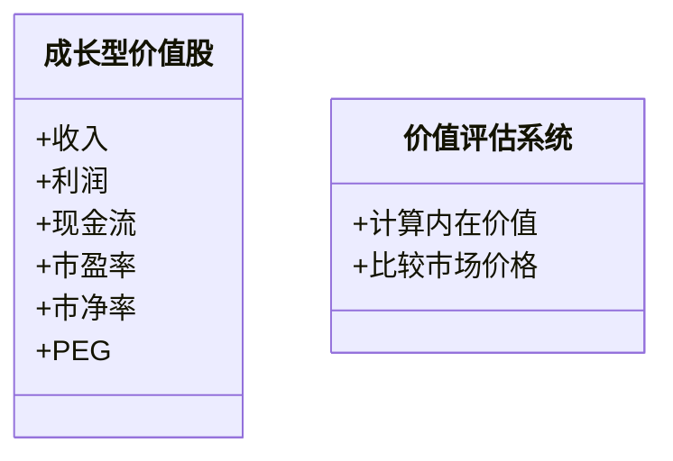
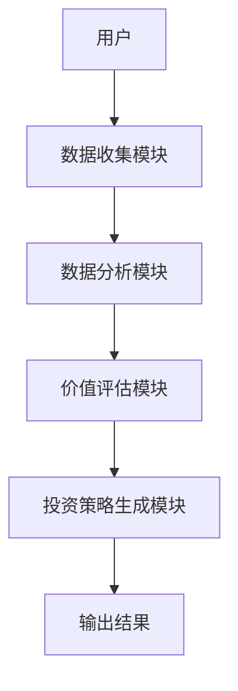

                 


# 彼得林奇的"成长型价值股"定义

> 关键词：彼得·林奇，成长型价值股，价值投资，投资策略，股票分析

> 摘要：本文深入探讨彼得·林奇提出的“成长型价值股”定义，分析其核心概念、投资策略、算法原理及系统架构，并通过实际案例展示其应用。

---

## 第一章：彼得林奇的"成长型价值股"定义背景介绍

### 1.1 成长型价值股的起源

#### 1.1.1 投资学中的成长型投资理念

成长型投资是一种长期投资策略，关注于选择那些具有持续盈利能力、良好管理团队和竞争优势的公司。彼得·林奇是成长型投资领域的代表人物之一，他提出了一种独特的“成长型价值股”概念。

#### 1.1.2 彼得·林奇的成长型价值股定义

彼得·林奇将成长型价值股定义为那些具有稳定增长潜力，且市场价格低于其内在价值的股票。这种股票不仅具备成长性，还具有一定的估值优势。

#### 1.1.3 成长型价值股的市场定位与发展

成长型价值股在市场中扮演着重要的角色，尤其是在经济周期波动中，这类股票能够为投资者提供稳定的收益和资本增值的机会。

### 1.2 成长型价值股的核心概念

#### 1.2.1 成长型价值股的定义

成长型价值股是指那些具备持续盈利能力和较高成长性，同时市场价格低于其内在价值的股票。

#### 1.2.2 成长型价值股的特点

- **收益增长性**：公司收入和利润持续增长。
- **估值合理性**：市场价格低于内在价值。
- **行业地位与发展前景**：公司在行业内具有竞争优势。

#### 1.2.3 成长型价值股与价值股、成长股的区别

| 属性         | 成长型价值股特点 | 价值股特点 | 成长股特点 |
|--------------|------------------|------------|------------|
| 收益增长率   | 高              | 中等       | 极高       |
| 估值水平     | 合理            | 较低       | 估值较高   |

---

## 第二章：成长型价值股的核心概念原理

### 2.1 成长型价值股的核心要素

#### 2.1.1 收益增长性

公司收入和利润的持续增长是成长型价值股的核心要素之一。

#### 2.1.2 估值合理性

市场价格低于内在价值是成长型价值股的重要特征。

#### 2.1.3 行业地位与发展前景

公司在行业内具有竞争优势，未来发展潜力大。

### 2.2 成长型价值股的价值评估体系

#### 2.2.1 市盈率（P/E）分析

市盈率是衡量股票价值的重要指标之一。成长型价值股通常具有合理的市盈率。

#### 2.2.2 市净率（P/B）分析

市净率是公司市值与净资产的比率，用于评估股票的估值水平。

#### 2.2.3 市盈率增长比（PEG）分析

PEG是市盈率与收益增长率的比率，用于衡量股票的估值与成长性的匹配程度。

---

## 第三章：成长型价值股的算法原理

### 3.1 彼得·林奇的价值评估模型

#### 3.1.1 计算内在价值

内在价值是基于公司未来现金流的折现值。

$$
\text{内在价值} = \frac{\text{自由现金流}}{wacc}
$$

#### 3.1.2 现金流折现法

通过现金流折现法计算公司的内在价值。

$$
\text{FCF} = \text{营业收入} - \text{资本支出}
$$

### 3.2 价值评估流程

1. **收集数据**：收入、利润、现金流等。
2. **计算关键指标**：市盈率、市净率、PEG。
3. **评估内在价值**：通过现金流折现法计算。
4. **比较市场价格与内在价值**：确定是否低估。

---

## 第四章：成长型价值股的系统分析

### 4.1 投资决策系统的工作流程

1. 数据收集：收集目标公司的财务数据。
2. 数据分析：计算关键指标。
3. 价值评估：比较市场价格与内在价值。
4. 投资策略生成：制定投资计划。

### 4.2 系统架构设计

#### 4.2.1 领域模型类图



#### 4.2.2 系统架构图



---

## 第五章：成长型价值股的项目实战

### 5.1 环境安装

安装Python和相关库（如Pandas、NumPy）。

### 5.2 核心代码实现

```python
def calculate_pe(stock):
    return stock.price / stock.net_income

def calculate_pb(stock):
    return stock.price / stock.book_value

def calculate_peg(stock):
    return calculate_pe(stock) / stock.eps_growth_rate
```

### 5.3 案例分析

以某科技公司为例，计算其市盈率、市净率和PEG，评估其是否为成长型价值股。

---

## 第六章：成长型价值股的最佳实践

### 6.1 小结

彼得·林奇的成长型价值股定义为投资者提供了一种有效的投资策略，结合了成长性和估值合理性。

### 6.2 注意事项

- 选择具有持续增长潜力的公司。
- 确保市场价格低于内在价值。
- 定期评估和调整投资组合。

### 6.3 拓展阅读

- 彼得·林奇的《股市长线法宝》
- 其他成长型投资书籍和研究

---

通过以上结构，本文全面解析了彼得·林奇的“成长型价值股”定义，从理论到实践，为投资者提供了深入的指导和实用的工具。

