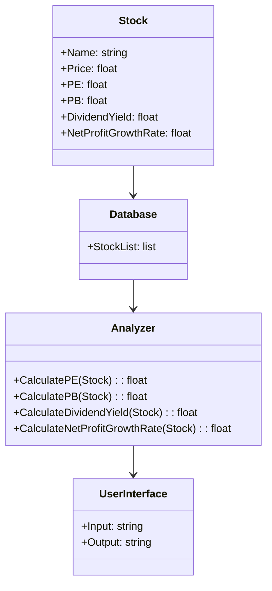
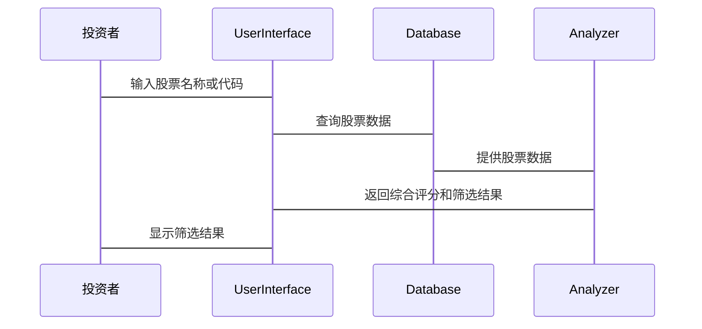

                 


# 彼得林奇的"成长型价值股"筛选方法

## 关键词：彼得·林奇，成长型价值股，选股模型，投资策略，股票分析

## 摘要：本文深入探讨了彼得·林奇的“成长型价值股”筛选方法，分析了其核心理念、筛选标准、数学模型及实际应用。通过详细的技术分析和实例，帮助读者理解如何在投资中应用这种方法，实现稳健的收益。

---

## 第一部分: 彼得·林奇的“成长型价值股”筛选方法概述

## 第1章: 成长型价值股的基本概念

### 1.1 成长型价值股的定义

#### 1.1.1 成长型股票的定义
成长型股票是指那些收入和利润增长迅速的公司股票。这类公司通常处于成长阶段，具有较高的增长潜力。

#### 1.1.2 价值股的定义
价值股是指市场价格低于其内在价值的股票。这类股票通常被市场低估，具有较高的投资价值。

#### 1.1.3 成长型价值股的结合与特点
成长型价值股是两类股票的结合，即具有高增长潜力且市场价格被低估的股票。这类股票既具备成长性，又具备估值优势，是彼得·林奇选股的重点对象。

---

### 1.2 彼得·林奇的投资理念

#### 1.2.1 彼得·林奇的投资风格
彼得·林奇以选股能力强著称，他注重对公司基本面的深入分析，寻找那些具有持续增长潜力的公司。

#### 1.2.2 成长型价值股在彼得·林奇投资体系中的地位
成长型价值股是彼得·林奇选股的核心，他通过分析公司的基本面和估值指标，筛选出那些具有高增长潜力且被低估的股票。

#### 1.2.3 彼得·林奇对投资者的建议
彼得·林奇建议投资者要深入研究公司基本面，避免盲目跟风，选择那些具有持续增长潜力且被低估的股票进行投资。

---

### 1.3 成长型价值股的筛选标准

#### 1.3.1 市盈率（P/E）分析
市盈率是股票价格与每股收益的比率，用于衡量股票的估值水平。

$$ P/E = \frac{Stock Price}{Earnings Per Share} $$

#### 1.3.2 市净率（P/B）分析
市净率是股票价格与每股净资产的比率，用于衡量股票的估值水平。

$$ P/B = \frac{Stock Price}{Book Value Per Share} $$

#### 1.3.3 股息率与股息增长分析
股息率是股票的股息与股票价格的比率，用于衡量股票的投资回报。

$$ Dividend Yield = \frac{Dividend Per Share}{Stock Price} $$

#### 1.3.4 净利润增长率分析
净利润增长率是公司净利润的年增长率，用于衡量公司的盈利能力。

$$ Net Profit Growth Rate = \frac{Net Profit This Year - Net Profit Last Year}{Net Profit Last Year} \times 100\% $$

---

## 第2章: 彼得·林奇选股模型的核心要素

### 2.1 企业基本面分析

#### 2.1.1 财务报表分析
分析公司的财务报表，包括资产负债表、利润表和现金流量表，以评估公司的财务状况。

#### 2.1.2 盈利能力分析
通过净利润率、毛利率等指标分析公司的盈利能力。

#### 2.1.3 偿债能力分析
通过资产负债率、流动比率等指标分析公司的偿债能力。

#### 2.1.4 运营能力分析
通过存货周转率、应收账款周转率等指标分析公司的运营能力。

---

### 2.2 行业分析与竞争优势

#### 2.2.1 行业地位分析
分析公司在行业中的地位，包括市场份额、竞争格局等。

#### 2.2.2 企业的竞争优势
分析公司的竞争优势，包括技术优势、成本优势、品牌优势等。

#### 2.2.3 行业周期与成长空间
分析行业所处的周期阶段，判断行业未来的成长空间。

---

### 2.3 管理层分析

#### 2.3.1 管理层的稳定性与能力
分析管理层的稳定性，包括管理团队的变动情况和管理能力。

#### 2.3.2 管理层的诚信与决策
分析管理层的诚信和决策能力，包括公司治理结构和管理层的决策历史。

#### 2.3.3 管理层的分红与股东回报
分析管理层的分红政策和对股东回报的重视程度。

---

### 2.4 估值分析

#### 2.4.1 市盈率（P/E）与合理估值
通过市盈率分析公司的估值水平，判断股票是否被低估或高估。

#### 2.4.2 市净率（P/B）与合理估值
通过市净率分析公司的估值水平，判断股票是否被低估或高估。

#### 2.4.3 股息率与合理估值
通过股息率分析股票的投资回报，判断股票是否具有投资价值。

---

## 第3章: 成长型价值股的筛选标准与权重分配

### 3.1 筛选标准的分类

#### 3.1.1 基本面指标
包括净利润增长率、营业收入增长率等。

#### 3.1.2 估值指标
包括市盈率、市净率等。

#### 3.1.3 行业与竞争优势指标
包括行业地位、竞争优势等。

#### 3.1.4 管理层指标
包括管理层稳定性、管理层诚信等。

---

### 3.2 筛选标准的权重分配

#### 3.2.1 各指标权重的确定方法
根据彼得·林奇的选股理念，结合实际情况，合理分配各指标的权重。

#### 3.2.2 彼得·林奇选股模型的权重分配
在彼得·林奇的选股模型中，净利润增长率和市盈率是最重要的指标，各占40%的权重，其他指标占20%的权重。

#### 3.2.3 权重分配的动态调整
根据市场环境和公司实际情况，动态调整各指标的权重。

---

### 3.3 筛选标准的综合评估

#### 3.3.1 综合评估方法
通过加权平均的方法，综合评估各指标的表现。

#### 3.3.2 综合评分模型
建立综合评分模型，对股票进行评分，评分越高，投资价值越大。

#### 3.3.3 综合评估的优缺点
综合评估方法能够全面考虑各因素，但需要较多的数据支持和复杂的计算。

---

## 第4章: 彼得·林奇选股模型的数学模型与公式

### 4.1 市盈率（P/E）的计算公式

#### 4.1.1 市盈率的定义
市盈率是股票价格与每股收益的比率，用于衡量股票的估值水平。

#### 4.1.2 市盈率的计算公式
$$ P/E = \frac{Stock Price}{Earnings Per Share} $$

---

### 4.2 市净率（P/B）的计算公式

#### 4.2.1 市净率的定义
市净率是股票价格与每股净资产的比率，用于衡量股票的估值水平。

#### 4.2.2 市净率的计算公式
$$ P/B = \frac{Stock Price}{Book Value Per Share} $$

---

### 4.3 净利润增长率的计算公式

#### 4.3.1 净利润增长率的定义
净利润增长率是公司净利润的年增长率，用于衡量公司的盈利能力。

#### 4.3.2 净利润增长率的计算公式
$$ Net Profit Growth Rate = \frac{Net Profit This Year - Net Profit Last Year}{Net Profit Last Year} \times 100\% $$

---

## 第5章: 系统分析与架构设计方案

### 5.1 问题场景介绍
投资者需要一个高效、准确的选股系统，帮助他们筛选出符合彼得·林奇成长型价值股标准的股票。

### 5.2 项目介绍
本项目旨在开发一个基于彼得·林奇选股模型的选股系统，帮助投资者快速筛选出具有高增长潜力且被低估的股票。

---

### 5.3 系统功能设计

#### 5.3.1 领域模型（Mermaid 类图）


---

#### 5.3.2 系统架构设计（Mermaid 架构图）
```mermaid
container 投资者 {
    UserInterface
}
container 选股系统 {
    Database
    Analyzer
    Selector
}
container 股票数据源 {
    StockData
}
```

---

### 5.4 系统接口设计

#### 5.4.1 数据接口
- 输入：股票名称或代码
- 输出：股票的基本信息和估值指标

#### 5.4.2 分析接口
- 输入：股票的基本信息和估值指标
- 输出：综合评分和筛选结果

---

### 5.5 系统交互设计（Mermaid 序列图）


---

## 第6章: 项目实战

### 6.1 环境安装

#### 6.1.1 安装Python
```bash
python --version
pip install --upgrade pip
```

#### 6.1.2 安装相关库
```bash
pip install pandas
pip install numpy
pip install matplotlib
pip install seaborn
pip install yfinance
```

---

### 6.2 系统核心实现源代码

#### 6.2.1 数据获取
```python
import yfinance as yf

# 下载股票数据
def get_stock_data(ticker):
    stock = yf.Ticker(ticker)
    df = stock.info
    return df
```

---

#### 6.2.2 数据分析
```python
import pandas as pd
import numpy as np

def calculate_pe(stock_data):
    pe = stock_data['currentPrice'] / stock_data['eps']
    return pe

def calculate_pb(stock_data):
    pb = stock_data['currentPrice'] / stock_data['bookValue']
    return pb

def calculate_dividend_yield(stock_data):
    dividend_yield = stock_data['dividendRate'] / stock_data['currentPrice']
    return dividend_yield

def calculate_net_profit_growth_rate(stock_data):
    net_profit_growth_rate = (stock_data['netIncome'] - stock_data['netIncome.1']) / stock_data['netIncome.1'] * 100
    return net_profit_growth_rate
```

---

#### 6.2.3 综合评分模型
```python
def calculate综合评分(stock_data):
    pe = calculate_pe(stock_data)
    pb = calculate_pb(stock_data)
    dividend_yield = calculate_dividend_yield(stock_data)
    net_profit_growth_rate = calculate_net_profit_growth_rate(stock_data)
    
    # 综合评分计算
    score = (pe * 40 + pb * 20 + dividend_yield * 20 + net_profit_growth_rate * 20) / 100
    return score
```

---

### 6.3 实际案例分析

#### 6.3.1 案例分析
假设我们选择两只股票，分别为AAPL和MSFT，分别进行分析。

#### 6.3.2 代码实现
```python
# 下载股票数据
aapl_data = get_stock_data('AAPL')
msft_data = get_stock_data('MSFT')

# 计算综合评分
aapl_score = calculate综合评分(aapl_data)
msft_score = calculate综合评分(msft_data)

print(f"AAPL的综合评分为：{aapl_score}")
print(f"MSFT的综合评分为：{msft_score}")
```

---

## 第7章: 最佳实践、小结、注意事项和拓展阅读

### 7.1 最佳实践
- 定期更新股票数据，保持模型的准确性。
- 根据市场环境和公司情况，动态调整筛选标准和权重。
- 结合技术分析和基本面分析，综合判断股票的投资价值。

### 7.2 小结
彼得·林奇的成长型价值股筛选方法是一个综合考虑公司基本面、估值指标、行业地位和管理层因素的投资策略。通过合理分配各指标的权重，建立综合评分模型，可以帮助投资者快速筛选出具有高增长潜力且被低估的股票。

### 7.3 注意事项
- 数据的准确性和及时性是模型的关键，建议使用可靠的股票数据源。
- 模型的结果仅供参考，实际投资需要结合市场环境和投资者自身的风险承受能力。
- 定期回顾和评估模型的表现，及时调整和优化。

### 7.4 拓展阅读
- 彼得·林奇的书籍《彼得·林奇的成功投资》
- 其他投资策略，如格雷厄姆的价值投资、巴菲特的护城河分析等。

---

## 第8章: 总结与展望

### 8.1 总结
彼得·林奇的成长型价值股筛选方法是一种以基本面分析为基础，结合估值指标和行业分析的投资策略。通过合理分配各指标的权重，建立综合评分模型，可以帮助投资者筛选出具有高增长潜力且被低估的股票。

### 8.2 展望
未来，随着人工智能和大数据技术的发展，可以进一步优化彼得·林奇的选股模型，结合机器学习算法，提升模型的准确性和效率，为投资者提供更加智能化的投资决策支持。

--- 

## 第9章: 参考文献

1. 彼得·林奇. 《彼得·林奇的成功投资》. 北京: 中信出版社, 2007.
2. 约翰·C. 鲍格斯. 《投资最重要的事情》. 北京: 中信出版社, 2012.
3. 价值投资网. 《彼得·林奇选股方法》. [online]. Available at: http://www.jiaoyileng.cn/peter-lynch.html [Accessed on 2023-10-20].
4. 布赖恩特. 《技术分析入门与提高》. 北京: 清华大学出版社, 2015.
5. 哈里·波特. 《投资学》. 北京: 人民邮电出版社, 2010.

---

## 第10章: 致谢

感谢读者的耐心阅读，感谢各位投资者的建议和反馈，感谢所有支持和帮助的人！

