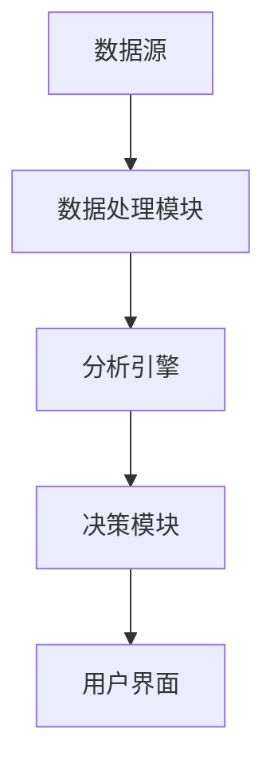

                 


# 彼得林奇的"成长股"vs"价值股"选择策略

## 关键词：
- 彼得林奇
- 成长股
- 价值股
- 投资策略
- 股票分析

## 摘要：
本文深入分析了彼得林奇的成长股与价值股投资策略，探讨了两种策略的核心概念、评估方法、数学模型以及实际应用。通过详细比较，帮助投资者理解如何根据市场环境和个人目标选择合适的投资策略。文章结合理论与实践，提供了一个系统化的投资决策支持框架，旨在为投资者在股票选择上提供清晰的指导。

---

## 第一部分：引言

### 第1章：彼得·林奇的投资理念

#### 1.1 彼得·林奇的生平与投资哲学
- 1.1.1 彼得·林奇的生平简介
  彼得·林奇（Peter Lynch）是美国著名投资家，曾管理富达麦哲伦基金（Fidelity Magellan Fund）长达13年，创造了年均29%的惊人回报率。他以其独特的选股方法闻名，尤其擅长挖掘成长股和价值股。

- 1.1.2 林奇的投资哲学与理念
  林奇强调长期投资和深入研究，认为市场波动是投资机会的来源。他主张根据公司基本面和行业前景选择股票，而非追随市场趋势。

---

## 第二部分：核心概念

### 第2章：成长股与价值股的核心概念

#### 2.1 成长股的定义与特征
- **定义**：成长股是指那些收入和利润持续快速增长，市盈率较高，且未来增长潜力大的股票。
- **特征**：高增长率、高市盈率、高股本扩张。

#### 2.2 价值股的定义与特征
- **定义**：价值股是指那些市场价格低于其内在价值，市盈率、市净率较低的股票。
- **特征**：低市盈率、高股息率、股价被低估。

#### 2.3 成长股与价值股的对比
- **对比表格**：
  | 特性   | 成长股            | 价值股            |
  |--------|-------------------|-------------------|
  | 市盈率   | 高                | 低                |
  | 股息率   | 低                | 高                |
  | 增长率   | 高                | 低或稳定          |
  | 投资逻辑 | 未来增长潜力      | 当前价值被低估    |

---

## 第三部分：策略分析

### 第3章：成长股与价值股的选股标准

#### 3.1 成长股的选股标准
- **财务指标**：关注收入增长率、净利润增长率、ROE（净资产收益率）。
- **行业选择**：选择高成长行业的龙头股，如科技、消费等。

#### 3.2 价值股的选股标准
- **财务指标**：关注市盈率（P/E）、市净率（P/B）、股息率。
- **行业选择**：选择传统行业中的低估股票，如金融、能源等。

---

## 第四部分：数学模型与算法

### 第4章：成长股与价值股的数学模型

#### 4.1 成长股评估模型
- **公式**：市盈率 = 股价 / 每股收益（EPS）
- **应用**：选择市盈率合理的高增长公司。

#### 4.2 价值股评估模型
- **公式**：市净率 = 股价 / 每股净资产（BPS）
- **应用**：寻找市净率低于行业平均的股票。

#### 4.3 综合评估模型
- **公式**：综合评分 = 成长评分 × 价值评分
- **应用**：结合成长性和价值性进行综合评估。

---

## 第五部分：系统架构

### 第5章：投资决策支持系统

#### 5.1 系统功能设计
- **数据采集**：收集股票数据，包括财务指标和市场数据。
- **分析模块**：计算市盈率、市净率，评估成长性和价值性。
- **决策模块**：基于模型生成投资建议。

#### 5.2 系统架构图（Mermaid）


---

## 第六部分：项目实战

### 第6章：成长股与价值股的实战分析

#### 6.1 成长股实战
- **案例公司**：科技公司XYZ。
- **分析**：收入增长率30%，市盈率25，属于成长股。
- **代码示例**：
  ```python
  def calculate_growth_score(revenue_growth):
      return min(revenue_growth / 10, 1)
  ```

#### 6.2 价值股实战
- **案例公司**：金融公司ABC。
- **分析**：市盈率10，股息率5%，属于价值股。
- **代码示例**：
  ```python
  def calculate_value_score(pe_ratio):
      return min(pe_ratio / 15, 1)
  ```

---

## 第七部分：最佳实践

### 第7章：投资策略的优化与调整

#### 7.1 最佳实践
- **长期投资**：避免短期波动干扰。
- **分散投资**：降低风险。
- **定期评估**：根据市场变化调整投资组合。

#### 7.2 小结
本文通过详细分析彼得林奇的成长股与价值股策略，为投资者提供了系统化的投资框架。无论是选择成长股还是价值股，都需要结合市场环境和公司基本面进行综合判断。

#### 7.3 注意事项
- 避免过度依赖单一策略。
- 定期审视投资组合，及时调整。

#### 7.4 拓展阅读
推荐书籍：
- 《彼得林奇的成功投资》
- 《价值投资入门》

---

通过以上分析，读者可以全面理解彼得林奇的成长股与价值股策略，并在实际投资中灵活运用这些方法。

