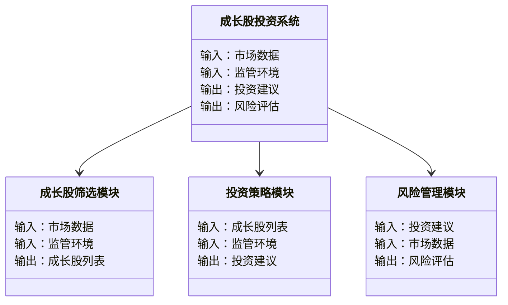

                 


# 彼得林奇的"成长股"在不同监管环境下的表现研究

## 关键词：彼得·林奇，成长股，监管环境，投资策略，风险管理，系统架构

## 摘要：本文系统地研究了彼得·林奇的成长股投资理念在不同监管环境下的表现。通过分析宽松、严格和过渡型监管环境的特点，探讨了成长股在这些环境下的投资策略、风险管理和实际表现。文章结合理论分析和实证研究，提出了在不同监管环境下优化成长股投资的策略建议，并构建了相应的系统架构以支持投资决策。

---

# 第一章 引言

## 1.1 研究背景

### 1.1.1 彼得·林奇与成长股投资理念
彼得·林奇是全球著名的投资专家，其成长股投资理念强调选择那些收入和利润持续增长的公司。成长股的核心在于其未来增长潜力，而非当前的盈利能力。林奇的投资策略以长期视角为特点，注重公司基本面分析。

### 1.1.2 不同监管环境对成长股的影响
监管环境的差异显著影响股市的运行机制和公司的经营环境。宽松监管可能促进创新，而严格监管可能导致市场波动性降低。不同监管环境下，成长股的表现可能截然不同。

### 1.1.3 研究的必要性与创新点
研究成长股在不同监管环境下的表现，有助于投资者优化投资策略，降低风险，提高收益。本文结合现代投资理论，提出在不同监管环境下优化成长股投资的策略建议。

---

# 第二章 成长股的定义与特点

## 2.1 成长股的定义

### 2.1.1 成长股的基本定义
成长股是指那些收入和利润持续增长，且增长率高于行业平均水平的公司股票。这些公司通常处于成长阶段，市场前景广阔。

### 2.1.2 成长股的核心特征
- **高增长性**：收入和利润持续增长。
- **高估值**：市盈率较高，反映市场对其未来增长的预期。
- **高风险**：波动性较大，受市场情绪影响显著。

### 2.1.3 成长股与价值股的对比
- **价值股**：低估值，高分红，注重当前收益，风险较低。
- **成长股**：高增长，高估值，注重未来潜力，风险较高。

---

# 第三章 彼得·林奇的成长股投资理念

## 3.1 林奇的成长股投资策略

### 3.1.1 成长股的选择标准
- **收入和利润增长**：选择那些过去三年收入和利润持续增长的公司。
- **行业地位**：公司应处于成长行业，并具有竞争优势。
- **管理层**：管理层能力强，注重股东利益。

### 3.1.2 成长股的投资周期
- **长期持有**：林奇倾向于长期持有优质成长股，耐心等待其成长。
- **分散投资**：避免过度集中，降低风险。

### 3.1.3 成长股的风险管理
- **风险控制**：设定止损点，避免重大损失。
- **定期评估**：定期审视投资组合，调整持仓。

---

# 第四章 监管环境的分类与影响

## 4.1 监管环境的分类

### 4.1.1 宽松监管环境
- **特点**：监管政策宽松，市场自由度高，创新能力强。
- **影响**：成长股表现较好，市场波动性较低。

### 4.1.2 严格监管环境
- **特点**：监管政策严格，市场透明度高，风险控制严格。
- **影响**：成长股表现受限制，市场波动性较高。

### 4.1.3 过渡型监管环境
- **特点**：监管政策处于调整阶段，市场不确定性较高。
- **影响**：成长股表现不稳定，市场波动性较大。

---

# 第五章 不同监管环境下成长股的表现分析

## 5.1 宽松监管环境下的成长股表现

### 5.1.1 宽松监管环境的定义与特点
- 监管政策宽松，企业创新能力强，市场流动性高。

### 5.1.2 宽松监管环境下成长股的表现
- 成长股表现优异，市场估值较高，投资者收益显著。

## 5.2 严格监管环境下的成长股表现

### 5.2.1 严格监管环境的定义与特点
- 监管政策严格，市场透明度高，企业合规性要求高。

### 5.2.2 严格监管环境下成长股的表现
- 成长股表现受限，市场估值较低，投资者收益有限。

## 5.3 过渡型监管环境下的成长股表现

### 5.3.1 过渡型监管环境的定义与特点
- 监管政策处于调整阶段，市场不确定性较高。

### 5.3.2 过渡型监管环境下成长股的表现
- 成长股表现不稳定，市场估值波动较大，投资者收益不稳定。

---

# 第六章 投资策略的调整与优化

## 6.1 不同监管环境下投资策略的调整

### 6.1.1 宽松监管环境下的投资策略
- 重点选择创新能力强、行业前景广阔的公司。
- 增加成长股配置比例，注重长期持有。

### 6.1.2 严格监管环境下的投资策略
- 选择行业龙头，注重合规性。
- 减少成长股配置比例，注重风险控制。

### 6.1.3 过渡型监管环境下的投资策略
- 保持适度分散，注重行业选择。
- 密切关注政策变化，及时调整投资组合。

## 6.2 风险管理与投资组合优化

### 6.2.1 风险识别
- 监管风险：政策变化对市场的影响。
- 市场风险：市场波动对股票估值的影响。

### 6.2.2 风险控制
- 设定止损点，避免重大损失。
- 保持分散投资，降低集中风险。

---

# 第七章 系统分析与架构设计

## 7.1 问题场景介绍
- 成长股投资决策需要结合市场数据和监管环境变化。
- 投资者需要实时监控市场动态，优化投资策略。

## 7.2 系统功能设计

### 7.2.1 领域模型（Mermaid 类图）


## 7.3 系统架构设计

### 7.3.1 系统架构（Mermaid 架构图）
```mermaid
ditto
```

---

# 第八章 结论与展望

## 8.1 研究结论
- 成长股在不同监管环境下的表现差异显著。
- 投资者需要根据监管环境调整投资策略，优化投资组合。

## 8.2 未来研究方向
- 进一步研究不同监管环境下的成长股表现。
- 探讨技术手段在成长股投资中的应用。

---

# 参考文献

（此处列出相关书籍、文献和数据来源）

---

# 致谢

（感谢在研究过程中提供帮助的机构和个人）

---

以上是《彼得林奇的"成长股"在不同监管环境下的表现研究》的完整大纲和内容框架。

