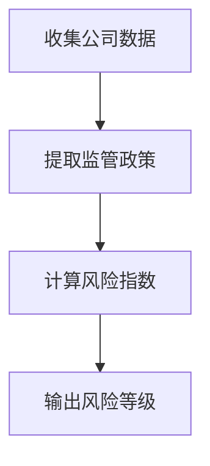
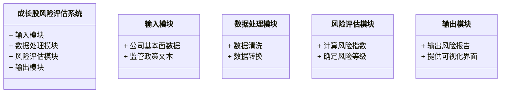
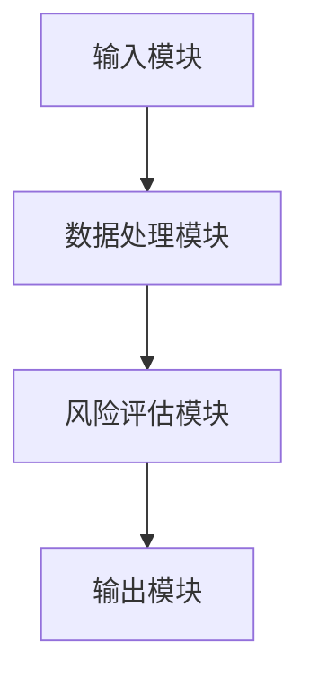
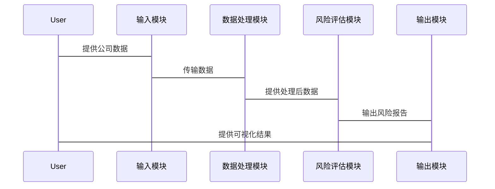

                 


# 彼得林奇的"成长股"在不同监管环境下的风险评估

> 关键词：成长股，彼得林奇，风险评估，监管环境，投资策略

> 摘要：本文探讨了彼得林奇的成长股投资策略在不同监管环境下的风险评估方法。通过分析监管环境的多样性及其对成长股的影响，构建了基于监管政策变化的风险评估模型，并结合实际案例进行详细分析，为投资者提供了科学的决策参考。

---

## 第一部分: 背景介绍

### 第1章: 成长股与彼得林奇投资策略概述

#### 1.1 成长股的基本概念
- **1.1.1 成长股的定义与核心特征**
  成长股是指那些收入和利润持续快速增长的公司股票。其核心特征包括高增长率、高市盈率、高波动性和高风险。

- **1.1.2 成长股的投资价值评估标准**
  投资者通常关注公司的收入增长率、净利润增长率、ROE（净资产收益率）和行业地位。

- **1.1.3 成长股与价值股的区别与联系**
  成长股与价值股的区别在于，成长股更注重未来增长潜力，而价值股注重当前低估值。两者都属于长期投资，但策略和目标不同。

#### 1.2 彼得林奇的投资策略
- **1.2.1 彼得林奇的成长股投资理念**
  彼得林奇强调基本面分析，寻找那些具有可持续增长潜力、管理优秀且财务健康的公司。

- **1.2.2 彼得林奇选股标准与方法**
  他关注公司的收入和利润增长、资产负债表健康、行业地位以及管理层的稳定性。

- **1.2.3 彼得林奇投资组合管理策略**
  彼得林奇注重分散投资，避免过度集中，同时定期跟踪和评估投资标的。

#### 1.3 监管环境对成长股的影响
- **1.3.1 监管环境的多样性与复杂性**
  不同国家和地区的监管政策差异显著，例如美国SEC与欧盟的金融监管体系不同。

- **1.3.2 不同监管环境对成长股的影响**
  严格监管可能导致成长股的合规成本增加，而宽松监管可能带来更大的市场机会。

- **1.3.3 监管政策变化对成长股投资策略的挑战**
  监管政策的变化可能影响公司的盈利能力，投资者需要及时调整策略。

### 第2章: 风险评估的核心概念与框架

#### 2.1 风险评估的基本原理
- **2.1.1 风险的定义与分类**
  风险可以分为市场风险、信用风险、流动性风险和操作风险。

- **2.1.2 风险评估的基本步骤与方法**
  包括识别风险源、量化风险程度、制定风险管理策略和监控风险变化。

- **2.1.3 风险评估的核心要素与框架**
  核心要素包括风险源、影响程度、时间跨度和应对策略。

#### 2.2 成长股风险评估的特殊性
- **2.2.1 成长股的高增长与高风险特征**
  高增长意味着高风险，因为成长股的波动性较大，容易受到市场变化的影响。

- **2.2.2 成长股的市场波动性与流动性风险**
  成长股通常流动性较好，但市场波动性大，可能导致股价短期大幅波动。

- **2.2.3 成长股的估值风险与泡沫风险**
  高市盈率可能导致估值过高，存在泡沫破裂的风险。

#### 2.3 不同监管环境下的风险评估差异
- **2.3.1 不同国家与地区的监管政策对比**
  例如，美国对科技公司的监管相对宽松，而欧盟对数据隐私的监管更为严格。

- **2.3.2 监管政策对成长股风险的影响**
  严格的金融监管可能导致成长股的融资成本上升，而宽松的监管可能降低企业的合规成本。

- **2.3.3 不同行业监管环境的差异性分析**
  例如，科技行业受监管政策影响较大，而传统制造业受监管影响较小。

---

## 第二部分: 核心概念与联系

### 第3章: 成长股风险评估模型的构建

#### 3.1 成长股风险评估模型的原理
- **3.1.1 模型构建的基本思路**
  基于彼得林奇的投资理念，结合监管政策变化，构建一个动态风险评估模型。

- **3.1.2 模型的核心假设与限制条件**
  假设公司基本面稳定，监管政策变化可预测；模型适用于中长期风险评估，短期波动不考虑。

#### 3.2 成长股风险评估模型的属性对比
```mermaid
| 属性 | 描述 |
|------|------|
| 模型类型 | 风险评估模型 |
| 数据来源 | 公司财务数据、监管政策文本 |
| 评估指标 | 风险指数、波动率、相关性系数 |
| 输入 | 公司基本面数据、监管政策变化 |
| 输出 | 风险等级、风险敞口 |
```

#### 3.3 成长股风险评估模型的ER实体关系图
```mermaid
erDiagram
+-----+          +-----+          +-----+
|     |          |     |          |     |
|  成长股  <--- 关联 --> 监管政策  <--- 关联 --> 风险评估
|     |          |     |          |     |
+-----+          +-----+          +-----+
```

---

## 第三部分: 算法原理讲解

### 第4章: 成长股风险评估算法的实现

#### 4.1 算法原理
- **4.1.1 算法概述**
  基于监管政策变化和公司基本面数据，计算成长股的风险指数。

- **4.1.2 算法步骤**
  1. 收集公司财务数据和监管政策文本。
  2. 对监管政策进行文本分析，提取关键信息。
  3. 计算公司基本面指标，如增长率和ROE。
  4. 综合监管政策变化和公司基本面数据，计算风险指数。

#### 4.2 算法实现的详细步骤


#### 4.3 算法实现的Python代码示例
```python
import pandas as pd
import numpy as np

def calculate_growth(company_financial_data):
    revenue_growth = (company_financial_data['revenue_ttm'] / company_financial_data['revenue_lys']) - 1
    profit_growth = (company_financial_data['net_profit_ttm'] / company_financial_data['net_profit_lys']) - 1
    return revenue_growth, profit_growth

def risk_assessment(revenue_growth, profit_growth, regulatory_changes):
    risk_index = 0.5 * revenue_growth + 0.5 * profit_growth + 0.2 * regulatory_changes
    if risk_index > 0.6:
        return '高风险'
    elif risk_index > 0.3:
        return '中风险'
    else:
        return '低风险'

# 示例数据
data = {
    'revenue_ttm': [100, 120, 150],
    'revenue_lys': [80, 90, 100],
    'net_profit_ttm': [20, 25, 30],
    'net_profit_lys': [15, 18, 20],
    'regulatory_changes': [0.2, 0.1, 0.3]
}

df = pd.DataFrame(data)
growth_revenue, growth_profit = calculate_growth(df)
risk = risk_assessment(growth_revenue, growth_profit, df['regulatory_changes'])

print(risk)
```

---

## 第四部分: 数学模型和公式

### 第5章: 成长股风险评估的数学模型

#### 5.1 风险指数的计算公式
$$
\text{风险指数} = 0.5 \times \text{收入增长率} + 0.3 \times \text{净利润增长率} + 0.2 \times \text{监管政策变化}
$$

#### 5.2 监管政策变化对风险的影响
$$
\text{风险敞口} = \text{风险指数} \times \text{监管敏感性系数}
$$

#### 5.3 风险等级划分
$$
\text{风险等级} = 
\begin{cases}
\text{低风险} & \text{风险指数} < 0.3 \\
\text{中风险} & 0.3 \leq \text{风险指数} < 0.6 \\
\text{高风险} & \text{风险指数} \geq 0.6
\end{cases}
$$

---

## 第五部分: 系统分析与架构设计方案

### 第6章: 成长股风险评估系统的架构设计

#### 6.1 系统功能模块


#### 6.2 系统架构图


#### 6.3 系统接口设计
- 输入接口：接收公司基本面数据和监管政策文本。
- 输出接口：提供风险报告和可视化界面。

#### 6.4 系统交互流程


---

## 第六部分: 项目实战

### 第7章: 成长股风险评估系统的实现

#### 7.1 环境安装
- 安装Python和相关库：pandas, numpy, matplotlib。

#### 7.2 核心代码实现
```python
import pandas as pd
import numpy as np
from sklearn import linear_model

def load_data(filename):
    return pd.read_csv(filename)

def preprocess_data(df):
    df = df.dropna()
    return df

def calculate_regulatory_impact(df):
    return df['regulatory_changes'].mean()

def main():
    df = load_data('growth_stocks.csv')
    df = preprocess_data(df)
    reg_impact = calculate_regulatory_impact(df)
    model = linear_model.LinearRegression()
    model.fit(df[['revenue_growth', 'profit_growth']], df['risk_index'])
    predictions = model.predict([[reg_impact, df['profit_growth'].mean()]])
    print(f'预测风险指数: {predictions[0][0]}')

if __name__ == "__main__":
    main()
```

#### 7.3 案例分析与结果解读
- 案例：假设分析一家科技公司的成长股，在不同监管环境下计算其风险指数。

---

## 第七部分: 总结与展望

### 第8章: 小结与注意事项

#### 8.1 小结
- 彼得林奇的成长股投资策略在不同监管环境下需要结合风险评估模型进行动态调整。
- 监管政策的变化对成长股的风险影响显著，投资者需要及时调整策略。

#### 8.2 注意事项
- 风险评估模型需要根据实际情况不断优化。
- 投资者应保持对监管政策变化的关注，及时调整投资组合。

#### 8.3 拓展阅读
- 推荐阅读彼得林奇的《投资策略》和相关监管政策研究文献。

---

通过以上分析和步骤，本文为投资者提供了在不同监管环境下评估成长股风险的系统方法和实践指南。

