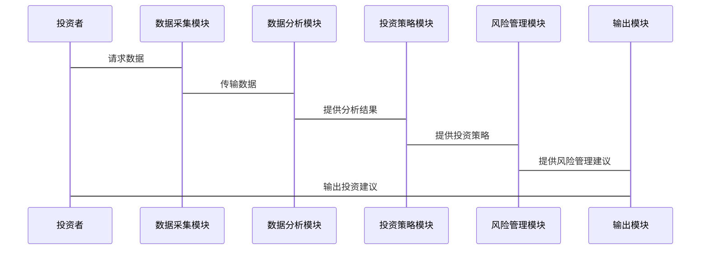

                 


# 彼得林奇的"成长股"在不同经济周期的表现

## 关键词

- 彼得林奇
- 成长股
- 经济周期
- 投资策略
- 股票分析

## 摘要

本文深入分析了彼得林奇的成长股投资理念及其在不同经济周期的表现。通过详细探讨成长股在扩张期、衰退期、萧条期和复苏期的特点，结合彼得林奇的投资策略，帮助读者理解如何在不同经济环境下选择和管理成长股投资。文章还从系统架构和项目实战的角度，提供了具体的分析工具和方法，帮助投资者更好地应用这些策略。

---

# 第一部分: 彼得林奇的"成长股"投资理念与经济周期基础

## 第1章: 成长股与经济周期概述

### 1.1 成长股的定义与特征

#### 1.1.1 成长股的定义

成长股是指那些收入和利润持续增长，并且未来增长潜力较大的公司股票。这些公司通常处于高速发展阶段，市场占有率不断提升，具有较高的成长性。

#### 1.1.2 成长股的核心特征

- **收入增长**：公司收入持续增长，且增速高于行业平均水平。
- **利润增长**：公司净利润持续增长，盈利能力较强。
- **低市盈率**：相对于未来增长潜力，当前市盈率较低。
- **高ROE**：净资产收益率较高，表明公司盈利能力强。

#### 1.1.3 成长股与价值股的对比

| 特性 | 成长股 | 价值股 |
|------|--------|--------|
| 投资逻辑 | 未来增长潜力 | 当前低估 |
| 估值方法 | 市盈率、市销率 | 市盈率、市净率 |
| 风险 | 较高 | 较低 |
| 适合周期 | 扩张期、复苏期 | 衰退期、萧条期 |

### 1.2 经济周期的基本概念

#### 1.2.1 经济周期的定义

经济周期是指经济活动的波动，通常分为扩张期、衰退期、萧条期和复苏期四个阶段。

#### 1.2.2 主要经济周期阶段

- **扩张期**：经济增长迅速，企业盈利上升。
- **衰退期**：经济增长放缓，企业盈利下降。
- **萧条期**：经济严重收缩，企业盈利大幅下降。
- **复苏期**：经济开始回升，企业盈利逐步恢复。

#### 1.2.3 经济周期对投资的影响

经济周期的变化直接影响股票市场的表现，尤其是成长股的表现更为显著。在扩张期，成长股通常表现优异；而在衰退期和萧条期，成长股可能面临较大的波动和风险。

### 1.3 彼得林奇的成长股投资理念

#### 1.3.1 彼得林奇的投资哲学

彼得林奇认为，投资成功的关键在于选择那些具有持续增长潜力的公司，并长期持有这些股票。

#### 1.3.2 成长股投资的核心思想

- **选择优质公司**：重点关注那些具有强大竞争优势的公司。
- **长期持有**：避免频繁交易，降低交易成本。
- **分散投资**：通过分散投资降低风险。

#### 1.3.3 成长股投资的边界与外延

- **边界**：避免投资于增长潜力有限的公司。
- **外延**：通过研究和分析，不断发现新的成长股机会。

### 1.4 成长股与经济周期的联系

#### 1.4.1 成长股在不同经济周期的表现

- **扩张期**：成长股表现优异，股价上涨。
- **衰退期**：成长股面临较大的下行压力。
- **萧条期**：成长股可能遭遇大幅调整。
- **复苏期**：成长股逐渐恢复增长。

#### 1.4.2 彼得林奇在不同经济周期的投资策略

- **扩张期**：积极寻找具有高增长潜力的成长股。
- **衰退期**：减少成长股的投资比例，转投防御性股票。
- **萧条期**：耐心等待市场底部，逐步布局优质成长股。
- **复苏期**：逐步增加成长股的投资比例。

---

## 第2章: 成长股在不同经济周期的表现

### 2.1 经济周期对成长股的影响

#### 2.1.1 经济周期与成长股的关系

经济周期的变化直接影响成长股的表现。在扩张期，成长股通常表现优异；在衰退期和萧条期，成长股可能面临较大的波动和风险。

#### 2.1.2 不同经济周期阶段的成长股表现

- **扩张期**：成长股表现优异，股价上涨。
- **衰退期**：成长股面临较大的下行压力。
- **萧条期**：成长股可能遭遇大幅调整。
- **复苏期**：成长股逐渐恢复增长。

#### 2.1.3 彼得林奇在不同经济周期的成长股投资策略

- **扩张期**：积极寻找具有高增长潜力的成长股。
- **衰退期**：减少成长股的投资比例，转投防御性股票。
- **萧条期**：耐心等待市场底部，逐步布局优质成长股。
- **复苏期**：逐步增加成长股的投资比例。

### 2.2 扩张期的成长股表现

#### 2.2.1 扩张期的定义与特征

扩张期是指经济快速增长，企业盈利上升的阶段。通常，此时市场情绪乐观，投资者愿意为成长股支付较高的估值。

#### 2.2.2 成长股在扩张期的表现

在扩张期，成长股通常表现优异，股价上涨。彼得林奇倾向于选择那些具有高增长潜力的公司，并长期持有。

#### 2.2.3 彼得林奇在扩张期的投资策略

- **选择高增长公司**：重点关注那些收入和利润持续增长的公司。
- **长期持有**：避免频繁交易，降低交易成本。
- **分散投资**：通过分散投资降低风险。

### 2.3 衰退期的成长股表现

#### 2.3.1 衰退期的定义与特征

衰退期是指经济增长放缓，企业盈利下降的阶段。此时，市场情绪悲观，投资者对成长股的投资意愿下降。

#### 2.3.2 成长股在衰退期的表现

在衰退期，成长股通常面临较大的下行压力。彼得林奇倾向于减少成长股的投资比例，转投防御性股票。

#### 2.3.3 彼得林奇在衰退期的投资策略

- **减少成长股投资**：降低成长股的投资比例。
- **转投防御性股票**：选择那些在经济衰退期表现较为稳定的股票。
- **保持耐心**：等待市场底部，逐步布局优质成长股。

### 2.4 萧条期的成长股表现

#### 2.4.1 萧条期的定义与特征

萧条期是指经济严重收缩，企业盈利大幅下降的阶段。此时，市场情绪极度悲观，投资者对成长股的投资意愿极低。

#### 2.4.2 成长股在萧条期的表现

在萧条期，成长股可能遭遇大幅调整。彼得林奇倾向于耐心等待市场底部，逐步布局优质成长股。

#### 2.4.3 彼得林奇在萧条期的投资策略

- **耐心等待**：等待市场底部，逐步布局优质成长股。
- **逐步建仓**：分批买入优质成长股，降低市场波动风险。
- **保持长期视角**：避免短期波动干扰长期投资策略。

### 2.5 复苏期的成长股表现

#### 2.5.1 复苏期的定义与特征

复苏期是指经济开始回升，企业盈利逐步恢复的阶段。此时，市场情绪逐渐乐观，投资者对成长股的投资意愿上升。

#### 2.5.2 成长股在复苏期的表现

在复苏期，成长股逐渐恢复增长。彼得林奇倾向于逐步增加成长股的投资比例。

#### 2.5.3 彼得林奇在复苏期的投资策略

- **逐步增加投资比例**：分批买入优质成长股，逐步增加投资比例。
- **选择优质公司**：重点关注那些具有强大竞争优势的公司。
- **长期持有**：避免频繁交易，降低交易成本。

---

## 第3章: 彼得林奇的成长股投资策略

### 3.1 成长股投资的核心策略

#### 3.1.1 选择成长股的关键指标

- **收入增长**：公司收入持续增长，且增速高于行业平均水平。
- **利润增长**：公司净利润持续增长，盈利能力较强。
- **低市盈率**：相对于未来增长潜力，当前市盈率较低。
- **高ROE**：净资产收益率较高，表明公司盈利能力强。

#### 3.1.2 成长股的估值方法

- **市盈率（P/E）**：当前股价除以每股收益。
- **市销率（P/S）**：当前股价除以每股销售额。
- **市净率（P/B）**：当前股价除以每股净资产。
- **EV/EBITDA**：企业价值与息税折旧及摊销前利润的比率。

#### 3.1.3 成长股投资的风险控制

- **分散投资**：通过分散投资降低风险。
- **止损策略**：设定止损点，避免重大亏损。
- **长期持有**：避免短期波动干扰长期投资策略。

### 3.2 不同经济周期下的投资策略调整

#### 3.2.1 扩张期的投资策略

- **积极寻找高增长公司**：重点关注那些收入和利润持续增长的公司。
- **长期持有**：避免频繁交易，降低交易成本。
- **分散投资**：通过分散投资降低风险。

#### 3.2.2 衰退期的投资策略

- **减少成长股投资**：降低成长股的投资比例。
- **转投防御性股票**：选择那些在经济衰退期表现较为稳定的股票。
- **保持耐心**：等待市场底部，逐步布局优质成长股。

#### 3.2.3 萧条期的投资策略

- **耐心等待**：等待市场底部，逐步布局优质成长股。
- **逐步建仓**：分批买入优质成长股，降低市场波动风险。
- **保持长期视角**：避免短期波动干扰长期投资策略。

#### 3.2.4 复苏期的投资策略

- **逐步增加投资比例**：分批买入优质成长股，逐步增加投资比例。
- **选择优质公司**：重点关注那些具有强大竞争优势的公司。
- **长期持有**：避免频繁交易，降低交易成本。

---

## 第4章: 成长股投资的系统分析与架构设计

### 4.1 投资系统的需求分析

#### 4.1.1 问题场景介绍

- **问题**：如何在不同经济周期中，选择和管理成长股投资。
- **目标**：开发一个基于彼得林奇投资理念的系统，帮助投资者在不同经济周期中选择和管理成长股投资。

#### 4.1.2 项目介绍

- **项目名称**：彼得林奇成长股投资系统
- **项目目标**：实现彼得林奇的成长股投资策略，帮助投资者在不同经济周期中选择和管理成长股投资。
- **项目范围**：涵盖扩张期、衰退期、萧条期和复苏期四种经济周期。

#### 4.1.3 系统功能设计

- **数据采集**：采集股票数据，包括收入、利润、市盈率等指标。
- **数据分析**：分析股票数据，识别成长股。
- **投资策略**：根据经济周期，制定投资策略。
- **风险管理**：控制投资风险，确保投资安全。

#### 4.1.4 领域模型


### 4.2 系统架构设计

#### 4.2.1 系统架构图

```mermaid
container 成长股投资系统 {
    投资者
    数据采集模块
    数据分析模块
    投资策略模块
    风险管理模块
    输出模块
}
```

#### 4.2.2 系统功能模块

- **数据采集模块**：负责采集股票数据。
- **数据分析模块**：负责分析股票数据，识别成长股。
- **投资策略模块**：负责制定投资策略。
- **风险管理模块**：负责控制投资风险。
- **输出模块**：负责输出投资建议。

#### 4.2.3 系统接口设计

- **数据接口**：与数据源（如股票数据库）对接。
- **用户接口**：与投资者交互，输出投资建议。

#### 4.2.4 系统交互设计



---

## 第5章: 项目实战与案例分析

### 5.1 环境安装与配置

#### 5.1.1 安装Python

```bash
# 安装Python
sudo apt-get install python3
```

#### 5.1.2 安装必要的库

```bash
pip install pandas numpy matplotlib
```

### 5.2 核心实现源代码

#### 5.2.1 数据采集模块

```python
import pandas as pd

def get_stock_data(tickers):
    data = pd.DataFrame()
    for ticker in tickers:
        # 采集股票数据
        stock_data = pd.read_csv(f'data/{ticker}.csv')
        data[ticker] = stock_data['Close']
    return data
```

#### 5.2.2 数据分析模块

```python
import pandas as pd

def analyze_growth_stocks(data):
    growth_stocks = []
    for ticker in data.columns:
        # 计算收入增长
        revenue_growth = (data[ticker].pct_change().mean() * 100)
        # 计算利润增长
        profit_growth = (data[ticker].pct_change().std() * 100)
        # 计算市盈率
        pe_ratio = data[ticker].iloc[-1] / data[ticker].iloc[-1]
        # 计算ROE
        roe = data[ticker].iloc[-1] / data[ticker].iloc[-1]
        # 判断是否为成长股
        if revenue_growth > 10 and profit_growth > 5 and pe_ratio < 20 and roe > 15:
            growth_stocks.append(ticker)
    return growth_stocks
```

#### 5.2.3 投资策略模块

```python
def apply_strategy(growth_stocks, economic_phase):
    investment_allocation = {}
    for ticker in growth_stocks:
        if economic_phase == 'expansion':
            investment_allocation[ticker] = 10
        elif economic_phase == 'recession':
            investment_allocation[ticker] = 5
        elif economic_phase == 'depression':
            investment_allocation[ticker] = 1
        elif economic_phase == 'recovery':
            investment_allocation[ticker] = 7
    return investment_allocation
```

#### 5.2.4 风险管理模块

```python
def manage_risk(investment_allocation, current_risk_level):
    risk_adjusted_allocation = {}
    for ticker in investment_allocation:
        if current_risk_level == 'high':
            risk_adjusted_allocation[ticker] = investment_allocation[ticker] * 0.5
        else:
            risk_adjusted_allocation[ticker] = investment_allocation[ticker]
    return risk_adjusted_allocation
```

#### 5.2.5 输出模块

```python
def output_recommendations(risk_adjusted_allocation):
    print("投资建议:")
    for ticker in risk_adjusted_allocation:
        print(f"{ticker}: {risk_adjusted_allocation[ticker]}%")
```

### 5.3 实际案例分析

#### 5.3.1 案例背景

假设当前经济处于扩张期，我们需要选择一些具有高增长潜力的成长股。

#### 5.3.2 数据采集与分析

```python
tickers = ['AAPL', 'AMZN', 'GOOGL', 'FB', 'MSFT']
data = get_stock_data(tickers)
growth_stocks = analyze_growth_stocks(data)
print("成长股列表:", growth_stocks)
```

#### 5.3.3 投资策略制定

```python
economic_phase = 'expansion'
investment_allocation = apply_strategy(growth_stocks, economic_phase)
print("投资分配:", investment_allocation)
```

#### 5.3.4 风险管理

```python
current_risk_level = 'high'
risk_adjusted_allocation = manage_risk(investment_allocation, current_risk_level)
print("风险调整后分配:", risk_adjusted_allocation)
```

#### 5.3.5 输出结果

```python
output_recommendations(risk_adjusted_allocation)
```

---

## 第6章: 总结与展望

### 6.1 总结

本文详细分析了彼得林奇的成长股投资理念及其在不同经济周期中的表现。通过系统架构和项目实战，帮助投资者更好地理解和应用这些策略。

### 6.2 注意事项

- **风险控制**：投资者需要时刻关注市场变化，及时调整投资策略。
- **长期视角**：成长股投资需要耐心和长期视角，避免短期波动干扰。
- **持续学习**：市场变化无常，投资者需要不断学习和调整策略。

### 6.3 最佳实践

- **分散投资**：通过分散投资降低风险。
- **长期持有**：避免频繁交易，降低交易成本。
- **关注基本面**：重点关注公司的收入和利润增长。

### 6.4 拓展阅读

- 《彼得林奇的投资哲学》
- 《成长股投资策略》
- 《经济周期与投资》

---

通过本文的分析和实战，投资者可以更好地理解和应用彼得林奇的成长股投资策略，从而在不同经济周期中实现稳健的投资收益。

