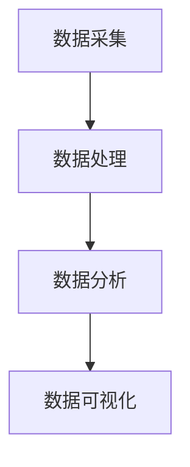

                 


# 彼得林奇的"成长股"在不同货币环境下的表现

> 关键词：彼得·林奇，成长股，货币环境，投资策略，量化分析

> 摘要：本文深入探讨了彼得·林奇的成长股投资理念及其在不同货币环境下的表现。通过分析货币宽松与紧缩环境对成长股的影响，结合量化分析方法，提出了适用于不同货币环境的成长股投资策略，并通过实际案例进行验证。

---

## 第1章：成长股的定义与特点

### 1.1 成长股的定义
成长股是指那些收入和利润增长速度超过行业平均水平的公司股票。这类公司通常处于扩张阶段，具有较高的成长潜力。与价值股不同，成长股的投资逻辑更注重公司未来的增长能力，而非当前的估值。

#### 核心特征
- **高增长率**：收入和利润持续增长。
- **高市盈率**：通常估值较高，市盈率（P/E）可能超过行业平均水平。
- **高风险**：由于估值较高，成长股的价格波动较大，风险也相对较高。

### 1.2 彼得·林奇的成长股投资理念
彼得·林奇是美国著名基金经理，他强调投资成长股的关键在于公司基本面的持续改善。他提出了“成长股”的定义，并总结出一套筛选成长股的标准。

#### 核心要素
- **收入与利润增长**：公司过去5年的收入和利润增长率必须稳定。
- **行业地位**：公司在行业中具有领先地位。
- **管理团队**：公司管理层具有较强的能力和良好的信誉。
- **财务健康**：公司财务状况良好，无重大负债。

---

## 第2章：货币环境对股市的影响

### 2.1 货币环境的分类
货币环境主要分为宽松和紧缩两种类型，不同环境对股市的影响截然不同。

#### 1. 货币宽松环境
- **低利率**：央行降低基准利率，鼓励借贷和投资。
- **流动性充裕**：市场资金充足，投资者倾向于风险资产。
- **影响**：股市通常上涨，尤其是成长股表现较好。

#### 2. 货币紧缩环境
- **高利率**：央行提高基准利率，抑制通胀。
- **流动性减少**：市场资金趋紧，投资者倾向于防御性资产。
- **影响**：股市通常下跌，尤其是成长股面临较大压力。

### 2.2 不同货币环境下股市的表现
货币环境对股市的影响是多方面的，以下表格对比了不同货币环境下股市的表现：

| 货币环境       | 股市表现       | 成长股表现   |
|----------------|---------------|-------------|
| 宽松           | 上涨          | 表现较好     |
| 紧缩           | 下跌          | 表现较差     |

---

## 第3章：彼得·林奇成长股在不同货币环境下的表现

### 3.1 货币宽松环境下的成长股表现
在货币宽松环境下，成长股通常表现优异。以下是具体原因：

#### 1. 资金成本下降
低利率环境下，企业的融资成本降低，成长股公司的扩张能力增强。

#### 2. 投资者情绪乐观
宽松的货币环境通常会刺激投资者的乐观情绪，成长股因其高增长潜力更受青睐。

#### 3. 典型案例分析
以科技公司为例，在货币宽松环境下，科技股的表现通常优于行业平均水平。

---

### 3.2 货币紧缩环境下的成长股表现
在货币紧缩环境下，成长股的表现通常不如价值股。

#### 1. 资金成本上升
高利率环境下，企业的融资成本上升，成长股公司的扩张能力受到限制。

#### 2. 投资者情绪悲观
紧缩的货币环境通常会抑制投资者的乐观情绪，成长股因其高估值更受压力。

#### 3. 典型案例分析
以科技公司为例，在货币紧缩环境下，科技股的表现通常逊于行业平均水平。

---

## 第4章：成长股投资的量化分析方法

### 4.1 成长股投资的量化指标
以下是常用的量化指标：

#### 1. 市盈率（P/E）
$$ P/E = \frac{\text{股价}}{\text{每股净利润}} $$

#### 2. 市净率（P/B）
$$ P/B = \frac{\text{股价}}{\text{每股净资产}} $$

#### 3. 营业收入增长率
$$ \text{营业收入增长率} = \frac{\text{本期营业收入} - \text{上期营业收入}}{\text{上期营业收入}} \times 100\% $$

#### 4. 净利润增长率
$$ \text{净利润增长率} = \frac{\text{本期净利润} - \text{上期净利润}}{\text{上期净利润}} \times 100\% $$

---

### 4.2 不同货币环境下的量化分析模型

#### 1. 货币宽松环境下的量化模型
在货币宽松环境下，成长股的量化分析模型应侧重于收入和利润增长率。

#### 2. 货币紧缩环境下的量化模型
在货币紧缩环境下，成长股的量化分析模型应侧重于市盈率和市净率。

---

## 第5章：成长股投资的系统架构设计

### 5.1 系统架构概述
以下是系统的架构设计：



### 5.2 系统功能设计

#### 1. 数据采集模块
负责从金融数据库中获取成长股的相关数据。

#### 2. 数据处理模块
对数据进行清洗和标准化处理。

#### 3. 数据分析模块
使用量化指标对成长股进行分析。

#### 4. 数据可视化模块
将分析结果以图表形式展示。

---

## 第6章：项目实战

### 6.1 环境安装
需要安装以下工具：
- Python
- Pandas
- Matplotlib
- NumPy

### 6.2 核心实现代码

```python
import pandas as pd
import matplotlib.pyplot as plt

# 数据获取
data = pd.read_csv('growth_stocks.csv')

# 数据处理
data['PE'] = data['Price'] / data['EPS']
data['PB'] = data['Price'] / data['BVPS']

# 数据分析
growth_stocks = data[data['Growth_Rate'] > data['Growth_Rate'].mean()]

# 数据可视化
growth_stocks[['PE', 'PB']].plot.hist(bins=10, figsize=(10,6))
plt.title('成长股的PE和PB分布')
plt.show()
```

---

## 第7章：总结与展望

### 7.1 总结
通过本文的分析，我们可以得出以下结论：
1. 成长股在货币宽松环境下表现较好。
2. 成长股在货币紧缩环境下表现较差。
3. 量化分析是成长股投资的重要工具。

### 7.2 注意事项
- 投资者应根据货币环境调整投资策略。
- 成长股投资需关注公司的基本面。
- 量化分析应结合行业和市场情况。

### 7.3 未来展望
未来，随着人工智能技术的发展，成长股的投资分析将更加精准和高效。

---

以上是《彼得林奇的"成长股"在不同货币环境下的表现》的完整目录和内容框架，希望对您有所帮助！

