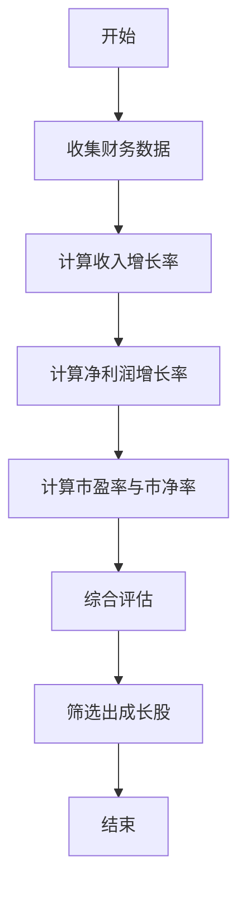
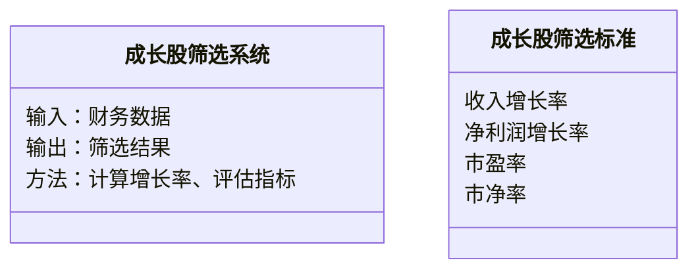
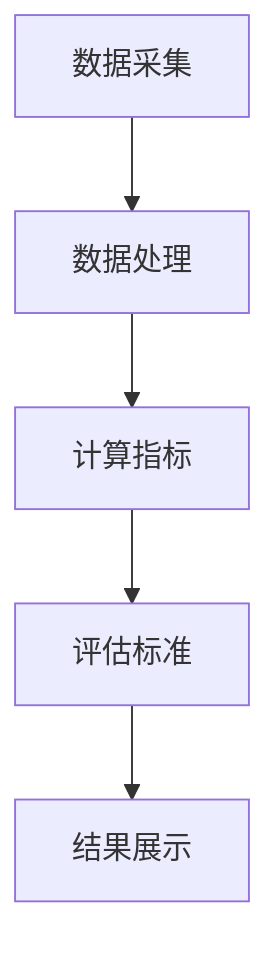

                 


# 彼得林奇的"成长股"筛选标准

> 关键词：成长股，彼得林奇，投资标准，财务指标，行业分析，管理层评估

> 摘要：本文详细阐述了彼得林奇的成长股筛选标准，从核心概念到数学模型，从系统架构到项目实战，为投资者提供科学的选股依据和方法。文章内容丰富，逻辑清晰，旨在帮助读者理解并应用这些标准进行投资决策。

---

## 第一部分: 成长股的基本概念

### 第1章: 成长股的定义与特点

#### 1.1 成长股的定义与特点
成长股是指那些收入和利润持续增长，具有较高成长潜力的公司股票。与价值股不同，成长股的估值通常高于其当前的盈利能力，但其未来增长预期使其具有较高的投资价值。

#### 1.2 彼得林奇的投资理念
彼得·林奇是美国著名投资经理人，以其在成长股投资领域的卓越表现闻名。他主张通过深入研究公司基本面，寻找那些具有持续增长潜力的公司，长期持有以实现资本增值。

---

### 第2章: 成长股筛选标准的背景与意义

#### 2.1 成长股筛选标准的背景
成长股投资兴起于20世纪70年代，彼得林奇在其任职期间（1977-1999年）通过深入研究和实践，总结出一套科学的筛选标准。

#### 2.2 成长股筛选标准的意义
科学的筛选标准能够帮助投资者规避风险，提高投资效率，同时促进市场对成长股的理性评估。

---

## 第二部分: 成长股筛选标准的核心要素

### 第3章: 财务指标分析

#### 3.1 收入与利润增长
收入和利润的持续增长是成长股的核心特征。彼得林奇通常关注过去5年的收入和净利润增长率，要求年均增长率不低于10%。

#### 3.2 净利润率与ROE
高净利润率和ROE（净资产收益率）表明公司具有较强的盈利能力。彼得林奇建议选择ROE超过15%的公司。

#### 3.3 负债与现金流
健康的财务状况是成长股的重要指标。彼得林奇要求公司负债率不超过50%，同时现金流应为正且稳定增长。

---

### 第4章: 行业分析

#### 4.1 行业生命周期
成长股通常出现在成长期或成熟期的行业中。彼得林奇偏好那些行业空间广阔、增长动力强劲的领域。

#### 4.2 行业竞争格局
低竞争度或差异化明显的行业更容易孕育成长股。彼得林奇倾向于选择那些具有竞争优势的公司。

#### 4.3 行业政策影响
政策支持或行业门槛高的领域更有利于成长股的发展。彼得林奇会关注行业政策对公司的长期影响。

---

### 第5章: 管理层评估

#### 5.1 管理层的背景与能力
经验丰富且能力突出的管理层更有可能带领公司实现持续增长。彼得林奇会考察管理层的历史业绩和行业经验。

#### 5.2 管理层的战略决策
公司战略的清晰性和可行性是判断管理层能力的重要标准。彼得林奇注重公司是否有明确的增长战略。

#### 5.3 管理层的诚信与道德
诚信的管理层更值得信赖。彼得林奇会通过公司治理结构和管理层行为来评估其道德水平。

---

## 第三部分: 成长股筛选标准的算法与模型

### 第6章: 筛选标准的数学模型

#### 6.1 收入增长率模型
收入增长率 = (本年收入 - 上年收入) / 上年收入 × 100%

#### 6.2 净利润增长率模型
净利润增长率 = (本年净利润 - 上年净利润) / 上年净利润 × 100%

#### 6.3 市盈率与市净率模型
市盈率 = 股价 / 每股净利润  
市净率 = 股价 / 每股净资产

---

### 第7章: 算法实现代码

#### 7.1 算法流程图


#### 7.2 Python代码实现
```python
def is_growth_stock(financial_data):
    # 计算收入增长率
    revenue_growth = (financial_data['current_revenue'] - financial_data['previous_revenue']) / financial_data['previous_revenue'] * 100
    # 计算净利润增长率
    net_profit_growth = (financial_data['current_net_profit'] - financial_data['previous_net_profit']) / financial_data['previous_net_profit'] * 100
    # 计算市盈率和市净率
    pe = financial_data['price'] / financial_data['eps']
    pb = financial_data['price'] / financial_data['book_value_per_share']
    # 综合评估
    if revenue_growth > 10 and net_profit_growth > 10 and pe < 20 and pb < 2:
        return True
    else:
        return False
```

---

## 第四部分: 成长股筛选标准的系统分析与架构设计

### 第8章: 系统功能设计

#### 8.1 领域模型


#### 8.2 系统架构设计


---

## 第五部分: 成长股筛选标准的项目实战

### 第9章: 环境安装与代码实现

#### 9.1 环境安装
安装Python和相关库（Pandas、NumPy）。

#### 9.2 核心代码实现
```python
import pandas as pd

# 加载数据
data = pd.read_csv('stocks.csv')

# 计算收入增长率
data['收入增长率'] = (data['current_revenue'] - data['previous_revenue']) / data['previous_revenue'] * 100

# 计算净利润增长率
data['净利润增长率'] = (data['current_net_profit'] - data['previous_net_profit']) / data['previous_net_profit'] * 100

# 计算市盈率和市净率
data['市盈率'] = data['price'] / data['eps']
data['市净率'] = data['price'] / data['book_value_per_share']

# 筛选成长股
data['是否成长股'] = data.apply(lambda x: x['收入增长率'] > 10 and x['净利润增长率'] > 10 and x['市盈率'] < 20 and x['市净率'] < 2, axis=1)
```

---

## 第六部分: 成长股筛选标准的最佳实践

### 第10章: 小结与注意事项

#### 10.1 小结
彼得林奇的成长股筛选标准为投资者提供了科学的选股依据，但投资需结合市场环境和个股具体情况。

#### 10.2 注意事项
- 避免单一指标评估
- 考虑宏观经济因素
- 定期复盘和调整

### 第11章: 未来研究方向与拓展阅读

#### 11.1 未来研究方向
- 结合机器学习优化筛选标准
- 探索多因子模型的应用

#### 11.2 拓展阅读
推荐书籍：《彼得·林奇的成功投资》

---

## 第七部分: 总结

通过本文的详细阐述，读者可以全面了解彼得林奇的成长股筛选标准，并将其应用于实际投资中。希望本文能为投资者提供有价值的参考和指导。

